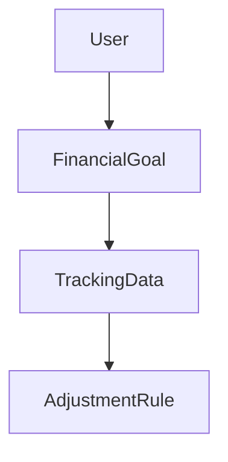
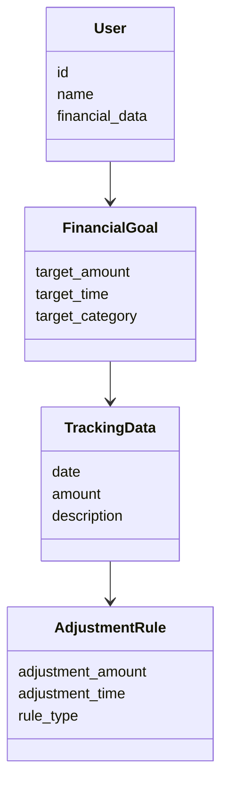
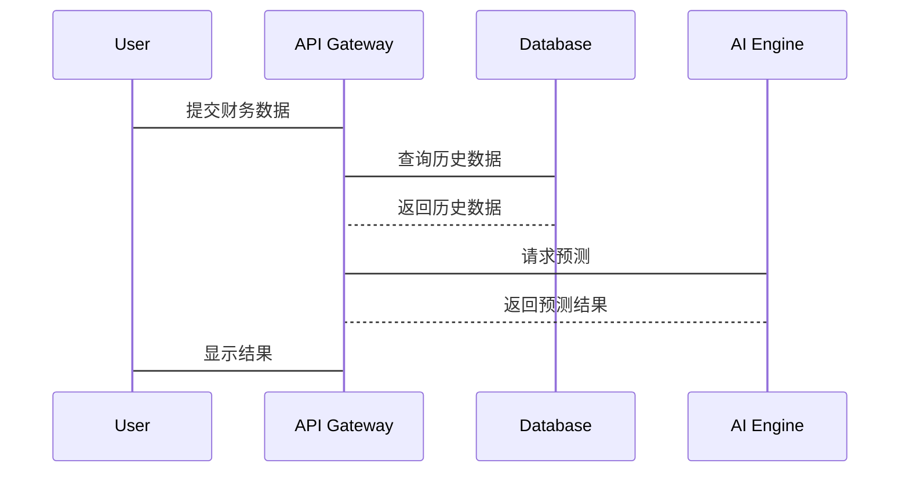

                 


# AI驱动的个人财务目标追踪与调整系统

**关键词**：AI，财务目标，追踪系统，机器学习，用户行为分析

**摘要**：  
本文探讨了如何利用人工智能技术构建个人财务目标追踪与调整系统，通过数据分析、机器学习和自然语言处理等技术手段，帮助用户实现财务目标的智能化管理。文章从背景介绍、核心概念、系统架构到算法实现、项目实战，全面阐述了该系统的构建过程和应用场景，并提供了具体的实现案例和最佳实践。

---

## 第一部分：AI驱动的个人财务目标追踪与调整系统概述

### 第1章：背景与概念

#### 1.1 问题背景

##### 1.1.1 个人财务管理的现状与挑战
现代生活中，个人财务管理日益复杂，涉及工资、投资、支出、债务等多个方面。传统的人工记录和管理方式效率低下，容易出错，且难以及时调整。随着生活节奏的加快和金融产品的多样化，个人需要更加高效和智能的工具来管理财务目标。

##### 1.1.2 AI技术在财务管理中的应用前景
人工智能技术的快速发展为财务管理带来了新的可能性。通过机器学习、自然语言处理和大数据分析，AI能够帮助用户更好地理解和管理财务数据，制定合理的财务计划，并实时调整以应对变化。

##### 1.1.3 个人财务目标追踪与调整的必要性
财务目标的实现往往需要长期的努力和调整。传统的静态目标设定方法难以应对实际生活中的不确定性。通过AI驱动的系统，用户可以实时追踪财务状况，并根据变化自动调整目标，从而提高管理效率和准确性。

#### 1.2 核心概念与定义

##### 1.2.1 个人财务目标的定义与分类
个人财务目标是指用户在一定时间内希望实现的财务状态或成果，通常包括资产积累、支出控制、债务偿还、投资收益等。根据时间跨度和重要性，财务目标可以分为短期、中期和长期目标。

##### 1.2.2 AI驱动的系统特点与优势
AI驱动的个人财务目标追踪与调整系统利用机器学习算法，能够实时分析用户的财务数据，预测未来的财务状况，并根据实际情况动态调整目标。相比传统方法，该系统具有高效性、智能化和个性化的特点。

##### 1.2.3 系统的目标与功能
系统的目标是帮助用户实现财务目标的智能化管理。主要功能包括数据采集与处理、目标设定与分解、财务追踪与调整、可视化报告生成等。

---

## 第二部分：核心概念与系统架构

### 第2章：核心概念与联系

#### 2.1 核心概念原理

##### 2.1.1 数据采集与处理
系统通过多种渠道（如银行账户、交易记录、支出记录等）采集用户的财务数据，并对其进行清洗和预处理，确保数据的准确性和一致性。

##### 2.1.2 目标设定与分解
用户根据自身需求设定财务目标，系统将其分解为可执行的具体任务，并根据用户的收入和支出情况，提供个性化的建议。

##### 2.1.3 财务追踪与调整
系统实时跟踪用户的财务状况，并根据实际表现与目标的偏差，动态调整目标或提供调整建议。

#### 2.2 概念属性特征对比表格

| 概念       | 特征                   | 优势                           |
|------------|------------------------|--------------------------------|
| 数据采集   | 多源、实时性           | 确保数据的全面性和及时性       |
| 目标设定   | 个性化、动态调整       | 提高目标的可行性和适应性       |
| 财务追踪   | 实时性、准确性         | 保证追踪结果的可靠性和及时性   |

#### 2.3 ER实体关系图



---

## 第三部分：算法原理与实现

### 第3章：算法原理讲解

#### 3.1 算法流程

##### 3.1.1 数据预处理
数据预处理是机器学习模型训练的基础，包括数据清洗、特征提取和数据标准化。

##### 3.1.2 模型训练
采用监督学习算法（如线性回归、支持向量机）或无监督学习算法（如聚类分析）进行模型训练，目标是预测用户的财务状况或分类用户的财务行为。

##### 3.1.3 模型部署
将训练好的模型部署到系统中，实时接收用户的财务数据，并输出预测结果或调整建议。

#### 3.2 算法实现细节

##### 3.2.1 线性回归模型

```python
import numpy as np
from sklearn.linear_model import LinearRegression

# 示例数据
X = np.array([[1], [2], [3], [4]])
y = np.array([2, 4, 6, 8])

# 模型训练
model = LinearRegression()
model.fit(X, y)

# 预测
print(model.predict([[5]]))  # 输出：[[10]]
```

##### 3.2.2 支持向量机模型

```python
from sklearn.svm import SVC
from sklearn.datasets import make_classification

# 示例数据
X, y = make_classification(n_samples=100, n_features=2, n_classes=2)

# 模型训练
model = SVC()
model.fit(X, y)

# 预测
print(model.predict(X[:5]))
```

---

## 第四部分：系统分析与架构设计

### 第4章：系统分析与架构设计

#### 4.1 问题场景介绍

##### 4.1.1 系统功能模块
系统主要包括用户界面、数据处理层、AI引擎和结果展示层。

##### 4.1.2 功能模块之间的关系
用户通过界面输入数据，数据处理层清洗数据，AI引擎进行分析和预测，最后结果展示层将结果反馈给用户。

#### 4.2 系统架构设计

##### 4.2.1 系统功能设计



##### 4.2.2 系统架构设计

```mermaid
graph LR
    Client --> API Gateway
    API Gateway --> Database
    Database --> AI Engine
    AI Engine --> Database
    Database --> Notification
```

##### 4.2.3 系统接口设计
系统接口包括数据接口（用于获取和更新财务数据）、AI接口（用于模型预测和调整建议）和用户接口（用于展示结果和交互）。

##### 4.2.4 系统交互设计



---

## 第五部分：项目实战

### 第5章：项目实战

#### 5.1 环境安装

##### 5.1.1 安装Python和必要的库
```bash
pip install numpy scikit-learn matplotlib
```

##### 5.1.2 安装Jupyter Notebook
```bash
pip install jupyter
```

#### 5.2 系统核心实现

##### 5.2.1 数据采集与处理

```python
import pandas as pd

# 读取数据
data = pd.read_csv('financial_data.csv')

# 数据清洗
data.dropna()
data = data[~data['income'].isnull()]
```

##### 5.2.2 模型训练与预测

```python
from sklearn.model_selection import train_test_split
from sklearn.ensemble import RandomForestRegressor

# 数据分割
X_train, X_test, y_train, y_test = train_test_split(data[['income', 'expenses']], data['savings'], test_size=0.2)

# 模型训练
model = RandomForestRegressor()
model.fit(X_train, y_train)

# 预测
print(model.score(X_test, y_test))
```

#### 5.3 案例分析

##### 5.3.1 数据分析与可视化

```python
import matplotlib.pyplot as plt

# 绘制支出分布图
plt.hist(data['expenses'], bins=10)
plt.xlabel('Expenses')
plt.ylabel('Frequency')
plt.show()
```

##### 5.3.2 模型优化与调整
根据实际需求，对模型进行调参和优化，例如调整随机森林的树数和深度。

#### 5.4 项目小结
通过实际案例分析，验证了AI驱动的个人财务目标追踪与调整系统的可行性和有效性。系统能够实时跟踪财务状况，并根据变化动态调整目标。

---

## 第六部分：最佳实践与小结

### 第6章：最佳实践与小结

#### 6.1 最佳实践

##### 6.1.1 数据安全与隐私保护
在处理用户财务数据时，必须确保数据的安全性和隐私性，避免数据泄露和滥用。

##### 6.1.2 系统的可扩展性
设计系统时应考虑未来可能的扩展需求，例如增加新的数据源或功能模块。

#### 6.2 小结
本文详细介绍了AI驱动的个人财务目标追踪与调整系统的构建过程，从背景、概念、算法到系统架构和项目实战，全面阐述了该系统的实现方法和应用价值。

#### 6.3 注意事项
在实际应用中，应充分考虑用户的行为习惯和需求，确保系统的易用性和用户体验。

#### 6.4 拓展阅读
建议读者进一步阅读相关领域的最新研究，例如强化学习在财务管理中的应用，以及区块链技术在数据安全中的应用。

---

通过以上内容，您可以逐步构建一个AI驱动的个人财务目标追踪与调整系统，并根据实际需求进行优化和扩展。

