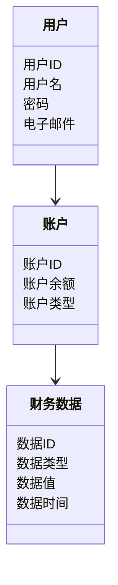
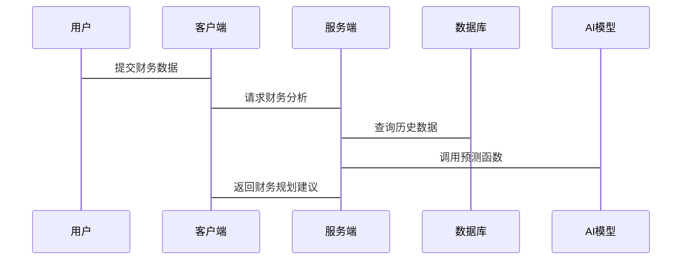

                 


# AI驱动的个人财务规划工具开发指南

> 关键词：AI技术、个人财务规划、机器学习、自然语言处理、系统架构、项目实战

> 摘要：本文将详细探讨AI技术在个人财务规划工具中的应用，从核心概念、算法原理到系统架构设计，再到项目实战，全面解析如何利用AI技术实现智能化的财务规划工具。本文将结合实际案例，通过清晰的逻辑和详细的步骤，帮助读者从理论到实践，掌握AI驱动的个人财务规划工具的开发方法。

---

# 第一部分: AI驱动的个人财务规划工具背景与概述

# 第1章: AI驱动的个人财务规划工具概述

## 1.1 个人财务规划的背景与需求

### 1.1.1 个人财务规划的基本概念
个人财务规划是指通过分析和管理个人的收入、支出、资产和负债，制定合理的财务目标和计划，以实现财务安全和财富增长。随着经济全球化和金融产品的多样化，个人财务管理变得越来越复杂，对智能化工具的需求也日益增长。

### 1.1.2 当前个人财务管理的痛点与挑战
- 数据分散：个人的财务数据可能分布在不同的平台和账户中，难以统一管理。
- 需求多样：每个人的财务目标不同，需要个性化的解决方案。
- 市场波动：金融市场波动大，需要实时调整财务策略。
- 信息过载：面对海量的财务信息和产品，个人难以有效筛选和决策。

### 1.1.3 AI技术在个人财务规划中的应用价值
- 数据整合与分析：AI技术可以自动整合分散的财务数据，并进行深度分析。
- 智能决策支持：通过机器学习算法，AI能够提供个性化的财务建议和预测。
- 实时监控与调整：AI可以实时跟踪市场变化和财务状况，及时调整财务策略。

## 1.2 AI驱动的财务规划工具的发展趋势

### 1.2.1 AI技术在金融领域的应用现状
AI技术已经在金融领域得到了广泛应用，包括智能投顾、风险管理、信用评估等领域。随着技术的成熟，AI在个人财务规划中的应用也逐渐普及。

### 1.2.2 个人财务规划工具的智能化转型
传统财务规划工具主要依赖人工计算和简单的规则引擎，而智能化转型将通过AI技术实现更精准和个性化的财务规划。

### 1.2.3 未来发展趋势与潜在机会
- 多模态交互：未来的财务规划工具将支持语音、图像等多种交互方式。
- 自适应学习：工具将能够根据用户的反馈和市场变化，动态调整财务策略。
- 预测与模拟：AI将能够进行更精准的财务预测和多种场景的模拟。

## 1.3 本书的核心目标与内容框架

### 1.3.1 本书的核心目标
本书旨在通过理论与实践相结合的方式，详细讲解AI技术在个人财务规划工具中的应用，帮助读者掌握开发和优化这类工具的方法。

### 1.3.2 本书的主要内容框架
- **核心概念**：介绍个人财务规划的核心要素和AI技术的基本原理。
- **算法原理**：详细讲解机器学习和自然语言处理在财务规划中的应用。
- **系统架构**：从功能设计到架构实现，全面解析AI驱动的财务规划工具的构建过程。
- **项目实战**：通过实际案例，指导读者从环境搭建到代码实现，完成一个完整的AI驱动的财务规划工具。

### 1.3.3 本书的适用读者群体
- 初中级AI工程师、数据科学家
- 对AI技术感兴趣并希望将其应用于金融领域的开发者
- 从事个人财务规划业务的企业和创业者

---

# 第二部分: AI驱动的个人财务规划工具核心概念与技术

# 第2章: 个人财务规划的核心要素与数据模型

## 2.1 个人财务规划的核心要素

### 2.1.1 收入与支出分析
- 收入来源：工资、投资收益、租金等。
- 支出项目：生活开支、债务还款、投资支出等。

### 2.1.2 资产与负债管理
- 资产：现金、银行存款、股票、房地产等。
- 负债：贷款、信用卡欠款等。

### 2.1.3 投资与风险管理
- 投资策略：股票、基金、债券等。
- 风险管理：保险、应急储备等。

## 2.2 数据模型与实体关系图

### 2.2.1 数据模型的构建
- 数据模型需要涵盖用户的基本信息、财务数据、交易记录等。
- 数据模型的设计需要考虑数据的完整性和一致性。

### 2.2.2 ER图实体关系设计
```mermaid
erDiagram
    actor 用户 "User" {
        <-o 账户 "Account"
        <-o 财务数据 "Financial Data"
        <-o 交易记录 "Transaction Log"
    }
    
    账户 "Account" {
        <-o 资产 "Assets"
        <-o 负债 "Liabilities"
    }
    
    财务数据 "Financial Data" {
        <-o 收入 "Income"
        <-o 支出 "Expenses"
        <-o 投资 "Investments"
    }
    
    交易记录 "Transaction Log" {
        <-o 交易类型 "Transaction Type"
        <-o 时间戳 "Timestamp"
    }
```

### 2.2.3 数据模型的扩展与优化
- 数据模型需要根据实际需求进行扩展，例如增加税务、社保等模块。
- 数据模型的优化需要考虑性能和可扩展性。

## 2.3 核心概念与联系

### 2.3.1 核心概念的原理
- 通过数据模型将个人财务信息进行结构化，为AI算法提供基础数据。
- AI算法通过对数据的分析和学习，生成个性化的财务规划建议。

### 2.3.2 核心概念属性特征对比表格
| 核心概念 | 属性 | 特征 |
|----------|------|------|
| 收入     | 类型 | 工资、投资收益 |
| 支出     | 类型 | 生活开支、债务还款 |
| 资产     | 类型 | 现金、股票、房地产 |
| 负债     | 类型 | 贷款、信用卡欠款 |

### 2.3.3 ER实体关系图的 Mermaid 流程图
```mermaid
erDiagram
    用户 --> 账户
    用户 --> 财务数据
    用户 --> 交易记录
    账户 --> 资产
    账户 --> 负债
    财务数据 --> 收入
    财务数据 --> 支出
    财务数据 --> 投资
    交易记录 --> 交易类型
    交易记录 --> 时间戳
```

---

# 第3章: AI技术在个人财务规划中的应用原理

## 3.1 机器学习在财务数据分析中的应用

### 3.1.1 监督学习在财务预测中的应用
- 监督学习通过训练数据，预测未来的财务状况。
- 常用算法：线性回归、随机森林、神经网络等。

### 3.1.2 非监督学习在数据聚类中的应用
- 非监督学习用于发现数据中的潜在模式。
- 常用算法：K-means、DBSCAN等。

### 3.1.3 强化学习在投资决策中的应用
- 强化学习通过模拟投资环境，优化投资策略。
- 常用算法：Q-Learning、Deep Q-Network等。

## 3.2 自然语言处理在财务信息提取中的应用

### 3.2.1 NLP技术在财务文本分析中的应用
- 文本分类：识别财务报告中的关键词。
- 情感分析：分析市场情绪对投资决策的影响。

### 3.2.2 基于NLP的财务信息抽取流程


### 3.2.3 NLP在财务报告生成中的应用
- 自动生成财务报告，提供个性化的财务建议。

## 3.3 算法原理与数学模型

### 3.3.1 机器学习算法的数学模型
- 线性回归模型：
  $$ y = \beta_0 + \beta_1 x + \epsilon $$
  
- 神经网络模型：
  $$ y = \sigma(w x + b) $$
  其中，σ表示激活函数，如sigmoid或ReLU。

### 3.3.2 深度学习模型的数学公式
- 卷积神经网络（CNN）：
  $$ f(x) = \text{Conv}(x) \ast \text{Pool}(x) \ast \text{Fully Connected}(x) $$

### 3.3.3 算法流程的 Mermaid 图


---

# 第四部分: 系统分析与架构设计

# 第4章: 系统功能设计与架构

## 4.1 系统功能设计

### 4.1.1 功能模块划分
- 用户管理模块：用户注册、登录、个人信息管理。
- 财务数据分析模块：数据采集、清洗、建模。
- 财务规划模块：生成财务报告、投资建议。
- 风险管理模块：实时监控、风险预警。

### 4.1.2 领域模型类图


## 4.2 系统架构设计

### 4.2.1 系统架构图


### 4.2.2 接口设计
- API接口：RESTful API，支持JSON格式的数据交互。
- 接口文档：使用Swagger或类似的工具进行文档管理。

### 4.2.3 交互流程图


---

# 第5章: 项目实战与优化

## 5.1 环境安装与配置

### 5.1.1 开发环境
- Python 3.8+
- 虚拟环境：venv或Anaconda
- 依赖库：TensorFlow、Scikit-learn、Numpy、Pandas、Flask

### 5.1.2 安装依赖
```bash
pip install tensorflow scikit-learn numpy pandas flask
```

## 5.2 核心功能实现

### 5.2.1 数据预处理代码
```python
import pandas as pd
import numpy as np

# 数据加载
data = pd.read_csv('financial_data.csv')

# 数据清洗
data.dropna(inplace=True)
data = pd.get_dummies(data, columns=['category'])
```

### 5.2.2 模型训练代码
```python
from sklearn.model import LinearRegression
from sklearn.metrics import mean_squared_error

# 模型训练
model = LinearRegression()
model.fit(X_train, y_train)

# 模型预测
y_pred = model.predict(X_test)
```

### 5.2.3 结果分析代码
```python
from sklearn.metrics import r2_score

# 计算R²分数
score = r2_score(y_test, y_pred)
print(f"模型的R²分数为：{score}")
```

## 5.3 数据分析与优化

### 5.3.1 数据分析案例
- 使用Python的Pandas库对财务数据进行分析，生成可视化图表。
- 使用Matplotlib或Seaborn库绘制折线图、柱状图等。

### 5.3.2 模型优化
- 调整模型参数，优化模型性能。
- 使用交叉验证评估模型的泛化能力。

## 5.4 项目小结

### 5.4.1 核心收获
- 掌握了AI技术在个人财务规划中的具体应用。
- 熟悉了系统架构设计和项目实现的全过程。

### 5.4.2 实践中的注意事项
- 数据隐私保护：确保用户数据的安全性和隐私性。
- 模型的可解释性：提高模型的透明度，便于用户理解和信任。

### 5.4.3 拓展方向
- 将工具部署到云平台，提供SaaS服务。
- 引入更多的AI技术，如强化学习和自然语言处理，进一步提升工具的智能化水平。

---

# 第6章: 最佳实践与小结

## 6.1 最佳实践 Tips

### 6.1.1 数据处理
- 数据清洗：处理缺失值、异常值。
- 数据标准化：归一化处理，确保模型的稳定性。

### 6.1.2 模型选择
- 根据具体场景选择合适的算法。
- 通过交叉验证评估模型性能。

### 6.1.3 系统优化
- 使用分布式架构，提升系统的处理能力。
- 采用缓存技术，优化数据访问效率。

## 6.2 小结

### 6.2.1 核心内容回顾
- 本文详细讲解了AI技术在个人财务规划工具中的应用。
- 从理论到实践，全面解析了系统设计和实现过程。

### 6.2.2 未来展望
- AI技术在个人财务规划中的应用前景广阔。
- 开发者需要不断学习新技术，提升工具的智能化水平。

## 6.3 注意事项

### 6.3.1 数据隐私
- 严格遵守数据隐私保护法规。
- 确保用户数据的安全性和隐私性。

### 6.3.2 模型可解释性
- 提高模型的可解释性，便于用户理解和信任。
- 在模型设计中加入可解释性机制，如LIME或SHAP。

## 6.4 拓展阅读

### 6.4.1 推荐书籍
- 《机器学习实战》
- 《Python数据处理与分析实战》

### 6.4.2 推荐博客与资源
- TensorFlow中文社区
- Keras官方文档
- GitHub上的相关项目

---

# 结语

AI驱动的个人财务规划工具是未来金融领域的重要发展方向。通过本文的详细讲解，读者可以掌握从理论到实践的整个开发过程。希望本文能够为开发者提供有价值的参考，助力他们在AI驱动的个人财务规划工具开发领域取得更大的成功。

