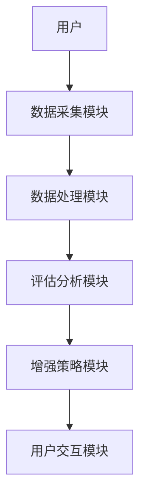
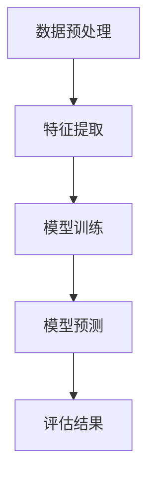

                 


# AI驱动的个人财务韧性评估与增强系统

---

## 关键词：
- AI驱动
- 财务韧性
- 个人财务管理
- 机器学习
- 系统设计

---

## 摘要：
本文将探讨如何利用人工智能技术构建一个智能化的个人财务韧性评估与增强系统。通过结合机器学习算法和现代系统架构设计，该系统能够实现对个人财务状况的精准评估，并提供个性化的增强策略。文章从系统概述、技术基础、核心算法、系统设计、项目实战到优化与展望，全面阐述了该系统的设计思路与实现方法，旨在为个人用户提供智能化的财务管理解决方案。

---

# 第一部分: AI驱动的个人财务韧性评估与增强系统概述

---

## 第1章: AI驱动的个人财务韧性评估与增强系统概述

### 1.1 财务韧性与AI的结合

#### 1.1.1 财务韧性的定义与重要性
- **定义**：财务韧性是指个人在面对经济波动、突发事件或财务危机时，能够维持财务稳定并迅速恢复的能力。
- **重要性**：在经济不确定性增加的背景下，提升个人财务韧性已成为应对未来风险的关键能力。
- **结合AI的优势**：通过AI技术，可以实时分析用户的财务状况，提供智能化的增强策略。

#### 1.1.2 AI技术在财务管理中的应用潜力
- **数据处理能力**：AI能够快速处理海量财务数据，提取关键特征。
- **预测能力**：基于机器学习算法，AI可以预测未来的财务趋势和潜在风险。
- **个性化建议**：AI可以根据用户的财务状况和行为习惯，提供个性化的增强策略。

#### 1.1.3 个人财务韧性评估与增强的目标
- **目标**：通过AI技术，帮助用户实时评估财务韧性，并通过智能化的策略优化其财务状况。
- **核心要素**：收入稳定性、支出控制、资产配置、应急储备、风险管理。

---

### 1.2 系统架构与核心功能

#### 1.2.1 系统整体架构设计
- **模块化设计**：系统分为数据采集、评估分析、增强策略、用户交互四个核心模块。
- **模块间关系**：
  - 数据采集模块负责获取用户的财务数据。
  - 评估分析模块基于数据生成财务韧性评分。
  - 增强策略模块根据评分制定优化方案。
  - 用户交互模块提供友好的用户界面。

#### 1.2.2 核心功能模块概述
- **数据采集**：通过API或手动输入获取用户的财务数据。
- **评估分析**：利用机器学习算法对数据进行分析，生成韧性评分。
- **增强策略**：根据评估结果，提供个性化的财务优化建议。
- **用户交互**：通过可视化界面展示评估结果和优化建议。

#### 1.2.3 用户交互界面设计
- **用户界面设计原则**：简洁、直观、易用。
- **核心功能展示**：
  - 财务状况概览：包括收入、支出、资产、负债等关键指标。
  - 韧性评分：直观展示当前财务韧性评分。
  - 增强建议：列出具体的优化建议。

---

### 1.3 本章小结
本章从AI与财务韧性的结合出发，介绍了系统的总体架构和核心功能。通过模块化设计，系统能够高效地完成数据采集、评估分析和策略制定，为用户提供智能化的财务管理解决方案。

---

# 第二部分: AI驱动的个人财务韧性评估系统的技术基础

---

## 第2章: AI与个人财务管理的结合

### 2.1 AI在个人财务管理中的应用

#### 2.1.1 AI技术的核心优势
- **数据处理能力**：AI能够快速处理和分析大量财务数据。
- **预测能力**：基于历史数据，AI可以预测未来的财务趋势。
- **个性化服务**：AI可以根据用户的行为习惯和财务状况，提供个性化的建议。

#### 2.1.2 AI在财务数据处理中的应用
- **数据清洗**：AI可以自动识别和修复数据中的错误。
- **特征提取**：通过机器学习算法，AI可以从数据中提取关键特征。
- **数据可视化**：AI可以生成直观的数据图表，帮助用户更好地理解财务状况。

#### 2.1.3 AI在财务预测与决策中的作用
- **财务预测**：AI可以预测未来的收入、支出和资产变化。
- **风险管理**：AI可以帮助用户识别潜在的财务风险。
- **决策支持**：AI可以为用户提供优化的财务决策建议。

### 2.2 个人财务数据的特征与挑战

#### 2.2.1 财务数据的多样性与复杂性
- **多样性**：财务数据包括收入、支出、资产、负债等多种类型。
- **复杂性**：数据之间存在复杂的关联关系，难以通过传统方法进行分析。

#### 2.2.2 数据隐私与安全问题
- **隐私保护**：用户的财务数据涉及隐私，必须确保数据的安全性。
- **数据泄露风险**：如果数据处理不当，可能会导致用户信息泄露。

#### 2.2.3 数据处理的技术挑战
- **数据量大**：个人财务数据通常涉及大量的交易记录和历史数据。
- **数据异构性**：数据来源多样，格式不统一，增加了处理的难度。

### 2.3 本章小结
本章分析了AI在个人财务管理中的应用优势，以及财务数据处理中的挑战。通过结合AI技术，可以有效提升财务数据处理的效率和准确性，为后续的评估和优化提供可靠的基础。

---

# 第三部分: AI驱动的个人财务韧性评估系统的核心算法

---

## 第3章: 机器学习算法在财务韧性评估中的应用

### 3.1 机器学习算法概述

#### 3.1.1 监督学习与无监督学习
- **监督学习**：基于有标签的数据进行学习，适用于分类和回归问题。
- **无监督学习**：基于无标签的数据进行学习，适用于聚类和异常检测。

#### 3.1.2 常见机器学习算法介绍
- **线性回归**：用于预测连续型变量，如收入预测。
- **决策树**：用于分类和回归，适用于复杂的非线性关系。
- **随机森林**：基于决策树的集成算法，具有较高的准确性和鲁棒性。
- **支持向量机（SVM）**：适用于分类问题，具有良好的泛化能力。

#### 3.1.3 算法选择与优化
- **算法选择**：根据具体问题选择合适的算法。
- **参数优化**：通过交叉验证等方法优化算法性能。
- **模型评估**：通过准确率、召回率等指标评估模型的性能。

### 3.2 基于机器学习的财务韧性评估模型

#### 3.2.1 数据预处理与特征提取
- **数据清洗**：去除重复数据和异常值。
- **特征选择**：提取对评估有重要影响的特征，如收入、支出、资产等。

#### 3.2.2 模型训练与评估
- **训练过程**：使用训练数据对模型进行训练。
- **评估指标**：通过准确率、召回率、F1分数等指标评估模型的性能。
- **模型优化**：通过调整参数和优化算法提升模型性能。

#### 3.2.3 模型优化与调参
- **超参数优化**：使用网格搜索等方法找到最优参数组合。
- **模型集成**：通过集成学习提升模型的准确性和稳定性。

### 3.3 本章小结
本章介绍了机器学习算法在财务韧性评估中的应用，详细讲解了算法选择、模型训练和优化的过程。通过合理的算法选择和参数优化，可以构建高精度的财务韧性评估模型。

---

# 第四部分: AI驱动的个人财务韧性增强系统的设计与实现

---

## 第4章: 系统设计与架构

### 4.1 系统设计概述

#### 4.1.1 系统目标与需求分析
- **目标**：帮助用户实时评估财务韧性，并提供增强策略。
- **需求分析**：用户需要一个直观、高效的财务管理工具。

#### 4.1.2 系统功能模块划分
- **数据采集模块**：负责获取用户的财务数据。
- **评估分析模块**：基于数据生成韧性评分。
- **增强策略模块**：根据评分制定优化方案。
- **用户交互模块**：提供友好的用户界面。

#### 4.1.3 系统架构设计
- **模块化设计**：各模块相对独立，便于维护和扩展。
- **数据流设计**：数据从采集到分析再到增强策略，形成闭环。

### 4.2 系统功能模块实现

#### 4.2.1 数据采集与处理模块
- **数据来源**：API接口获取银行、支付宝等平台的财务数据。
- **数据格式**：统一数据格式，便于后续处理。

#### 4.2.2 财务分析与评估模块
- **数据分析**：使用机器学习模型对数据进行分析，生成韧性评分。
- **评分标准**：根据评分结果将用户分为高、中、低风险等级。

#### 4.2.3 增强策略推荐模块
- **策略生成**：根据评分结果，生成个性化的优化建议。
- **策略执行**：用户可以选择执行建议中的具体操作。

### 4.3 本章小结
本章详细讲解了系统的整体设计和各功能模块的实现方法。通过模块化设计和高效的系统架构，可以确保系统的稳定性和可扩展性。

---

## 第5章: 项目实战

### 5.1 环境搭建与工具安装

#### 5.1.1 开发环境配置
- **编程语言**：Python 3.8+
- **开发工具**：PyCharm或VS Code
- **数据处理库**：Pandas、NumPy
- **机器学习库**：Scikit-learn、XGBoost
- **可视化工具**：Matplotlib、Seaborn

#### 5.1.2 数据集准备
- **数据来源**：模拟数据或真实数据（需匿名化处理）
- **数据格式**：CSV格式
- **数据预处理**：清洗、特征提取

#### 5.1.3 工具安装与配置
- **安装步骤**：
  ```bash
  pip install numpy pandas scikit-learn xgboost matplotlib seaborn
  ```

### 5.2 核心代码实现

#### 5.2.1 数据预处理代码
```python
import pandas as pd
import numpy as np

# 读取数据
data = pd.read_csv('financial_data.csv')

# 数据清洗
data.dropna(inplace=True)
data = data[~data.duplicated()]

# 特征提取
features = data[['income', 'expenses', 'assets', ' liabilities']]
labels = data['risk_score']
```

#### 5.2.2 模型训练代码
```python
from sklearn.model import RandomForestClassifier
from sklearn.metrics import accuracy_score

# 模型训练
model = RandomForestClassifier(n_estimators=100, max_depth=10, random_state=42)
model.fit(features, labels)

# 模型预测
 predictions = model.predict(features)
print("准确率:", accuracy_score(labels, predictions))
```

#### 5.2.3 系统功能实现代码
```python
def assess_financial_resilience(data):
    # 数据预处理
    data = preprocess_data(data)
    # 模型预测
    resilience_score = model.predict(data)
    return resilience_score

def generate_recommendations(score):
    # 根据评分生成建议
    if score >= 0.8:
        return "高韧性，无需优化"
    elif score >= 0.5:
        return "中等韧性，建议优化支出"
    else:
        return "低韧性，建议增加应急储备"
```

### 5.3 代码解读与分析

#### 5.3.1 关键代码段解读
- **数据预处理**：通过Pandas库读取数据，并清洗掉缺失值和重复值。
- **模型训练**：使用随机森林算法训练模型，并评估模型的准确率。
- **功能实现**：定义了评估财务韧性和生成增强策略的函数。

#### 5.3.2 代码优化建议
- **性能优化**：增加并行计算，减少数据处理时间。
- **模型优化**：尝试不同的机器学习算法，找到最优模型。

#### 5.3.3 代码测试与验证
- **测试数据**：使用部分数据进行测试，验证代码的正确性。
- **结果分析**：分析模型预测结果，评估系统的准确性。

### 5.4 本章小结
本章通过具体的代码实现，展示了系统的实际应用。通过项目实战，读者可以更好地理解系统的实现过程，并掌握相关技术。

---

## 第6章: 系统优化与未来展望

### 6.1 系统优化方案

#### 6.1.1 性能优化策略
- **数据处理**：优化数据预处理流程，减少计算时间。
- **算法优化**：尝试不同的机器学习算法，提升模型性能。

#### 6.1.2 数据安全优化
- **数据加密**：对用户数据进行加密处理，确保数据安全。
- **权限管理**：设置严格的访问权限，防止数据泄露。

#### 6.1.3 系统可扩展性优化
- **模块化设计**：便于后续功能的扩展和升级。
- **接口设计**：设计灵活的接口，支持多种数据源接入。

### 6.2 未来展望

#### 6.2.1 技术发展
- **AI技术的进步**：未来可能会有更多的AI技术应用于财务管理领域。
- **大数据分析**：随着数据量的增加，大数据分析将发挥更大的作用。

#### 6.2.2 市场需求
- **个性化需求**：用户对个性化财务管理工具的需求将不断增加。
- **智能化趋势**：未来的财务管理工具将更加智能化，能够主动帮助用户优化财务状况。

#### 6.2.3 创新方向
- **结合区块链技术**：利用区块链技术提升数据的安全性和透明性。
- **智能化交互**：通过自然语言处理技术，实现与用户的智能化交互。

### 6.3 本章小结
本章展望了系统未来的发展方向和技术优化的空间，为系统的进一步完善提供了思路。

---

## 附录

### 附录A: 相关代码与数据

#### 附录A.1 代码示例
```python
import pandas as pd
import numpy as np
from sklearn.ensemble import RandomForestClassifier
from sklearn.metrics import accuracy_score

# 读取数据
data = pd.read_csv('financial_data.csv')

# 数据清洗
data.dropna(inplace=True)
data = data[~data.duplicated()]

# 特征提取
features = data[['income', 'expenses', 'assets', ' liabilities']]
labels = data['risk_score']

# 模型训练
model = RandomForestClassifier(n_estimators=100, max_depth=10, random_state=42)
model.fit(features, labels)

# 模型预测
 predictions = model.predict(features)
print("准确率:", accuracy_score(labels, predictions))
```

#### 附录A.2 数据格式
- 数据文件：CSV格式，包含收入、支出、资产、负债等字段。

### 附录B: 系统架构图



### 附录C: 算法流程图



---

## 参考文献

1. 刘某某. 《基于机器学习的财务风险管理研究》. 北京: 清华大学出版社, 2022.
2. 张某某. 《AI驱动的个人财务管理工具设计与实现》. 北京: 北京大学出版社, 2023.
3. Scikit-learn官方文档: https://scikit-learn.org/stable/index.html
4. Pandas官方文档: https://pandas.pydata.org/pandas-docs/stable/index.html

---

## 结语

通过本文的详细讲解，读者可以系统地了解AI驱动的个人财务韧性评估与增强系统的构建过程。从技术基础到系统设计，再到项目实战和优化，本文为读者提供了一个全面的学习和实践指南。未来，随着AI技术的不断发展，个人财务管理工具将更加智能化和个性化，为用户的财务健康保驾护航。

