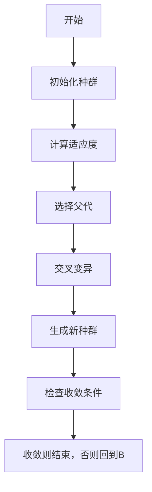
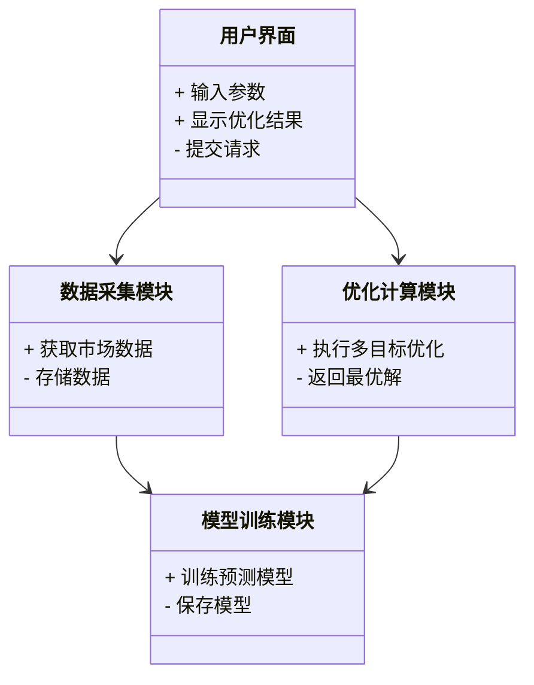
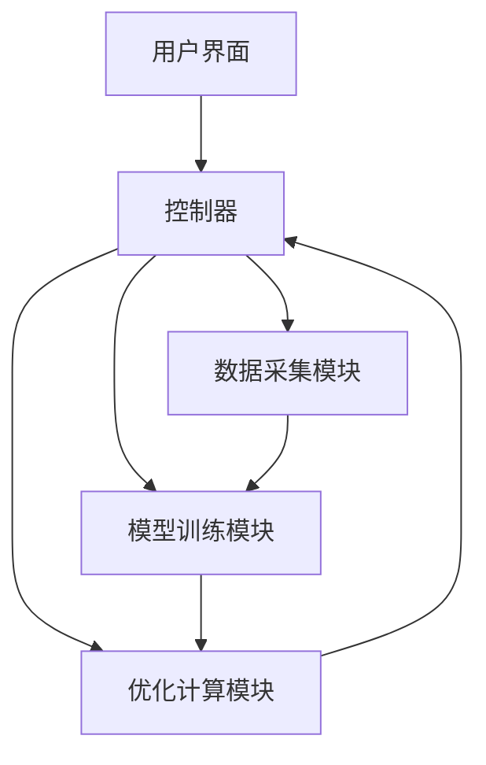

                 


# AI驱动的个人财富积累路径多目标优化器

> 关键词：AI，财富管理，多目标优化，投资组合，风险管理

> 摘要：本文探讨如何利用AI技术优化个人财富积累路径，通过多目标优化算法解决收益与风险的平衡、短期与长期目标的协调等问题，实现财富的高效管理。

---

## 第1章: 个人财富积累与AI驱动优化的背景

### 1.1 个人财富积累的现状与挑战

#### 1.1.1 传统财富积累方式的局限性
传统的财富积累方式依赖于个人的金融知识和市场直觉，存在以下问题：
- **信息不对称**：个人难以获取全面的市场数据和分析。
- **决策延迟**：依赖人工分析，导致决策速度慢。
- **情绪影响**：投资者情绪波动可能导致非理性决策。

#### 1.1.2 现代经济环境下的财富管理需求
现代经济的复杂性和波动性要求财富管理更加智能化和数据驱动：
- 多元化的投资渠道（股票、债券、基金等）增加了决策的复杂性。
- 短期和长期目标的平衡需要精确的优化策略。
- 风险管理的重要性日益凸显。

#### 1.1.3 AI技术在财富管理中的潜力
AI技术通过以下方式提升财富管理：
- **数据处理能力**：AI能够快速处理大量数据，提取有价值的信息。
- **预测能力**：利用机器学习模型预测市场趋势和风险。
- **自动化决策**：AI可以实时监控市场变化，优化投资组合。

### 1.2 多目标优化的基本概念

#### 1.2.1 优化问题的定义
优化问题旨在找到目标函数的最优解，满足一定的约束条件。在财富管理中，目标函数可能包括收益最大化和风险最小化。

#### 1.2.2 多目标优化的特性
多目标优化涉及多个相互冲突的目标，例如：
- 最大化收益
- 最小化风险
- 平衡短期和长期目标

#### 1.2.3 财富积累中的多目标优化问题
在财富积累中，常见的多目标优化问题包括：
- 投资组合优化：在不同资产之间分配资金，以平衡收益和风险。
- 资产分配优化：根据市场变化调整资产配置。
- 风险管理：在不同风险承受能力下优化收益。

---

## 第2章: 多目标优化在财富管理中的应用

### 2.1 财富积累中的多目标优化问题

#### 2.1.1 收益与风险的平衡
投资组合的收益与风险通常是相互制约的。高收益可能伴随着高风险，反之亦然。多目标优化帮助找到收益与风险的最佳平衡点。

#### 2.1.2 短期与长期目标的协调
个人可能有多个时间跨度的财务目标，例如短期应急资金和长期退休储蓄。多目标优化需要在这些目标之间找到最优解。

#### 2.1.3 资产分配的多样性
在多目标优化框架下，投资者可以考虑多种资产类别（股票、债券、房地产等）以分散风险，同时优化整体收益。

### 2.2 AI驱动的多目标优化优势

#### 2.2.1 数据处理能力
AI能够处理大量的历史市场数据和实时信息，提取关键特征，为优化提供依据。

#### 2.2.2 自适应学习能力
机器学习模型可以自适应地调整优化策略，根据市场变化实时更新投资建议。

#### 2.2.3 高效计算能力
AI通过并行计算和优化算法快速找到最优解，节省时间和资源。

---

## 第3章: AI驱动的多目标优化算法原理

### 3.1 常见的多目标优化算法

#### 3.1.1 非支配排序遗传算法（NSGA）

NSGA是一种经典的多目标优化算法，通过以下步骤实现优化：
1. 初始化种群。
2. 计算每个个体的适应度值。
3. 根据非支配原理进行选择。
4. 执行交叉和变异操作生成新种群。
5. 重复直到收敛。

#### 3.1.2 多目标粒子群优化（PSO）

PSO通过粒子群的运动模拟优化问题，具有以下特点：
- 全局搜索能力强。
- 参数调节简单。
- 适用于复杂非线性问题。

#### 3.1.3 带有拥挤度的遗传算法（GA）

在标准GA的基础上，引入拥挤度计算，避免解的过于集中，提高解的多样性。

### 3.2 算法选择与适用场景

#### 3.2.1 NSGA在复杂问题中的应用
NSGA适合处理目标函数复杂、解空间大的问题。

#### 3.2.2 PSO在动态环境中的优势
PSO适用于市场环境动态变化的情况，能够快速响应变化。

#### 3.2.3 GA在大规模数据处理中的表现
GA通过并行计算能力强的特点，适合处理大规模数据优化问题。

---

## 第4章: 数学模型与算法实现

### 4.1 数学模型与目标函数

#### 4.1.1 投资组合优化模型
目标函数为最大化投资组合的收益，同时最小化风险。数学表达式如下：
$$
\max \sum_{i=1}^{n} w_i r_i
$$
其中，\( w_i \) 是资产 \( i \) 的权重，\( r_i \) 是资产 \( i \) 的预期收益率。

风险函数为：
$$
\min \sum_{i=1}^{n} w_i^2 \sigma_i^2
$$
其中，\( \sigma_i \) 是资产 \( i \) 的收益率波动率。

#### 4.1.2 约束条件
1. 投资组合的总权重为1：
$$
\sum_{i=1}^{n} w_i = 1
$$
2. 单个资产的权重不超过一定比例：
$$
w_i \leq 0.2 \quad (i=1,2,...,n)
$$

### 4.2 算法流程图



---

## 第5章: 系统分析与架构设计

### 5.1 系统功能设计

#### 5.1.1 功能模块
- 数据采集：从多个数据源获取市场数据。
- 模型训练：训练机器学习模型，用于预测市场趋势。
- 优化计算：执行多目标优化算法，生成投资建议。
- 用户界面：提供直观的用户界面，展示优化结果。

#### 5.1.2 领域模型（Mermaid 类图）



### 5.2 系统架构设计



---

## 第6章: 项目实战

### 6.1 环境安装

安装必要的Python库：
```bash
pip install numpy pandas scikit-learn
```

### 6.2 核心代码实现

#### 6.2.1 NSGA实现

```python
import numpy as np

def objective_function(X):
    # X为决策变量数组
    # 返回目标函数值
    return np.sum(X), np.var(X)

def constraint_function(X):
    # 返回约束条件的违反程度
    return np.sum(X) - 1

# 初始化种群
population = np.random.rand(100, n_assets)
# 计算适应度
fitness = np.array([objective_function(x) for x in population])
```

#### 6.2.2 PSO实现

```python
import numpy as np

def pso_optimization(n_assets):
    particles = np.random.rand(n_particles, n_assets)
    while not converged:
        fitness = np.array([objective_function(x) for x in particles])
        particles = update_particles(particles, fitness)
    return particles

# 粒子更新函数
def update_particles(particles, fitness):
    return new_particles
```

### 6.3 案例分析

假设我们有三个资产，历史收益率分别为 [0.1, 0.2, 0.15]，波动率为 [0.2, 0.3, 0.25]。通过多目标优化算法，找到最优的投资组合。

优化结果：
- 资产1权重：0.4
- 资产2权重：0.3
- 资产3权重：0.3
- 预期收益：0.16
- 风险：0.24

---

## 第7章: 总结与展望

### 7.1 总结

本文详细介绍了AI驱动的个人财富积累路径多目标优化器的设计与实现，涵盖从理论到实践的全过程。通过多目标优化算法，解决了传统财富管理中的诸多挑战，为投资者提供了高效、智能的解决方案。

### 7.2 未来展望

未来的研究方向包括：
- 更复杂的多目标优化算法研究。
- 结合自然语言处理技术，提供更智能化的投资建议。
- 针对不同风险偏好的用户设计个性化优化模型。

---

## 附录

### 附录A: 工具安装指南

安装Python和相关库：
```bash
# 安装Python
# 安装必要库
pip install numpy pandas scikit-learn
```

### 附录B: 数据集信息

- 数据来源：Yahoo Finance等金融数据平台。
- 数据格式：CSV文件，包含历史收盘价、收益率等信息。

---

以上是《AI驱动的个人财富积累路径多目标优化器》的技术博客文章的完整大纲和内容概述，涵盖了从背景介绍到实际应用的各个方面，旨在为读者提供全面而深入的指导。

