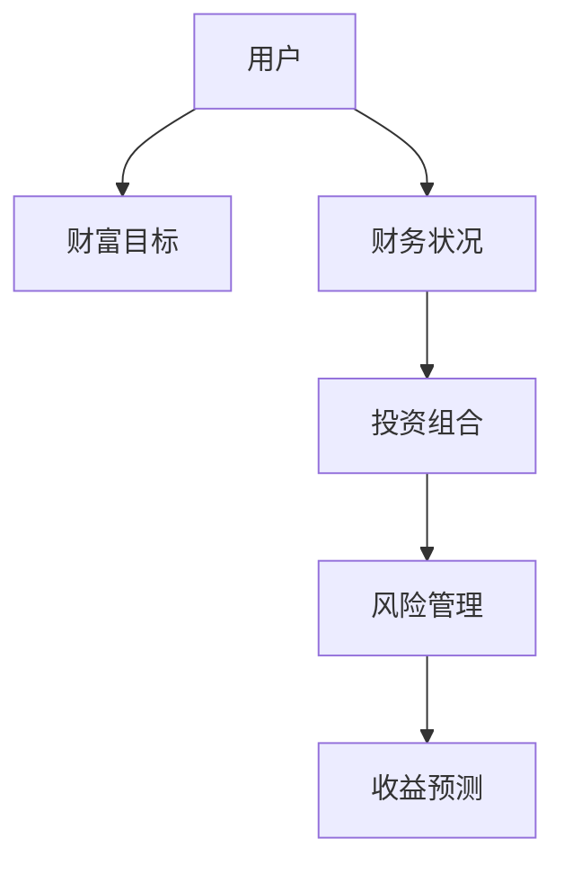
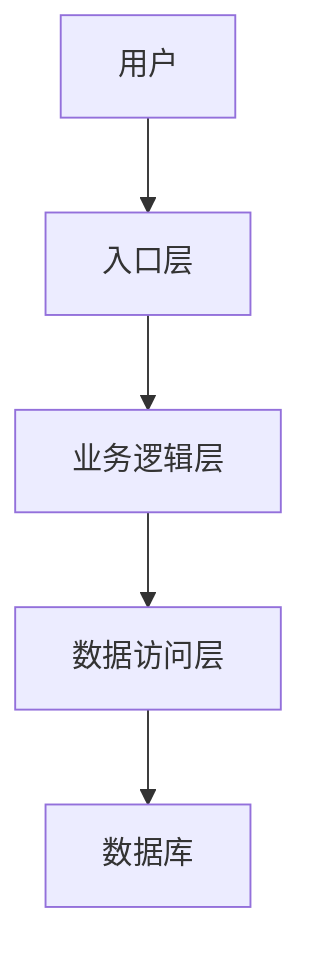
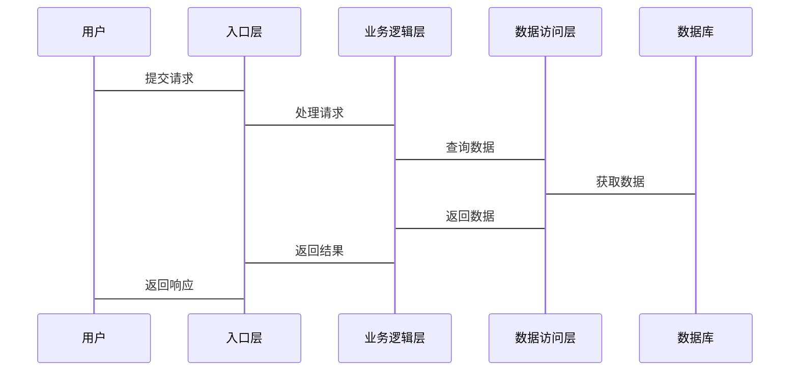

                 


# AI驱动的个人财富积累路径规划器

## 关键词：
AI技术、财富管理、投资策略、风险管理、动态规划、强化学习、财富积累路径

## 摘要：
本文详细探讨了如何利用AI技术来优化个人财富积累路径，通过分析投资策略和风险管理，结合动态规划和强化学习算法，构建一个智能化的财富规划系统。文章从背景到系统架构设计，再到项目实战，全面解析AI在财富管理中的应用，帮助读者实现更高效的财富积累。

---

# 第一部分: AI驱动的个人财富积累路径规划器背景与核心概念

## 第1章: AI驱动的财富规划背景与问题定义

### 1.1 个人财富积累的核心问题
#### 1.1.1 财富积累的目标与挑战
财富积累的目标通常包括实现财务自由、资产保值与增值、规避风险等。然而，传统财富管理方法依赖人工经验，存在效率低下、决策滞后等问题。

#### 1.1.2 传统财富管理的局限性
传统方法主要依赖专家经验，难以应对市场波动和复杂的投资环境，且效率较低，难以满足个性化需求。

#### 1.1.3 AI技术在财富管理中的应用潜力
AI技术可以通过大数据分析和机器学习算法，实现个性化投资建议、风险预测和动态调整，显著提升财富管理效率。

### 1.2 AI驱动财富规划的定义与边界
#### 1.2.1 定义：AI驱动的财富积累路径规划器
AI驱动的财富规划器通过分析用户财务状况、投资目标和风险偏好，提供个性化的投资策略和风险管理方案。

#### 1.2.2 核心目标与应用场景
核心目标包括最大化收益、最小化风险、实现财务自由等。应用场景包括投资组合优化、风险预警、资产配置建议等。

#### 1.2.3 与传统财富管理的区别与联系
区别在于效率和个性化程度，联系在于结合传统经验与AI技术，形成更优的解决方案。

### 1.3 财富积累的核心要素与模型
#### 1.3.1 财富积累的关键因素分析
包括投资标的、时间跨度、风险偏好、市场环境等因素。

#### 1.3.2 财富积累路径模型构建
构建数学模型，模拟不同投资策略下的财富变化。

#### 1.3.3 AI驱动规划器的核心要素
包括数据采集、算法模型、风险评估、动态调整等。

### 1.4 本章小结
本章介绍了AI驱动财富规划的背景、核心概念和关键要素，为后续分析奠定了基础。

---

## 第2章: AI驱动财富规划的核心概念与联系

### 2.1 核心概念原理
#### 2.1.1 AI算法在财富规划中的应用
AI算法如强化学习和动态规划被广泛应用于投资组合优化和风险管理。

#### 2.1.2 优化模型与财富积累的关系
优化模型通过数学建模，模拟财富积累路径，帮助制定最优策略。

#### 2.1.3 数据驱动的决策机制
通过大数据分析，提供个性化投资建议和风险预警。

### 2.2 核心概念属性对比表
| 特性         | 传统财富管理 | AI驱动规划器 |
|--------------|--------------|---------------|
| 决策效率     | 较低         | 高             |
| 个性化程度   | 有限         | 高             |
| 风险控制     | 主观         | 客观           |
| 调整速度     | 缓慢         | 快             |

### 2.3 ER实体关系图


---

## 第3章: AI驱动财富规划的算法原理

### 3.1 算法原理概述
#### 3.1.1 强化学习在财富管理中的应用
强化学习通过模拟不同投资策略，选择最优路径，实现收益最大化。

#### 3.1.2 动态规划与财富积累路径优化
动态规划通过分解问题，逐步优化投资组合，实现长期收益最大化。

### 3.2 算法流程图
```mermaid
graph TD
    输入：财务状况 --> 目标设定
    目标设定 --> 风险偏好分析
    风险偏好分析 --> 投资组合优化
    投资组合优化 --> 收益预测
    收益预测 --> 路径调整
```

### 3.3 算法数学模型
#### 3.3.1 动态规划模型
$$ V(s) = \max_{a} [ r(s,a) + \gamma V(s') ] $$
其中，\( V(s) \) 表示状态 \( s \) 的价值，\( a \) 表示动作，\( r(s,a) \) 表示状态转移的奖励，\( \gamma \) 表示折扣因子，\( s' \) 表示新状态。

#### 3.3.2 强化学习模型
$$ Q(s,a) = r(s,a) + \gamma \max_{a'} Q(s',a') $$

### 3.4 通俗易懂的举例说明
#### 3.4.1 简单投资组合优化案例
假设用户有100万元，选择投资股票和债券。通过动态规划，AI会根据市场预测，优化投资比例，实现最大收益。

#### 3.4.2 风险偏好调整的模拟场景
根据用户风险偏好，调整投资组合的激进程度，平衡风险与收益。

---

## 第4章: 系统分析与架构设计方案

### 4.1 问题场景介绍
#### 4.1.1 用户需求分析
用户需要个性化的投资建议和动态调整的财富规划。

#### 4.1.2 系统目标与范围
系统目标是帮助用户实现财富积累，范围包括投资组合优化、风险管理、收益预测等。

### 4.2 系统功能设计
#### 4.2.1 领域模型


#### 4.2.2 系统架构设计


### 4.3 系统接口设计
系统接口包括用户输入接口、数据接口、算法接口等。

### 4.4 系统交互设计


---

## 第5章: 项目实战

### 5.1 环境安装
需要安装Python、机器学习库（如TensorFlow、PyTorch）和数据处理库（如Pandas）。

### 5.2 系统核心实现源代码
```python
import numpy as np
import pandas as pd

def dynamic_planning(assets, goals, risk_level):
    # 简单动态规划实现
    pass

def强化学习算法：
    pass
```

### 5.3 代码应用解读与分析
解释代码实现的逻辑，如何通过算法优化投资组合。

### 5.4 实际案例分析
通过具体案例，展示AI规划器如何帮助用户实现财富积累。

---

## 第6章: 总结与扩展

### 6.1 最佳实践 tips
- 定期调整投资策略。
- 结合市场动态及时优化。

### 6.2 小结
AI技术在财富管理中的应用前景广阔，通过优化算法和系统设计，可以显著提升财富积累效率。

### 6.3 注意事项
- 数据质量影响结果准确性。
- 算法选择需根据具体情况。

### 6.4 拓展阅读
推荐相关书籍和论文，进一步深入学习。

---

# 结语
通过本文的详细分析，读者可以全面理解AI在财富管理中的应用，并通过实际案例和代码实现，掌握AI驱动的财富积累路径规划器的核心技术。

