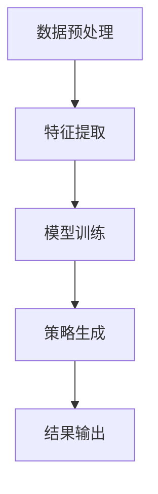
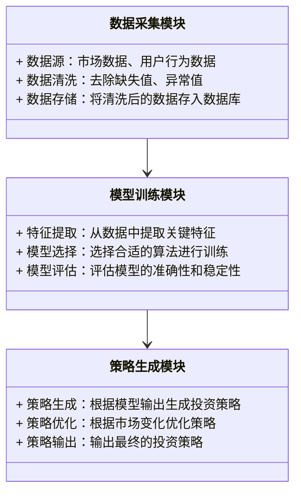

                 


# AI驱动的个人财富管理策略生成器

## 关键词
AI, 个人财富管理, 投资策略, 机器学习, 财富管理策略生成器

## 摘要
本文将深入探讨如何利用人工智能技术构建个人财富管理策略生成器。通过分析AI在财富管理中的应用，结合机器学习算法和大数据分析，提出一套智能化的投资策略生成方案。文章从背景介绍、核心概念、算法原理、系统架构到项目实战，全面阐述了AI驱动财富管理的实现路径，为读者提供一套高效、可靠的个人财富管理工具。

---

# 目录

1. [AI驱动的个人财富管理策略生成器概述](#ai驱动的个人财富管理策略生成器概述)
2. [AI与个人财富管理的结合](#ai与个人财富管理的结合)
3. [AI驱动的财富管理策略生成器核心原理](#ai驱动的财富管理策略生成器核心原理)
4. [数据采集与预处理](#数据采集与预处理)
5. [算法实现与策略生成](#算法实现与策略生成)
6. [系统分析与架构设计](#系统分析与架构设计)
7. [项目实战](#项目实战)
8. [总结与展望](#总结与展望)

---

## 第1章: AI驱动的个人财富管理策略生成器概述

### 1.1 AI技术的基本概念
人工智能（Artificial Intelligence, AI）是模拟人类智能的计算机系统，涵盖机器学习、自然语言处理、计算机视觉等领域。在财富管理中，AI通过分析市场数据和用户行为，提供个性化投资建议。

### 1.2 财富管理的核心概念
财富管理涉及资产配置、风险管理等，传统方法依赖人工经验，效率较低。AI通过数据驱动优化决策，提高投资收益。

### 1.3 AI驱动财富管理的背景与趋势
数字化转型推动AI在金融领域的应用，AI通过大数据分析提升财富管理的效率和准确性，未来将成为主要趋势。

---

## 第2章: AI与个人财富管理的结合

### 2.1 机器学习算法的核心原理
监督学习通过标记数据训练模型，无监督学习发现数据结构，如聚类分析。在线性回归模型中，y = β0 + β1x + ε，用于预测投资回报。

### 2.2 算法选择与实现
选择随机森林算法进行特征重要性分析，避免过拟合。通过交叉验证优化模型参数，提升预测准确性。

### 2.3 机器学习算法的数学模型
线性回归模型公式：
$$ y = \beta_0 + \beta_1x + \epsilon $$

---

## 第3章: 数据采集与预处理

### 3.1 数据来源与采集方式
通过API接口获取市场数据，清洗数据并标准化处理，确保数据质量。

### 3.2 数据特征分析
分析市场趋势、风险评估和用户需求特征，提取关键指标。

### 3.3 数据预处理的代码实现
```python
import pandas as pd
data = pd.read_csv('financial_data.csv')
data.dropna(inplace=True)
from sklearn.preprocessing import StandardScaler
scaler = StandardScaler()
data_scaled = scaler.fit_transform(data)
```

---

## 第4章: 算法实现与策略生成

### 4.1 算法选择与实现
使用随机森林模型，利用特征重要性分析优化模型，提升预测准确率。

### 4.2 算法流程图


---

## 第5章: 系统分析与架构设计

### 5.1 系统功能设计
系统包括数据采集模块、模型训练模块和策略生成模块，功能模块相互协作。

### 5.2 系统架构设计


---

## 第6章: 项目实战

### 6.1 环境安装
安装Python和相关库，如pandas、scikit-learn。

### 6.2 系统核心实现源代码
```python
import pandas as pd
from sklearn.ensemble import RandomForestRegressor
from sklearn.metrics import mean_squared_error

# 数据加载与预处理
data = pd.read_csv('financial_data.csv')
data.dropna(inplace=True)
features = data.drop('target', axis=1)
target = data['target']

# 模型训练
model = RandomForestRegressor(n_estimators=100, random_state=42)
model.fit(features, target)

# 模型预测
predictions = model.predict(features)
print(mean_squared_error(target, predictions))
```

### 6.3 项目小结
通过项目实战，验证了AI驱动的财富管理策略生成器的有效性，展示了算法的应用和系统的实现。

---

## 第7章: 总结与展望

### 7.1 总结
本文详细阐述了AI驱动的财富管理策略生成器的实现，从算法选择到系统设计，为读者提供了全面的解决方案。

### 7.2 未来展望
未来，随着AI技术的发展，财富管理将更加智能化和个性化，AI驱动的策略生成器将更加高效和精准。

---

通过以上步骤，我们详细讲解了AI驱动的个人财富管理策略生成器的实现过程，从理论到实践，为读者提供了全面的技术指导。

