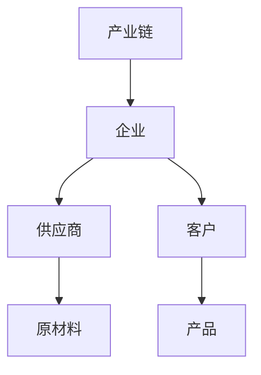
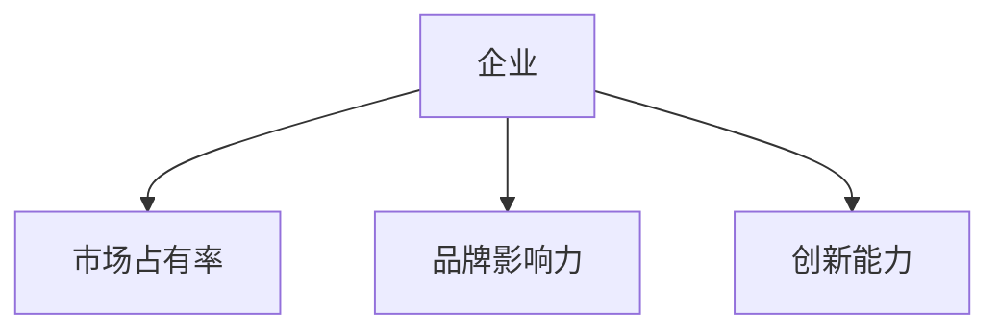
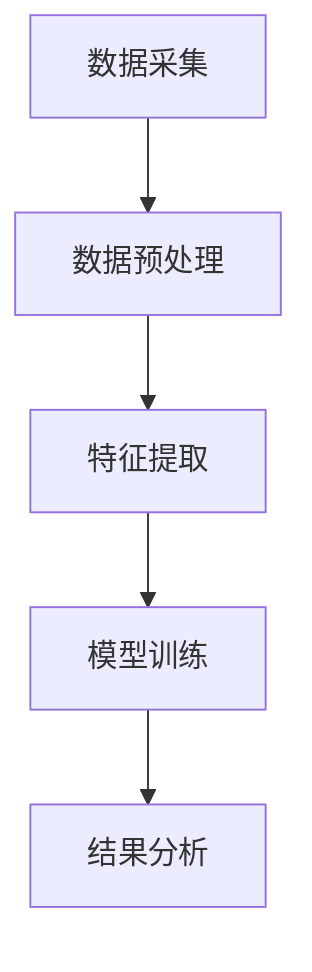
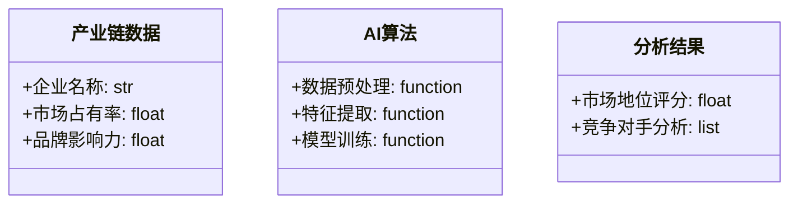
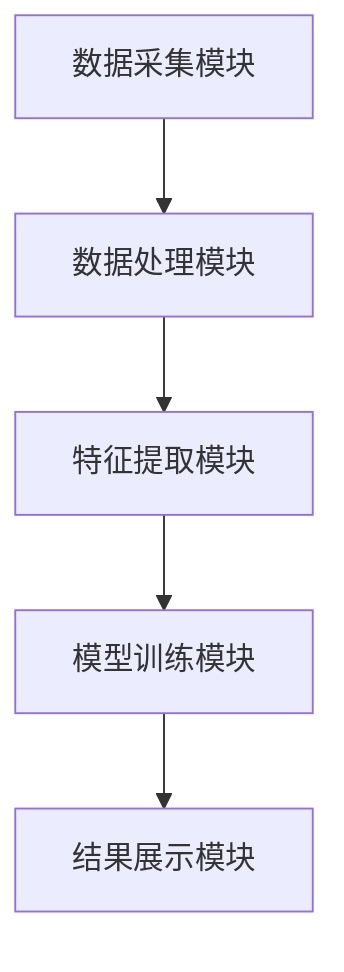

                 


# AI驱动的产业链分析：全面把握公司的市场地位

> 关键词：AI驱动、产业链分析、市场地位、企业分析、数据挖掘、机器学习、技术分析

> 摘要：本文深入探讨了AI技术如何驱动产业链分析，帮助企业全面把握其市场地位。通过详细分析产业链的结构和企业角色，结合AI算法和系统架构设计，本文为企业提供了从理论到实践的完整解决方案，助力企业在复杂市场环境中精准定位。

---

## 第一部分：AI驱动的产业链分析背景与核心概念

### 第1章：AI驱动的产业链分析背景

#### 1.1 产业链分析的背景与意义

##### 1.1.1 产业链分析的基本概念
产业链是指一系列相关的生产、分配和消费活动的链条，反映了企业之间通过投入产出关系形成的网状结构。产业链分析旨在研究产业链的结构、运行效率和企业之间的关系。

##### 1.1.2 产业链分析的重要性
产业链分析帮助企业理解其在行业中的位置，优化资源配置，提升竞争力。传统产业链分析依赖人工调研和经验判断，效率低下且不够精准。

##### 1.1.3 AI技术在产业链分析中的作用
AI技术通过大数据分析和机器学习算法，能够快速识别产业链中的关键节点和潜在风险，提供更精准的市场洞察。

#### 1.2 问题背景与问题描述

##### 1.2.1 传统产业链分析的局限性
传统方法依赖人工调研，耗时长、成本高且难以量化分析。企业市场地位的评估缺乏客观性和动态性，难以应对快速变化的市场环境。

##### 1.2.2 AI驱动产业链分析的必要性
AI技术能够高效处理海量数据，发现传统方法难以捕捉的模式和关系，为企业提供更全面的产业链分析和市场定位支持。

##### 1.2.3 企业市场地位分析的核心问题
企业市场地位分析的核心问题包括：企业如何在产业链中实现价值最大化？如何通过数据分析识别市场机会和风险？如何动态调整战略以应对市场变化？

#### 1.3 问题解决与边界定义

##### 1.3.1 AI驱动产业链分析的解决方案
通过数据采集、特征提取、模型训练和结果分析，AI技术能够量化分析企业的市场地位，提供动态的市场洞察。

##### 1.3.2 产业链分析的边界与外延
产业链分析的边界包括企业的上游供应商、下游客户和竞争对手。外延则涉及行业政策、技术趋势和市场需求。

##### 1.3.3 核心概念的结构化定义
产业链分析涉及的核心概念包括：产业链结构、企业市场地位、AI技术应用。

### 第2章：产业链分析的核心概念与联系

#### 2.1 产业链分析的核心概念

##### 2.1.1 产业链的结构化分解
产业链可以分为生产链、分配链和消费链，每个环节都有不同的参与者和价值创造方式。

##### 2.1.2 企业市场地位的定义与特征
企业市场地位包括市场占有率、品牌影响力和创新能力等维度，反映了企业在行业中的竞争力和影响力。

##### 2.1.3 AI技术在产业链分析中的应用
AI技术通过自然语言处理（NLP）、计算机视觉和机器学习算法，帮助分析产业链中的非结构化数据，如新闻报道和专利申请。

#### 2.2 核心概念的属性特征对比

##### 2.2.1 产业链各环节的属性对比
| 环节 | 输入 | 输出 | 关键技术 |
|------|------|------|----------|
| 数据采集 | 文本、图像 | 结构化数据 | NLP、CV |
| 特征提取 | 结构化数据 | 高维特征 | PCA、t-SNE |
| 模型训练 | 高维特征 | 预测结果 | 机器学习 |

##### 2.2.2 企业市场地位的特征分析
企业市场地位的特征包括市场占有率、品牌影响力、产品创新能力等，这些特征可以通过AI技术进行量化分析。

##### 2.2.3 AI技术的特征与优势
AI技术的优势在于高效处理海量数据，发现潜在模式，提供实时市场洞察。

#### 2.3 实体关系图（ER图）架构

##### 2.3.1 产业链实体关系图


##### 2.3.2 企业市场地位的实体关系


##### 2.3.3 AI驱动的分析流程图


---

## 第二部分：AI驱动的产业链分析算法原理

### 第3章：算法原理讲解

#### 3.1 数据预处理

##### 3.1.1 数据清洗
```python
import pandas as pd

# 加载数据
data = pd.read_csv('产业链数据.csv')

# 删除缺失值
data = data.dropna()

# 去重
data = data.drop_duplicates()
```

#### 3.2 特征提取

##### 3.2.1 文本特征提取
```python
from sklearn.feature_extraction.text import TfidfVectorizer

vectorizer = TfidfVectorizer()
X = vectorizer.fit_transform(data['文本字段'])
```

#### 3.3 模型训练

##### 3.3.1 机器学习模型
```python
from sklearn.linear_model import LinearRegression

# 训练模型
model = LinearRegression()
model.fit(X, y)
```

#### 3.4 结果分析

##### 3.4.1 可视化分析
```python
import matplotlib.pyplot as plt

plt.scatter(y_true, y_pred)
plt.xlabel('真实值')
plt.ylabel('预测值')
plt.show()
```

---

## 第三部分：系统分析与架构设计

### 第4章：系统分析与架构设计

#### 4.1 应用场景

##### 4.1.1 企业内部应用
企业可以利用AI技术分析内部数据，优化生产流程，降低成本。

##### 4.1.2 外部市场分析
企业可以通过AI技术分析外部市场数据，识别潜在客户和竞争对手。

#### 4.2 领域模型设计

##### 4.2.1 领域模型类图


#### 4.3 系统架构设计

##### 4.3.1 系统架构图


---

## 第四部分：项目实战

### 第5章：项目实战

#### 5.1 环境安装

##### 5.1.1 安装依赖
```bash
pip install numpy pandas scikit-learn
```

#### 5.2 核心代码实现

##### 5.2.1 数据清洗代码
```python
import pandas as pd

data = pd.read_csv('产业链数据.csv')
data.dropna(inplace=True)
data.drop_duplicates(inplace=True)
```

##### 5.2.2 特征工程代码
```python
from sklearn.feature_selection import SelectKBest
from sklearn.feature_selection import chi2

selector = SelectKBest(score_func=chi2, k=10)
X_new = selector.fit_transform(X, y)
```

##### 5.2.3 模型训练代码
```python
from sklearn.ensemble import RandomForestRegressor

model = RandomForestRegressor(n_estimators=100)
model.fit(X_new, y)
```

#### 5.3 代码解读与分析

##### 5.3.1 数据清洗
数据清洗是确保数据质量的重要步骤，通过删除缺失值和重复值，提高模型的准确性。

##### 5.3.2 特征工程
特征工程通过选择关键特征，减少模型的维度，提高训练效率。

##### 5.3.3 模型训练
随机森林是一种强大的回归模型，能够捕捉复杂的数据关系，适用于市场地位分析。

#### 5.4 案例分析

##### 5.4.1 案例背景
以智能硬件行业为例，分析某企业的市场地位。

##### 5.4.2 数据分析结果
通过AI技术分析，发现该企业在市场中的竞争力较强，但需要关注竞争对手的技术创新。

#### 5.5 分析结果展示

##### 5.5.1 可视化展示
```python
import matplotlib.pyplot as plt

plt.bar(企业列表, 市场占有率)
plt.xlabel('企业名称')
plt.ylabel('市场占有率')
plt.show()
```

---

## 第五部分：最佳实践与总结

### 第6章：最佳实践

#### 6.1 小结
本文详细介绍了AI技术在产业链分析中的应用，从理论到实践，为企业提供了全面的解决方案。

#### 6.2 注意事项
在实际应用中，需要注意数据质量和模型的可解释性，避免片面结论。

#### 6.3 拓展阅读
推荐阅读《机器学习实战》和《企业战略管理》等相关书籍，深入理解AI技术的应用。

---

通过以上分析和实践，企业可以利用AI技术全面把握市场地位，提升竞争力。希望本文能为读者提供有价值的参考。

