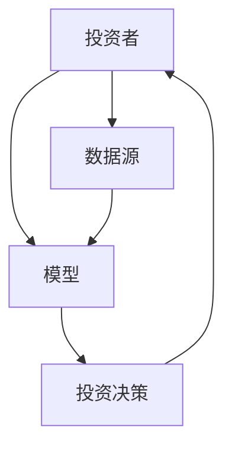
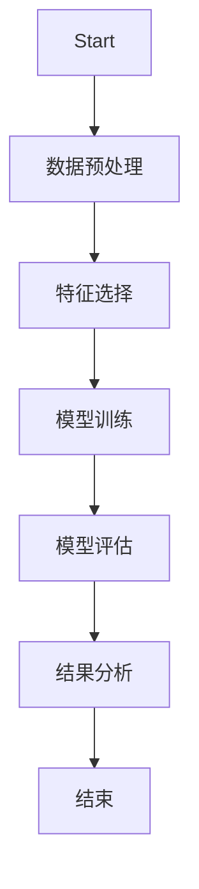
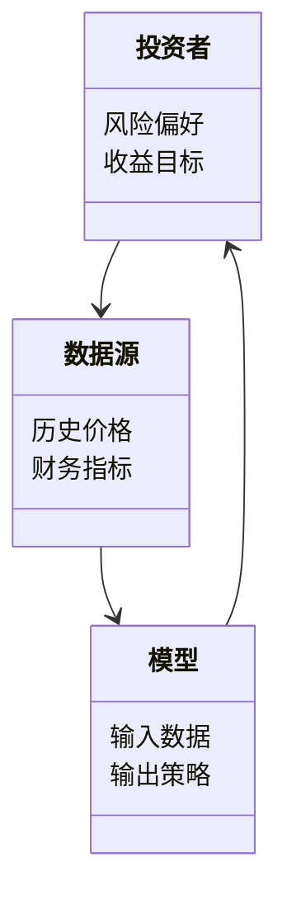

                 


# AI驱动的价值投资策略个性化定制

## 关键词：AI，价值投资，个性化定制，投资策略，金融数据分析，机器学习，风险管理

## 摘要：本文探讨了如何利用人工智能技术驱动价值投资策略的个性化定制。文章从背景介绍、核心概念、算法原理、系统架构设计、项目实战到最佳实践，详细分析了AI在价值投资中的应用，展示了如何通过数据驱动和智能算法实现个性化的投资策略，帮助投资者在复杂多变的市场中优化决策。

---

# 第1章: AI驱动的价值投资策略概述

## 1.1 价值投资的基本概念

### 1.1.1 价值投资的定义与核心理念
价值投资是一种以基本面分析为基础的投资策略，强调购买被市场低估的资产，长期持有，等待其价值回归。其核心理念是寻找具有持续竞争优势和良好治理结构的企业，关注企业的内在价值而非短期市场波动。

### 1.1.2 价值投资的哲学与方法论
价值投资的哲学强调安全边际和长期持有，注重对企业财务状况、行业地位和管理团队的深入分析。方法论包括对公司基本面的全面评估、行业趋势分析以及竞争对手分析。

### 1.1.3 价值投资在现代金融中的地位与作用
尽管价值投资在传统金融中占据重要地位，但其依赖人工分析和经验判断的局限性在复杂多变的市场中逐渐显现。传统方法难以满足个性化、实时性和高效性的需求。

## 1.2 AI在金融投资中的应用现状

### 1.2.1 AI在金融领域的核心应用场景
人工智能技术在金融领域的应用广泛，包括智能投顾、风险控制、市场预测、量化交易等。AI通过处理海量数据，提供实时分析和决策支持，帮助投资者优化投资组合。

### 1.2.2 AI驱动投资策略的优势与挑战
AI的优势在于其高效的数据处理能力和模式识别能力，能够发现传统方法难以察觉的市场信号。然而，AI的黑箱特性、数据质量依赖以及市场环境的不确定性仍对其应用构成挑战。

### 1.2.3 个性化投资策略的市场需求与技术可行性
随着投资者需求的多样化，个性化投资策略成为市场焦点。通过AI技术，投资者可以根据自身风险承受能力和收益目标，定制专属的投资方案，实现精准投资。

## 1.3 价值投资与AI的结合

### 1.3.1 传统价值投资的局限性
传统价值投资依赖分析师的主观判断，存在效率低下、覆盖面有限的问题，难以应对高频交易和大数据时代的挑战。

### 1.3.2 AI如何赋能价值投资
人工智能通过深度学习模型，能够快速分析大量非结构化数据，如新闻、社交媒体和公司财报，提取关键信息，辅助价值评估。

### 1.3.3 个性化投资策略的实现路径
通过AI技术，投资者可以根据自身需求，定制基于个人风险偏好和收益目标的投资策略，实现精准投资。

## 1.4 本章小结

### 1.4.1 价值投资的核心理念
价值投资注重企业内在价值，强调长期持有和安全边际。

### 1.4.2 AI在金融投资中的应用潜力
AI通过数据处理和模式识别，为投资决策提供高效支持。

### 1.4.3 个性化投资策略的实现框架
通过AI技术，投资者可以根据个人需求定制专属的投资策略，优化投资效果。

---

# 第2章: AI驱动的价值投资策略的核心概念与联系

## 2.1 核心概念原理

### 2.1.1 数据驱动的投资决策
AI通过分析历史数据、市场动态和公司基本面，提供数据支持的投资决策。

### 2.1.2 AI算法在投资策略中的应用
AI算法，如神经网络和随机森林，用于市场预测和投资组合优化。

### 2.1.3 个性化投资策略的构建逻辑
基于投资者的特征，构建定制化的投资策略，满足个性化需求。

## 2.2 核心概念属性特征对比

| 特征维度 | 传统投资策略 | AI驱动策略 |
|----------|---------------|-------------|
| 数据依赖 | 低             | 高           |
| 模型复杂度 | 简单           | 复杂         |
| 可解释性 | 高             | 中到低       |
| 实时性 | 低             | 高           |

## 2.3 ER实体关系图


---

# 第3章: AI驱动的价值投资策略的算法原理

## 3.1 算法原理概述

### 3.1.1 机器学习在投资中的应用
机器学习用于市场预测、风险评估和投资组合优化。

### 3.1.2 常见算法及其特点
- **线性回归**：用于预测资产回报。
- **支持向量机**：用于分类和回归分析。
- **随机森林**：用于特征重要性分析。
- **神经网络**：用于复杂模式识别。

### 3.1.3 算法选择的依据与策略
根据数据类型、任务需求和计算资源选择合适的算法。

## 3.2 算法流程图


## 3.3 算法实现代码

### 线性回归示例
```python
import numpy as np
import pandas as pd
from sklearn.linear_model import LinearRegression

# 示例数据
data = pd.DataFrame({
    'feature': np.random.rand(100, 1),
    'target': np.random.rand(100, 1)
})

# 创建并训练模型
model = LinearRegression()
model.fit(data[['feature']], data['target'])

# 预测结果
predictions = model.predict(data[['feature']])
print('回归系数:', model.coef_)
print('截距:', model.intercept_)
```

### 支持向量机示例
```python
from sklearn.svm import SVC
from sklearn.datasets import make_classification

# 示例数据
X, y = make_classification(n_samples=100, n_features=2, n_classes=2)

# 创建并训练模型
model = SVC()
model.fit(X, y)

# 预测结果
print('支持向量机模型:', model)
```

---

# 第4章: AI驱动的价值投资策略的系统分析与架构设计

## 4.1 问题场景介绍

### 4.1.1 投资者需求分析
投资者根据自身风险偏好和收益目标，定制投资策略。

### 4.1.2 数据来源与特征
包括历史价格、财务指标、新闻数据等多维度数据。

## 4.2 系统功能设计

### 4.2.1 系统功能模块
- 数据采集模块
- 数据处理模块
- 模型训练模块
- 策略生成模块
- 结果展示模块

### 4.2.2 系统功能流程
1. 数据采集：获取相关数据。
2. 数据处理：清洗和特征工程。
3. 模型训练：选择并训练模型。
4. 策略生成：输出投资策略。
5. 结果展示：可视化分析结果。

## 4.3 系统架构设计

### 4.3.1 领域模型类图


### 4.3.2 系统架构图


---

# 第5章: AI驱动的价值投资策略的项目实战

## 5.1 环境安装

### 5.1.1 安装Anaconda
```bash
# 在终端运行
conda install -n py38 python=3.8
```

### 5.1.2 安装Jupyter Notebook
```bash
conda install jupyter
```

## 5.2 系统核心实现源代码

### 价值投资策略实现代码
```python
import numpy as np
import pandas as pd
from sklearn.linear_model import LinearRegression

# 示例数据
data = pd.DataFrame({
    'feature1': np.random.rand(100, 1),
    'feature2': np.random.rand(100, 1),
    'target': np.random.rand(100, 1)
})

# 创建并训练模型
model = LinearRegression()
model.fit(data[['feature1', 'feature2']], data['target'])

# 预测结果
predictions = model.predict(data[['feature1', 'feature2']])
print('预测结果:', predictions)
```

## 5.3 代码应用解读与分析

### 代码功能解读
上述代码展示了如何使用线性回归模型进行预测，帮助投资者根据特征变量预测目标变量。

### 代码运行环境
需要安装Python 3.8及以上版本和相关库。

## 5.4 实际案例分析

### 案例背景
假设一名投资者希望根据公司财务指标预测股票价格。

### 数据准备
收集相关公司的财务数据和历史股价。

### 模型训练
使用随机森林模型进行训练。

### 结果分析
模型输出预测结果，帮助投资者制定投资策略。

## 5.5 项目小结

### 项目实现的关键步骤
1. 数据采集与预处理。
2. 模型选择与训练。
3. 结果分析与策略生成。

### 项目实现的经验总结
- 数据质量至关重要。
- 模型选择影响结果。
- 结果解释需要结合业务知识。

---

# 第6章: AI驱动的价值投资策略的最佳实践

## 6.1 小结

### 6.1.1 价值投资的核心理念
价值投资注重内在价值，强调长期持有。

### 6.1.2 AI在金融投资中的应用
AI通过数据处理和模式识别，优化投资决策。

### 6.1.3 个性化投资策略的实现
通过AI技术，投资者可以根据自身需求定制专属投资策略。

## 6.2 注意事项

### 6.2.1 数据依赖性
AI模型严重依赖数据质量，数据偏差可能影响结果。

### 6.2.2 模型可解释性
复杂的AI模型可能难以解释，影响投资者信任。

### 6.2.3 市场环境的不确定性
市场波动和突发事件可能影响模型预测。

## 6.3 拓展阅读

### 6.3.1 推荐书籍
- 《机器学习实战》
- 《Python机器学习》

### 6.3.2 推荐课程
- 《AI驱动的金融分析》
- 《高级投资策略》

### 6.3.3 推荐工具
- Python编程
- TensorFlow/PyTorch
- Jupyter Notebook

---

# 结语

通过本文的详细阐述，读者可以深入了解AI驱动的价值投资策略个性化定制的实现过程和实际应用。AI技术的引入为价值投资注入了新的活力，帮助投资者在复杂多变的市场中实现精准投资。希望本文能为读者提供有价值的见解和实践指导。

---

# 附录

## 附录A: 常见问题解答

### 问题1: AI在价值投资中的具体应用有哪些？
答：AI可以用于市场预测、风险评估、投资组合优化等。

### 问题2: 如何确保AI模型的准确性？
答：需要高质量的数据和合理的模型选择。

## 附录B: 参考文献

1. 《机器学习实战》
2. 《Python机器学习》
3. 《深度学习》

---

通过以上内容，本文系统地介绍了AI驱动的价值投资策略个性化定制的各个方面，从理论到实践，为读者提供了全面的指导和见解。希望本文能帮助投资者和开发者更好地理解和应用这一技术。

