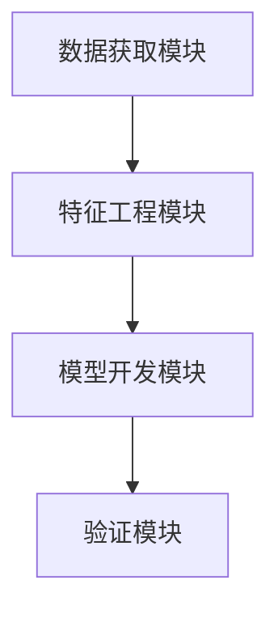

                 


# AI驱动的价值投资策略交叉验证

> 关键词：AI驱动、价值投资、交叉验证、机器学习、金融分析、投资策略、深度学习

> 摘要：本文将探讨如何利用人工智能技术优化价值投资策略，并通过交叉验证的方法来验证策略的有效性。文章将从价值投资策略的核心概念出发，分析AI驱动的金融分析背景，详细介绍AI算法在价值投资中的应用，包括回归分析、聚类分析和时间序列分析等方法。同时，本文将重点讲解交叉验证在投资策略优化中的作用，并通过系统架构设计和项目实战来展示如何实现AI驱动的价值投资策略。最后，文章将总结AI驱动的价值投资策略的优势，并展望其未来的发展方向。

---

# 第1章: AI驱动的价值投资策略概述

## 1.1 价值投资策略的核心概念

### 1.1.1 价值投资的定义与核心要素

价值投资是一种以公司基本面分析为基础的投资策略，其核心在于寻找市场价格低于其内在价值的股票。以下是价值投资的核心要素：

1. **内在价值**：公司未来现金流的现值，是衡量公司价值的关键指标。
2. **财务指标**：如市盈率（P/E）、市净率（P/B）、股息率等。
3. **公司基本面**：包括收入、利润、资产负债表等财务数据。
4. **市场情绪**：投资者情绪对市场价格的影响。

### 1.1.2 价值投资与AI技术的结合

随着AI技术的快速发展，价值投资策略也在逐步引入人工智能技术。AI可以通过以下方式增强价值投资策略：

1. **数据处理**：AI能够快速处理大量非结构化数据，如新闻、社交媒体等，提取情绪指标。
2. **预测模型**：通过机器学习算法预测股票价格走势。
3. **策略优化**：利用深度学习技术优化投资组合，降低风险。

### 1.1.3 价值投资策略的数学模型

价值投资策略的数学模型可以表示为：

$$ V = \sum_{t=1}^{n} \frac{C_t}{(1 + r)^t} $$

其中：
- \( V \) 是公司内在价值
- \( C_t \) 是第 \( t \) 年的现金流
- \( r \) 是折现率
- \( n \) 是预测的年数

---

## 1.2 AI驱动的金融分析背景

### 1.2.1 人工智能在金融领域的应用现状

人工智能在金融领域的应用广泛，包括股票预测、风险管理、投资组合优化等。以下是一些典型的应用场景：

1. **股票预测**：利用机器学习算法预测股票价格走势。
2. **风险管理**：通过AI技术识别市场风险并制定应对策略。
3. **投资组合优化**：利用AI技术优化投资组合，提高收益。

### 1.2.2 价值投资策略的数字化转型

传统价值投资策略依赖于人工分析，而AI技术的引入使得价值投资策略更加高效和精准。AI可以通过以下方式实现价值投资策略的数字化转型：

1. **自动化数据处理**：AI能够快速处理大量数据，提取关键指标。
2. **智能决策支持**：AI可以通过模型预测市场趋势，辅助投资决策。
3. **实时监控**：AI可以实时监控市场变化，及时调整投资策略。

### 1.2.3 交叉验证在投资策略优化中的作用

交叉验证是一种常用的模型验证方法，通过将数据集划分为训练集和测试集，反复验证模型的泛化能力。在投资策略优化中，交叉验证可以帮助投资者评估策略的有效性。

---

## 1.3 本书的核心目标与结构

### 1.3.1 本书的核心目标

本书的核心目标是通过AI技术优化价值投资策略，并通过交叉验证的方法验证策略的有效性。

### 1.3.2 本书的结构安排

本书将从价值投资策略的核心概念出发，详细介绍AI算法在价值投资中的应用，包括回归分析、聚类分析和时间序列分析等方法。同时，本书将重点讲解交叉验证在投资策略优化中的作用，并通过系统架构设计和项目实战来展示如何实现AI驱动的价值投资策略。

### 1.3.3 本书的适用读者

本书适用于以下读者：

1. 对价值投资策略感兴趣的投资专业人士。
2. 对人工智能技术感兴趣的程序员和数据科学家。
3. 对金融数据分析感兴趣的学术研究者。

---

# 第2章: 价值投资策略的AI模型基础

## 2.1 价值投资策略的核心要素

### 2.1.1 财务指标分析

财务指标是价值投资策略的核心要素之一。以下是常见的财务指标：

1. **市盈率（P/E）**：市盈率 = 股价 / 每股净利润
2. **市净率（P/B）**：市净率 = 股价 / 每股净资产
3. **股息率**：股息率 = 每股股息 / 股价

### 2.1.2 市场情绪分析

市场情绪是影响股票价格的重要因素。以下是一些常用的市场情绪指标：

1. **新闻情感分析**：通过自然语言处理技术分析新闻标题和内容，提取市场情绪。
2. **社交媒体情绪分析**：通过分析社交媒体上的投资者情绪，预测市场走势。

### 2.1.3 公司基本面分析

公司基本面分析是价值投资策略的核心内容之一。以下是常见的公司基本面分析指标：

1. **收入与利润**：公司收入和利润的增长情况。
2. **资产负债表**：公司的资产、负债和所有者权益情况。
3. **现金流**：公司经营活动、投资活动和筹资活动的现金流情况。

---

## 2.2 AI模型在价值投资中的应用

### 2.2.1 机器学习在股票筛选中的应用

机器学习在股票筛选中的应用主要体现在以下几个方面：

1. **特征工程**：通过机器学习技术提取股票的特征指标。
2. **分类模型**：利用机器学习算法对股票进行分类，筛选出具有投资价值的股票。

### 2.2.2 深度学习在市场趋势预测中的应用

深度学习在市场趋势预测中的应用主要体现在以下几个方面：

1. **时间序列分析**：利用LSTM模型预测股票价格走势。
2. **市场情绪预测**：通过自然语言处理技术分析新闻和社交媒体，预测市场情绪。

### 2.2.3 自然语言处理在新闻分析中的应用

自然语言处理在新闻分析中的应用主要体现在以下几个方面：

1. **新闻情感分析**：通过NLP技术分析新闻标题和内容，提取市场情绪。
2. **关键词提取**：通过NLP技术提取新闻中的关键词，识别市场趋势。

---

## 2.3 价值投资策略的交叉验证方法

### 2.3.1 交叉验证的基本概念

交叉验证是一种常用的模型验证方法，通过将数据集划分为训练集和测试集，反复验证模型的泛化能力。交叉验证可以帮助投资者评估投资策略的有效性。

### 2.3.2 交叉验证在模型评估中的应用

交叉验证在模型评估中的应用主要体现在以下几个方面：

1. **模型选择**：通过交叉验证选择最优模型。
2. **模型调优**：通过交叉验证优化模型参数。
3. **模型验证**：通过交叉验证验证模型的泛化能力。

### 2.3.3 交叉验证在投资策略优化中的作用

交叉验证在投资策略优化中的作用主要体现在以下几个方面：

1. **策略验证**：通过交叉验证验证投资策略的有效性。
2. **风险控制**：通过交叉验证评估投资策略的风险。
3. **策略优化**：通过交叉验证优化投资策略。

---

# 第3章: 价值投资策略的AI算法原理

## 3.1 机器学习算法在价值投资中的应用

### 3.1.1 线性回归模型

线性回归模型是一种常用的回归分析方法，其核心思想是通过最小化预测值和实际值之间的平方差之和来拟合一条直线。线性回归模型的数学表达式为：

$$ y = \beta_0 + \beta_1 x + \epsilon $$

其中：
- \( y \) 是目标变量
- \( x \) 是自变量
- \( \beta_0 \) 是截距
- \( \beta_1 \) 是回归系数
- \( \epsilon \) 是误差项

---

## 3.2 深度学习算法在价值投资中的应用

### 3.2.1 RNN在时间序列分析中的应用

RNN（循环神经网络）是一种常用的深度学习算法，其核心思想是通过循环结构处理时间序列数据。RNN的数学表达式为：

$$ h_t = \sigma(W_{hh} h_{t-1} + W_{xh} x_t + b_h) $$

其中：
- \( h_t \) 是当前时刻的隐藏状态
- \( x_t \) 是当前时刻的输入
- \( W_{hh} \) 是隐藏层权重
- \( W_{xh} \) 是输入层权重
- \( b_h \) 是隐藏层偏置
- \( \sigma \) 是激活函数

---

## 3.3 交叉验证的算法实现

### 3.3.1 K折交叉验证的实现原理

K折交叉验证是一种常用的交叉验证方法，其核心思想是将数据集划分为K个子集，每次使用其中一个子集作为测试集，其余子集作为训练集。K折交叉验证的步骤如下：

1. 将数据集划分为K个子集。
2. 每次使用一个子集作为测试集，其余子集作为训练集。
3. 重复K次，计算模型的平均准确率。

---

## 3.4 LSTM在股票价格预测中的应用

LSTM（长短期记忆网络）是一种常用的深度学习算法，其核心思想是通过记忆门控机制处理时间序列数据。LSTM的数学表达式为：

$$
\begin{cases}
f_t = \sigma(W_{hf} h_{t-1} + W_{xf} x_t + b_f) \\
i_t = \sigma(W_{hi} h_{t-1} + W_{xi} x_t + b_i) \\
o_t = \sigma(W_{ho} h_{t-1} + W_{xo} x_t + b_o) \\
g_t = \tanh(W_{hg} h_{t-1} + W_{xg} x_t + b_g)
\end{cases}
$$

其中：
- \( f_t \) 是遗忘门
- \( i_t \) 是输入门
- \( o_t \) 是输出门
- \( g_t \) 是候选记忆单元

---

# 第4章: 价值投资策略的系统架构设计

## 4.1 系统架构概述

### 4.1.1 系统架构的核心模块

系统架构的核心模块包括数据获取模块、特征工程模块、模型开发模块和验证模块。

### 4.1.2 系统架构的模块划分

系统架构的模块划分包括以下内容：

1. **数据获取模块**：从数据源获取股票数据。
2. **特征工程模块**：对股票数据进行特征提取和处理。
3. **模型开发模块**：利用机器学习和深度学习算法开发投资策略模型。
4. **验证模块**：通过交叉验证方法验证模型的有效性。

### 4.1.3 系统架构的交互流程

系统架构的交互流程包括以下步骤：

1. **数据获取**：从数据源获取股票数据。
2. **特征工程**：对股票数据进行特征提取和处理。
3. **模型开发**：利用机器学习和深度学习算法开发投资策略模型。
4. **模型验证**：通过交叉验证方法验证模型的有效性。

---

## 4.2 数据获取与处理

### 4.2.1 数据来源与数据清洗

数据来源包括股票市场数据、财务数据、新闻数据等。数据清洗包括去除缺失值、处理异常值等。

### 4.2.2 数据特征提取与工程

数据特征提取与工程包括以下内容：

1. **财务指标提取**：提取市盈率、市净率等财务指标。
2. **市场情绪提取**：提取新闻情感、社交媒体情绪等市场情绪指标。

### 4.2.3 数据预处理与标准化

数据预处理包括数据归一化、数据标准化等步骤。常用的标准化方法包括Z-score标准化和Min-Max标准化。

---

## 4.3 模型开发与训练

### 4.3.1 模型选择与训练策略

模型选择包括选择适合的算法，如线性回归、随机森林、LSTM等。训练策略包括批量训练、在线训练等。

### 4.3.2 模型调优与优化方法

模型调优包括调整模型参数、优化算法等。常用的优化方法包括梯度下降、Adam优化器等。

### 4.3.3 模型评估与验证

模型评估与验证包括计算模型的准确率、召回率、F1分数等指标。

---

## 4.4 系统接口与交互设计

### 4.4.1 系统接口的设计原则

系统接口设计原则包括简洁性、可扩展性、可维护性等。

### 4.4.2 系统交互的流程设计

系统交互流程包括数据输入、模型选择、参数设置、模型训练、结果输出等步骤。

### 4.4.3 系统界面的用户友好性

系统界面设计应注重用户体验，提供友好的交互界面，方便用户操作。

---

# 第5章: 价值投资策略的项目实战

## 5.1 项目介绍

### 5.1.1 项目背景

本项目旨在利用AI技术优化价值投资策略，并通过交叉验证的方法验证策略的有效性。

### 5.1.2 项目目标

本项目的目标是开发一个基于AI的价值投资策略系统，能够根据市场数据和公司基本面数据，自动筛选出具有投资价值的股票，并通过交叉验证方法验证策略的有效性。

---

## 5.2 系统功能设计

### 5.2.1 数据获取模块

数据获取模块负责从数据源获取股票数据，包括股票价格、财务数据、新闻数据等。

### 5.2.2 特征工程模块

特征工程模块负责对股票数据进行特征提取和处理，包括财务指标提取、市场情绪提取等。

### 5.2.3 模型开发模块

模型开发模块负责利用机器学习和深度学习算法开发投资策略模型，包括模型选择、模型调优等。

### 5.2.4 验证模块

验证模块负责通过交叉验证方法验证模型的有效性，包括模型评估、结果输出等。

---

## 5.3 系统架构设计

### 5.3.1 系统架构图

以下是系统的架构图：



### 5.3.2 系统接口设计

系统接口设计包括数据接口、模型接口和结果接口。

### 5.3.3 系统交互设计

系统交互设计包括数据输入、模型选择、参数设置、模型训练、结果输出等步骤。

---

## 5.4 系统实现

### 5.4.1 环境安装

需要安装以下环境：

1. Python 3.8+
2. TensorFlow 2.0+
3. Pandas
4. Scikit-learn
5. NLTK

### 5.4.2 核心代码实现

以下是核心代码实现：

```python
import pandas as pd
import numpy as np
from sklearn.linear_model import LinearRegression
from sklearn.metrics import mean_squared_error

# 数据获取
data = pd.read_csv('stock_data.csv')

# 特征工程
X = data[['P/E', 'P/B', 'ROE']]
y = data['Price']

# 模型开发
model = LinearRegression()
model.fit(X, y)

# 模型验证
y_pred = model.predict(X)
print('均方误差:', mean_squared_error(y, y_pred))
```

### 5.4.3 代码应用解读与分析

上述代码实现了一个简单的线性回归模型，用于预测股票价格。通过特征工程提取了市盈率、市净率和ROE三个特征，利用线性回归算法进行模型训练，并通过均方误差评估模型的性能。

---

## 5.5 项目小结

本项目通过AI技术优化了价值投资策略，并通过交叉验证方法验证了策略的有效性。通过特征工程、模型开发和模型验证等步骤，实现了股票价格预测和投资策略优化。

---

# 第6章: 总结与展望

## 6.1 总结

本文通过AI技术优化了价值投资策略，并通过交叉验证方法验证了策略的有效性。通过特征工程、模型开发和模型验证等步骤，实现了股票价格预测和投资策略优化。

## 6.2 展望

未来，随着AI技术的不断发展，价值投资策略将更加智能化和高效化。AI技术将更加广泛地应用于金融领域，帮助投资者实现更加精准的投资决策。

---

# END

