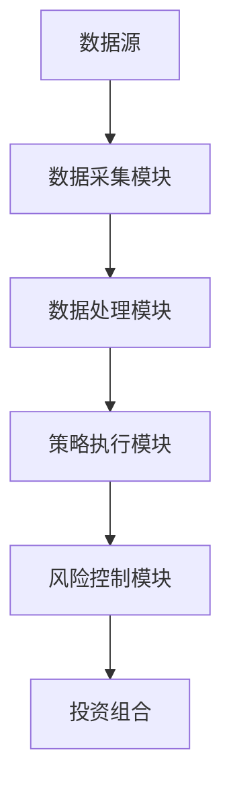
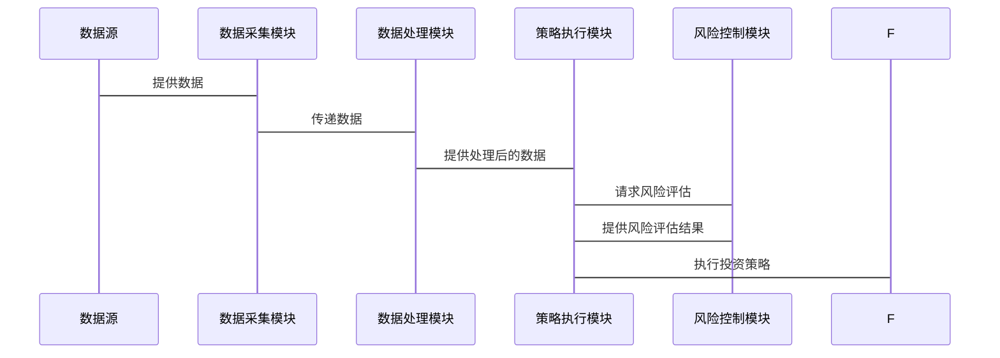

                 


# AI驱动的价值投资策略动态调整

> 关键词：AI驱动，价值投资，动态调整，投资策略，量化分析

> 摘要：本文深入探讨了AI在价值投资策略动态调整中的应用，从理论到实践，详细阐述了AI如何帮助投资者优化投资策略。通过分析市场变化、投资者情绪和数据更新等因素，结合具体算法和系统架构设计，本文为读者提供了实现AI驱动的动态调整策略的完整指南。

---

## 第一章: AI驱动的价值投资策略概述

### 1.1 价值投资的定义与核心理念

#### 1.1.1 价值投资的定义
价值投资是一种基于对公司内在价值进行深入分析的投资策略，旨在以低于内在价值的价格买入优质资产。其核心在于识别市场低估的公司，并长期持有，等待其价值回归。

#### 1.1.2 价值投资的核心理念
- 市场先生理论：市场情绪波动导致价格偏离内在价值。
- 安全边际：以低于内在价值的价格买入，降低风险。
- 长期视角：关注公司的长期盈利能力，而非短期价格波动。

#### 1.1.3 价值投资与传统投资的区别
| 方面         | 价值投资               | 传统投资               |
|--------------|------------------------|------------------------|
| 投资策略     | 基于基本面分析         | 基于技术分析或短期波动 |
| 时间框架     | 长期持有               | 短期交易               |
| 风险管理     | 重视安全边际           | 依赖止损机制           |

### 1.2 AI在金融投资中的应用

#### 1.2.1 AI在金融领域的应用现状
AI技术在金融领域的应用日益广泛，包括量化交易、风险评估、市场预测和客户画像等方面。

#### 1.2.2 AI在价值投资中的优势
- 数据处理能力：AI能够快速分析大量非结构化数据（如新闻、社交媒体）。
- 模型优化：通过机器学习算法，AI可以发现传统方法难以捕捉的模式。
- 动态调整：AI能够实时监控市场变化，动态优化投资策略。

#### 1.2.3 AI驱动投资策略的未来趋势
- 更加个性化：基于投资者风险偏好和市场环境进行定制化策略。
- 更加实时化：AI能够快速响应市场变化，实现实时动态调整。
- 更加智能化：结合NLP和强化学习，投资策略将更加灵活和智能。

### 1.3 投资策略动态调整的必要性

#### 1.3.1 投资策略动态调整的定义
投资策略动态调整是指根据市场环境、公司基本面和投资者目标的变化，实时优化投资组合的过程。

#### 1.3.2 动态调整在价值投资中的重要性
- 应对市场变化：及时调整策略以应对突发事件（如疫情、政策变化）。
- 提高收益：通过动态调整，捕捉市场机会，规避潜在风险。
- 适应投资者需求：根据投资者风险偏好和资金需求进行调整。

#### 1.3.3 动态调整的实现方式
- 定期评估：定期对投资组合进行评估，根据市场变化进行调整。
- 实时监控：利用AI技术实时监控市场和公司基本面变化。
- 自动化调整：通过算法实现自动化动态调整。

---

## 第二章: 价值投资策略的AI驱动量化分析

### 2.1 价值投资的量化分析基础

#### 2.1.1 量化分析的定义
量化分析是指通过数学模型和算法，对市场数据进行分析和预测的过程。

#### 2.1.2 量化分析在价值投资中的应用
- 数据清洗与特征提取：对历史价格、财务数据、新闻等进行处理。
- 模型训练：基于历史数据训练预测模型。
- 策略回测：对模型进行历史数据回测，评估其表现。

#### 2.1.3 量化分析的核心指标
| 指标         | 定义                     | 作用                     |
|--------------|--------------------------|--------------------------|
| 市盈率（PE）  | 每股价格与每股收益之比   | 评估股票估值             |
| 市净率（PB）  | 每股价格与每股净资产之比 | 评估股票估值             |
| 财务健康度    | 包括收入、利润、负债等   | 评估公司财务状况         |
| 市场情绪      | 基于新闻、社交媒体等     | 评估市场情绪             |

### 2.2 AI驱动的量化投资模型

#### 2.2.1 数据采集与清洗
- 数据来源：股票价格、财务报表、新闻、社交媒体。
- 数据清洗：处理缺失值、异常值和噪声数据。

#### 2.2.2 特征提取与建模
- 特征提取：从原始数据中提取有用的特征（如动量、波动率）。
- 模型训练：使用机器学习算法（如随机森林、支持向量机）进行分类或回归。

#### 2.2.3 模型评估与优化
- 回测：通过历史数据验证模型表现。
- 优化：调整模型参数，提高预测准确率。

---

## 第三章: 投资策略动态调整的AI实现机制

### 3.1 动态调整的驱动因素

#### 3.1.1 市场环境变化
- 市场波动：如疫情、地缘政治等突发事件。
- 经济周期：经济衰退或复苏对股票价格的影响。

#### 3.1.2 投资者情绪变化
- 基于新闻和社交媒体的情绪分析。
- 投资者信心指数。

#### 3.1.3 数据更新与反馈
- 新数据的输入：如最新的财务报表、市场新闻。
- 模型反馈：如策略表现、风险指标。

### 3.2 AI驱动的动态调整算法

#### 3.2.1 时间序列分析
- 使用ARIMA或LSTM模型预测股票价格走势。
- 示例：使用LSTM预测未来价格。

#### 3.2.2 情绪指标分析
- 基于文本挖掘技术分析市场情绪。
- 示例：使用情感分析模型判断新闻对股价的影响。

#### 3.2.3 基于机器学习的动态调整模型
- 使用强化学习算法（如Q-Learning）进行策略优化。
- 示例：通过Q-Learning动态调整投资组合。

---

## 第四章: AI算法在投资策略中的应用

### 4.1 常见AI算法概述

#### 4.1.1 线性回归
- 用于预测股票价格。
- 示例：使用线性回归模型预测未来价格。

#### 4.1.2 支持向量机
- 用于分类问题。
- 示例：基于财务指标分类股票。

#### 4.1.3 随机森林
- 用于分类和回归。
- 示例：预测股票价格波动。

#### 4.1.4 强化学习
- 用于动态策略优化。
- 示例：使用强化学习优化投资组合。

---

## 第五章: 系统架构设计

### 5.1 问题场景介绍
- 数据来源多样：包括股票价格、财务报表、新闻等。
- 需要实时监控市场变化。
- 需要动态调整投资策略。

### 5.2 系统功能设计

#### 5.2.1 数据采集模块
- 功能：实时采集股票价格、财务报表、新闻等数据。
- 实现：使用API接口获取数据。

#### 5.2.2 策略执行模块
- 功能：根据模型预测结果动态调整投资组合。
- 实现：基于强化学习算法优化投资策略。

#### 5.2.3 风险控制模块
- 功能：监控投资组合风险，制定风险控制策略。
- 实现：基于VaR模型评估风险。

### 5.3 系统架构设计

#### 5.3.1 系统架构图


#### 5.3.2 系统交互图


---

## 第六章: 项目实战

### 6.1 环境安装

```bash
pip install numpy pandas scikit-learn tensorflow keras
```

### 6.2 核心实现源代码

#### 6.2.1 数据处理代码
```python
import pandas as pd
import numpy as np

# 数据清洗
data = pd.read_csv('stock_data.csv')
data = data.dropna()
data['price'] = (data['price'] - data['price'].mean()) / data['price'].std()
```

#### 6.2.2 模型训练代码
```python
from sklearn.ensemble import RandomForestRegressor

# 特征提取
features = data[['PE', 'PB', 'revenue_growth']]
target = data['price']

# 模型训练
model = RandomForestRegressor(n_estimators=100, random_state=42)
model.fit(features, target)
```

#### 6.2.3 动态调整代码
```python
from keras.models import Sequential
from keras.layers import LSTM, Dense

# LSTM模型
model = Sequential()
model.add(LSTM(64, input_shape=(1, 1)))
model.add(Dense(1))
model.compile(optimizer='adam', loss='mean_squared_error')

# 训练模型
model.fit(x_train, y_train, epochs=10, batch_size=32)
```

---

## 第七章: 总结与展望

### 7.1 总结
AI技术为价值投资策略的动态调整提供了强大工具。通过量化分析和机器学习算法，投资者可以实时优化投资组合，提高收益并降低风险。

### 7.2 未来展望
- 更多的数据源：结合更多非结构化数据（如图像、音频）进行分析。
- 更智能的算法：如强化学习和深度学习的进一步优化。
- 更个性化的服务：根据投资者需求提供定制化策略。

### 7.3 最佳实践 tips
- 数据质量至关重要：确保数据的准确性和完整性。
- 模型需要不断优化：根据市场变化调整模型参数。
- 风险控制是关键：结合VaR模型等工具进行风险管理。

---

通过本文的详细分析，读者可以全面了解AI在价值投资策略动态调整中的应用，并通过实际案例掌握具体实现方法。

