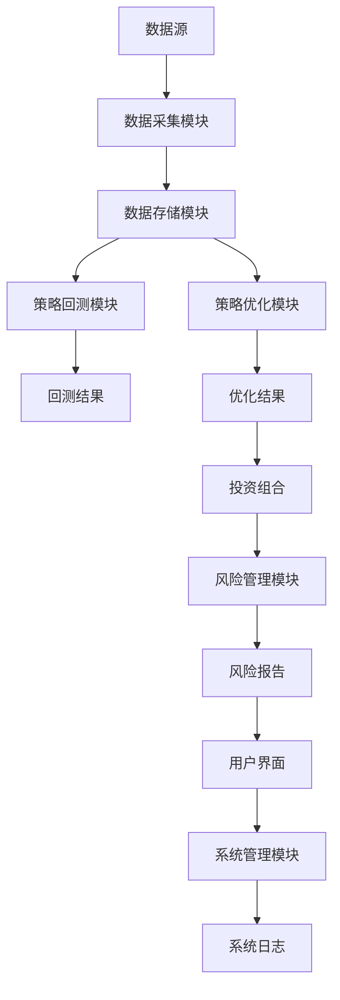

                 


# 第五章：AI驱动的策略优化

## 5.1 策略优化的核心方法

### 5.1.1 基于AI的策略优化方法

#### 5.1.1.1 策略优化的基本概念
策略优化是指在现有策略的基础上，通过调整参数或结构，使其在特定评价指标下达到最优或接近最优的过程。在AI驱动的价值投资中，策略优化的目标是找到能够在不同市场条件下表现最佳的策略组合。

#### 5.1.1.2 基于AI的策略优化方法
1. **遗传算法（Genetic Algorithm, GA）**：
   - **原理**：模拟生物进化的过程，通过选择、交叉和变异操作，逐步优化策略参数。
   - **优化步骤**：
     1. 初始化种群：生成随机的策略参数组合。
     2. 计算适应度：评估每个策略在回测中的表现。
     3. 选择：根据适应度值选择优秀的策略。
     4. 交叉：将优秀策略的参数进行交叉组合，生成新策略。
     5. 变异：随机改变部分参数，增加多样性。
     6. 重复上述步骤，直到达到收敛条件或预设迭代次数。

   ```python
   import numpy as np

   def fitness_function(strategy_params, data):
       # 计算策略的回测收益
       pass

   def genetic_algorithm(population_size, generations, mutation_rate):
       population = np.random.rand(population_size, num_params)
       for _ in range(generations):
           fitness = np.array([fitness_function(p, data) for p in population])
           # 选择
           selected = population[np.argsort(-fitness)[:int(population_size/2)]]
           # 交叉
           offspring = selected[:, np.newaxis] * np.ones((population_size, num_params)) + selected.T[np.newaxis, :]
           # 变异
           mask = np.random.rand(population_size, num_params) < mutation_rate
           offspring[mask] += np.random.randn(np.sum(mask))
       return offspring[0]
   ```

2. **粒子群优化（Particle Swarm Optimization, PSO）**：
   - **原理**：通过模拟鸟群觅食的行为，寻找最优解。
   - **优化步骤**：
     1. 初始化粒子群：随机生成策略参数组合。
     2. 计算适应度：评估每个策略的表现。
     3. 更新粒子速度：根据全局最优和局部最优调整速度。
     4. 更新粒子位置：根据速度更新位置。
     5. 重复上述步骤，直到达到收敛条件或预设迭代次数。

   ```python
   import numpy as np

   def particle_swarm_optimization(population_size, num_params, max_iterations):
       particles = np.random.rand(population_size, num_params)
       velocities = np.zeros((population_size, num_params))
       global_best = np.min([fitness_function(p, data) for p in particles])
       for _ in range(max_iterations):
           for i in range(population_size):
               # 计算适应度
               fitness = fitness_function(particles[i], data)
               # 更新全局最优
               if fitness < global_best:
                   global_best = fitness
                   best_particle = particles[i].copy()
               # 更新速度
               velocities[i] = 0.8 * velocities[i] + 1.2 * (best_particle - particles[i]) + 0.2 * (np.random.rand(num_params) - 0.5)
               # 更新位置
               particles[i] += velocities[i]
       return best_particle
   ```

3. **模拟退火（Simulated Annealing, SA）**：
   - **原理**：通过模拟金属退火的过程，逐步降低温度以寻找全局最优。
   - **优化步骤**：
     1. 初始化当前解：随机生成策略参数组合。
     2. 设置初始温度。
     3. 进行迭代：在每个温度下，随机扰动参数，计算适应度。
     4. 根据适应度决定是否接受新解，逐渐降温，直到达到终止条件。

   ```python
   import numpy as np

   def simulated_annealing(num_params, max_iterations, initial_temp):
       current = np.random.rand(num_params)
       temp = initial_temp
       best = current.copy()
       for _ in range(max_iterations):
           # 扰动参数
           neighbor = current + np.random.randn(num_params) * temp / 100
           # 计算适应度
           fitness_current = fitness_function(current, data)
           fitness_neighbor = fitness_function(neighbor, data)
           # 计算概率
           if fitness_neighbor > fitness_current:
               current = neighbor.copy()
           elif np.exp(- (fitness_neighbor - fitness_current) / temp) > np.random.rand():
               current = neighbor.copy()
           # 降温
           temp *= 0.95
       return current
   ```

### 5.1.2 风险管理与策略优化

#### 5.1.2.1 风险管理的核心概念
风险管理在价值投资中至关重要。AI驱动的策略优化需要考虑以下风险指标：

1. **VaR（Value at Risk）**：在给定置信水平下，可能承受的最大损失。
2. **CVaR（Conditional Value at Risk）**：VaR的条件期望损失，衡量尾部风险。
3. **最大回撤（Maximum Drawdown）**：策略在某段时间内的最大损失。

#### 5.1.2.2 风险管理的AI优化方法
通过AI模型实时监控和预测风险，动态调整投资组合，以降低潜在损失。例如，使用LSTM模型预测市场波动性，调整投资组合的风险暴露。

### 5.1.3 组合优化与策略优化

#### 5.1.3.1 组合优化的基本概念
组合优化是指在多个资产中选择最优的组合，以实现收益最大化或风险最小化。在AI驱动下，可以通过多目标优化模型同时优化收益和风险。

#### 5.1.3.2 组合优化的AI方法
1. **均值-方差优化**：通过优化资产的预期收益和方差，找到最优组合。
2. **多目标优化**：在多个目标（如收益、风险、流动性）之间寻找平衡点。

```python
import numpy as np
from scipy.optimize import minimize

def portfolio_optimization(returns, weights, risk_free_rate):
    # 均值-方差优化
    n = len(weights)
    # 定义目标函数
    def objective(weights):
        return np.dot(weights.T, np.dot(returns, weights))
    # 定义约束条件
    constraints = [{'type': 'eq', 'fun': lambda w: np.sum(w) - 1},  # 投资比例为1
                   {'type': 'eq', 'fun': lambda w: np.dot(weights.T, w) - risk_free_rate}]  # 夏普比率约束
    # 最优化
    result = minimize(objective, np.ones(n)/n, method='SLSQP', constraints=constraints)
    return result.x
```

## 5.2 本章小结

本章详细探讨了AI驱动的策略优化方法，包括遗传算法、粒子群优化和模拟退火等优化算法，以及风险管理与组合优化的AI方法。通过数学模型和代码示例，展示了如何利用这些方法提高投资策略的表现。

---

# 第六章：AI驱动的价值投资系统架构设计

## 6.1 系统架构的核心要素

### 6.1.1 系统功能模块设计

#### 6.1.1.1 数据采集模块
- **功能**：从多种数据源（如股票市场数据、新闻、社交媒体）获取实时或历史数据。
- **输入**：数据源配置文件。
- **输出**：标准化的金融数据集。

#### 6.1.1.2 策略回测模块
- **功能**：基于历史数据，回测投资策略的表现。
- **输入**：策略参数、历史数据。
- **输出**：回测结果（收益、风险指标等）。

#### 6.1.1.3 策略优化模块
- **功能**：优化投资策略的参数或结构。
- **输入**：回测结果、优化目标。
- **输出**：优化后的策略参数。

#### 6.1.1.4 风险管理模块
- **功能**：实时监控和管理投资组合的风险。
- **输入**：当前投资组合、市场数据。
- **输出**：风险指标、调整建议。

#### 6.1.1.5 系统管理模块
- **功能**：系统监控、日志记录、参数配置。
- **输入**：用户输入、系统状态。
- **输出**：系统运行状态、错误日志。

### 6.1.2 系统架构设计



### 6.1.3 接口设计

1. **数据接口**：
   - **输入接口**：数据采集模块接收数据源配置。
   - **输出接口**：数据存储模块输出标准化数据集。

2. **策略接口**：
   - **输入接口**：回测模块接收策略参数。
   - **输出接口**：优化模块输出优化后的策略参数。

3. **风险管理接口**：
   - **输入接口**：投资组合和市场数据。
   - **输出接口**：风险指标和调整建议。

---

# 第七章：AI驱动的价值投资策略项目实战

## 7.1 环境配置与数据准备

### 7.1.1 环境配置
- **安装Python环境**：使用Anaconda或virtualenv。
- **安装依赖库**：numpy、pandas、scikit-learn、LSTM等。

### 7.1.2 数据准备
- **数据获取**：从Yahoo Finance获取股票数据。
- **数据预处理**：标准化、缺失值处理、异常值剔除。

## 7.2 项目核心实现

### 7.2.1 数据预处理与特征提取

```python
import pandas as pd
from sklearn.preprocessing import StandardScaler

# 获取数据
data = pd.read_csv('stock_data.csv')
# 标准化处理
scaler = StandardScaler()
data_scaled = scaler.fit_transform(data[['open', 'high', 'low', 'close']])
```

### 7.2.2 模型训练与回测实现

```python
from sklearn.linear_model import LinearRegression
from sklearn.metrics import mean_squared_error

# 训练模型
model = LinearRegression()
model.fit(X_train, y_train)
# 预测回测
y_pred = model.predict(X_test)
# 评估结果
mse = mean_squared_error(y_test, y_pred)
print(f'MSE: {mse}')
```

### 7.2.3 策略优化与组合优化

```python
from scipy.optimize import minimize

# 定义目标函数
def objective(weights):
    return np.dot(weights.T, np.dot(cov_matrix, weights))

# 定义约束条件
constraints = [{'type': 'eq', 'fun': lambda w: np.sum(w) - 1}]

# 最优化
result = minimize(objective, np.ones(n)/n, method='SLSQP', constraints=constraints)
optimized_weights = result.x
```

## 7.3 实际案例分析与结果解读

### 7.3.1 案例分析
假设我们选择几个股票组成投资组合，使用上述模型进行回测和优化。

### 7.3.2 测试结果与分析
通过回测结果计算夏普比率、最大回撤等指标，评估策略的有效性。

## 7.4 本章小结

本章通过实际项目实战，详细展示了AI驱动的价值投资策略的实现过程，包括环境配置、数据处理、模型训练、策略优化和结果分析。

---

# 第八章：总结与展望

## 8.1 全书总结

### 8.1.1 核心内容回顾
- AI在价值投资中的应用。
- 策略回测与优化的方法。
- 系统架构设计与实现。

## 8.2 当前挑战与未来展望

### 8.2.1 当前主要挑战
1. **数据质量**：数据的完整性和准确性直接影响模型性能。
2. **模型解释性**：复杂的模型可能难以解释其决策过程。
3. **市场变化**：金融市场具有不确定性，模型需要不断更新。

### 8.2.2 未来优化方向
1. **多模态数据融合**：结合文本、图像等多种数据源。
2. **强化学习应用**：通过与市场的交互不断优化策略。
3. **实时交易系统**：实现低延迟的实时交易。

## 8.3 最佳实践与注意事项

### 8.3.1 投资者注意事项
- **风险管理**：始终将风险管理放在首位。
- **持续学习**：关注市场变化，及时调整策略。

### 8.3.2 开发者注意事项
- **数据处理**：确保数据的高质量。
- **模型验证**：多次回测，避免过拟合。
- **系统维护**：定期更新模型和优化参数。

## 8.4 拓展阅读与学习资源

### 8.4.1 推荐书籍
1. 《机器学习实战》
2. 《Python金融大数据分析》
3. 《投资学》

### 8.4.2 推荐在线课程
1. Coursera：AI for Financial Markets
2. Udemy：Algorithmic Trading with Python
3. edX：Introduction to Quantitative Finance

## 8.5 结语

AI驱动的价值投资策略是一个复杂的系统工程，需要结合金融知识和AI技术。通过不断的优化和创新，我们可以开发出更高效、更可靠的策略，帮助投资者实现长期稳健的收益。

---

# 关键词

- AI驱动
- 价值投资
- 策略回测
- 策略优化
- 系统架构
- 投资组合
- 风险管理
- 多目标优化
- 机器学习
- 金融大数据

# 摘要

本书《AI驱动的价值投资策略回测与优化》系统地探讨了如何利用人工智能技术提升价值投资策略的效果。从基础概念到实际应用，详细介绍了AI在策略回测、优化和系统架构中的应用。通过丰富的代码示例和实际案例，读者可以掌握如何利用AI技术进行策略优化和风险管理，最终构建出高效、稳健的投资系统。

