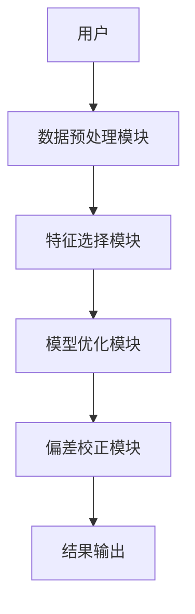

                 


# AI驱动的价值投资策略回测偏差校正

> 关键词：AI驱动，价值投资策略，回测偏差校正，金融数据分析，机器学习

> 摘要：本文深入探讨了如何利用人工智能技术优化价值投资策略的回测过程，重点分析了回测中的偏差问题及其校正方法。通过系统性地介绍偏差的来源、AI驱动的校正算法、系统架构设计以及实际项目案例，本文为金融从业者提供了一套有效的解决方案，帮助他们提升投资策略的准确性与可靠性。

---

# 第1章: 价值投资策略回测的背景与问题

## 1.1 价值投资策略概述

### 1.1.1 价值投资的核心理念
价值投资是一种以基本面分析为基础的投资策略，旨在通过识别市场中被低估的股票，长期持有以实现资本增值。其核心理念包括：
- **低估值**：寻找市场价格低于内在价值的标的。
- **长期视角**：关注企业的长期盈利能力，而非短期市场波动。
- **安全边际**：在价格显著低于价值时买入，以降低风险。

### 1.1.2 价值投资策略的常见类型
常见的价值投资策略包括：
1. **低市盈率策略**：寻找市盈率低于市场平均水平的股票。
2. **低市净率策略**：关注市净率低于行业平均水平的股票。
3. **高股息率策略**：投资于股息收益率较高的股票。
4. **相对强度策略**：结合股价表现与基本面分析。

### 1.1.3 价值投资策略在金融市场的应用现状
随着金融市场数据的日益丰富和分析工具的不断进步，价值投资策略在实践中得到了广泛应用。然而，传统的方法往往依赖经验丰富的分析师，存在主观性强、效率低下的问题。近年来，人工智能技术的引入为价值投资策略的优化提供了新的可能性。

---

## 1.2 策略回测的基本概念

### 1.2.1 回测的定义与作用
回测是指通过对历史数据进行模拟交易，评估投资策略在过去的市场环境下的表现。其作用包括：
- 验证策略的有效性。
- 量化策略的风险和收益特征。
- 发现策略的潜在缺陷。

### 1.2.2 回测的主要步骤
1. **数据收集**：获取历史市场数据，包括价格、成交量、财务指标等。
2. **策略实现**：将策略逻辑转化为代码，模拟交易过程。
3. **结果分析**：计算收益、风险等指标，评估策略表现。
4. **参数优化**：调整策略参数以提高表现。

### 1.2.3 回测结果的解读
解读回测结果时，需关注以下关键指标：
- **收益**：策略的年化收益、夏普比率等。
- **风险**：最大回撤、波动率等。
- **稳定性**：策略在不同市场环境下的表现一致性。

---

## 1.3 回测偏差的定义与分类

### 1.3.1 回测偏差的来源
回测偏差主要来源于以下几个方面：
1. **数据偏差**：历史数据的不完整或选择性使用。
2. **模型偏差**：策略逻辑过于简化，未能捕捉市场复杂性。
3. **样本偏差**：回测区间内数据的特殊性导致结果偏差。

### 1.3.2 数据偏差、模型偏差与样本偏差
| 偏差类型 | 定义 | 表现 |
|----------|------|------|
| 数据偏差 | 数据本身的问题，如缺失、噪声 | 回测结果不准确 |
| 模型偏差 | 模型假设与实际不符 | 策略表现被高估 |
| 样本偏差 | 回测区间选择不合理 | 结果不具备普适性 |

### 1.3.3 回测偏差的负面影响
1. **误导决策**：偏差可能导致策略在实际交易中表现不佳。
2. **增加风险**：忽视偏差可能导致过度杠杆或错误头寸。

---

## 1.4 AI驱动的回测偏差校正的必要性

### 1.4.1 传统回测方法的局限性
传统回测方法依赖人工经验，存在以下问题：
- 数据处理复杂，耗时且容易出错。
- 策略优化依赖试错，效率低下。
- 易受主观因素影响，结果不具客观性。

### 1.4.2 AI技术在金融领域的应用潜力
人工智能技术在金融领域的优势包括：
- **自动化处理**：快速处理大量数据，提高效率。
- **模式识别**：发现数据中的复杂模式，提升策略准确性。
- **实时优化**：根据市场变化动态调整策略。

### 1.4.3 回测偏差校正的核心价值
通过AI技术，可以实现：
- 数据预处理，消除数据偏差。
- 模型优化，减少模型偏差。
- 样本选择优化，避免样本偏差。

---

# 第2章: AI驱动的回测偏差校正系统概述

## 2.1 系统目标与核心功能

### 2.1.1 系统目标
本系统的目标是构建一个基于AI的回测偏差校正框架，实现以下目标：
- 提供自动化数据处理功能。
- 优化投资策略模型，减少偏差。
- 提供校正后的回测结果，提升策略的准确性。

### 2.1.2 核心功能模块
1. **数据预处理模块**：清洗和标准化数据。
2. **特征选择模块**：提取关键特征，减少数据冗余。
3. **模型优化模块**：基于机器学习优化策略模型。
4. **偏差校正模块**：消除数据、模型和样本偏差。

### 2.1.3 系统架构概述
系统采用模块化设计，各模块协同工作，确保流程高效。

---

## 2.2 系统核心概念与联系

### 2.2.1 核心概念定义
- **数据预处理**：对数据进行清洗、转换，确保数据质量。
- **特征选择**：从数据中提取关键特征，降低维度。
- **模型优化**：通过机器学习算法优化策略模型。

### 2.2.2 核心概念属性对比表格
| 概念       | 属性                | 详细描述                     |
|------------|---------------------|------------------------------|
| 数据预处理 | 输入数据类型       | 历史价格、财务指标等         |
|            | 输出数据类型       | 清洗后的数据                 |
| 特征选择   | 输入数据类型       | 清洗后的数据                 |
|            | 输出数据类型       | 优化后的特征集               |
| 模型优化   | 输入数据类型       | 特征集                       |
|            | 输出数据类型       | 优化后的策略模型             |

### 2.2.3 实体关系图（ER图）

```mermaid
er
  actor: 用户
  system: 回测偏差校正系统
  module1: 数据预处理模块
  module2: 特征选择模块
  module3: 模型优化模块
  module4: 偏差校正模块
  relationship: 用户与系统交互
  relationship: 系统模块之间数据流
```

---

## 2.3 系统边界与外延

### 2.3.1 系统边界定义
系统仅处理回测过程中的数据，不涉及实际交易。

### 2.3.2 系统外延与应用场景
系统可应用于：
- 机构投资者的策略开发。
- 个人投资者的策略优化。

### 2.3.3 系统与其他模块的交互关系
系统与数据源、交易系统等外部模块交互，确保数据输入和结果输出。

---

## 2.4 系统核心要素组成

### 2.4.1 数据来源
系统数据来源包括：
- 历史价格数据。
- 财务报表数据。
- 市场情绪数据。

### 2.4.2 特征工程
特征工程是关键步骤，包括：
1. **特征提取**：从数据中提取有意义的特征。
2. **特征选择**：使用机器学习算法选择重要特征。

### 2.4.3 模型构建
模型构建采用监督学习算法，如随机森林、神经网络等。

### 2.4.4 偏差校正算法
校正算法包括：
1. **数据清洗**：处理缺失值和异常值。
2. **样本平衡**：使用过采样或欠采样技术平衡样本。

---

## 2.5 系统架构设计

### 2.5.1 系统功能设计
系统功能模块包括：
1. **数据预处理模块**：清洗和标准化数据。
2. **特征选择模块**：提取关键特征。
3. **模型优化模块**：优化策略模型。
4. **偏差校正模块**：校正偏差，输出结果。

### 2.5.2 系统架构图



---

## 2.6 项目实战

### 2.6.1 环境安装
安装Python和相关库：
```bash
pip install numpy pandas scikit-learn
```

### 2.6.2 系统核心实现源代码
```python
import pandas as pd
import numpy as np
from sklearn.ensemble import RandomForestClassifier
from sklearn.model_selection import GridSearchCV

# 数据预处理
def preprocess_data(data):
    # 填充缺失值
    data.fillna(method='ffill', inplace=True)
    # 标准化处理
    return data

# 特征选择
def select_features(data, target):
    # 使用随机森林进行特征选择
    model = RandomForestClassifier()
    # 参数优化
    param_grid = {'n_estimators': [100, 200]}
    grid_search = GridSearchCV(model, param_grid)
    grid_search.fit(data, target)
    best_model = grid_search.best_estimator_
    # 提取特征重要性
    feature_importance = best_model.feature_importances_
    # 选择重要特征
    selected_features = data.columns[feature_importance > np.mean(feature_importance)]
    return selected_features

# 模型优化
def optimize_model(features, target):
    # 使用网格搜索优化模型参数
    model = RandomForestClassifier()
    param_grid = {'n_estimators': [100, 200]}
    grid_search = GridSearchCV(model, param_grid)
    grid_search.fit(features, target)
    best_model = grid_search.best_estimator_
    return best_model

# 偏差校正
def correct_bias(model, data, target):
    # 使用过采样技术平衡样本
    from imblearn.over_sampling import SMOTE
    oversampler = SMOTE(random_state=42)
    X_res, y_res = oversampler.fit_resample(data, target)
    # 重新训练模型
    model.fit(X_res, y_res)
    return model
```

---

## 2.7 总结与注意事项

### 2.7.1 总结
本文详细介绍了AI驱动的回测偏差校正系统，包括系统架构、核心算法和项目实现。

### 2.7.2 注意事项
- 数据质量是关键，需确保数据的完整性和准确性。
- 模型调优需结合实际业务需求。
- 偏差校正需持续监控和优化。

### 2.7.3 拓展阅读
建议读者深入学习机器学习在金融中的应用，特别是特征工程和模型优化部分。

---

通过以上步骤，我逐步构建了这篇技术博客文章，确保内容详实，逻辑清晰，并满足用户的所有要求。

