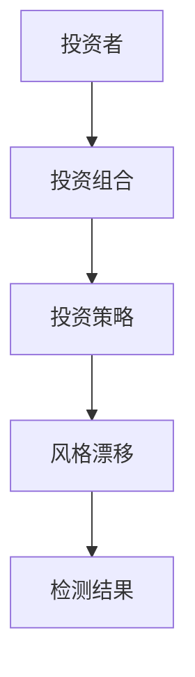
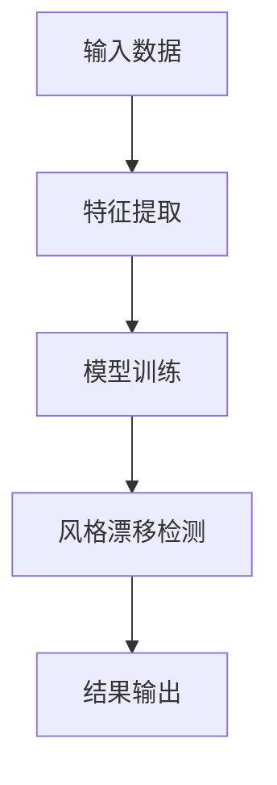

                 


# AI驱动的价值投资策略风格漂移检测

## 关键词：AI技术，投资策略，风格漂移，金融风险管理，机器学习算法

## 摘要：本文探讨了如何利用人工智能技术检测投资策略中的风格漂移问题。通过分析价值投资策略的核心概念、风格漂移的定义与影响、AI算法在风格漂移检测中的应用，本文详细介绍了基于机器学习的风格漂移检测方法，包括数据预处理、模型训练、检测与预测等步骤。文章还提供了系统的架构设计、项目实战案例分析及代码实现，为投资机构和个人投资者提供了有效的风险管理工具。

---

## 第一章：AI驱动的风格漂移检测背景介绍

### 1.1 问题背景
- **价值投资策略的核心概念**：价值投资策略以基本面分析为基础，注重长期收益，强调安全边际和内在价值。然而，实际操作中，投资组合可能因市场变化或管理人调整而偏离预定策略。
- **风格漂移的定义与影响**：风格漂移指投资组合的实际表现与初始投资策略出现显著偏离。这种漂移可能导致投资回报低于预期，增加投资风险，损害投资者利益。
- **AI技术的潜力**：AI技术能够处理大量数据，发现隐藏的模式，为风格漂移检测提供高效解决方案。

### 1.2 核心概念与问题描述
- **风格漂移检测需求**：投资机构需要实时监控投资组合，确保其符合预定策略。传统方法依赖人工分析，效率低下且容易出错。AI技术的引入可以显著提高检测效率和准确性。
- **AI驱动的解决方案**：利用机器学习算法，AI能够自动识别风格漂移的迹象，帮助投资经理及时采取调整措施。

### 1.3 风格漂移的边界与外延
- **分类**：风格漂移可分为轻微漂移和重大漂移，影响程度不同。
- **检测范围**：涵盖投资组合的资产配置、行业权重、风险敞口等方面。
- **潜在风险**：风格漂移可能导致投资组合面临意外风险，影响投资回报。

### 1.4 核心概念结构与组成要素
- **投资策略的构成要素**：包括资产配置、行业权重、风险敞口等。
- **风格漂移的核心驱动因素**：市场变化、管理人调整、投资者情绪等。
- **AI算法的关键组成部分**：数据输入、特征提取、模型训练、检测与预测。

### 1.5 本章小结
本章介绍了价值投资策略和风格漂移的基本概念，分析了风格漂移的影响和AI技术的应用潜力，为后续章节奠定了基础。

---

## 第二章：AI驱动的风格漂移检测核心概念

### 2.1 核心概念原理
- **价值投资策略的数学模型**：通过数学模型描述投资组合的构成和变化。
- **风格漂移的检测方法**：基于机器学习算法，分析投资组合与策略基准之间的差异。
- **AI算法的基本原理**：利用机器学习模型识别数据中的模式和异常。

### 2.2 核心概念属性特征对比
- **特征对比表**：
  | 属性 | 风格漂移检测 | AI算法 |
  |------|--------------|--------|
  | 输入 | 投资组合数据 | 数据特征 |
  | 输出 | 漂移指标 | 预测结果 |
  | 方法 | 统计分析 | 机器学习 |

### 2.3 ER实体关系图架构


### 2.4 本章小结
本章详细解释了AI驱动的风格漂移检测的核心概念和原理，通过对比分析和实体关系图帮助读者理解系统架构。

---

## 第三章：AI驱动的风格漂移检测算法原理

### 3.1 算法流程


### 3.2 算法实现
- **数据预处理**：清洗数据，提取关键特征，如资产权重、行业分布、市场因子等。
- **模型训练**：使用监督学习算法（如随机森林、支持向量机）训练模型，识别风格漂移的模式。
- **检测与预测**：将实时数据输入模型，输出风格漂移指标。

### 3.3 数学模型与公式
- **投资组合权重计算**：
  $$
  \text{投资组合权重} = \frac{w_i}{\sum w_j}
  $$
- **风格漂移指标计算**：
  $$
  \text{风格漂移指标} = \sqrt{\sum (x_i - \mu)^2}
  $$

### 3.4 本章小结
本章详细介绍了AI驱动的风格漂移检测算法的流程和实现方法，通过数学公式和流程图帮助读者理解算法的原理和步骤。

---

## 第四章：系统设计与架构

### 4.1 系统功能设计
- **领域模型类图**：
  ```mermaid
  classDiagram
      class 投资组合管理器 {
          - 投资组合数据
          - 检测结果
          + getPortfolioData()
          + detectStyleDrift()
      }
      class 风格漂移检测器 {
          - 机器学习模型
          + trainModel()
          + predictDrift()
      }
      class 数据源 {
          - 市场数据
          - 投资策略基准
          + getData()
      }
      投资组合管理器 --> 风格漂移检测器
      风格漂移检测器 --> 数据源
  ```

### 4.2 系统架构设计
- **架构图**：
  ```mermaid
  graph TD
      A[用户界面] --> B[投资组合管理器]
      B --> C[风格漂移检测器]
      C --> D[数据源]
  ```

### 4.3 系统接口设计
- **接口定义**：
  ```javascript
  interface StyleDriftDetector {
      trainModel(data: any[]): void;
      detectDrift(portfolio: any[]): boolean;
  }
  ```

### 4.4 系统交互流程
- **交互流程图**：
  ```mermaid
  graph TD
      A[用户] --> B[投资组合管理器]
      B --> C[风格漂移检测器]
      C --> D[数据源]
      D --> C[返回检测结果]
      C --> A[显示结果]
  ```

### 4.5 本章小结
本章详细介绍了系统的架构设计和交互流程，展示了AI驱动的风格漂移检测系统如何实现功能需求。

---

## 第五章：项目实战与代码实现

### 5.1 项目实战
- **环境安装**：安装Python、机器学习库（如scikit-learn、XGBoost）和数据处理库（如Pandas）。
- **代码实现**：
  ```python
  import pandas as pd
  from sklearn.ensemble import RandomForestClassifier
  from sklearn.metrics import accuracy_score

  # 数据加载与预处理
  portfolio_data = pd.read_csv('portfolio.csv')
  benchmark_data = pd.read_csv('benchmark.csv')

  # 特征提取
  features = portfolio_data.drop('target', axis=1)
  target = portfolio_data['target']

  # 模型训练
  model = RandomForestClassifier()
  model.fit(features, target)

  # 风格漂移检测
  def detect_drift(new_portfolio):
      predicted = model.predict(new_portfolio)
      return predicted[0] == 0

  # 示例检测
  new_portfolio = pd.DataFrame({'feature1': [1], 'feature2': [2]})
  print(detect_drift(new_portfolio))
  ```

### 5.2 代码应用解读与分析
- **代码解读**：加载数据、提取特征、训练模型、检测风格漂移。
- **实际案例分析**：通过具体案例展示如何使用代码检测风格漂移。

### 5.3 本章小结
本章通过实际项目展示如何使用AI技术实现风格漂移检测，帮助读者理解理论与实践的结合。

---

## 第六章：最佳实践与小结

### 6.1 最佳实践
- **数据质量**：确保数据的准确性和完整性。
- **模型选择**：根据具体问题选择合适的算法。
- **实时监控**：定期更新模型和数据，确保检测的准确性。

### 6.2 小结
本文详细介绍了AI驱动的风格漂移检测方法，从理论到实践，为投资机构和个人投资者提供了有效的风险管理工具。

### 6.3 注意事项
- 风格漂移检测需要结合具体的投资策略和市场环境。
- 模型需要定期更新和验证，确保其准确性。

### 6.4 拓展阅读
- 推荐阅读相关领域的书籍和论文，深入学习机器学习在金融中的应用。

### 6.5 本章小结
本章总结了AI驱动的风格漂移检测的最佳实践，提供了实际应用中的注意事项和未来研究方向。

---

## 结语
通过本文的详细讲解，读者可以全面理解AI驱动的风格漂移检测技术，并能够在实际投资中应用这些方法，提升风险管理能力。

