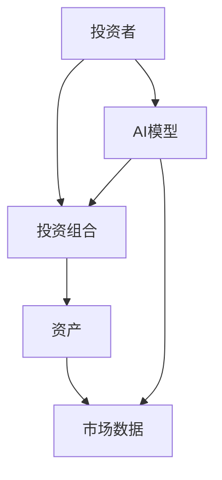
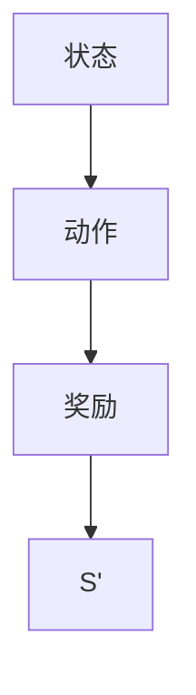
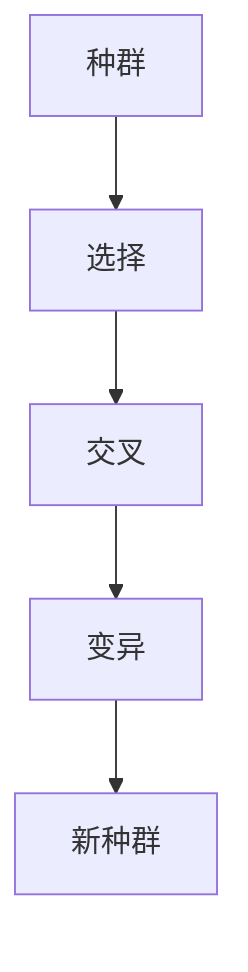
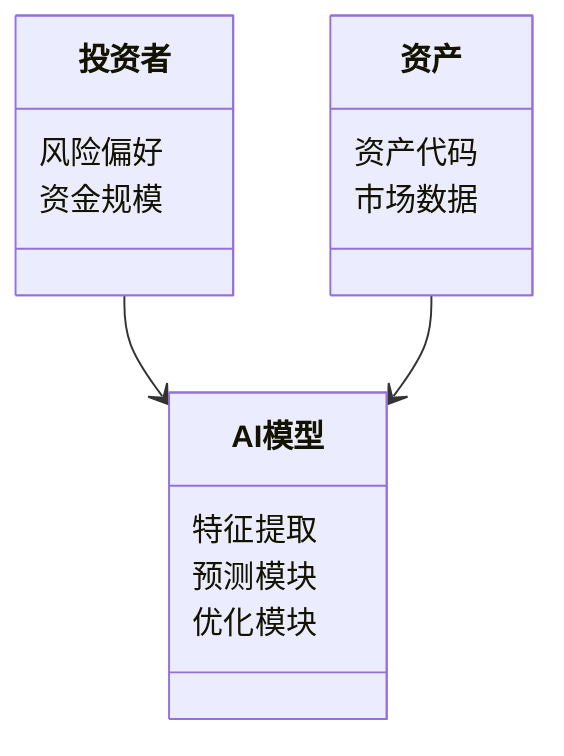
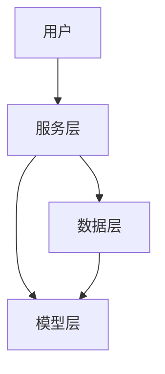
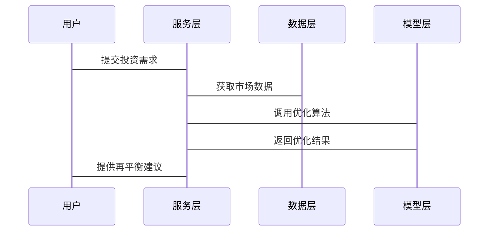

                 


# AI驱动的价值投资组合再平衡优化

## 关键词：AI, 投资组合优化, 再平衡, 机器学习, 强化学习

## 摘要：本文探讨了利用人工智能技术优化投资组合再平衡的过程，分析了传统方法的局限性，提出了基于机器学习和强化学习的新方法，通过数学建模和系统设计，展示了如何构建高效的AI驱动投资组合优化系统，并通过实际案例验证了该方法的有效性。

---

# 第1章: 价值投资与AI驱动的再平衡概述

## 1.1 价值投资的核心概念

### 1.1.1 价值投资的定义与特点
- **定义**: 价值投资是一种投资策略，旨在以低于内在价值的价格购买优质资产。
- **特点**: 长期视角、注重基本面分析、追求安全边际。

### 1.1.2 投资组合再平衡的必要性
- **动态市场环境**: 市场波动和资产价格变化需要定期调整投资组合。
- **风险控制**: 保持资产配置与投资目标一致，避免过度集中风险。
- **收益优化**: 通过再平衡提高组合的收益率。

### 1.1.3 传统投资组合优化方法的局限性
- **静态假设**: 传统方法假设市场条件不变，难以应对动态变化。
- **计算复杂性**: 高维优化问题在实际操作中难以高效解决。
- **交易成本**: 频繁调整可能导致较高的交易费用和税务负担。

## 1.2 AI技术在金融领域的应用背景

### 1.2.1 AI在金融分析中的优势
- **数据处理能力**: 处理海量数据，提取非线性特征。
- **实时性**: 高频交易和实时市场反应。
- **个性化**: 根据投资者风险偏好定制策略。

### 1.2.2 机器学习在投资组合优化中的作用
- **特征工程**: 利用机器学习提取有用的市场特征。
- **预测模型**: 构建预测资产回报的模型。
- **组合优化**: 利用算法优化投资组合配置。

### 1.2.3 价值投资与AI结合的潜力
- **智能化配置**: AI辅助选择低估资产。
- **动态调整**: 根据市场变化自动优化组合。
- **风险管理**: AI实时监控并调整头寸，降低风险。

## 1.3 本章小结

### 1.3.1 价值投资的核心理念
- 以合理价格买入优质资产，长期持有。

### 1.3.2 AI驱动的再平衡优化的创新点
- 利用AI技术动态优化投资组合，降低交易成本，提高收益。

### 1.3.3 本书的研究目标与意义
- 探讨AI如何提升投资组合再平衡的效率和效果，为投资者提供新的工具和方法。

---

# 第2章: 投资组合再平衡的数学模型与问题描述

## 2.1 投资组合优化的数学模型

### 2.1.1 投资组合优化的目标函数
- **目标函数**: 最大化收益或最小化风险。
- **公式**: 
  $$ \text{目标} = \max \left( \sum w_i r_i \right) $$
  其中，\( w_i \) 是资产 \( i \) 的权重，\( r_i \) 是预期收益。

### 2.1.2 约束条件的构建
- **权重约束**: 
  $$ \sum w_i = 1 $$
- **风险约束**: 
  $$ \text{风险指标} \leq \text{阈值} $$

### 2.1.3 数学模型的边界与外延
- **边界条件**: 资产权重非负。
- **外延**: 考虑交易成本、税收、流动性等因素。

## 2.2 再平衡优化的核心问题

### 2.2.1 动态市场环境下的再平衡需求
- 市场波动导致资产比例偏离目标配置。
- 经济周期变化影响资产表现。

### 2.2.2 投资组合收益与风险的平衡
- 在收益与风险之间找到最佳平衡点。
- 使用夏普比率等指标衡量风险调整后收益。

### 2.2.3 交易成本与再平衡频率的权衡
- 高频再平衡增加交易成本。
- 低频再平衡可能导致错失收益或承担更大风险。

## 2.3 问题背景与解决思路

### 2.3.1 传统再平衡方法的不足
- 手动调整效率低，主观性强。
- 传统优化模型难以处理非线性问题。

### 2.3.2 AI驱动的再平衡优化的解决方案
- 使用机器学习模型预测市场趋势。
- 通过强化学习优化动态调整策略。

### 2.3.3 核心概念的结构与要素组成
- **输入**: 市场数据、资产特征、投资者偏好。
- **输出**: 优化后的资产配置建议。
- **模型**: 机器学习模型、强化学习框架。

---

# 第3章: AI驱动的再平衡优化核心概念与联系

## 3.1 核心概念原理

### 3.1.1 机器学习在投资组合优化中的应用
- **监督学习**: 预测资产回报。
- **无监督学习**: 检测异常市场情况。
- **强化学习**: 学习最优投资策略。

### 3.1.2 强化学习在动态市场中的优势
- **实时决策**: 环境反馈指导下调整策略。
- **非线性关系**: 捕捉复杂市场动态。
- **自适应性**: 根据市场变化自动调整。

### 3.1.3 遗传算法在组合优化中的作用
- **全局最优**: 寻找全局最优解。
- **多样性**: 保持解的多样性，避免局部最优。
- **适应性**: 根据适应度函数动态调整。

## 3.2 核心概念属性对比

| 概念         | 属性对比         |
|--------------|-----------------|
| 机器学习模型 | 监督学习、无监督学习、强化学习 |
| 强化学习     | 奖励函数、策略优化、状态转移 |
| 遗传算法     | 适应度函数、交叉、变异、选择 |

## 3.3 实体关系图



---

# 第4章: 算法原理与实现

## 4.1 强化学习算法的实现

### 4.1.1 算法流程


### 4.1.2 Python代码实现
```python
import gym
import numpy as np

class DQN:
    def __init__(self, state_space, action_space):
        self.state_space = state_space
        self.action_space = action_space
        # 简单的神经网络结构（示例）
        self.model = self.build_model()

    def build_model(self):
        model = Sequential()
        model.add(Dense(32, activation='relu', input_dim=self.state_space))
        model.add(Dense(32, activation='relu'))
        model.add(Dense(self.action_space, activation='linear'))
        model.compile(optimizer='adam', loss='mse')
        return model

    def remember(self, state, action, reward, next_state):
        # 记忆单元格
        pass

    def act(self, state):
        # 根据当前状态选择动作
        pass

    def replay(self):
        # 回放记忆进行训练
        pass
```

### 4.1.3 优缺点分析
- **优点**: 可以处理复杂动态环境。
- **缺点**: 需要大量数据和计算资源，可能过拟合。

## 4.2 遗传算法的实现

### 4.2.1 算法流程


### 4.2.2 Python代码实现
```python
def genetic_algorithm(population, fitness, mutation_rate):
    while True:
        # 计算适应度
        ranked = sorted(population, key=lambda x: fitness(x), reverse=True)
        # 选择
        selected = ranked[:int(len(population)/2)]
        # 交叉
        children = []
        for i in range(len(selected)):
            parent1 = selected[i]
            parent2 = selected[-i-1]
            child = crossover(parent1, parent2)
            children.append(child)
        # 变异
        mutated = []
        for child in children:
            if random.random() < mutation_rate:
                mutate(child)
            mutated.append(child)
        population = mutated
```

### 4.2.3 优缺点分析
- **优点**: 全局搜索能力强，适合复杂优化问题。
- **缺点**: 计算效率较低，参数调整敏感。

## 4.3 组合优化的数学模型

### 4.3.1 数学公式
$$ \text{目标函数} = \max \left( \sum w_i r_i \right) $$
$$ \text{约束条件}: \sum w_i = 1, w_i \geq 0 $$

### 4.3.2 示例分析
假设市场有3种资产，预期回报分别为5%、7%、6%，目标是最小化风险或最大化收益。

---

# 第5章: 系统分析与架构设计

## 5.1 问题场景介绍

### 5.1.1 投资者需求
- 个性化投资目标。
- 动态市场环境下的实时优化。

### 5.1.2 项目介绍
- 开发一个基于AI的投资组合再平衡系统。
- 使用机器学习和强化学习技术。

## 5.2 系统功能设计

### 5.2.1 领域模型


### 5.2.2 系统架构


## 5.3 系统交互设计

### 5.3.1 交互流程


---

# 第6章: 项目实战

## 6.1 环境配置

### 6.1.1 Python环境
- 安装必要的库：numpy、pandas、tensorflow、keras、scikit-learn。

### 6.1.2 数据来源
- 使用Yahoo Finance获取市场数据。

## 6.2 核心实现

### 6.2.1 数据预处理
```python
import pandas as pd
data = pd.read_csv('market_data.csv')
data = data.dropna()
data = data.pct_change().dropna()
```

### 6.2.2 模型训练
```python
import numpy as np
from sklearn.model_selection import train_test_split
X_train, X_test, y_train, y_test = train_test_split(X, y)
model = DQN(state_space, action_space)
model.fit(X_train, y_train)
```

## 6.3 案例分析

### 6.3.1 案例背景
- 投资者：风险中等，资金100万。
- 目标：构建价值投资组合。

### 6.3.2 实施步骤
1. 数据采集与清洗。
2. 模型训练与优化。
3. 再平衡策略生成。
4. 业绩回测与分析。

## 6.4 总结与最佳实践

### 6.4.1 实战总结
- AI驱动的再平衡优化能有效提升投资收益。
- 系统设计与实现需要考虑数据质量、模型性能和计算效率。

### 6.4.2 小结
- 价值投资与AI结合是未来趋势。
- 交易成本和市场流动性是需要关注的关键因素。

### 6.4.3 注意事项
- 数据质量直接影响模型效果。
- 模型需要定期更新和再训练。
- 风险管理是投资组合优化的核心。

### 6.4.4 拓展阅读
- 阅读相关学术论文，关注最新研究成果。
- 学习更多AI在金融领域的应用案例。

---

# 第7章: 总结与展望

## 7.1 本章总结

### 7.1.1 核心内容回顾
- AI驱动的价值投资组合再平衡优化的基本原理。
- 机器学习和强化学习在投资组合优化中的应用。

### 7.1.2 本书的研究目标实现
- 提出了基于AI的再平衡优化方法。
- 展示了系统的实现和实际案例。

## 7.2 未来展望

### 7.2.1 研究方向
- 更高效的学习算法。
- 多目标优化问题的研究。
- 更复杂的市场环境建模。

### 7.2.2 技术趋势
- AI与金融的深度融合。
- 自动化投资工具的普及。
- 更多应用场景的拓展。

## 7.3 最佳实践 Tips

### 7.3.1 投资者建议
- 结合AI工具进行投资决策。
- 定期审视和调整投资策略。

### 7.3.2 开发者建议
- 关注最新的AI技术进展。
- 多实践，积累经验。

---

# 参考文献
（此处列出相关的书籍、论文和其他参考资料）

