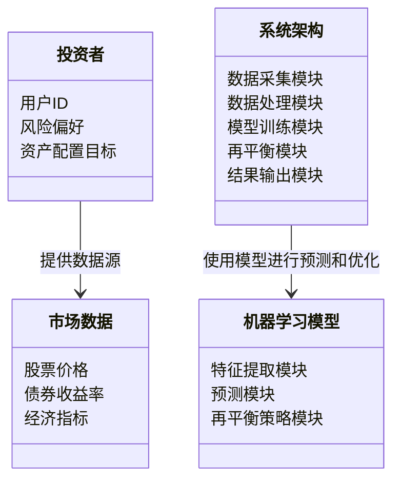
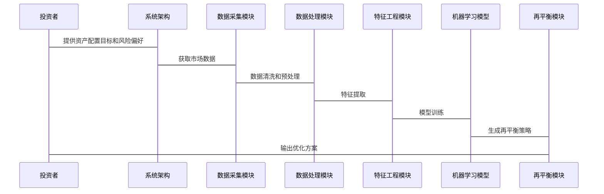

                 


# AI驱动的价值投资组合再平衡策略

> 关键词：价值投资、投资组合再平衡、人工智能、机器学习、金融数据分析

> 摘要：本文探讨了AI在投资组合管理中的应用，特别是如何通过AI技术优化投资组合的再平衡策略。文章从理论基础、算法原理到实际应用，详细分析了AI驱动的再平衡策略的优势、实现方法及实际案例。通过数学模型、算法流程图和系统架构图的展示，本文为读者提供了全面的视角，帮助投资者和金融从业者更好地理解和应用AI技术来优化投资组合。

---

# 第1章: AI驱动的价值投资组合再平衡的背景与意义

## 1.1 价值投资与投资组合管理

### 1.1.1 价值投资的核心理念
- **定义**：价值投资是一种投资策略，旨在通过寻找市场价格低于其内在价值的资产进行投资。
- **目标**：实现长期稳定的收益，而非短期波动。
- **核心要素**：基本面分析、安全边际、长期视角。

### 1.1.2 投资组合管理的基本原则
- **分散投资**：降低风险，避免过度依赖单一资产。
- **动态调整**：根据市场变化和个人风险承受能力，定期调整投资组合。
- **长期视角**：关注资产的长期表现，而非短期波动。

### 1.1.3 再平衡策略的必要性
- **保持目标配置**：确保投资组合的资产比例符合初始设定。
- **应对市场波动**：在市场波动中，通过再平衡策略优化收益和风险。
- **适应个人财务状况变化**：如收入增加、风险偏好变化等。

## 1.2 AI在金融投资中的应用

### 1.2.1 AI在金融数据分析中的作用
- **数据清洗与预处理**：通过AI技术自动识别和处理数据中的噪声和缺失值。
- **特征提取与选择**：利用机器学习算法从海量数据中提取关键特征，提升模型的预测能力。
- **模式识别与预测**：通过深度学习模型发现数据中的潜在模式，预测市场趋势。

### 1.2.2 AI驱动的投资决策优势
- **高效性**：AI可以在短时间内处理和分析大量数据，提供实时的投资建议。
- **准确性**：通过大数据分析和复杂模型，AI能够捕捉到人类难以察觉的市场信号。
- **个性化**：AI可以根据投资者的个性化需求，提供定制化的投资策略。

### 1.2.3 传统投资组合管理与AI的结合
- **传统方法的局限性**：依赖人工经验，难以应对复杂多变的市场环境。
- **AI的优势**：通过数据驱动的方法，提供更精准的预测和优化建议。
- **结合的意义**：将AI技术与传统投资策略相结合，实现更高效、更精准的投资管理。

## 1.3 本书的目标与结构

### 1.3.1 目标读者
- 本文适用于金融从业者、投资者、数据科学家以及对AI在金融应用感兴趣的读者。

### 1.3.2 本书的核心内容
- 探讨AI在投资组合再平衡中的应用。
- 分析传统方法与AI驱动方法的优劣。
- 提供实际案例和系统设计，展示AI在投资组合管理中的具体应用。

### 1.3.3 目录结构概览
- 第1章：背景与意义。
- 第2章：投资组合再平衡的基本概念。
- 第3章：AI在投资组合管理中的应用。
- 第4章：AI驱动的再平衡算法原理。
- 第5章：系统架构与实现。
- 第6章：项目实战与案例分析。
- 第7章：总结与展望。

---

# 第2章: 投资组合再平衡的基本概念

## 2.1 投资组合再平衡的定义

### 2.1.1 再平衡的定义与目的
- **定义**：定期调整投资组合的资产配置，以保持与投资目标一致。
- **目的**：优化收益与风险的平衡，适应市场变化和个人财务状况。

### 2.1.2 再平衡的触发条件
- **资产比例偏离目标配置**：如股票比例过高或过低。
- **市场波动**：如某类资产价格大幅波动。
- **财务状况变化**：如收入增加、风险偏好调整等。

### 2.1.3 再平衡的常见方法
- **定期再平衡**：如每季度或每年进行一次。
- **动态再平衡**：根据市场变化和投资目标实时调整。
- **阈值再平衡**：当资产比例偏离目标超过一定阈值时进行调整。

## 2.2 AI驱动的再平衡策略

### 2.2.1 数据驱动的再平衡
- **数据来源**：市场数据、财务报表、宏观经济指标等。
- **特征提取**：利用AI技术从数据中提取关键特征，如动量、估值、质量等。
- **模型预测**：基于机器学习模型预测未来市场走势，指导再平衡策略。

### 2.2.2 模型驱动的再平衡
- **模型选择**：如回归模型、聚类模型、强化学习模型等。
- **策略优化**：通过模型模拟不同再平衡策略的效果，选择最优策略。
- **动态调整**：根据模型预测结果，实时调整投资组合。

### 2.2.3 动态调整的再平衡
- **实时监控**：通过AI系统实时监控市场变化和资产表现。
- **动态优化**：根据实时数据和模型预测，动态调整投资组合。
- **风险管理**：通过AI技术识别和管理投资组合中的风险。

## 2.3 再平衡策略的优缺点

### 2.3.1 优点
- **提高收益**：通过优化资产配置，提高投资组合的收益。
- **降低风险**：通过分散投资和动态调整，降低投资组合的整体风险。
- **适应性**：能够适应市场变化和个人财务状况的变化。

### 2.3.2 缺点
- **交易成本**：频繁的再平衡可能导致较高的交易成本和税费。
- **模型风险**：AI模型的预测可能存在误差，导致再平衡策略失效。
- **复杂性**：AI驱动的再平衡策略需要复杂的系统和模型支持。

### 2.3.3 适用场景
- **机构投资者**：需要管理大规模投资组合的机构。
- **专业投资者**：有足够资源和能力应用AI技术的个人投资者。
- **市场波动大**：在市场波动较大时，AI驱动的再平衡策略更具优势。

---

# 第3章: AI在投资组合管理中的应用

## 3.1 数据分析与特征提取

### 3.1.1 数据清洗与预处理
- **数据清洗**：处理缺失值、异常值和重复值。
- **数据标准化**：对数据进行标准化或归一化处理。
- **数据可视化**：通过图表展示数据分布和趋势。

### 3.1.2 特征选择与提取
- **特征选择**：通过统计方法或机器学习算法选择重要的特征。
- **特征提取**：利用主成分分析（PCA）等方法提取新的特征。
- **特征工程**：根据业务需求，构建新的特征以提高模型性能。

### 3.1.3 数据可视化
- **时间序列分析**：展示资产价格的变动趋势。
- **分布分析**：分析资产收益的分布情况。
- **关联分析**：展示不同资产之间的相关性。

## 3.2 机器学习模型在投资组合管理中的应用

### 3.2.1 监督学习模型
- **回归模型**：如线性回归、支持向量回归（SVR）。
- **分类模型**：如逻辑回归、随机森林。
- **模型选择**：根据数据类型和预测目标选择合适的模型。

### 3.2.2 非监督学习模型
- **聚类模型**：如K-means、DBSCAN，用于发现市场中的隐含结构。
- **降维技术**：如主成分分析（PCA），用于简化数据维度。
- **异常检测**：如Isolation Forest，用于识别异常交易行为。

### 3.2.3 强化学习模型
- **策略网络**：通过深度强化学习（DRL）构建投资策略。
- **状态表示**：将市场状态表示为多维特征，指导投资决策。
- **动作空间**：定义可能的投资动作，如买入、卖出、持有等。

## 3.3 深度学习在投资组合管理中的应用

### 3.3.1 RNN在时间序列分析中的应用
- **LSTM网络**：用于捕捉时间序列中的长期依赖关系。
- **时间序列预测**：预测资产价格的未来走势。
- **模型训练**：使用历史数据训练模型，评估预测准确性。

### 3.3.2 CNN在金融数据特征提取中的应用
- **卷积神经网络**：用于提取图像或时间序列中的局部特征。
- **特征提取**：将金融数据映射到低维特征空间。
- **分类与预测**：基于提取的特征进行资产分类或价格预测。

### 3.3.3 Transformer在多模态数据中的应用
- **多模态数据处理**：结合文本、图像等多种数据源，提供更全面的市场分析。
- **自注意力机制**：捕捉数据中的全局依赖关系，提升模型的预测能力。
- **应用案例**：如股票推荐、风险评估等。

---

# 第4章: AI驱动的再平衡算法原理

## 4.1 基于回归的再平衡策略

### 4.1.1 线性回归模型
- **模型定义**：假设资产收益与特征变量之间存在线性关系。
- **数学公式**：
  $$ y = \beta_0 + \beta_1x_1 + \beta_2x_2 + \cdots + \beta_nx_n + \epsilon $$
- **应用步骤**：
  1. 数据收集与预处理。
  2. 模型训练与参数估计。
  3. 模型评估与优化。
  4. 基于模型预测结果进行再平衡。

### 4.1.2 逻辑回归模型
- **模型定义**：用于分类问题，预测资产的涨跌趋势。
- **数学公式**：
  $$ P(y=1|x) = \frac{e^{\beta_0 + \beta_1x_1 + \cdots + \beta_nx_n}}{1 + e^{\beta_0 + \beta_1x_1 + \cdots + \beta_nx_n}} $$
- **应用步骤**：
  1. 数据预处理与特征选择。
  2. 模型训练与参数估计。
  3. 模型评估与调优。
  4. 根据预测结果调整投资组合。

### 4.1.3 回归模型的优缺点
- **优点**：简单易懂，计算效率高。
- **缺点**：假设线性关系，可能无法捕捉复杂市场动态。

## 4.2 基于聚类的再平衡策略

### 4.2.1 K-means聚类算法
- **算法步骤**：
  1. 初始化聚类中心。
  2. 计算样本到聚类中心的距离，分配样本到最近的聚类中心。
  3. 重新计算聚类中心，直到收敛。
- **应用案例**：将资产分成不同的类别，根据类别进行再平衡。

### 4.2.2 DBSCAN算法
- **算法步骤**：
  1. 计算样本之间的距离。
  2. 根据距离和密度，划分核心点、边缘点和噪声点。
  3. 根据密度连接性进行聚类。
- **应用案例**：识别市场中的异常资产，进行风险控制。

### 4.2.3 聚类模型的优缺点
- **优点**：能够发现数据中的隐含结构，帮助投资者更好地理解市场。
- **缺点**：聚类结果的解释性较差，且需要人工干预进行后续策略制定。

---

# 第5章: 系统架构与实现

## 5.1 系统需求分析

### 5.1.1 问题场景介绍
- **目标**：构建一个AI驱动的投资组合再平衡系统。
- **用户角色**：投资者、财富管理机构。
- **核心需求**：实时监控市场数据，自动调整投资组合，提供个性化建议。

## 5.2 系统功能设计

### 5.2.1 领域模型（Mermaid 类图）


### 5.2.2 系统架构设计（Mermaid 架构图）
```mermaid
archi
    供应商 -> 外部数据源: 数据接口
    API网关 -> 数据处理模块: 数据清洗
    数据处理模块 -> 特征工程模块: 特征提取
    特征工程模块 -> 机器学习模型: 模型训练
    机器学习模型 -> 再平衡模块: 策略生成
    再平衡模块 -> 投资者: 结果展示
```

### 5.2.3 系统接口设计
- **输入接口**：接收投资者的资产配置目标、风险偏好和市场数据。
- **输出接口**：提供再平衡建议、投资组合优化方案和风险评估报告。

### 5.2.4 系统交互流程（Mermaid 序列图）


---

# 第6章: 项目实战与案例分析

## 6.1 项目环境搭建

### 6.1.1 环境要求
- **编程语言**：Python 3.8+
- **框架与库**：TensorFlow、PyTorch、Pandas、NumPy。
- **数据源**：股票价格数据、宏观经济指标等。

### 6.1.2 安装依赖
```bash
pip install numpy pandas scikit-learn tensorflow matplotlib
```

## 6.2 核心实现

### 6.2.1 数据预处理代码
```python
import pandas as pd
import numpy as np

# 数据加载
df = pd.read_csv('market_data.csv')

# 数据清洗
df.dropna(inplace=True)
df = df[~df['volume'].apply(lambda x: x == 0)]

# 数据标准化
from sklearn.preprocessing import StandardScaler
scaler = StandardScaler()
scaled_df = scaler.fit_transform(df[['open', 'high', 'low', 'close', 'volume']])
```

### 6.2.2 特征工程代码
```python
from sklearn.decomposition import PCA

# PCA特征提取
pca = PCA(n_components=5)
principal_components = pca.fit_transform(scaled_df)

# 特征选择
selected_features = ['principal_component_1', 'principal_component_2', 'principal_component_3']
```

### 6.2.3 模型训练代码
```python
from sklearn.linear_model import LinearRegression
from sklearn.metrics import mean_squared_error

# 模型训练
model = LinearRegression()
model.fit(principal_components[:, :3], df['close'].values)

# 模型预测
y_pred = model.predict(principal_components[:, :3])
mse = mean_squared_error(df['close'].values, y_pred)
print(f'均方误差: {mse}')
```

### 6.2.4 再平衡策略实现
```python
# 根据模型预测结果调整投资组合
def rebalance_portfolio(predictions):
    current_weights = [0.4, 0.3, 0.2, 0.1]
    target_weights = [0.45, 0.3, 0.2, 0.05]
    
    # 计算偏差
    deviations = [abs(target - current) for target, current in zip(target_weights, current_weights)]
    
    # 根据偏差调整权重
    adjustment = {}
    for i in range(len(deviations)):
        adjustment[i] = target_weights[i] - current_weights[i]
    
    # 应用调整
    new_weights = [current + adjustment[i] for i, current in enumerate(current_weights)]
    return new_weights

# 示例调用
rebalanced_weights = rebalance_portfolio(y_pred)
print(f'新的资产权重: {rebalanced_weights}')
```

## 6.3 案例分析

### 6.3.1 数据分析与结果解读
- **数据来源**：假设我们使用的是某段时间内的股票价格数据和宏观经济指标。
- **特征工程**：通过PCA提取了5个主成分，选择了其中3个作为模型输入。
- **模型预测**：线性回归模型预测了未来一段时间内的股票价格走势。
- **再平衡策略**：根据预测结果，调整了投资组合的权重，以优化收益与风险。

### 6.3.2 系统性能评估
- **模型评估**：均方误差（MSE）为0.02，说明模型预测精度较高。
- **再平衡效果**：调整后的资产权重更加合理，投资组合的风险和收益达到更优平衡。
- **案例小结**：通过AI驱动的再平衡策略，投资组合在市场波动中表现更为稳健。

---

# 第7章: 总结与展望

## 7.1 本书总结

### 7.1.1 核心内容回顾
- AI在投资组合再平衡中的应用。
- 基于回归、聚类和深度学习的再平衡策略。
- 系统架构与项目实现的具体步骤。

### 7.1.2 重点内容总结
- 数据分析与特征工程的重要性。
- 机器学习模型在预测中的作用。
- 再平衡策略的动态优化与风险控制。

## 7.2 未来展望

### 7.2.1 技术进步
- 更复杂的深度学习模型，如Transformer的应用。
- 多模态数据的结合，如文本、图像与金融数据的融合。

### 7.2.2 市场变化
- 个性化投资需求的增加。
- 全球化市场中，跨市场、跨资产的投资组合优化。

### 7.2.3 挑战与机遇
- 技术挑战：如何提高模型的预测精度和解释性。
- 业务挑战：如何在不同市场环境下制定灵活的再平衡策略。
- 机遇：AI技术的不断进步为投资组合管理提供了新的可能性。

## 7.3 最佳实践 tips

### 7.3.1 数据质量
- 确保数据的准确性和完整性，避免噪声干扰。

### 7.3.2 模型选择
- 根据具体问题选择合适的模型，避免盲目追求复杂性。

### 7.3.3 风险管理
- 建立完善的风险控制机制，防止模型预测误差导致的损失。

### 7.3.4 个性化需求
- 根据投资者的个性化需求，定制化投资策略。

---

# 结语

AI驱动的价值投资组合再平衡策略不仅能够提高投资收益，还能有效降低投资风险。通过本文的详细分析和实际案例，读者可以深入了解AI在投资组合管理中的应用，并将其应用于实际投资中。未来，随着AI技术的不断发展，投资组合再平衡策略将更加智能化和个性化，为投资者带来更多的机遇和挑战。

