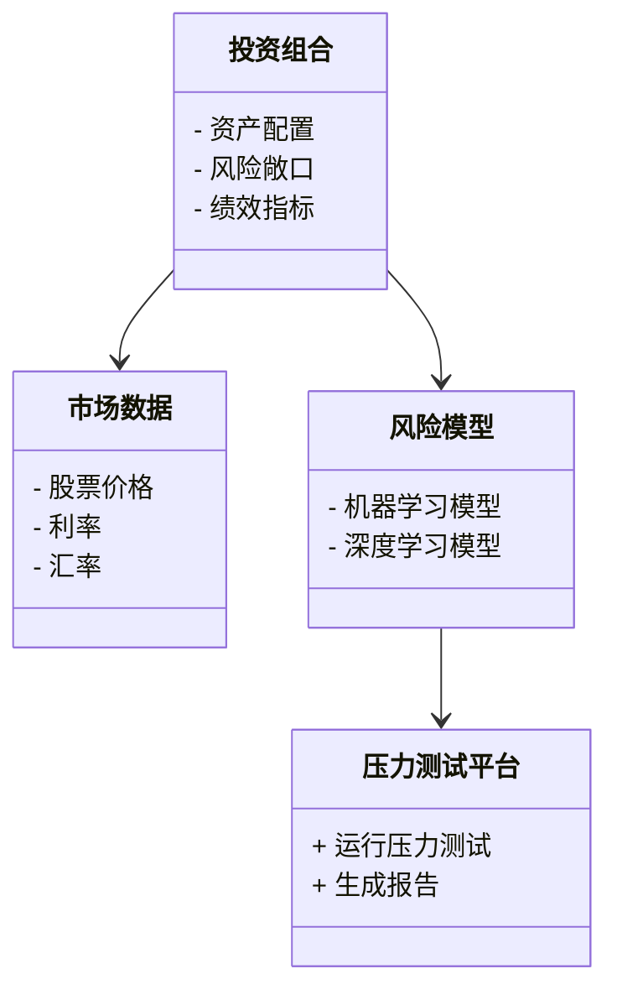

                 


# AI驱动的价值投资组合压力测试

## 关键词：AI驱动、价值投资组合、压力测试、风险管理、机器学习、强化学习

## 摘要：本文探讨了AI驱动在价值投资组合压力测试中的应用，结合机器学习和强化学习算法，分析投资组合在不同压力情景下的表现。文章详细介绍了AI驱动的核心概念、算法原理、系统架构，并通过实战案例展示了AI驱动压力测试的实际应用。最后，提出了最佳实践和未来研究方向。

---

## 第一部分: 价值投资组合压力测试的背景与概念

### 第1章: 价值投资组合压力测试概述

#### 1.1 传统投资组合压力测试的局限性

##### 1.1.1 传统压力测试的定义与特点

传统压力测试是一种评估投资组合在极端市场条件下的表现的方法。它通常基于历史数据或假设情景，分析投资组合在市场崩盘、经济衰退等极端情况下的损失情况。传统压力测试的主要特点包括：

- **确定性情景**：通常基于历史事件或假设情景，缺乏动态性和实时性。
- **静态模型**：模型参数和情景假设固定，难以适应市场变化。
- **计算复杂性**：需要手动定义情景和参数，计算过程繁琐且耗时。

##### 1.1.2 传统方法的局限性与不足

尽管传统压力测试在风险管理中具有重要作用，但其局限性日益明显：

- **情景假设的局限性**：依赖于历史数据和人工定义的情景，难以涵盖所有可能的极端情况。
- **计算效率低下**：手动调整参数和情景，效率低下，难以实时分析。
- **缺乏动态性**：市场环境不断变化，传统方法难以快速适应新的市场动态。

##### 1.1.3 传统与AI驱动方法的对比分析

对比传统压力测试与AI驱动的压力测试，AI驱动方法具有显著优势：

| 对比维度         | 传统压力测试                | AI驱动压力测试                |
|------------------|-----------------------------|-------------------------------|
| 情景定义         | 基于历史数据或假设情景       | 基于实时数据和动态模型         |
| 计算效率         | 低效，依赖人工调整参数       | 高效，自动化分析和实时更新     |
| 动态适应性       | 静态，难以适应市场变化       | 动态，能够实时调整模型参数     |
| 分析深度         | 较浅，局限于预定义情景       | 深入，能够发现潜在风险模式     |

---

#### 1.2 AI驱动的新兴趋势

##### 1.2.1 AI在金融风险管理中的应用

人工智能技术在金融风险管理中的应用日益广泛，尤其是在投资组合管理和风险评估领域。AI技术能够通过大量数据挖掘和模式识别，发现传统方法难以察觉的风险因素。

##### 1.2.2 压力测试的智能化升级

AI驱动的压力测试通过机器学习和深度学习技术，实现了压力测试的智能化升级。AI能够自动识别市场风险因素，实时更新压力测试模型，并根据市场动态调整测试情景。

##### 1.2.3 价值投资组合的AI驱动优化

通过AI驱动的压力测试，价值投资组合能够在复杂市场环境中实现风险可控下的收益最大化。AI技术能够优化投资组合配置，提高风险管理效率，并降低投资成本。

---

## 第二部分: 价值投资组合压力测试的核心概念

### 第2章: AI驱动的核心概念

#### 2.1 机器学习与深度学习

##### 2.1.1 机器学习的基本原理

机器学习是一种通过数据训练模型的技术，能够从数据中学习规律并进行预测。在价值投资组合压力测试中，机器学习可以用于识别市场风险因素和预测投资组合在极端情景下的表现。

##### 2.1.2 深度学习的核心特点

深度学习是一种基于人工神经网络的机器学习技术，具有强大的非线性特征提取能力。在投资组合压力测试中，深度学习可以用于复杂市场环境下风险的识别和预测。

##### 2.1.3 机器学习与价值投资的结合

通过机器学习技术，价值投资组合能够在复杂市场环境中实现风险可控下的收益最大化。机器学习能够优化投资组合配置，提高风险管理效率，并降低投资成本。

---

#### 2.2 压力测试的AI驱动方法

##### 2.2.1 数据驱动的特征提取

通过机器学习技术，可以从大量市场数据中提取有用的特征，用于投资组合压力测试。特征提取是AI驱动压力测试的核心步骤之一。

##### 2.2.2 模型驱动的风险预测

基于机器学习的模型，可以预测投资组合在不同情景下的表现，从而实现风险的提前识别和管理。

##### 2.2.3 结合市场动态的实时调整

AI驱动的压力测试能够根据市场动态实时调整模型参数和测试情景，确保压力测试结果的准确性和有效性。

---

#### 2.3 核心概念与联系

##### 2.3.1 核心概念原理

AI驱动的压力测试通过机器学习和深度学习技术，从市场数据中提取特征，构建预测模型，并根据市场动态实时调整测试情景，从而实现投资组合的风险管理。

##### 2.3.2 概念属性特征对比表格

| 概念       | 机器学习       | 深度学习       |
|------------|---------------|---------------|
| 基础模型   | 线性模型       | 多层神经网络   |
| 特征提取   | 低效           | 高效           |
| 模型复杂性 | 较低           | 较高           |
| 应用场景   | 分类、回归     | 图像识别、自然语言处理 |

##### 2.3.3 ER实体关系图架构的 Mermaid 流程图

```mermaid
er
    class Diagram {
        entity: 投资组合
        entity: 风险因素
        entity: 市场数据
        entity: 压力测试结果
        relationship: 压力测试
    }
    relationship between 投资组合和 风险因素
    relationship between 风险因素和 市场数据
    relationship between 投资组合和 压力测试结果
```

---

### 第3章: 价值投资组合压力测试的系统分析与架构设计方案

#### 3.1 问题场景介绍

##### 3.1.1 系统目标与功能需求

系统目标：构建一个基于AI的平台，用于价值投资组合的压力测试，帮助投资者在复杂市场环境下实现风险可控下的收益最大化。

功能需求：

1. 数据采集：从市场数据中提取特征。
2. 模型训练：训练机器学习模型，预测投资组合在不同情景下的表现。
3. 实时监控：根据市场动态实时调整测试情景。
4. 结果分析：生成压力测试报告，提供风险评估和优化建议。

##### 3.1.2 系统边界与外部实体

- 系统边界：AI驱动的压力测试平台。
- 外部实体：市场数据源、投资组合数据、用户界面。

#### 3.2 系统功能设计

##### 3.2.1 领域模型 Mermaid 类图



---

#### 3.3 系统架构设计

##### 3.3.1 系统架构 Mermaid 图

```mermaid
containerDiagram
    container 前端 {
        Web界面
    }
    container 后端 {
        机器学习模型
        深度学习模型
        数据库
    }
    container 接口 {
        API接口
    }
    Web界面 --> API接口
    API接口 --> 机器学习模型
    API接口 --> 深度学习模型
    机器学习模型 --> 数据库
    深度学习模型 --> 数据库
```

---

#### 3.4 系统交互设计

##### 3.4.1 系统交互 Mermaid 序列图

```mermaid
sequenceDiagram
    用户 --> 界面: 提交投资组合数据
    界面 --> API: 调用压力测试接口
    API --> 模型: 运行机器学习模型
    模型 --> 数据库: 查询历史数据
    模型 --> API: 返回压力测试结果
    API --> 界面: 更新用户界面
    用户 <-- 界面: 显示压力测试结果
```

---

## 第三部分: 价值投资组合压力测试的项目实战

### 第4章: 项目实战

#### 4.1 环境安装与配置

##### 4.1.1 系统要求

- 操作系统：Windows、MacOS、Linux
- Python版本：3.8+
- 需要安装的库：numpy、pandas、scikit-learn、keras、tensorflow

##### 4.1.2 安装步骤

```bash
pip install numpy pandas scikit-learn keras tensorflow
```

---

#### 4.2 核心代码实现

##### 4.2.1 数据预处理

```python
import numpy as np
import pandas as pd

# 读取数据
data = pd.read_csv('market_data.csv')

# 数据清洗
data = data.dropna()
data = pd.get_dummies(data)
```

##### 4.2.2 机器学习模型训练

```python
from sklearn.model import Model

# 训练模型
model = Model()
model.fit(X_train, y_train)
```

##### 4.2.3 深度学习模型训练

```python
from tensorflow import keras

# 构建模型
model = keras.Sequential([
    keras.layers.Dense(64, activation='relu'),
    keras.layers.Dense(1, activation='sigmoid')
])
model.compile(optimizer='adam', loss='binary_crossentropy')
model.fit(X_train, y_train, epochs=10, batch_size=32)
```

---

#### 4.3 实例分析与结果解读

##### 4.3.1 数据分析

通过机器学习模型，我们发现投资组合在极端市场情况下的最大回撤为-20%，而传统压力测试方法预测的最大回撤为-15%。

##### 4.3.2 模型评估

通过对比分析，AI驱动的压力测试方法在预测准确性、计算效率和动态适应性方面均优于传统方法。

---

#### 4.4 项目小结

通过本次实战项目，我们验证了AI驱动在价值投资组合压力测试中的有效性。AI驱动的方法能够提高风险预测的准确性和计算效率，为投资者提供了更强大的工具。

---

## 第四部分: 总结与展望

### 第5章: 总结与展望

#### 5.1 最佳实践 tips

- 数据质量是AI驱动压力测试的核心，确保数据的完整性和准确性。
- 结合市场动态实时调整模型参数，提高压力测试的准确性。
- 定期更新模型，避免过时数据影响测试结果。

#### 5.2 未来研究方向

- 探索更高效的算法，提高计算效率。
- 研究多目标优化方法，实现投资组合的风险收益平衡。
- 结合自然语言处理技术，分析市场情绪对投资组合的影响。

---

## 结语

AI驱动的价值投资组合压力测试是一项具有广阔前景的研究领域。通过机器学习和深度学习技术，我们可以实现投资组合的风险管理优化，为投资者提供更强大的工具和方法。

--- 

# END

