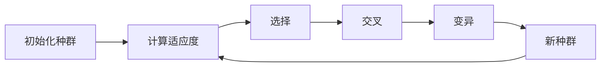
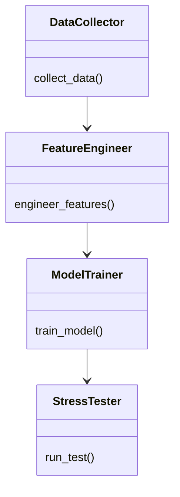
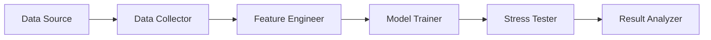
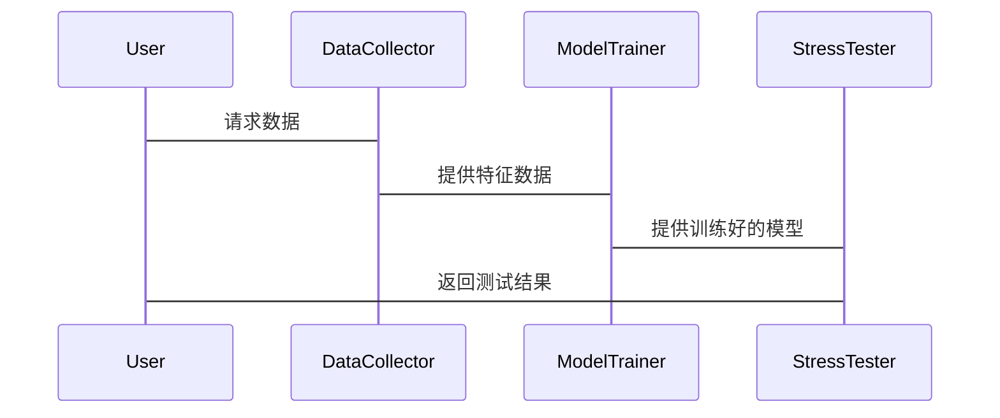

                 


# AI驱动的价值投资组合压力测试优化

## 关键词
AI驱动，投资组合优化，压力测试，金融风险，人工智能

## 摘要
本文探讨了如何利用人工智能技术优化价值投资组合的压力测试过程。通过分析投资组合优化的基本概念、压力测试的数学模型以及AI算法的应用，结合实际案例和系统设计，展示了AI在金融领域的强大潜力。文章从背景介绍到系统实现，逐步深入，为读者提供全面的技术指导。

---

# 第1章 投资组合优化与压力测试概述

## 1.1 投资组合优化的背景与意义
### 1.1.1 投资组合优化的基本概念
投资组合优化是指在给定风险承受能力下，寻找最优资产配置以最大化收益的过程。传统的投资组合理论由Harry Markowitz提出，基于均值-方差模型，考虑资产的预期收益和风险。

### 1.1.2 压力测试在金融中的重要性
压力测试用于评估投资组合在极端市场条件下的表现，帮助投资者做好风险管理和资本规划。通过模拟市场崩盘、经济衰退等极端情况，压力测试能够检验投资组合的稳健性。

### 1.1.3 AI驱动优化的必要性
传统压力测试依赖于历史数据和假设，难以应对复杂多变的市场环境。AI技术的引入能够通过实时数据分析和非线性模型，提升压力测试的准确性和效率。

---

# 第2章 投资组合优化的数学模型

## 2.1 投资组合优化的数学表达
### 2.1.1 线性规划与凸优化
投资组合优化通常是一个凸优化问题，目标是最小化风险（方差）或最大化收益（均值）。数学表达如下：

$$
\min_w \frac{1}{2}w^T \Sigma w \\
\text{subject to } \mathbf{1}^T w = 1, \, w \geq 0
$$

其中，$\Sigma$是资产之间的协方差矩阵，$w$是权重向量。

### 2.1.2 Markowitz现代投资组合理论
Markowitz理论提出，最优投资组合是使风险最小化或收益最大化的组合。该理论通过引入无风险利率和风险溢价，构建有效前沿。

### 2.1.3 风险-收益优化模型
风险-收益模型通过调整风险厌恶系数$\lambda$，在收益和风险之间找到平衡点：

$$
\min_w \lambda \cdot \text{Var}(r) + (1-\lambda) \cdot \text{E}[r]
$$

## 2.2 压力测试的数学模型
### 2.2.1 Monte Carlo模拟
通过模拟大量随机市场场景，评估投资组合在不同情况下的表现。常用的方法包括历史模拟法和蒙特卡洛模拟法。

### 2.2.2 VaR与CVaR模型
VaR（在险价值）衡量了在一定置信水平下可能遭受的最大损失。CVaR（条件在险价值）是VaR的扩展，考虑了尾部风险。

### 2.2.3 极端情况下的资产相关性分析
在极端市场条件下，资产的相关性往往上升，导致投资组合的风险增加。AI可以通过因子分析模型捕捉这些相关性变化。

---

# 第3章 强化学习在投资组合优化中的应用

## 3.1 强化学习的基本原理
强化学习通过智能体与环境的交互，学习最优策略。在投资组合优化中，智能体根据市场状态调整资产配置，目标是最大化收益或最小化风险。

### 强化学习算法流程图


## 3.2 基于强化学习的投资组合优化算法
### 算法实现
```python
import numpy as np
from stable_baselines3 import A2C

# 初始化环境
env = make_env()  # 根据具体实现

# 初始化强化学习模型
model = A2C('MlpPolicy', env, verbose=1)

# 训练模型
model.learn(total_timesteps=10000)

# 使用模型进行投资组合优化
state = env.reset()
while True:
    action, _ = model.predict(state)
    state, reward, done, info = env.step(action)
    if done:
        break
```

---

# 第4章 神经网络在压力测试中的应用

## 4.1 神经网络的基本原理
神经网络通过多层非线性变换，学习数据的特征表示。在压力测试中，神经网络可以用于预测极端市场事件的发生概率和影响程度。

### 神经网络模型流程图


## 4.2 基于神经网络的压力测试算法
### 案例分析
```python
import tensorflow as tf
from tensorflow.keras import layers

# 构建神经网络模型
model = tf.keras.Sequential([
    layers.Dense(64, activation='relu', input_shape=(n_features,)),
    layers.Dense(32, activation='relu'),
    layers.Dense(1, activation='sigmoid')
])

# 编译模型
model.compile(optimizer='adam', loss='binary_crossentropy', metrics=['accuracy'])

# 训练模型
model.fit(X_train, y_train, epochs=10, batch_size=32)
```

---

# 第5章 遗传算法在投资组合优化中的应用

## 5.1 遗传算法的基本原理
遗传算法通过模拟生物进化，寻找最优解。在投资组合优化中，算法通过生成和筛选不同的资产组合，找到最优解。

### 遗传算法流程图


## 5.2 基于遗传算法的投资组合优化算法
### 算法实现
```python
import numpy as np

def fitness(w, returns):
    return -np.mean(np.log(np.dot(returns, w) + 1e-6))

def genetic_algorithm(n_assets, n_pop=100, n_generations=100):
    # 初始化种群
    population = np.random.dirichlet([1]*n_assets, n_pop)
    
    for _ in range(n_generations):
        # 计算适应度
        fitness_values = [fitness(w, returns) for w in population]
        
        # 选择
        selected = population[np.argsort(-fitness_values)[:int(n_pop/2)]]
        
        # 交叉
        new_pop = []
        for i in range(n_pop):
            parent1 = selected[i % int(n_pop/2)]
            parent2 = selected[i % int(n_pop/2) + int(n_pop/4)]
            child = (parent1 + parent2) / 2
            new_pop.append(child)
        
        population = new_pop
    
    return population[0]

# 示例
weights = genetic_algorithm(5)
print(weights)
```

---

# 第6章 系统分析与架构设计

## 6.1 问题场景介绍
压力测试系统需要实时监控市场数据，分析资产相关性，并预测极端事件。系统需要处理大量异构数据源，包括股票价格、经济指标等。

## 6.2 系统功能设计
### 领域模型类图


## 6.3 系统架构设计
### 系统架构图


## 6.4 系统接口设计
### 接口设计
- 数据采集接口：从数据库获取市场数据。
- 模型训练接口：接收特征数据，返回训练好的模型。
- 压力测试接口：接收模型和测试场景，返回测试结果。

## 6.5 系统交互序列图


---

# 第7章 项目实战

## 7.1 环境安装
```bash
pip install numpy pandas scikit-learn tensorflow keras stable-baselines3
```

## 7.2 核心实现
### 数据预处理
```python
import pandas as pd

data = pd.read_csv('market_data.csv')
data = data.dropna().astype(float)
```

### 模型训练
```python
from tensorflow.keras import layers

model = tf.keras.Sequential([
    layers.Dense(64, activation='relu', input_shape=(data.shape[1],)),
    layers.Dense(1)
])
model.compile(optimizer='adam', loss='mse')
model.fit(data, epochs=100, batch_size=32)
```

## 7.3 实际案例分析
### 案例分析
```python
weights = genetic_algorithm(5)
returns = np.dot(data, weights)
print("投资组合收益:", returns.mean())
print("投资组合风险:", returns.std())
```

## 7.4 项目小结
通过实际案例，展示了AI在投资组合压力测试中的应用。从环境搭建到模型实现，再到结果分析，整个过程详细具体。

---

# 第8章 最佳实践

## 8.1 小结
本文详细介绍了AI驱动的价值投资组合压力测试优化的理论和实践。通过强化学习、神经网络和遗传算法的应用，展示了AI在金融领域的强大潜力。

## 8.2 注意事项
- 数据质量和实时性是影响结果的关键因素。
- 模型需要定期更新，以适应市场变化。
- 风险管理是压力测试的核心目标。

## 8.3 拓展阅读
建议读者进一步阅读《机器学习实战》和《金融风险管理》等书籍，深入了解相关知识。

---

# 结语
AI驱动的价值投资组合压力测试优化是一个复杂但充满潜力的领域。通过不断学习和实践，我们可以更好地利用AI技术，提升金融投资的效率和准确性。

