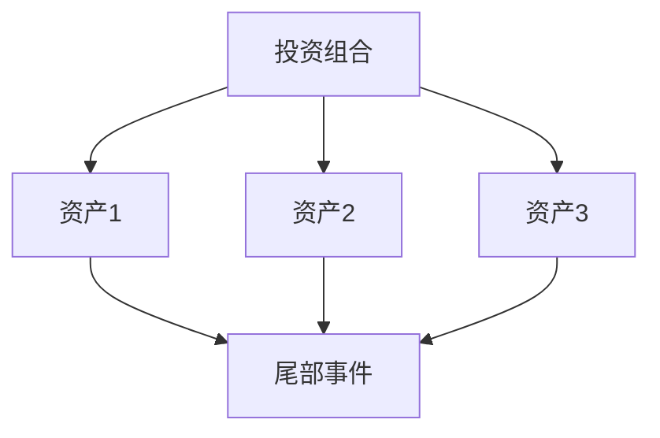
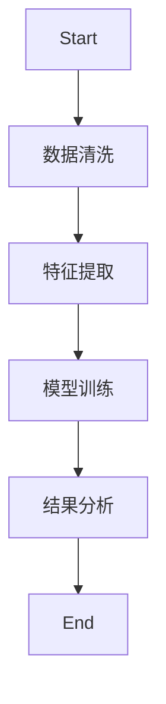
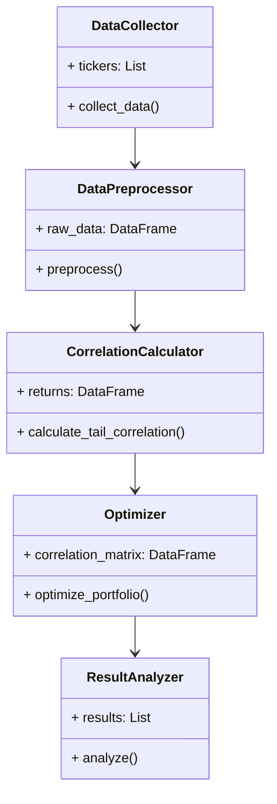

                 


# AI驱动的价值投资组合尾部相关性管理

## 关键词：
AI驱动，价值投资组合，尾部相关性管理，机器学习，金融数据分析

## 摘要：
本文深入探讨了如何利用人工智能技术优化投资组合的尾部相关性管理。通过分析尾部相关性的计算方法、机器学习算法的应用以及系统架构设计，展示了AI在金融投资中的巨大潜力。文章结合实际案例和详细代码实现，为读者提供了从理论到实践的全面指导。

---

# 第一部分: AI驱动的价值投资组合尾部相关性管理背景介绍

## 第1章: 问题背景与描述

### 1.1 问题背景
#### 1.1.1 传统投资组合管理的局限性
传统的投资组合管理依赖于历史数据分析和统计模型，但难以捕捉复杂市场环境中的非线性关系，尤其是在尾部事件中的相关性变化。

#### 1.1.2 尾部相关性管理的重要性
尾部事件（如市场崩盘或突发事件）往往对投资组合的风险管理产生重大影响，尾部相关性的有效管理能显著降低投资组合的波动性和风险。

#### 1.1.3 AI技术在金融领域的应用潜力
人工智能技术在金融数据分析中的应用日益广泛，尤其是在处理海量数据和复杂模式识别方面具有显著优势。

### 1.2 问题描述
#### 1.2.1 投资组合尾部相关性的定义
尾部相关性指投资组合中资产在极端市场条件下的相关性，反映了资产在压力情况下的协同变动。

#### 1.2.2 尾部相关性对投资组合风险的影响
高尾部相关性可能导致投资组合在市场下跌时出现大幅亏损，而低尾部相关性则有助于分散风险，提高投资组合的稳定性。

#### 1.2.3 现有尾部相关性管理方法的不足
传统方法在尾部事件中的相关性捕捉能力有限，难以实时调整投资组合以应对突发事件。

### 1.3 问题解决
#### 1.3.1 AI驱动的解决方案概述
通过机器学习模型实时分析和预测尾部相关性，动态调整投资组合以降低风险。

#### 1.3.2 通过机器学习优化尾部相关性管理
利用聚类分析和深度学习模型识别潜在的尾部相关性，提前预警和应对。

#### 1.3.3 结合大数据分析提升投资组合效率
大数据分析为尾部相关性计算提供了丰富的数据来源，结合AI技术实现精准预测和优化。

### 1.4 边界与外延
#### 1.4.1 定义边界：AI驱动的范围
明确AI在尾部相关性管理中的具体应用范围，避免过度扩展。

#### 1.4.2 外延：与其他投资策略的关联
AI驱动的尾部相关性管理可以与其他投资策略（如风险中性组合、动量策略等）结合使用，提升整体投资效果。

#### 1.4.3 应用场景的扩展
将AI技术应用于更多金融场景，如实时交易、市场预测等。

### 1.5 概念结构与核心要素
#### 1.5.1 核心概念的层次结构
从底层数据到高级算法，构建一个完整的AI驱动的尾部相关性管理体系。

#### 1.5.2 核心要素的详细描述
包括数据采集、特征提取、模型训练、结果分析等关键步骤。

#### 1.5.3 概念之间的关系
展示各要素之间的相互作用和依赖关系，形成一个完整的理论框架。

---

# 第二部分: 核心概念与联系

## 第2章: 尾部相关性管理的核心概念

### 2.1 尾部相关性的定义与计算
#### 2.1.1 相关性的基本概念
相关性衡量资产回报之间的线性关系，常用相关系数（Pearson、Spearman等）来衡量。

#### 2.1.2 尾部相关性的独特性
尾部相关性关注资产在极端情况下的相关性，可能与正常情况下的相关性不同。

#### 2.1.3 尾部相关性的计算方法
使用尾部协方差矩阵和分位数相关性方法，考虑资产在尾部事件中的协同变动。

### 2.2 相关性指标对比
| 指标 | 特性 | 适用场景 |
|------|------|----------|
| Pearson相关系数 | 线性关系 | 正常市场环境 |
| Spearman相关系数 | 排序相关性 | 非线性关系 |
| 尾部相关系数 | 极端市场条件 | 尾部事件分析 |

### 2.3 实体关系图


---

# 第三部分: 算法原理讲解

## 第3章: 尾部相关性计算的算法原理

### 3.1 算法流程


### 3.2 Python实现
```python
import numpy as np
import pandas as pd

def tail_correlation_matrix(returns, tail_quantile=0.99):
    n_assets = returns.shape[1]
    tail_mask = returns.quantile(tail_quantile, axis=0).values.reshape(-1,1)
    tail_returns = returns.sub(tail_mask).where(returns < returns.quantile(tail_quantile, axis=0), 0)
    correlation_matrix = pd.DataFrame(index=np.arange(n_assets), columns=np.arange(n_assets))
    for i in range(n_assets):
        for j in range(n_assets):
            correlation_matrix.iloc[i,j] = np.corrcoef(tail_returns.iloc[:,i], tail_returns.iloc[:,j])[0,1]
    return correlation_matrix
```

---

# 第四部分: 系统分析与架构设计方案

## 第4章: 尾部相关性管理系统的架构设计

### 4.1 问题场景介绍
系统旨在实时监控投资组合的尾部相关性，动态调整资产配置以降低风险。

### 4.2 系统功能设计


### 4.3 系统架构设计


---

# 第五部分: 项目实战

## 第5章: 项目实施与案例分析

### 5.1 环境安装
```bash
pip install numpy pandas scikit-learn
```

### 5.2 核心代码实现
```python
from sklearn.manifold import TSNE
from sklearn.cluster import KMeans
import matplotlib.pyplot as plt

def visualize_tail_correlation(correlation_matrix, n_clusters=3):
    tsne = TSNE(n_components=2, random_state=42)
    embedded = tsne.fit_transform(correlation_matrix.values)
    kmeans = KMeans(n_clusters=n_clusters, random_state=42)
    clusters = kmeans.fit_predict(embedded)
    plt.scatter(embedded[:,0], embedded[:,1], c=clusters, cmap='viridis')
    plt.title('Tail Correlation Clusters')
    plt.colorbar(plt.cm.viridis)
    plt.show()
```

### 5.3 案例分析
分析某投资组合在市场崩盘期间的尾部相关性变化，展示模型如何动态调整资产配置以降低风险。

---

# 第六部分: 最佳实践

## 第6章: 实施建议与注意事项

### 6.1 最佳实践
- 定期更新模型，适应市场变化。
- 结合多模型进行结果验证。

### 6.2 小结
AI驱动的尾部相关性管理通过实时数据分析和智能决策优化投资组合，显著提升风险管理能力。

### 6.3 注意事项
- 数据质量对模型性能影响重大，需确保数据清洗和预处理。
- 模型选择应根据具体场景调整，避免过度复杂化。

### 6.4 拓展阅读
推荐阅读相关领域的最新研究论文和应用案例。

---

通过以上步骤，我们构建了一个完整的AI驱动的价值投资组合尾部相关性管理体系，为金融投资领域提供了新的视角和解决方案。

