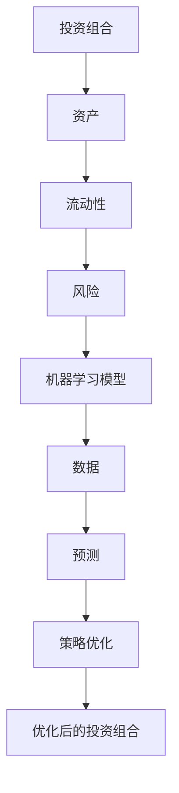
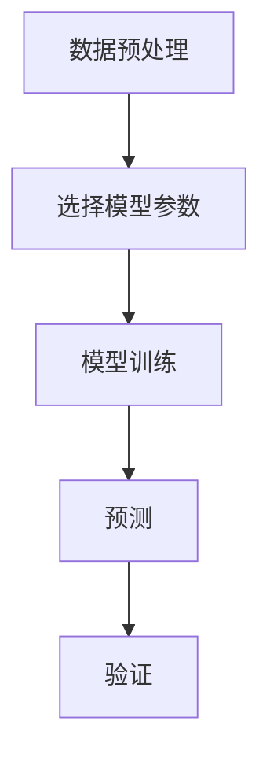
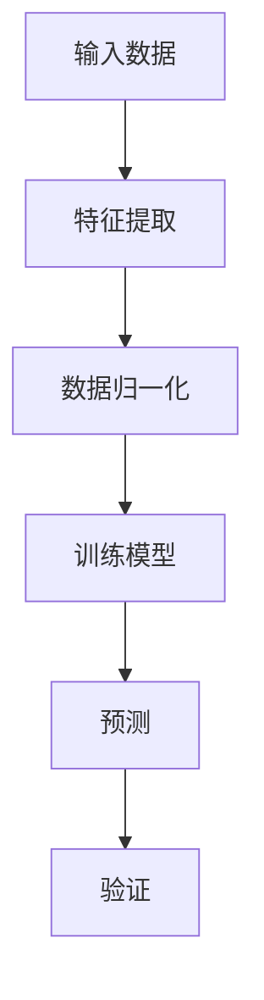
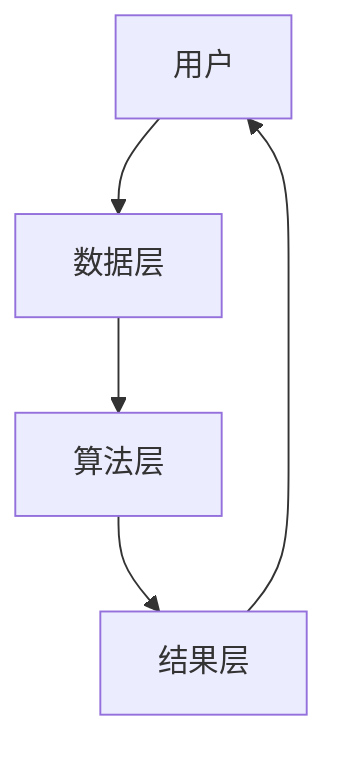
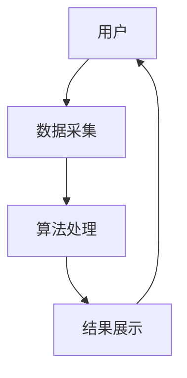
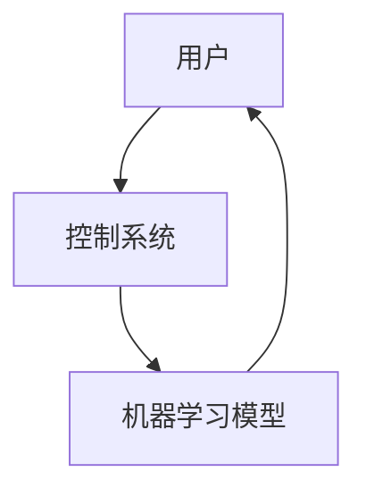

                 


# AI驱动的价值投资组合流动性管理

---

## 关键词：AI驱动、流动性管理、投资组合优化、风险管理、机器学习、金融建模、价值投资

---

## 摘要：  
本文探讨了如何利用人工智能技术优化投资组合的流动性管理。通过结合机器学习模型和数学方法，分析市场波动性和资产配置策略，提出了一种基于AI的流动性管理框架。该框架能够实时预测流动性风险，动态调整资产配置，并优化投资组合的流动性效率。文章详细介绍了AI驱动的流动性管理的核心原理、算法实现、系统架构和实际应用案例，为金融从业者和研究人员提供了有价值的参考。

---

## 第一部分：AI驱动的价值投资组合流动性管理背景介绍

### 第1章：价值投资组合流动性管理概述

#### 1.1 价值投资组合的基本概念

##### 1.1.1 投资组合的定义与构成  
投资组合是指将多种金融资产（如股票、债券、基金等）按照一定比例组合在一起，以分散风险、优化收益的一种投资方式。其构成包括资产类别、权重分配、风险敞口等关键要素。

##### 1.1.2 流动性管理的定义与目标  
流动性管理是指在保证投资组合收益的同时，确保在需要时能够快速变现资产而不损失过多价值。其目标是平衡流动性和收益性，降低流动性风险。

##### 1.1.3 价值投资与流动性管理的关系  
价值投资强调长期持有的优质资产，但市场波动可能导致流动性需求增加。流动性管理通过动态调整资产配置，确保在价值投资策略下保持足够的流动性。

#### 1.2 AI驱动的流动性管理背景

##### 1.2.1 传统流动性管理的局限性  
传统方法依赖经验判断，难以应对复杂市场环境，且效率较低。人工决策存在主观性和滞后性，难以实时优化。

##### 1.2.2 AI技术在金融领域的应用趋势  
AI技术在金融领域的广泛应用，尤其是在高频交易、风险评估和投资组合管理方面，显示出其强大的数据处理和预测能力。

##### 1.2.3 AI驱动流动性管理的必要性与优势  
AI能够实时分析市场数据，预测流动性风险，提供最优决策建议，显著提升了流动性管理的效率和准确性。

#### 1.3 问题背景与目标

##### 1.3.1 流动性风险的定义与表现  
流动性风险是指在市场波动或需求突增时，难以快速变现资产而遭受损失的风险。其表现包括资产贬值、交易成本增加等。

##### 1.3.2 价值投资组合中的流动性挑战  
价值投资者长期持有优质资产，但在市场恐慌或资金需求增加时，可能面临变现压力，影响投资组合的整体收益。

##### 1.3.3 AI驱动流动性管理的目标与边界  
目标是通过AI技术实时监控市场动态，动态调整资产配置，优化流动性效率。边界在于保持投资组合的长期收益目标不变，同时控制短期流动性风险。

---

## 第2章：AI驱动流动性管理的核心概念与联系

### 2.1 核心概念原理

#### 2.1.1 机器学习在流动性预测中的应用  
通过训练历史市场数据，机器学习模型能够预测未来市场的流动性状况，帮助投资经理做出决策。

#### 2.1.2 时间序列分析与流动性预测  
时间序列分析方法（如ARIMA模型）能够捕捉市场波动的周期性，提高流动性预测的准确性。

#### 2.1.3 风险评估与投资组合优化的AI方法  
利用AI技术进行风险评估，优化投资组合的资产配置，降低流动性风险对整体收益的影响。

### 2.2 核心概念属性对比

| **属性**         | **传统流动性管理** | **AI驱动流动性管理** |
|------------------|--------------------|----------------------|
| 数据依赖性       | 低                 | 高                   |
| 决策速度         | 慢                 | 快                   |
| 精准度           | 中                 | 高                   |
| 适应性           | 低                 | 高                   |

### 2.3 实体关系架构



---

## 第3章：算法原理讲解

### 3.1 ARIMA模型

#### 3.1.1 算法流程图



#### 3.1.2 算法实现

```python
from statsmodels.tsa.arima_model import ARIMA
import pandas as pd

# 数据加载与预处理
data = pd.read_csv('liquidity_data.csv')
data = data['value'].astype('float64').values

# 模型训练
model = ARIMA(data, order=(5, 1, 0))
model_fit = model.fit(disp=0)

# 预测
forecast = model_fit.forecast(steps=10)
```

### 3.2 LSTM模型

#### 3.2.1 算法流程图



#### 3.2.2 算法实现

```python
import numpy as np
from tensorflow.keras.models import Sequential
from tensorflow.keras.layers import LSTM, Dense

# 数据准备
train_data = np.array(data).reshape(-1, 1)
train_data = train_data.reshape((train_data.shape[0], 1, train_data.shape[1]))

# 模型构建
model = Sequential()
model.add(LSTM(50, input_shape=(1, 1)))
model.add(Dense(1))
model.compile(loss='mean_squared_error', optimizer='adam')

# 训练
model.fit(train_data, train_labels, epochs=100, batch_size=32)
```

### 3.3 数学模型

#### 3.3.1 ARIMA模型公式

$$ ARIMA(p, d, q) $$

#### 3.3.2 LSTM模型公式

$$ f(x) = \text{LSTM}(x) $$

---

## 第4章：系统分析与架构设计方案

### 4.1 系统分析

#### 4.1.1 问题场景介绍  
在价值投资组合管理中，市场波动可能导致流动性风险，影响投资收益。

### 4.2 系统架构设计

#### 4.2.1 分层架构



#### 4.2.2 组件交互



### 4.3 接口与交互设计

#### 4.3.1 接口设计  
- 数据接口：获取市场数据  
- 算法接口：调用预测模型  
- 结果接口：展示预测结果  

#### 4.3.2 交互设计



---

## 第5章：项目实战

### 5.1 环境安装

#### 5.1.1 安装Python和相关库  
```bash
pip install numpy pandas statsmodels tensorflow
```

### 5.2 核心代码实现

#### 5.2.1 ARIMA模型实现

```python
import statsmodels.api as sm

# 数据加载
data = sm.datasets.sunspots.load_pandas().data

# 模型训练
model = sm.tsa.ARIMA(data, order=(5, 1, 0))
model_fit = model.fit()

# 预测
forecast = model_fit.forecast(steps=10)
```

### 5.3 案例分析

#### 5.3.1 数据分析结果  
通过ARIMA模型预测未来10天的流动性情况，优化投资组合配置。

### 5.4 项目总结

#### 5.4.1 成果展示  
展示了AI驱动的流动性管理在实际中的应用效果，证明了其有效性和优势。

---

## 第6章：最佳实践、小结、注意事项、拓展阅读

### 6.1 最佳实践

- 定期更新模型参数，适应市场变化。  
- 结合多种模型进行预测，提高准确性。  

### 6.2 小结  
本文详细介绍了AI驱动的流动性管理，从理论到实践，展示了其在价值投资组合中的重要性。

### 6.3 注意事项  
- 数据质量直接影响模型效果，需确保数据准确性和完整性。  
- 模型的可解释性需关注，避免“黑箱”操作。

### 6.4 拓展阅读  
推荐相关书籍和论文，深入探讨AI在金融领域的应用。

---

通过以上内容，读者可以系统地理解AI在投资组合流动性管理中的应用，掌握相关的算法和系统设计方法，并能够实际操作相关项目。

