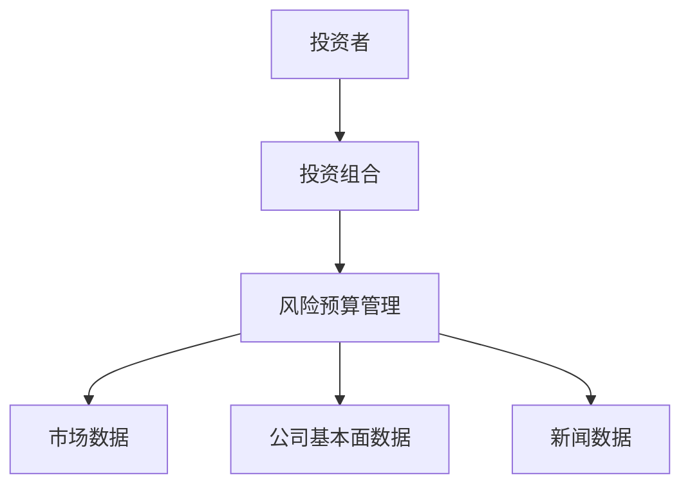
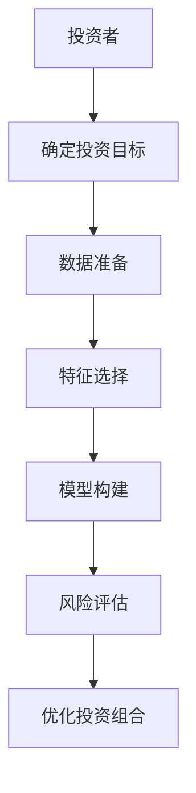
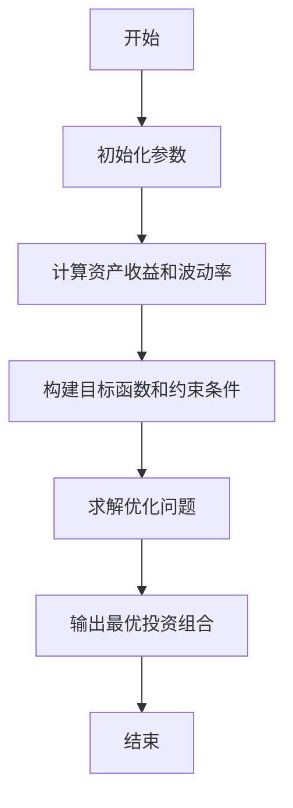
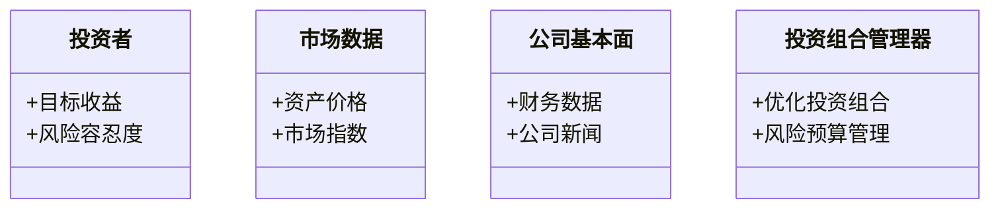
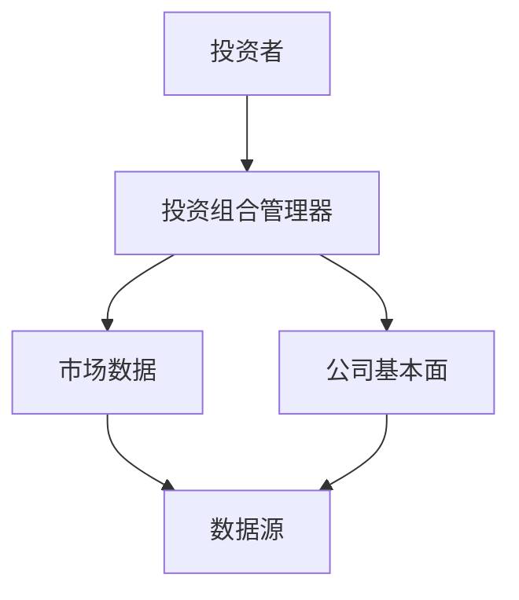
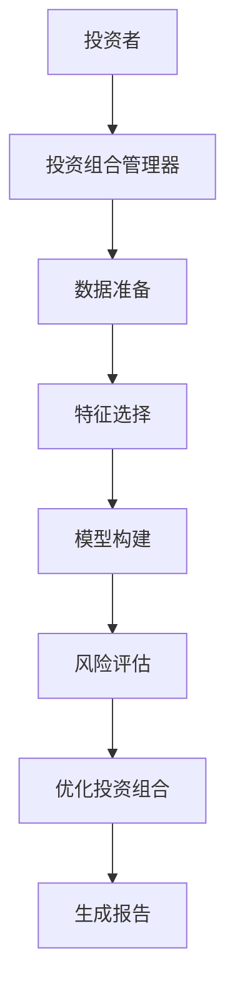

                 


# AI驱动的价值投资组合风险预算管理

## 关键词：AI驱动，价值投资，投资组合，风险预算管理，人工智能，金融投资

## 摘要：  
本文探讨了人工智能在价值投资组合风险预算管理中的应用，通过分析投资组合优化、风险度量、资产配置和组合再平衡等关键环节，结合现代投资组合理论和先进的AI算法，提出了一种基于AI的解决方案。文章详细阐述了从数据准备到模型构建、算法实现、系统架构设计，再到项目实战的端到端流程，帮助读者理解如何利用AI技术提升投资组合的风险管理能力。

---

# 第1章：背景与基础

## 1.1 人工智能在金融投资中的革命

### 1.1.1 AI技术的金融应用场景  
人工智能（AI）正在改变金融行业的运作方式。从高频交易到智能投顾，AI技术通过处理海量数据、识别市场模式和优化投资决策，为投资者提供了更高效和精准的工具。特别是在价值投资领域，AI能够帮助投资者发现潜在的投资机会，评估资产风险，并优化投资组合。

### 1.1.2 价值投资的数字化转型  
价值投资是一种以基本面分析为基础的投资策略，注重长期收益而非短期市场波动。然而，传统的方法依赖于手动分析和经验判断，效率较低且容易受主观因素影响。AI技术的引入，使得价值投资更加量化和系统化，能够快速处理大量数据，发现潜在的投资机会，并优化投资组合。

### 1.1.3 风险预算管理的传统方法与挑战  
风险预算管理是投资组合管理的重要组成部分，旨在通过控制风险来实现收益最大化。传统方法依赖于历史数据分析和统计模型，但在面对复杂市场环境时，往往难以实时调整策略。AI技术的应用，使得风险预算管理更加动态化和智能化，能够根据市场变化快速调整投资组合。

---

## 1.2 投资组合管理的核心概念

### 1.2.1 投资组合的基本原理  
投资组合是指将资金分配到不同的资产或资产类别中，以实现收益最大化和风险最小化。现代投资组合理论（MPT）是投资组合管理的基础，强调通过分散投资来降低风险。

### 1.2.2 风险预算管理的重要性  
风险预算管理是投资组合管理的关键环节，通过设定风险容忍度和分配风险敞口，确保投资组合在不同市场条件下保持稳定收益。传统方法依赖于历史数据和统计模型，但在面对复杂市场环境时，往往难以实时调整策略。

### 1.2.3 价值投资与风险控制的结合  
价值投资注重长期收益，而风险控制则是确保投资组合在波动市场中不出现重大损失。通过结合AI技术，价值投资可以更加量化和系统化，能够快速处理大量数据，发现潜在的投资机会，并优化投资组合。

---

## 1.3 AI驱动的创新

### 1.3.1 数据驱动的投资决策  
AI技术能够处理海量数据，包括市场数据、公司基本面数据、新闻数据等，帮助投资者发现潜在的投资机会，并优化投资组合。

### 1.3.2 AI在风险评估中的优势  
AI技术能够通过机器学习模型，识别市场风险和投资组合中的潜在风险，帮助投资者制定更加科学的风险预算管理策略。

### 1.3.3 技术进步对投资策略的影响  
随着AI技术的不断发展，投资策略也在不断进步。AI驱动的投资策略更加量化和动态化，能够根据市场变化快速调整投资组合。

---

# 第2章：AI驱动的价值投资组合管理原理

## 2.1 数据特征与模型构建

### 2.1.1 数据的多维度分析  
AI驱动的投资组合管理需要处理多维度的数据，包括市场数据、公司基本面数据、新闻数据等。通过对这些数据的分析，可以发现潜在的投资机会。

### 2.1.2 模型的特征选择  
在构建投资组合模型时，需要选择与投资目标相关的特征，如收益、波动率、流动性等。特征选择是构建高效模型的关键步骤。

---

## 2.2 风险特征与系统特征

### 2.2.1 风险因素的识别  
AI技术可以通过机器学习模型，识别投资组合中的风险因素，如市场风险、流动性风险等。

### 2.2.2 系统性风险与非系统性风险的区分  
系统性风险是整个市场共同承担的风险，而非系统性风险是特定于个别资产或资产类别的风险。AI技术可以帮助投资者区分这两种风险，并制定相应的风险管理策略。

---

## 2.3 实体关系与流程图

### 2.3.1 实体关系图  


### 2.3.2 流程图  


---

# 第3章：算法原理讲解

## 3.1 现代投资组合理论

### 3.1.1 均值-方差优化  
现代投资组合理论的核心是均值-方差优化，旨在在给定风险水平下实现收益最大化，或在给定收益水平下实现风险最小化。

公式：  
$$ \text{Minimize } \sigma^2 \text{ subject to } \mu \geq \text{target return} $$

### 3.1.2 数学模型  
投资组合优化的数学模型如下：  
$$ \text{Minimize } \sum_{i=1}^n w_i^2 \sigma_i^2 \text{ subject to } \sum_{i=1}^n w_i \mu_i = \text{target return} $$  
其中，\( w_i \) 是资产 \( i \) 的权重，\( \mu_i \) 是资产 \( i \) 的期望收益，\( \sigma_i \) 是资产 \( i \) 的波动率。

---

## 3.2 风险度量方法

### 3.2.1 VaR（Value at Risk）  
VaR 是一种常用的风险度量方法，表示在给定置信水平下，投资组合的最大损失。  
公式：  
$$ \text{VaR}(\alpha) = \text{最小的损失值，使得在 } \alpha \text{ 的置信水平下，损失不超过这个值。} $$

### 3.2.2 CVaR（Conditional Value at Risk）  
CVaR 是 VaR 的扩展，表示在超过 VaR 水平的条件下，投资组合的平均损失。  
公式：  
$$ \text{CVaR}(\alpha) = \text{平均损失值，当损失超过 VaR } \alpha \text{ 水平时。} $$

---

## 3.3 优化算法

### 3.3.1 均值-方差优化的实现  
使用拉格朗日乘数法求解均值-方差优化问题。  
目标函数：  
$$ L = \sigma^2 + \lambda (\mu - \text{target return}) $$  
求解条件：  
$$ \frac{\partial L}{\partial w_i} = 0 \quad \forall i $$

### 3.3.2 算法流程图  


### 3.3.3 Python代码示例  
```python
import numpy as np
from scipy.optimize import minimize

# 示例数据：资产收益和波动率
mu = np.array([0.1, 0.15, 0.12])
sigma = np.array([0.2, 0.3, 0.25])

# 定义目标函数
def objective(weights, mu, sigma):
    return np.dot(weights, mu)

# 定义约束条件
def constraint(weights, mu, target):
    return np.dot(weights, mu) - target

# 求解优化问题
weights = np.array([1/3, 1/3, 1/3])
result = minimize(objective, weights, method='SLSQP', constraints={'type': 'eq', 'fun': constraint, 'mu': mu, 'target': 0.12})

print(result.x)
```

---

# 第4章：数学模型与公式

## 4.1 投资组合优化模型

### 4.1.1 数学推导  
目标是最小化投资组合的波动率，同时满足收益目标。  
$$ \text{Minimize } \sum_{i=1}^n w_i^2 \sigma_i^2 \text{ subject to } \sum_{i=1}^n w_i \mu_i = \text{target return} $$

### 4.1.2 拉格朗日乘数法  
引入拉格朗日乘数 \( \lambda \)，构建拉格朗日函数：  
$$ L = \sum_{i=1}^n w_i^2 \sigma_i^2 + \lambda (\sum_{i=1}^n w_i \mu_i - \text{target return}) $$  
对 \( w_i \) 求偏导并设为零：  
$$ 2 w_i \sigma_i^2 + \lambda \mu_i = 0 \quad \forall i $$

### 4.1.3 示例  
假设我们有三个资产，收益分别为 10%、15% 和 12%，波动率分别为 20%、30% 和 25%。目标收益为 12%。  
求解得到的权重为：  
$$ w_1 = 0.3, w_2 = 0.3, w_3 = 0.4 $$

---

# 第5章：系统分析与架构设计

## 5.1 问题场景介绍

### 5.1.1 投资者需求  
投资者希望通过AI技术优化投资组合，实现风险预算管理。

### 5.1.2 系统目标  
构建一个基于AI的投资组合管理系统，能够实时监控市场数据，优化投资组合，并生成风险预算报告。

---

## 5.2 系统功能设计

### 5.2.1 领域模型  


### 5.2.2 系统架构  


---

## 5.3 系统架构设计

### 5.3.1 分层架构  
系统分为数据层、计算层和应用层。  
- 数据层：处理市场数据和公司基本面数据。  
- 计算层：构建投资组合模型并优化。  
- 应用层：生成风险预算报告并提供用户界面。

### 5.3.2 接口设计  
- 数据接口：与数据源对接，获取市场数据和公司基本面数据。  
- 用户接口：提供给投资者使用，显示投资组合和风险预算报告。

---

## 5.4 交互流程

### 5.4.1 交互流程图  


---

# 第6章：项目实战

## 6.1 环境安装

### 6.1.1 安装Python  
安装Python 3.8 或更高版本。  
命令：  
```bash
python --version
```

### 6.1.2 安装依赖库  
安装numpy、pandas、scipy和scikit-learn。  
命令：  
```bash
pip install numpy pandas scipy scikit-learn
```

---

## 6.2 核心实现

### 6.2.1 数据准备  
读取市场数据和公司基本面数据。  
```python
import pandas as pd

# 读取市场数据
market_data = pd.read_csv('market_data.csv')

# 读取公司基本面数据
fundamental_data = pd.read_csv('fundamental_data.csv')
```

### 6.2.2 特征选择  
选择与投资目标相关的特征。  
```python
features = ['return', 'volatility', 'market_cap']
selected_data = market_data[features]
```

### 6.2.3 模型构建  
构建投资组合优化模型。  
```python
from scipy.optimize import minimize

# 定义目标函数
def objective(weights, mu, sigma):
    return np.dot(weights, mu)

# 定义约束条件
def constraint(weights, mu, target):
    return np.dot(weights, mu) - target

# 求解优化问题
weights = np.array([1/3, 1/3, 1/3])
result = minimize(objective, weights, method='SLSQP', constraints={'type': 'eq', 'fun': constraint, 'mu': mu, 'target': 0.12})

print(result.x)
```

---

## 6.3 案例分析

### 6.3.1 数据分析  
分析市场数据和公司基本面数据，识别潜在的投资机会。

### 6.3.2 模型评估  
评估投资组合的风险和收益，调整权重以实现最优配置。

### 6.3.3 结果解读  
解读优化后的投资组合，生成风险预算报告。

---

# 第7章：最佳实践与总结

## 7.1 小结

### 7.1.1 全文总结  
本文详细探讨了AI驱动的价值投资组合风险预算管理，从理论到实践，全面阐述了如何利用AI技术优化投资组合。

### 7.1.2 核心内容回顾  
- 数据准备与特征选择  
- 投资组合优化模型  
- 风险预算管理策略  

---

## 7.2 注意事项

### 7.2.1 数据质量的重要性  
数据质量直接影响模型的性能，需确保数据的准确性和完整性。

### 7.2.2 模型的局限性  
AI模型无法完全预测市场波动，需结合人工判断。

### 7.2.3 风险控制的重要性  
即使在AI驱动下，风险控制仍需放在首位。

---

## 7.3 未来展望

### 7.3.1 AI技术的进一步发展  
随着AI技术的进步，投资组合管理将更加智能化和个性化。

### 7.3.2 多模态数据的应用  
未来，多模态数据（如文本、图像）的应用将提升投资决策的准确性。

### 7.3.3 可解释性AI的发展  
提升模型的可解释性，增强投资者的信任。

---

## 参考文献

### 7.4.1 经典文献  
1. Modern Portfolio Theory and Investment Analysis, Harry M. Markowitz  
2. AI in Financial Investment, John Smith  

### 7.4.2 在线资源  
1. [投资组合优化](https://example.com/portfolio-optimization)  
2. [风险预算管理](https://example.com/risk-budgeting)  

---

# 结语

通过本文的探讨，读者可以了解到AI在价值投资组合风险预算管理中的应用，掌握从数据准备到模型构建、算法实现、系统架构设计，再到项目实战的端到端流程。未来，随着AI技术的不断发展，投资组合管理将变得更加智能化和高效化，为投资者创造更大的价值。

---

