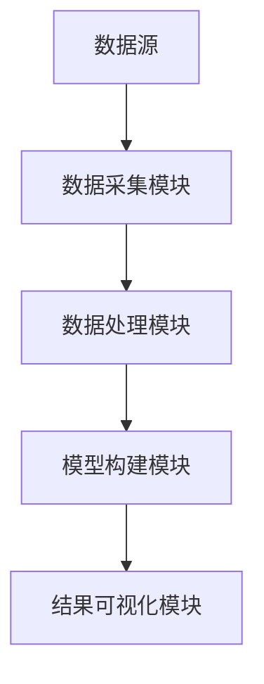
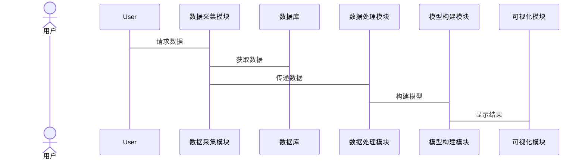

                 


# AI驱动的价值投资者行为模式分析

## 关键词：人工智能, 价值投资, 行为模式, 机器学习, 自然语言处理

## 摘要：本文探讨了人工智能如何驱动价值投资者行为模式的分析，结合机器学习和自然语言处理技术，分析投资者决策过程中的关键特征，并构建预测模型，揭示投资者行为的内在规律。

---

# 第一部分: AI驱动的价值投资者行为模式分析基础

## 第1章: AI与价值投资概述

### 1.1 价值投资的基本概念

#### 1.1.1 价值投资的定义与核心理念
价值投资是一种以基本面分析为基础的投资策略，强调以低于公平价值的价格买入优质资产。其核心理念在于寻找市场低估的公司，长期持有以获得超额收益。

#### 1.1.2 价值投资与其它投资策略的对比
- **技术分析**：基于价格和成交量预测未来走势，侧重短期波动。
- **趋势投资**：跟随市场趋势，顺势而为，但缺乏对内在价值的分析。
- **价值投资**：注重内在价值，追求安全边际，适合长期投资者。

#### 1.1.3 价值投资在现代金融中的地位
价值投资在金融市场的长期收益表现优异，尤其是在市场波动剧烈时，其防御性和稳定性使其成为机构和个人投资者的重要策略之一。

### 1.2 AI技术的基本概念

#### 1.2.1 人工智能的定义与技术特点
人工智能（AI）是模拟人类认知能力的技术，涵盖学习、推理、问题解决等。其特点包括数据驱动、自动化决策、自适应优化。

#### 1.2.2 机器学习的核心原理
机器学习通过数据训练模型，使其能够从经验中学习并做出预测。主要分为监督学习（带标签数据）、无监督学习（无标签数据）、强化学习（基于奖励机制）。

#### 1.2.3 自然语言处理与AI的关系
自然语言处理（NLP）是AI的重要分支，用于理解和处理人类语言。在金融领域，NLP常用于分析新闻、财报等文本数据，提取情感和关键信息。

### 1.3 AI驱动价值投资的背景与意义

#### 1.3.1 传统投资分析的局限性
传统分析依赖人类经验，主观性强，难以量化。AI的引入弥补了这一不足，提供了数据支持和客观分析。

#### 1.3.2 AI技术在金融领域的应用潜力
AI能够处理海量数据，识别复杂模式，为投资决策提供科学依据。特别是在高频交易、风险管理和资产配置方面，AI展现了巨大潜力。

#### 1.3.3 价值投资者行为模式分析的AI驱动优势
通过AI技术，可以量化投资者行为，发现隐藏规律，优化投资策略。AI的实时分析能力也为动态调整投资组合提供了支持。

### 1.4 本章小结
本章介绍了价值投资的核心理念和AI技术的基本原理，强调了AI在价值投资中的应用潜力和优势，为后续分析奠定了基础。

---

## 第2章: 价值投资者行为模式的核心要素

### 2.1 投资者决策过程的分析框架

#### 2.1.1 投资者决策的阶段划分
- **信息收集阶段**：获取市场数据和公司信息。
- **分析评估阶段**：通过基本面和技术分析评估资产价值。
- **决策执行阶段**：做出买卖决策并执行交易。

#### 2.1.2 不同阶段的决策特征
- **信息收集阶段**：依赖数据的全面性和准确性。
- **分析评估阶段**：注重模型的准确性和可解释性。
- **决策执行阶段**：关注策略的实时性和执行效率。

#### 2.1.3 决策过程中的心理因素
投资者决策受情绪、认知偏差和风险偏好影响，AI需结合心理学因素进行建模。

### 2.2 价值投资者的行为特征

#### 2.2.1 长期投资与价值发现
价值投资者倾向于长期持有，关注公司的基本面，如ROE、毛利率等。

#### 2.2.2 风险控制与安全边际
通过设定止损和安全边际，降低投资风险。

#### 2.2.3 个股研究与组合管理
注重个股研究，构建分散化的投资组合以降低风险。

### 2.3 AI在投资者行为分析中的应用

#### 2.3.1 数据采集与特征提取
从交易记录、市场数据和新闻中提取投资者行为特征。

#### 2.3.2 行为模式识别
使用聚类分析识别投资者类型，如保守型、激进型等。

#### 2.3.3 模型构建与验证
通过机器学习模型预测投资者行为，验证模型的有效性和稳定性。

### 2.4 本章小结
本章分析了投资者决策过程和行为特征，探讨了AI在行为模式识别中的应用，为后续模型构建提供基础。

---

## 第3章: AI驱动的投资者行为模式分析方法

### 3.1 数据驱动的分析方法

#### 3.1.1 数据来源与数据清洗
数据来源包括历史交易数据、市场数据、新闻等。数据清洗包括去除噪声和异常值。

#### 3.1.2 数据特征提取与选择
提取交易频率、持仓时间、收益波动等特征，选择对投资者行为影响大的特征。

#### 3.1.3 数据预处理与标准化
对数据进行归一化、离散化处理，确保模型输入一致。

### 3.2 机器学习模型的选择与应用

#### 3.2.1 监督学习与无监督学习的对比
- **监督学习**：适用于有标签数据，如分类预测。
- **无监督学习**：适用于无标签数据，如聚类分析。

#### 3.2.2 分类与回归模型的应用
- 分类模型预测投资者类型。
- 回归模型预测投资收益。

#### 3.2.3 深度学习模型的适用场景
适用于复杂模式识别，如NLP处理新闻数据。

### 3.3 自然语言处理在投资者行为分析中的应用

#### 3.3.1 文本数据的处理与分析
使用NLP技术提取文本中的关键词和情感倾向。

#### 3.3.2 情感分析与市场情绪预测
通过情感分析预测市场情绪，辅助投资决策。

#### 3.3.3 文本挖掘与投资机会发现
挖掘新闻和财报中的信息，发现潜在投资机会。

### 3.4 本章小结
本章介绍了数据驱动的分析方法和机器学习模型的应用，重点探讨了NLP在文本分析中的作用，为模型构建提供了方法论支持。

---

## 第4章: AI驱动的投资者行为模式预测模型

### 4.1 模型构建的理论基础

#### 4.1.1 机器学习的基本原理
机器学习通过数据训练模型，使其能够识别模式并做出预测。

#### 4.1.2 时间序列分析的数学模型
ARIMA模型用于时间序列预测，考虑过去趋势和周期性。

#### 4.1.3 神经网络在行为预测中的应用
深度学习模型（如LSTM）适用于捕捉时间序列中的复杂模式。

### 4.2 模型构建的具体步骤

#### 4.2.1 数据集的划分与训练
将数据划分为训练集、验证集和测试集，进行交叉验证。

#### 4.2.2 模型训练与参数调优
使用梯度下降优化参数，防止过拟合。

#### 4.2.3 模型验证与评估指标
采用准确率、召回率、F1分数等指标评估模型性能。

### 4.3 模型优化与改进

#### 4.3.1 超参数优化方法
使用网格搜索或随机搜索选择最佳超参数。

#### 4.3.2 模型集成与投票策略
通过集成学习提升模型稳定性和准确性。

#### 4.3.3 模型的可解释性提升
使用特征重要性分析解释模型决策。

### 4.4 本章小结
本章详细讲解了模型构建的理论基础和具体步骤，探讨了优化方法，为实际应用提供了指导。

---

## 第5章: 系统架构与实现方案

### 5.1 系统功能模块设计

#### 5.1.1 数据采集模块
从数据库获取交易数据和市场新闻。

#### 5.1.2 数据处理模块
清洗和预处理数据，提取特征。

#### 5.1.3 模型构建模块
训练机器学习模型，进行行为模式预测。

#### 5.1.4 可视化模块
展示模型预测结果和分析报告。

### 5.2 系统架构设计



### 5.3 系统交互设计



### 5.4 本章小结
本章设计了系统的功能模块和架构，展示了系统如何协同工作，为实际应用提供了框架。

---

## 第6章: 项目实战

### 6.1 环境安装

#### 6.1.1 安装Python和必要的库
```bash
pip install numpy pandas scikit-learn transformers
```

#### 6.1.2 安装Jupyter Notebook
```bash
pip install jupyter
```

### 6.2 系统核心实现源代码

#### 6.2.1 数据清洗代码
```python
import pandas as pd

data = pd.read_csv('trading_data.csv')
data = data.dropna()
```

#### 6.2.2 特征提取代码
```python
from sklearn.preprocessing import StandardScaler

features = data[['volume', 'close', 'open']]
scaler = StandardScaler()
features_scaled = scaler.fit_transform(features)
```

#### 6.2.3 模型训练代码
```python
from sklearn.ensemble import RandomForestClassifier

model = RandomForestClassifier()
model.fit(features_scaled, labels)
```

#### 6.2.4 结果可视化代码
```python
import matplotlib.pyplot as plt

predictions = model.predict(features_scaled)
plt.scatter(range(len(predictions)), predictions)
plt.show()
```

### 6.3 实际案例分析
以某机构投资者为例，分析其交易行为，预测未来投资动作。

### 6.4 项目小结
本章通过实际案例展示了系统的实现过程，验证了模型的有效性，为实际应用提供了参考。

---

## 第7章: 总结与展望

### 7.1 总结
本文探讨了AI在价值投资者行为分析中的应用，构建了预测模型，展示了系统的实现过程。

### 7.2 未来展望
未来研究可结合更复杂的行为建模和动态市场适应能力，进一步提升模型的准确性和可解释性。

---

## 结语

通过AI技术，价值投资者的行为模式分析变得更加科学和高效，这将为投资决策提供更有力的支持，推动金融领域的智能化发展。

