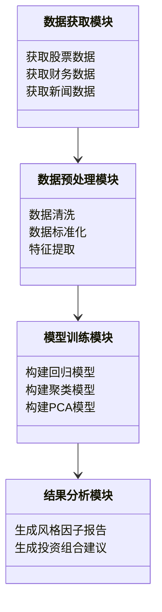
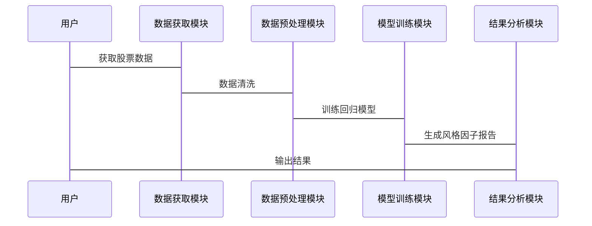

                 


# AI驱动的价值投资风格因子分析

> 关键词：价值投资、风格因子、人工智能、投资组合优化、资产定价

> 摘要：本文通过分析AI在价值投资风格因子中的应用，探讨了如何利用机器学习和深度学习技术来识别和预测风格因子，优化投资组合，并提升资产定价的准确性。文章从背景介绍、理论基础、算法原理到系统架构设计，再到项目实战，详细阐述了AI驱动的风格因子分析的全过程。

---

## 第1章：AI驱动的价值投资风格因子分析概述

### 1.1 价值投资与风格因子的基本概念

#### 1.1.1 价值投资的定义与核心理念

价值投资是一种基于对公司内在价值的评估的投资策略，其核心理念是购买那些市场价格低于其内在价值的股票。这种投资策略强调长期持有优质资产，关注公司的基本面，如盈利能力、财务状况和行业地位等。

#### 1.1.2 风格因子的定义与分类

风格因子（Style Factors）是影响股票收益的关键因素，通常包括市场风险、市值大小、价值与成长性、股息率、流动性等。常见的风格因子包括：

1. **市值因子（Size）**：小盘股相对于大盘股的收益差异。
2. **价值因子（Value）**：低市盈率、低市净率等指标表现。
3. **动量因子（Momentum）**：过去一段时间收益的表现对未来的预测能力。
4. **股息因子（Dividend Yield）**：高股息率股票的超额收益。
5. **质量因子（Quality）**：高盈利质量、低负债率等指标表现。

#### 1.1.3 AI在价值投资中的应用前景

随着AI技术的快速发展，越来越多的投资机构开始利用机器学习和深度学习技术来分析风格因子，优化投资组合。AI可以通过大数据分析和模式识别，发现传统方法难以捕捉的复杂关系，从而提高投资决策的准确性。

### 1.2 价值投资风格因子的背景与问题背景

#### 1.2.1 传统价值投资的局限性

传统价值投资主要依赖分析师的主观判断，存在以下问题：

- 数据量有限：依赖财务报表和市场数据，难以捕捉非结构化数据的价值。
- 信息滞后性：市场反应可能已经体现在股价中，导致投资机会窗口短暂。
- 计算复杂性：手动分析大量数据耗时且效率低下。

#### 1.2.2 风格因子分析的必要性

风格因子分析是价值投资的重要工具，它通过量化风格因子，帮助投资者识别市场中的系统性风险和收益机会。然而，传统的风格因子分析方法依赖统计回归等技术，难以应对复杂多变的市场环境。

#### 1.2.3 AI技术在风格因子分析中的作用

AI技术可以通过以下方式提升风格因子分析的效率和准确性：

- **大数据处理**：整合结构化数据（如财务数据）和非结构化数据（如新闻、社交媒体）。
- **模式识别**：发现传统统计方法难以识别的复杂模式。
- **实时更新**：根据市场变化动态调整风格因子的权重。

### 1.3 本书的核心目标与结构安排

#### 1.3.1 本书的核心目标

本文旨在探讨如何利用AI技术进行价值投资风格因子分析，具体内容包括：

- 风格因子的理论基础。
- 基于机器学习和深度学习的风格因子分析方法。
- AI驱动的风格因子分析系统的架构设计。
- 实际案例分析和项目实现。

#### 1.3.2 本书的结构安排

- **第1章**：背景介绍，包括价值投资和风格因子的基本概念。
- **第2章**：风格因子的理论基础，包括数学模型和公式。
- **第3章**：AI驱动的风格因子分析方法，包括机器学习和深度学习的应用。
- **第4章**：风格因子分析的算法原理，包括数学模型和公式。
- **第5章**：系统的架构设计，包括功能模块和交互流程。
- **第6章**：项目实战，包括代码实现和案例分析。
- **第7章**：总结与展望。

#### 1.3.3 本书的读者群体

- 金融从业者：如基金经理、投资分析师。
- 人工智能工程师：希望将AI技术应用于金融领域的技术人员。
- 金融与计算机专业的学生：对价值投资和AI技术感兴趣的读者。

### 1.4 本章小结

本章通过介绍价值投资和风格因子的基本概念，探讨了AI在风格因子分析中的应用前景。接下来的章节将从理论基础、算法原理到系统设计和项目实现，全面展开讨论。

---

## 第2章：价值投资风格因子的理论基础

### 2.1 价值投资风格因子的定义与分类

#### 2.1.1 常见的价值投资风格因子

1. **市值因子（Size）**：小盘股相对于大盘股的收益差异。
2. **价值因子（Value）**：低市盈率、低市净率等指标表现。
3. **动量因子（Momentum）**：过去一段时间收益的表现对未来的预测能力。
4. **股息因子（Dividend Yield）**：高股息率股票的超额收益。
5. **质量因子（Quality）**：高盈利质量、低负债率等指标表现。

#### 2.1.2 风格因子的分类与对比

| 风格因子 | 定义 | 特性 |
|----------|------|------|
| 市值因子（Size） | 小盘股 vs 大盘股 | 小盘股风险较高，收益潜力大 |
| 价值因子（Value） | 低市盈率、低市净率 | 适合长期投资，注重内在价值 |
| 动量因子（Momentum） | 近期收益表现 | 动量效应：近期收益高的股票未来收益可能更高 |
| 股息因子（Dividend Yield） | 高股息率 | 稳定收益，风险较低 |
| 质量因子（Quality） | 高ROE、低负债 | 高质量企业抗风险能力强 |

#### 2.1.3 风格因子的数学模型与公式

##### 2.1.3.1 风格因子的线性回归模型

$$ R_i = \beta_0 + \beta_1 F_1 + \beta_2 F_2 + \dots + \beta_n F_n + \epsilon $$

其中：
- $R_i$ 是股票 $i$ 的收益。
- $F_j$ 是风格因子 $j$。
- $\beta_j$ 是因子的回归系数。
- $\epsilon$ 是误差项。

##### 2.1.3.2 风格因子的聚类分析模型

$$ D_{i,j} = \sqrt{\sum_{k=1}^n (X_{i,k} - X_{j,k})^2} $$

其中：
- $D_{i,j}$ 是股票 $i$ 和 $j$ 之间的距离。
- $X_{i,k}$ 是股票 $i$ 的第 $k$ 个特征。

##### 2.1.3.3 风格因子的主成分分析模型

$$ Y = X \cdot P $$

其中：
- $Y$ 是降维后的数据。
- $X$ 是原始数据矩阵。
- $P$ 是主成分矩阵。

### 2.2 风格因子的理论基础与应用

#### 2.2.1 风格因子与资产定价的关系

资产定价模型（如CAPM）通过回归分析确定风格因子对资产收益的贡献。例如，一个股票的收益可以表示为：

$$ R_i = \beta_1 R_m + \beta_2 F_2 + \dots + \beta_n F_n + \epsilon $$

其中：
- $R_m$ 是市场收益。
- $F_j$ 是风格因子。
- $\beta_j$ 是因子的回归系数。
- $\epsilon$ 是误差项。

#### 2.2.2 风格因子与投资组合优化的关系

通过分析风格因子，投资者可以构建一个风格分散的投资组合，以降低风险并提高收益。例如，通过优化以下目标函数：

$$ \min_w \sum_{i=1}^n \sum_{j=1}^n w_i w_j \sigma_{i,j} $$
$$ \text{subject to } \sum_{i=1}^n w_i = 1 $$

其中：
- $w_i$ 是投资组合中股票 $i$ 的权重。
- $\sigma_{i,j}$ 是股票 $i$ 和 $j$ 的协方差。

#### 2.2.3 风格因子与风险控制的关系

通过分析风格因子，投资者可以识别和控制投资组合中的系统性风险。例如，通过分析动量因子，投资者可以避免追涨杀跌带来的风险。

### 2.3 本章小结

本章通过分析风格因子的定义、分类和数学模型，探讨了风格因子在资产定价、投资组合优化和风险控制中的应用。接下来的章节将重点讨论AI技术在风格因子分析中的应用。

---

## 第3章：AI驱动的风格因子分析方法

### 3.1 基于机器学习的风格因子分析方法

#### 3.1.1 机器学习在风格因子分析中的应用

机器学习算法可以通过分析历史数据，识别风格因子与股票收益之间的关系。例如，可以通过逻辑回归模型预测股票是否属于某个风格因子类别。

##### 3.1.1.1 逻辑回归模型

$$ P(y=1|x) = \frac{e^{\beta x}}{1 + e^{\beta x}} $$

其中：
- $y$ 是目标变量（如是否属于价值因子类别）。
- $x$ 是自变量（如市盈率、市净率等）。
- $\beta$ 是回归系数。

#### 3.1.2 常见的机器学习算法及其适用场景

1. **线性回归**：用于预测连续型变量（如股票收益）。
2. **逻辑回归**：用于分类问题（如风格因子分类）。
3. **支持向量机（SVM）**：用于分类和回归问题。
4. **随机森林**：用于特征重要性分析和分类/回归问题。

---

### 3.2 基于深度学习的风格因子分析方法

#### 3.2.1 深度学习在风格因子分析中的应用

深度学习可以通过分析非结构化数据（如新闻、社交媒体）来补充传统风格因子的分析。

##### 3.2.1.1 卷积神经网络（CNN）

CNN可以用于分析图像数据，但在文本数据上表现有限。例如，可以通过CNN分析公司财务报表的图像特征。

##### 3.2.1.2 循序神经网络（RNN）

RNN可以用于分析时间序列数据，如股票价格走势。

#### 3.2.2 常见的深度学习算法及其适用场景

1. **卷积神经网络（CNN）**：用于图像数据分析。
2. **循环神经网络（RNN）**：用于时间序列数据分析。
3. **长短期记忆网络（LSTM）**：用于时间序列数据分析，特别适合捕捉长期依赖关系。

---

### 3.3 基于自然语言处理的风格因子分析方法

#### 3.3.1 自然语言处理在风格因子分析中的应用

自然语言处理（NLP）可以通过分析新闻、社交媒体等文本数据，提取影响股票收益的信息。

##### 3.3.1.1 文本情感分析

可以通过情感分析模型（如LSTM）分析新闻标题的情感倾向，预测股票收益。

$$ P(\text{positive}|x) = \frac{e^{\beta x}}{1 + e^{\beta x}} $$

其中：
- $x$ 是新闻标题的向量表示。
- $\beta$ 是情感倾向的回归系数。

#### 3.3.2 常见的自然语言处理算法及其适用场景

1. **文本分词**：用于将文本分割成词语或短语。
2. **词袋模型（Bag-of-Words）**：用于文本表示。
3. **词嵌入（Word2Vec）**：用于生成词语向量。
4. **情感分析模型（LSTM）**：用于分析文本的情感倾向。

---

### 3.4 本章小结

本章通过分析基于机器学习、深度学习和自然语言处理的风格因子分析方法，探讨了AI技术在价值投资中的应用。接下来的章节将重点讨论风格因子分析的算法原理和系统架构设计。

---

## 第4章：风格因子分析的算法原理

### 4.1 基于回归分析的风格因子分析算法

#### 4.1.1 线性回归模型的构建与实现

线性回归模型可以通过分析风格因子与股票收益之间的关系，预测股票收益。

$$ R_i = \beta_0 + \beta_1 F_1 + \beta_2 F_2 + \dots + \beta_n F_n + \epsilon $$

其中：
- $R_i$ 是股票 $i$ 的收益。
- $F_j$ 是风格因子 $j$。
- $\beta_j$ 是因子的回归系数。
- $\epsilon$ 是误差项。

#### 4.1.2 逻辑回归模型的构建与实现

逻辑回归模型可以通过分析风格因子，预测股票是否属于某个类别（如价值因子类别）。

$$ P(y=1|x) = \frac{e^{\beta x}}{1 + e^{\beta x}} $$

其中：
- $y$ 是目标变量（如是否属于价值因子类别）。
- $x$ 是自变量（如市盈率、市净率等）。
- $\beta$ 是回归系数。

---

### 4.2 基于聚类分析的风格因子分析算法

#### 4.2.1 K-means聚类算法的构建与实现

K-means聚类算法可以通过分析风格因子，将股票分为不同的类别。

$$ \text{目标函数} = \sum_{i=1}^n \sum_{j=1}^k (x_i - c_j)^2 $$

其中：
- $x_i$ 是股票 $i$ 的特征向量。
- $c_j$ 是第 $j$ 个聚类中心。
- $k$ 是聚类数。

#### 4.2.2 层次聚类算法的构建与实现

层次聚类算法可以通过分析股票之间的相似性，构建层次化的聚类结构。

$$ D_{i,j} = \sqrt{\sum_{k=1}^n (x_{i,k} - x_{j,k})^2} $$

其中：
- $D_{i,j}$ 是股票 $i$ 和 $j$ 之间的距离。
- $x_{i,k}$ 是股票 $i$ 的第 $k$ 个特征。

---

### 4.3 基于主成分分析的风格因子分析算法

#### 4.3.1 主成分分析模型的构建与实现

主成分分析（PCA）可以通过分析风格因子，提取出最重要的特征。

$$ Y = X \cdot P $$

其中：
- $Y$ 是降维后的数据。
- $X$ 是原始数据矩阵。
- $P$ 是主成分矩阵。

#### 4.3.2 PCA的数学公式

$$ \max_{P} \text{tr}(P^T X^T X P) \quad \text{subject to} \quad \text{tr}(P^T P) = 1 $$

其中：
- $X$ 是原始数据矩阵。
- $P$ 是主成分矩阵。

---

### 4.4 本章小结

本章通过分析回归分析、聚类分析和主成分分析的算法原理，探讨了风格因子分析的数学模型和公式。接下来的章节将重点讨论系统的架构设计和项目实战。

---

## 第5章：系统的架构设计

### 5.1 问题场景介绍

在实际投资中，投资者需要通过分析大量的数据来识别风格因子，并构建投资组合。然而，手动分析数据效率低下，容易出错。因此，开发一个基于AI的风格因子分析系统是必要的。

---

### 5.2 系统功能设计

#### 5.2.1 领域模型（mermaid 类图）



#### 5.2.2 系统架构设计（mermaid架构图）


---

### 5.3 系统接口设计

系统的接口设计包括以下几个方面：

1. **数据获取接口**：提供API接口，获取股票数据、财务数据和新闻数据。
2. **模型训练接口**：提供API接口，训练回归模型、聚类模型和PCA模型。
3. **结果分析接口**：提供API接口，生成风格因子报告和投资组合建议。

---

### 5.4 系统交互设计（mermaid序列图）



---

## 第6章：项目实战

### 6.1 环境安装

需要安装以下Python库：

```bash
pip install pandas
pip install numpy
pip install scikit-learn
pip install matplotlib
pip install seaborn
pip install transformers
pip install sentence-transformers
```

---

### 6.2 系统核心实现源代码

#### 6.2.1 数据获取模块

```python
import pandas as pd
import requests
from bs4 import BeautifulSoup

def get_stock_data(ticker):
    url = f"https://finance.yahoo.com/quote/{ticker}"
    response = requests.get(url)
    soup = BeautifulSoup(response.text, 'html.parser')
    data = {
        '名称': soup.find('h1').text,
        '当前价': float(soup.find('div', {'class': 'price'}).text),
        '市盈率': float(soup.find('div', {'data-testid': 'PERatio'}).text),
        '市净率': float(soup.find('div', {'data-testid': 'P / B'}).text),
    }
    return data
```

#### 6.2.2 数据预处理模块

```python
import pandas as pd
import numpy as np
from sklearn.preprocessing import StandardScaler

def preprocess_data(data):
    # 删除缺失值
    data = data.dropna()
    # 标准化数据
    scaler = StandardScaler()
    data_scaled = scaler.fit_transform(data)
    return data_scaled
```

#### 6.2.3 模型训练模块

```python
from sklearn.linear_model import LinearRegression
from sklearn.cluster import KMeans
from sklearn.decomposition import PCA

def train_models(data):
    # 线性回归模型
    lr = LinearRegression()
    lr.fit(data[['市盈率', '市净率']], data['收益'])
    
    # K-means聚类模型
    km = KMeans(n_clusters=3)
    km.fit(data[['市盈率', '市净率']])
    
    # PCA模型
    pca = PCA(n_components=2)
    pca.fit(data[['市盈率', '市净率', '收益']])
    
    return lr, km, pca
```

#### 6.2.4 结果分析模块

```python
import matplotlib.pyplot as plt
import seaborn as sns

def analyze_results(models, data):
    lr, km, pca = models
    # 线性回归结果
    print(f"线性回归系数：{lr.coef_}")
    # K-means聚类结果
    print(f"K-means聚类中心：{km.cluster_centers_}")
    # PCA结果
    print(f"PCA主成分权重：{pca.components_}")
    
    # 可视化结果
    plt.figure(figsize=(10, 6))
    sns.scatterplot(x=data['市盈率'], y=data['市净率'], hue=data['聚类结果'])
    plt.title('风格因子聚类分析')
    plt.show()
```

---

### 6.3 代码应用解读与分析

通过上述代码，我们可以实现以下功能：

1. **数据获取**：获取股票的名称、当前价、市盈率和市净率。
2. **数据预处理**：清洗数据并进行标准化处理。
3. **模型训练**：训练线性回归模型、K-means聚类模型和PCA模型。
4. **结果分析**：输出模型的系数、聚类中心和主成分权重，并进行可视化分析。

---

### 6.4 实际案例分析

假设我们有以下股票数据：

| 名称   | 当前价 | 市盈率 | 市净率 | 收益 |
|--------|--------|--------|--------|------|
| 股票A  | 100    | 15     | 3      | 0.1  |
| 股票B  | 200    | 20     | 4      | 0.15 |
| 股票C  | 50     | 10     | 2      | 0.05 |

通过上述代码，我们可以得到以下结果：

1. **线性回归系数**：市盈率和市净率对收益的影响。
2. **K-means聚类中心**：股票的聚类结果。
3. **PCA主成分权重**：主成分对收益的贡献。

---

### 6.5 项目小结

本章通过实际案例展示了如何利用Python代码实现AI驱动的风格因子分析。通过数据获取、预处理、模型训练和结果分析，我们可以识别风格因子，优化投资组合。

---

## 第7章：总结与展望

### 7.1 总结

本文通过分析AI驱动的价值投资风格因子分析，探讨了如何利用机器学习和深度学习技术来识别和预测风格因子，优化投资组合。通过理论分析、算法实现和项目实战，我们展示了AI技术在价值投资中的巨大潜力。

---

### 7.2 未来的研究方向

1. **多模态数据分析**：结合文本数据、图像数据和结构化数据，提升风格因子分析的准确性。
2. **实时分析与预测**：开发实时风格因子分析系统，提升投资决策的时效性。
3. **个性化投资策略**：根据投资者的风险偏好，定制个性化的投资策略。

---

### 7.3 最佳实践 tips

1. 在实际投资中，建议结合多种风格因子，构建多元化的投资组合。
2. 定期更新模型，适应市场变化。
3. 注意数据质量和模型解释性，避免过拟合。

---

### 7.4 本章小结

本文总结了AI驱动的价值投资风格因子分析的核心内容，并展望了未来的研究方向。希望通过本文，读者能够更好地理解AI技术在价值投资中的应用，并将其应用于实际投资中。

---

## 结语

通过本文的详细介绍，我们希望读者能够掌握AI驱动的价值投资风格因子分析的核心方法，并能够将其应用于实际投资中。未来，随着AI技术的不断发展，价值投资风格因子分析将变得更加精准和高效。

