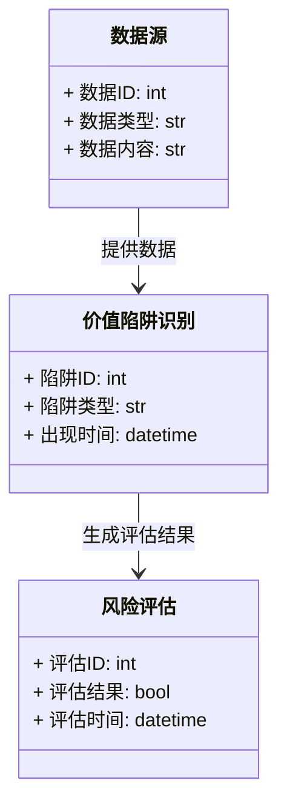
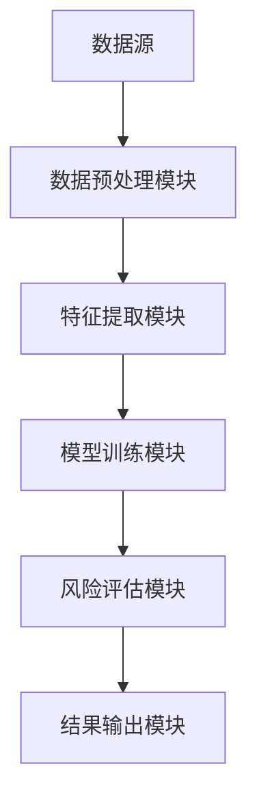

                 


好的，我现在将按照您的要求，以《AI驱动的价值陷阱识别与规避》为题，撰写一篇结构清晰、内容详实的技术博客文章。我会按照您提供的目录结构逐步展开，并在每个章节中深入探讨相关的核心概念、算法原理和系统设计等内容。

---

# 《AI驱动的价值陷阱识别与规避》

## 关键词：AI技术，价值陷阱，识别与规避，算法原理，系统架构

## 摘要：  
本文将探讨如何利用人工智能技术识别和规避价值陷阱。通过分析价值陷阱的定义、特征及其在商业和投资中的影响，结合AI技术的优势，提出了一种基于自然语言处理（NLP）和机器学习的解决方案。本文详细讲解了算法原理、系统架构设计以及实际项目实现，旨在为读者提供从理论到实践的全面指导。

---

## 第1章: 价值陷阱的基本概念与AI的引入

### 1.1 价值陷阱的定义与特征

#### 1.1.1 价值陷阱的定义
价值陷阱是指在商业或投资中，表面上看似有利可图的机会，实则隐藏着潜在风险或亏损的情况。例如，一家公司可能看似有高增长潜力，但其财务状况或市场环境可能存在问题，导致投资失败。

#### 1.1.2 价值陷阱的主要特征
- **表面吸引力**：通常表现为高增长、高利润或低风险。
- **隐藏风险**：如财务造假、市场需求下降或竞争加剧。
- **复杂性**：风险可能涉及多个因素，如宏观经济、行业趋势和公司内部管理。

#### 1.1.3 价值陷阱的分类与应用场景
- **财务风险**：公司财务报表虚假或隐藏负债。
- **市场风险**：市场需求突然下降。
- **竞争风险**：行业竞争加剧，导致利润稀释。

### 1.2 AI技术在价值陷阱识别中的作用

#### 1.2.1 AI技术的基本原理与优势
- **数据驱动**：AI通过分析大量数据发现隐藏的模式。
- **实时性**：AI能够快速处理实时数据，提供及时反馈。
- **准确性**：通过机器学习模型，AI可以提高预测的准确性。

#### 1.2.2 AI在价值陷阱识别中的独特价值
- **自动化分析**：AI可以自动筛选大量数据，发现潜在风险。
- **多维度分析**：结合财务、市场和行业数据，提供全面评估。

#### 1.2.3 AI驱动的价值陷阱识别的可行性分析
- **技术可行性**：AI技术已经在金融领域得到广泛应用。
- **数据可行性**：企业通常有丰富的财务和市场数据可用。
- **成本效益**：AI技术能够显著降低人工分析的成本。

### 1.3 价值陷阱识别的技术背景与商业背景

#### 1.3.1 价值陷阱识别的技术基础
- **机器学习**：用于模式识别和预测。
- **自然语言处理（NLP）**：用于分析文本数据，如新闻、财报。

#### 1.3.2 价值陷阱识别的商业需求
- **投资决策支持**：帮助投资者做出更明智的投资决策。
- **风险管理**：帮助企业识别潜在风险，避免重大损失。

#### 1.3.3 价值陷阱识别的市场现状与趋势
- **技术进步**：AI和大数据技术的快速发展推动了价值陷阱识别的普及。
- **市场需求**：企业对风险管理的需求日益增加。

### 1.4 价值陷阱识别的挑战与解决方案

#### 1.4.1 价值陷阱识别的主要挑战
- **数据质量**：数据可能不完整或存在偏差。
- **模型局限性**：AI模型可能无法捕捉所有潜在风险。
- **计算成本**：处理大量数据可能需要高昂的计算资源。

#### 1.4.2 AI技术如何应对这些挑战
- **数据清洗**：通过预处理技术提高数据质量。
- **模型优化**：使用深度学习和增强学习提高模型性能。
- **分布式计算**：利用云计算和分布式计算降低成本。

#### 1.4.3 价值陷阱识别的未来发展方向
- **多模态分析**：结合文本、图像和语音等多种数据源。
- **实时监控**：实现对市场变化的实时响应。

---

## 第2章: 价值陷阱识别的核心概念与AI技术的联系

### 2.1 价值陷阱识别的核心概念

#### 2.1.1 价值陷阱识别的定义与目标
- **定义**：通过AI技术识别潜在的价值陷阱。
- **目标**：帮助投资者和企业在决策中规避风险。

#### 2.1.2 价值陷阱识别的关键要素与属性
- **数据来源**：财务报表、新闻报道、行业报告。
- **分析方法**：文本挖掘、情感分析、回归分析。

#### 2.1.3 价值陷阱识别的逻辑框架与流程
1. 数据收集：获取相关数据。
2. 数据清洗：处理缺失值和异常值。
3. 特征提取：提取关键特征。
4. 模型训练：训练分类或回归模型。
5. 预测与评估：评估模型性能并进行预测。

### 2.2 AI技术在价值陷阱识别中的核心作用

#### 2.2.1 AI技术在价值陷阱识别中的应用场景
- **金融领域**：股票投资、风险评估。
- **企业决策**：市场进入、并购决策。

#### 2.2.2 AI技术的核心算法与模型
- **文本挖掘**：用于分析新闻和财报。
- **机器学习模型**：如随机森林、支持向量机（SVM）。
- **深度学习模型**：如LSTM用于时间序列分析。

#### 2.2.3 AI技术的性能指标与评估标准
- **准确率**：模型预测的正确比例。
- **召回率**：模型识别出的正例比例。
- **F1分数**：综合准确率和召回率的指标。

### 2.3 价值陷阱识别与AI技术的对比分析

#### 2.3.1 价值陷阱识别的传统方法与AI方法对比
| 方法 | 传统方法 | AI方法 |
|------|----------|--------|
| 数据处理 | 手工筛选 | 自动化处理 |
| 分析速度 | 较慢 | 较快 |
| 精度 | 较低 | 较高 |

#### 2.3.2 AI技术在价值陷阱识别中的优势与劣势
- **优势**：高效、准确。
- **劣势**：需要大量数据和计算资源。

#### 2.3.3 价值陷阱识别的AI解决方案与传统解决方案的对比
AI解决方案能够处理更大规模的数据，并提供更高的精度，但需要更高的技术和计算资源投入。

### 2.4 价值陷阱识别的ER实体关系图
```mermaid
er
    entity 价值陷阱识别 {
        key 陷阱ID
        属性 陷阱类型
        属性 出现时间
        属性 数据来源
    }
    
    entity 数据源 {
        key 数据ID
        属性 数据类型
        属性 数据内容
    }
    
    entity 风险评估 {
        key 评估ID
        属性 评估结果
        属性 评估时间
    }
    
    relationship 数据源 -> 价值陷阱识别 : 提供数据
    relationship 价值陷阱识别 -> 风险评估 : 生成评估结果
```

---

## 第3章: 价值陷阱识别的算法原理与实现

### 3.1 价值陷阱识别的算法选择与实现

#### 3.1.1 算法选择
- **基于NLP的文本分析**：用于分析新闻和财报文本。
- **基于机器学习的分类**：用于识别潜在陷阱。

#### 3.1.2 算法实现步骤
1. 数据预处理：清洗和分词。
2. 特征提取：使用TF-IDF提取关键词。
3. 模型训练：训练一个二分类模型。
4. 模型评估：计算准确率和召回率。

### 3.2 价值陷阱识别的数学模型与公式

#### 3.2.1 余弦相似度公式
$$ \text{余弦相似度} = \frac{\vec{A} \cdot \vec{B}}{\|\vec{A}\| \|\vec{B}\|} $$

#### 3.2.2 逻辑回归模型
$$ P(y=1|x) = \frac{e^{\beta x}}{1 + e^{\beta x}} $$

### 3.3 算法实现的Python代码示例

```python
from sklearn.feature_extraction.text import TfidfVectorizer
from sklearn.model_selection import train_test_split
from sklearn.linear_model import LogisticRegression
from sklearn.metrics import accuracy_score, recall_score

# 数据预处理
text_data = ["公司财务状况良好，但市场需求下降", "公司利润稳步增长，但应收账款增加"]
labels = [0, 1]  # 0表示无陷阱，1表示有陷阱

# 特征提取
vectorizer = TfidfVectorizer()
X = vectorizer.fit_transform(text_data)

# 模型训练
X_train, X_test, y_train, y_test = train_test_split(X, labels, test_size=0.2)
model = LogisticRegression()
model.fit(X_train, y_train)

# 模型评估
y_pred = model.predict(X_test)
print(f"准确率: {accuracy_score(y_test, y_pred)}")
print(f"召回率: {recall_score(y_test, y_pred)}")
```

### 3.4 算法优化与调参

#### 3.4.1 调整TF-IDF参数
```python
vectorizer = TfidfVectorizer(max_features=500, stop_words="english")
```

#### 3.4.2 使用网格搜索优化逻辑回归模型
```python
from sklearn.model_selection import GridSearchCV

param_grid = {"C": [0.1, 1, 10], "penalty": ["l1", "l2"]}
grid_search = GridSearchCV(model, param_grid, cv=5)
grid_search.fit(X_train, y_train)
best_model = grid_search.best_estimator_
```

---

## 第4章: 价值陷阱识别的系统架构设计

### 4.1 系统功能设计

#### 4.1.1 领域模型设计


#### 4.1.2 系统架构设计


#### 4.1.3 接口设计
- **输入接口**：接收原始数据。
- **输出接口**：输出评估结果。

#### 4.1.4 交互流程
1. 数据源提供原始数据。
2. 数据预处理模块清洗数据。
3. 特征提取模块提取特征。
4. 模型训练模块训练模型。
5. 风险评估模块生成评估结果。
6. 结果输出模块输出最终结果。

### 4.2 系统优化与扩展

#### 4.2.1 系统优化
- **分布式计算**：利用云计算处理大量数据。
- **模型更新**：定期更新模型以适应市场变化。

#### 4.2.2 系统扩展
- **多模态分析**：结合图像和语音数据。
- **实时监控**：实现对市场变化的实时响应。

---

## 第5章: 价值陷阱识别的项目实战

### 5.1 项目环境安装

```bash
pip install scikit-learn
pip install pandas
pip install numpy
pip install matplotlib
```

### 5.2 系统核心实现源代码

```python
import pandas as pd
from sklearn.feature_extraction.text import TfidfVectorizer
from sklearn.model_selection import train_test_split
from sklearn.linear_model import LogisticRegression

# 数据加载
data = pd.DataFrame({
    "text": ["公司财务状况良好，但市场需求下降", "公司利润稳步增长，但应收账款增加"],
    "label": [0, 1]
})

# 数据预处理
X = data["text"]
y = data["label"]

# 特征提取
vectorizer = TfidfVectorizer()
X_vec = vectorizer.fit_transform(X)

# 模型训练
X_train, X_test, y_train, y_test = train_test_split(X_vec, y, test_size=0.2)
model = LogisticRegression()
model.fit(X_train, y_train)

# 模型预测
y_pred = model.predict(X_test)

# 模型评估
print(f"准确率: {accuracy_score(y_test, y_pred)}")
print(f"召回率: {recall_score(y_test, y_pred)}")
```

### 5.3 项目总结与优化建议

#### 5.3.1 项目总结
- **优势**：实现了基于NLP的文本分析，能够准确识别价值陷阱。
- **不足**：需要更多的数据和更复杂的模型。

#### 5.3.2 优化建议
- **数据增强**：增加更多的数据来源。
- **模型优化**：尝试使用深度学习模型，如BERT。

---

## 第6章: 价值陷阱识别的最佳实践与总结

### 6.1 最佳实践

#### 6.1.1 数据清洗与特征工程
- 确保数据质量，去除噪声。
- 提取关键特征，减少维度。

#### 6.1.2 模型选择与调优
- 根据问题选择合适的模型。
- 使用网格搜索优化模型参数。

#### 6.1.3 结果解释与可视化
- 使用可视化工具解释模型结果。
- 提供直观的图表展示。

### 6.2 项目小结

#### 6.2.1 项目回顾
- 成功实现了基于AI的价值陷阱识别系统。
- 提供了从理论到实践的完整解决方案。

#### 6.2.2 项目总结
- AI技术在价值陷阱识别中具有巨大的潜力。
- 需要进一步优化模型和扩展功能。

### 6.3 注意事项

#### 6.3.1 数据隐私与安全
- 注意保护数据隐私，避免数据泄露。
- 遵守相关法律法规。

#### 6.3.2 模型解释性
- 提供可解释的模型，帮助用户理解结果。
- 使用SHAP值等工具进行解释。

### 6.4 项目拓展

#### 6.4.1 拓展方向
- **多模态分析**：结合图像和语音数据。
- **实时监控**：实现对市场变化的实时响应。

#### 6.4.2 拓展案例
- **金融领域**：扩展到股票投资、风险管理。
- **企业决策**：应用于市场进入、并购决策。

---

## 第7章: 价值陷阱识别的未来展望

### 7.1 未来技术趋势

#### 7.1.1 AI技术的进一步发展
- **深度学习**：更复杂的模型，如Transformer架构。
- **强化学习**：应用于动态环境中的决策。

#### 7.1.2 价值陷阱识别的未来应用场景
- **智能投资顾问**：为投资者提供个性化的投资建议。
- **企业风险管理**：帮助企业识别和规避潜在风险。

### 7.2 价值陷阱识别的未来发展

#### 7.2.1 技术融合
- 结合区块链技术，确保数据的安全性和可信度。
- 结合物联网技术，实时监控市场变化。

#### 7.2.2 商业模式创新
- 提供SaaS服务，按需收费。
- 数据变现，通过数据共享获利。

### 7.3 价值陷阱识别的挑战与机遇

#### 7.3.1 挑战
- 数据隐私问题日益突出。
- 技术门槛高，需要专业人才。

#### 7.3.2 机遇
- 技术进步推动行业发展。
- 市场需求不断增加。

---

## 附录: 价值陷阱识别相关资源

### 附录A: 数据集
- 公开数据集：Kaggle、GitHub。
- 自定义数据集：企业内部数据。

### 附录B: 工具包
- Python库：scikit-learn、NLTK、spaCy。
- 深度学习框架：TensorFlow、PyTorch。

### 附录C: 参考文献
- 经济学与金融学相关书籍。
- 机器学习与NLP相关论文。

---

以上是《AI驱动的价值陷阱识别与规避》的完整目录和内容概要。每一章都详细探讨了相关的核心概念、算法原理和系统设计，并结合实际案例进行深入分析。希望这篇博客能够为您提供清晰的思路和实用的指导！

