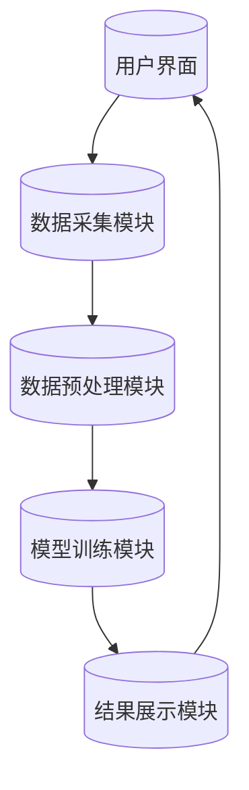

                 


# AI驱动的企业估值模型设计与实现

## 关键词
- 人工智能, 企业估值, 机器学习, 数据分析, 金融建模

## 摘要
AI驱动的企业估值模型是结合人工智能技术与金融建模的创新方法，旨在提高企业估值的准确性和效率。本文系统介绍AI驱动企业估值模型的设计原理、实现方法及应用场景，涵盖数据预处理、特征工程、模型选择及部署优化等关键环节，结合实际案例，深入探讨模型构建过程中的技术细节与实践技巧。

---

# 第一部分: AI驱动的企业估值模型背景与基础

## 第1章: 企业估值的基本概念与AI驱动的背景

### 1.1 企业估值的核心概念
- 1.1.1 企业估值的定义与意义
  - 企业估值是评估企业价值的过程，旨在确定企业的市场价值或内在价值。
  - 传统的估值方法包括DCF模型、相对估值法等，但存在数据依赖性强、主观性高、计算复杂等问题。
- 1.1.2 企业估值的关键影响因素
  - 财务指标：净利润、营收、毛利率等。
  - 市场因素：行业趋势、竞争环境、宏观经济状况。
  - 公司治理：管理团队、股权结构、企业战略。
- 1.1.3 企业估值的传统方法及其局限性
  - DCF模型：依赖于未来现金流的预测，假设条件严格。
  - 相对估值法：依赖可比公司数据，可能存在数据偏差。

### 1.2 AI驱动的企业估值模型的背景
- 1.2.1 人工智能在金融领域的应用现状
  - AI技术在金融领域的应用包括智能投顾、风险管理、信用评估等。
  - AI技术能够处理海量数据，发现传统方法难以捕捉的模式和规律。
- 1.2.2 企业估值模型的演变与挑战
  - 传统估值方法依赖人工经验和主观判断，难以应对复杂市场环境。
  - 数据爆炸和计算能力的提升为AI驱动的估值模型提供了技术基础。
- 1.2.3 AI驱动模型的优势与创新
  - 提高估值的准确性和效率。
  - 通过机器学习算法发现非线性关系，捕捉复杂市场中的潜在价值。

### 1.3 企业估值的核心要素与数据来源
- 1.3.1 企业财务数据
  - 财务报表数据：收入、利润、资产负债表等。
  - 财务指标：ROE、ROA、净利润率等。
- 1.3.2 市场数据与行业趋势
  - 市场指数、行业平均市盈率、可比公司估值等。
- 1.3.3 公司治理与管理团队
  - 股权结构、管理团队稳定性、企业战略。
- 1.3.4 宏观经济环境
  - 利率、通货膨胀、政策变化等宏观经济因素。

## 第2章: AI驱动的企业估值模型的核心概念

### 2.1 企业估值模型的构建逻辑
- 2.1.1 数据驱动的估值模型框架
  - 数据收集与清洗：从多个来源获取企业数据，清洗缺失值和异常值。
  - 特征工程：提取有用的特征，如财务指标、市场指标等。
  - 模型训练：基于机器学习算法训练估值模型。
  - 模型评估：通过回测和验证确保模型的准确性和稳定性。
- 2.1.2 基于AI的特征提取与建模
  - 使用自然语言处理技术分析公司新闻和公告。
  - 利用聚类算法识别行业趋势和市场风险。
- 2.1.3 模型的可解释性与鲁棒性
  - 可解释性：模型结果需要能够被理解和验证。
  - 鲁棒性：模型在数据变化和市场波动中的稳定性。

### 2.2 AI驱动模型的关键技术
- 2.2.1 机器学习算法在估值中的应用
  - 线性回归：用于简单的线性关系建模。
  - 随机森林：处理非线性关系和特征重要性分析。
  - 神经网络：用于复杂模式的识别和预测。
- 2.2.2 自然语言处理在企业信息分析中的应用
  - 分析公司公告、新闻报道，提取关键词和情感倾向。
- 2.2.3 时间序列分析与预测
  - 使用ARIMA、LSTM等模型预测市场趋势和企业业绩。

### 2.3 核心概念与联系
- 2.3.1 企业估值模型的ER实体关系图
```mermaid
er
    actor: 企业估值模型
    actor --> company: 企业
    actor --> financial_data: 财务数据
    actor --> market_data: 市场数据
    actor --> news: 新闻
    actor --> macro_economy: 宏观经济指标

    company --> financial_data
    company --> news
    macro_economy --> market_data
```

### 2.4 核心概念对比分析
| 概念 | 描述 | 数据来源 | 示例 |
|------|------|----------|------|
| 财务数据 | 企业的财务报表数据 | 财务报表、审计报告 | 收入、利润、资产 |
| 市场数据 | 市场指数、可比公司数据 | 金融数据供应商 | 标普500、行业平均PE |
| 新闻 | 公司公告、新闻报道 | 媒体、公告数据库 | 收购公告、业绩快报 |
| 宏观经济指标 | 宏观经济数据 | 政府统计、国际组织 | 利率、GDP增长率 |

---

# 第三部分: 算法原理与数学模型

## 第3章: 机器学习算法在企业估值中的应用

### 3.1 线性回归模型
- 3.1.1 线性回归的基本原理
  - 线性回归模型用于预测目标变量与特征变量之间的线性关系。
  - 模型公式：$$ y = \beta_0 + \beta_1 x_1 + \beta_2 x_2 + ... + \beta_n x_n + \epsilon $$
  - 其中，$y$ 是目标变量，$x_i$ 是特征变量，$\beta_i$ 是回归系数，$\epsilon$ 是误差项。

### 3.2 随机森林模型
- 3.2.1 随机森林的基本原理
  - 随机森林是一种基于决策树的集成学习算法。
  - 模型优势：能够处理高维数据，具有较强的抗过拟合能力。
  - 特征重要性分析：随机森林可以输出每个特征的重要性评分。

### 3.3 神经网络模型
- 3.3.1 神经网络的基本原理
  - 神经网络通过多层感知机（MLP）模拟非线性关系。
  - 模型结构：输入层、隐藏层、输出层。
  - 激活函数：ReLU、Sigmoid、Tanh等。

### 3.4 算法选择与优化
- 3.4.1 算法选择的依据
  - 数据特征：线性关系选择线性回归，非线性关系选择随机森林或神经网络。
  - 数据量：小数据集适合线性回归，大数据集适合随机森林。
  - 解释性要求：需要解释性时选择线性回归或随机森林。

---

# 第四部分: 系统分析与架构设计

## 第4章: AI驱动的企业估值系统架构

### 4.1 系统功能设计
- 4.1.1 数据采集模块
  - 数据来源：财务数据、市场数据、新闻数据。
  - 数据预处理：清洗、特征提取、标准化。
- 4.1.2 模型训练模块
  - 特征工程：特征选择、降维（PCA）。
  - 模型训练：选择合适的机器学习算法，训练估值模型。
- 4.1.3 结果展示模块
  - 可视化：展示估值结果、特征重要性、模型评估指标。

### 4.2 系统架构设计


---

# 第五部分: 项目实战与优化

## 第5章: 基于机器学习的企业估值系统实现

### 5.1 项目环境搭建
- 安装Python环境：使用Anaconda或virtualenv。
- 安装依赖库：numpy、pandas、scikit-learn、matplotlib。

### 5.2 系统核心实现
```python
import pandas as pd
from sklearn.ensemble import RandomForestRegressor
from sklearn.metrics import mean_squared_error

# 数据加载
data = pd.read_csv('enterprise_valuation.csv')

# 特征与目标分离
X = data.drop('target', axis=1)
y = data['target']

# 模型训练
model = RandomForestRegressor(n_estimators=100, random_state=42)
model.fit(X, y)

# 模型预测
y_pred = model.predict(X)

# 模型评估
mse = mean_squared_error(y, y_pred)
print(f'MSE: {mse}')
```

### 5.3 实际案例分析
- 选取实际企业数据，进行数据预处理、特征工程、模型训练和结果分析。

### 5.4 模型优化与调优
- 调整模型参数：如随机森林的n_estimators、max_depth。
- 使用交叉验证评估模型性能。
- 模型部署：将模型封装为API，供其他系统调用。

---

# 第六部分: 最佳实践与总结

## 第6章: 最佳实践与经验分享

### 6.1 数据预处理的关键技巧
- 数据清洗：处理缺失值、异常值。
- 特征工程：提取有意义的特征，降低维度。
- 数据标准化：处理不同量纲的特征。

### 6.2 模型选择与优化
- 根据数据特征选择合适的算法。
- 使用交叉验证评估模型性能。
- 避免过拟合：通过正则化、减少模型复杂度。

### 6.3 系统设计中的注意事项
- 数据安全：保护企业敏感数据。
- 系统性能：优化数据处理和模型推理的速度。
- 可扩展性：设计易于扩展的系统架构。

### 6.4 拓展阅读与学习资源
- 推荐书籍：《机器学习实战》、《深度学习入门》。
- 在线课程：Coursera上的相关课程。
- 开源项目：GitHub上的AI驱动金融项目。

---

# 结语

AI驱动的企业估值模型是金融领域的一项重要创新，通过机器学习算法和大数据技术，能够提高估值的准确性和效率。本文系统介绍了AI驱动企业估值模型的设计与实现过程，从数据预处理、特征工程到模型训练和部署，结合实际案例和代码示例，帮助读者掌握相关技术。未来，随着AI技术的不断发展，企业估值模型将更加智能化和精准化。

