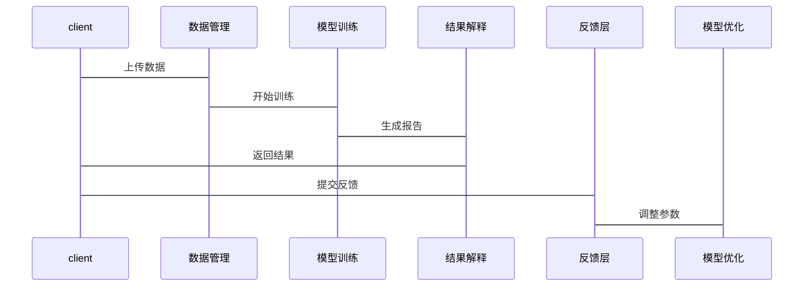

                 


---

# AI驱动的企业信用评级模型可解释性动态优化系统

## 关键词：企业信用评级，AI驱动，可解释性，动态优化，系统架构，算法实现

## 摘要：本文探讨了如何利用AI技术构建企业信用评级模型的可解释性动态优化系统，分析了传统模型的局限性，提出了基于机器学习和深度学习的创新算法，并详细阐述了系统的架构设计与实现方案，最后通过实际案例验证了系统的有效性和可扩展性。

---

## 第1章: 企业信用评级模型的背景与挑战

### 1.1 企业信用评级的定义与重要性

#### 1.1.1 企业信用评级的基本概念
企业信用评级是对企业在特定经济环境下的信用状况进行评估，旨在量化企业偿还债务的能力和意愿。它为债权人、投资者和其他利益相关者提供了重要的决策依据。

#### 1.1.2 信用评级在金融领域的作用
信用评级是金融风险管理的核心工具，直接影响企业的融资成本、市场准入和投资决策。高信用评级意味着企业更容易获得低成本资金，而低信用评级则可能导致融资困难。

#### 1.1.3 企业信用评级的分类与应用场景
企业信用评级可以分为内部评级和外部评级，应用场景包括贷款审批、债券发行、投资决策等。不同场景对评级模型的要求也有所不同，但核心目标是提高决策的准确性和效率。

### 1.2 当前信用评级模型的局限性

#### 1.2.1 传统信用评级模型的不足
传统信用评级模型通常基于简单的财务指标和统计分析，难以捕捉企业复杂经营状况中的非线性关系。此外，这些模型的可解释性较差，导致决策者难以理解评级结果背后的逻辑。

#### 1.2.2 模型黑箱化带来的问题
传统模型的“黑箱”特性使得企业在发现问题时难以进行有效的调整和优化，增加了决策风险。特别是在金融行业，模型的不可解释性可能导致信任缺失和合规问题。

#### 1.2.3 可解释性对企业信用评级的重要性
可解释性是企业信用评级模型的核心要求之一。只有当模型结果能够被决策者理解和信任时，才能真正支持企业的风险管理和发展战略。

### 1.3 AI驱动的信用评级模型的优势

#### 1.3.1 AI技术在信用评级中的应用潜力
AI技术，特别是机器学习和深度学习，能够处理海量数据，发现传统模型难以捕捉的复杂模式。这些技术可以显著提高信用评级的准确性和精细度。

#### 1.3.2 可解释性动态优化系统的提出
通过结合可解释性与动态优化，AI驱动的信用评级模型可以在保持高精度的同时，提供透明的结果解释，满足监管要求和企业需求。

#### 1.3.3 系统的目标与核心价值
本系统的开发目标是构建一个动态优化的企业信用评级模型，通过AI技术实现高精度、高可解释性和强适应性的评级系统，支持企业的风险管理与战略决策。

---

## 第2章: 可解释性动态优化系统的概念与架构

### 2.1 可解释性动态优化系统的定义

#### 2.1.1 系统的核心概念
可解释性动态优化系统是一种基于AI技术的信用评级模型，通过动态调整模型参数和结构，确保模型不仅准确，而且结果具有可解释性。

#### 2.1.2 系统的边界与外延
系统的边界包括输入数据、模型算法、输出结果和用户界面。外延则涉及模型的动态优化、结果解释和用户反馈机制。

#### 2.1.3 系统的核心要素与组成
系统主要由数据预处理模块、特征提取模块、模型训练模块、动态优化模块和结果解释模块组成，各模块协同工作以实现信用评级的目标。

### 2.2 系统的架构设计

#### 2.2.1 系统的整体架构图
系统架构分为数据层、算法层、业务层和用户层。数据层负责数据的采集与存储，算法层包括特征提取和模型训练，业务层处理评级逻辑，用户层提供交互界面。

#### 2.2.2 各模块的功能与交互关系
数据预处理模块清洗和标准化数据，特征提取模块提取关键特征，模型训练模块基于机器学习算法进行训练，动态优化模块根据反馈调整模型，结果解释模块将结果转化为可理解的形式。

#### 2.2.3 系统的灵活性与可扩展性
系统架构采用模块化设计，各模块之间具有良好的接口和互操作性，支持后续的功能扩展和性能优化。

### 2.3 可解释性与动态优化的实现机制

#### 2.3.1 可解释性的实现方法
通过模型的特征重要性分析和规则提取，系统能够解释每个评级结果的依据，增强用户的信任感。

#### 2.3.2 动态优化的实现策略
系统采用在线学习和反馈机制，根据实时数据和用户反馈动态调整模型参数，确保模型始终保持最优性能。

#### 2.3.3 两者的协同作用
可解释性和动态优化相辅相成，前者提高了模型的透明度，后者增强了模型的适应性和准确性，共同推动信用评级系统的发展。

---

## 第3章: 系统的核心算法原理

### 3.1 算法概述

#### 3.1.1 数据预处理
数据预处理包括数据清洗、缺失值处理、异常值处理和特征工程。通过这些步骤，确保输入数据的质量和适用性。

#### 3.1.2 特征提取
特征提取是利用机器学习技术从原始数据中提取有价值的特征，如使用PCA进行降维，或使用文本挖掘技术处理非结构化数据。

#### 3.1.3 模型训练
基于深度学习的模型，如LSTM和Transformer，用于捕捉数据中的复杂模式。模型训练采用端到端的方式，优化目标函数以最小化预测误差。

#### 3.1.4 模型评估与优化
通过交叉验证和网格搜索，选择最优模型参数。评估指标包括准确率、召回率和F1分数，确保模型的性能达到最佳状态。

### 3.2 算法实现细节

#### 3.2.1 使用的机器学习算法
系统采用集成学习算法，如随机森林和梯度提升树，以及深度学习算法，如BERT和Transformer，以提高模型的泛化能力和解释性。

#### 3.2.2 算法的数学模型
模型的损失函数可以表示为：
$$
L = \sum_{i=1}^{n} (y_i - \hat{y_i})^2
$$
其中，$y_i$ 是真实标签，$\hat{y_i}$ 是预测标签。

优化目标是最小化损失函数，采用Adam优化器：
$$
\theta_{t+1} = \theta_t - \eta \frac{\partial L}{\partial \theta_t}
$$
其中，$\theta$ 是模型参数，$\eta$ 是学习率。

#### 3.2.3 算法的实现步骤
1. 数据预处理：清洗和标准化数据。
2. 特征提取：选择关键特征或使用自动编码器提取特征。
3. 模型训练：基于选定的算法训练模型。
4. 模型评估：计算各项指标，调整参数。
5. 动态优化：根据反馈实时调整模型。

### 3.3 算法实现的代码示例

```python
import pandas as pd
from sklearn.ensemble import RandomForestClassifier
from sklearn.metrics import accuracy_score, classification_report

# 数据加载
data = pd.read_csv('credit_data.csv')

# 特征工程
X = data.drop('target', axis=1)
y = data['target']

# 模型训练
model = RandomForestClassifier(n_estimators=100, max_depth=4, random_state=42)
model.fit(X, y)

# 模型预测
y_pred = model.predict(X)

# 模型评估
print(accuracy_score(y, y_pred))
print(classification_report(y, y_pred))
```

---

## 第4章: 系统分析与架构设计方案

### 4.1 系统应用场景

#### 4.1.1 信用评级的主要场景
系统适用于企业贷款审批、债券评级、投资决策等领域，特别是在金融监管严格的环境中，可解释性是合规的重要要求。

#### 4.1.2 企业的核心需求
企业需要高精度、高透明度的信用评级模型，支持动态调整和实时反馈，以应对市场变化和风险控制。

### 4.2 系统功能设计

#### 4.2.1 领域模型
领域模型通过类图展示系统的功能模块，包括数据管理、模型训练、结果解释等。


#### 4.2.2 系统架构设计


#### 4.2.3 系统接口设计
系统提供API接口，支持RESTful风格，方便其他系统集成。主要接口包括数据上传、模型训练、结果查询和反馈提交。

#### 4.2.4 系统交互流程



---

## 第5章: 项目实战

### 5.1 环境安装与配置

#### 5.1.1 安装Python环境
安装Python 3.8及以上版本，建议使用Anaconda或虚拟环境管理。

#### 5.1.2 安装依赖库
安装必要的库，如scikit-learn、xgboost、pandas、mermaid等。

### 5.2 系统核心实现

#### 5.2.1 数据预处理代码
```python
import pandas as pd
from sklearn.impute import SimpleImputer
from sklearn.preprocessing import StandardScaler

# 加载数据
data = pd.read_csv('credit_data.csv')

# 处理缺失值
imp = SimpleImputer(missing_values=np.nan, strategy='mean')
imp.fit(data[['revenue', 'profit']])
data[['revenue', 'profit']] = imp.transform(data[['revenue', 'profit']])

# 标准化处理
scaler = StandardScaler()
data[['revenue', 'profit']] = scaler.fit_transform(data[['revenue', 'profit']])
```

#### 5.2.2 特征提取与模型训练
```python
from sklearn.ensemble import GradientBoostingClassifier
from sklearn.metrics import roc_auc_score

# 特征选择
selected_features = ['revenue', 'profit', 'debt', 'assets']
X = data[selected_features]
y = data['target']

# 模型训练
model = GradientBoostingClassifier(n_estimators=50, learning_rate=0.05, random_state=42)
model.fit(X, y)

# 模型评估
y_proba = model.predict_proba(X)[:, 1]
print(f"ROC AUC: {roc_auc_score(y, y_proba)}")
```

#### 5.2.3 结果解释与动态优化
通过SHAP值分析模型的特征重要性，并根据用户反馈调整模型参数，实现动态优化。

### 5.3 实际案例分析

#### 5.3.1 案例背景
某制造企业希望优化其信用评级模型，提高模型的准确性和透明度。

#### 5.3.2 数据准备
收集过去三年的企业财务数据和市场表现数据，清洗和标准化后用于模型训练。

#### 5.3.3 模型训练与评估
采用XGBoost模型进行训练，评估指标包括准确率、召回率和F1分数。

#### 5.3.4 动态优化与结果解释
根据模型预测结果和企业反馈，调整模型参数，优化特征选择，提高模型性能。

---

## 第6章: 最佳实践与小结

### 6.1 关键点总结

#### 6.1.1 系统设计的关键点
- 数据预处理的全面性
- 特征提取的有效性
- 模型选择的合理性
- 结果解释的清晰性

#### 6.1.2 算法实现的关键点
- 选择合适的模型架构
- 设定合理的超参数
- 优化损失函数和评估指标
- 处理数据稀疏性和不平衡性

### 6.2 实用建议

#### 6.2.1 数据管理建议
- 定期更新数据，保持数据的时效性
- 建立数据质量监控机制，确保数据的准确性
- 采用数据加密和访问控制，保护数据安全

#### 6.2.2 模型优化建议
- 根据业务需求选择合适的模型
- 定期进行模型再训练和更新
- 结合领域知识优化特征选择
- 利用反馈机制动态调整模型参数

### 6.3 注意事项

#### 6.3.1 数据隐私与合规性
- 确保数据收集和使用符合相关法律法规
- 建立数据使用授权机制，防止数据泄露
- 定期进行数据安全审计，确保数据安全

#### 6.3.2 模型可解释性与透明度
- 提供详细的模型解释报告，增强用户信任
- 设计友好的用户界面，便于用户理解模型结果
- 建立反馈渠道，及时响应用户问题和建议

### 6.4 拓展阅读

#### 6.4.1 推荐书籍
- 《机器学习实战》
- 《深度学习》
- 《可解释的人工智能：理论、方法与应用》

#### 6.4.2 推荐博客与资源
- Towards Data Science
- Medium上的AI与机器学习文章
- Kaggle上的信用评分相关项目

---

## 结语

AI驱动的企业信用评级模型可解释性动态优化系统通过结合先进的人工智能技术，解决了传统模型的局限性，提高了信用评级的准确性和透明度。随着技术的不断进步和应用场景的拓展，这种系统将在金融领域发挥越来越重要的作用，为企业风险管理与决策支持提供强有力的支持。

