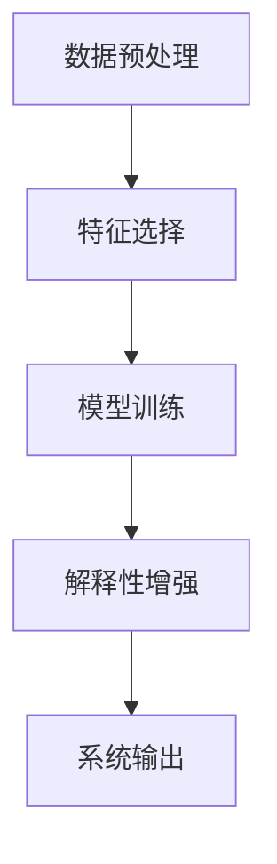
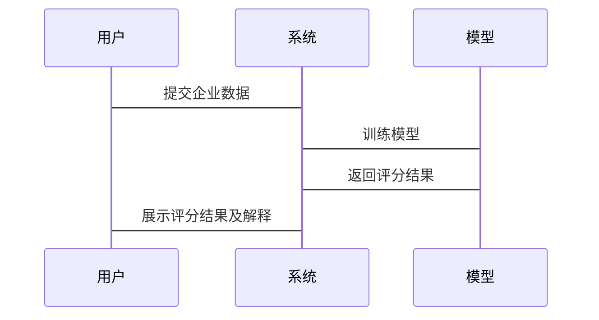

                 


# AI驱动的企业信用评级模型可解释性增强系统

> 关键词：AI驱动、企业信用评级、可解释性增强、机器学习、信用评分、系统设计

> 摘要：本文深入探讨了AI驱动的企业信用评级模型中的可解释性增强系统。通过分析传统信用评级的局限性，结合AI技术的优势，提出了一种基于机器学习的信用评级模型，并重点阐述了如何通过可解释性增强技术提升模型的透明度和可信度。文章详细介绍了模型的设计原理、算法实现、系统架构以及项目实战，旨在为企业信用评级提供一种更加智能和透明的解决方案。

---

# 第一部分: 背景与核心概念

## 第1章: 企业信用评级的背景与意义

### 1.1 传统信用评级的局限性
传统的信用评级方法主要依赖于财务指标和人工经验判断，存在以下问题：
- **主观性**：评级结果受到主观判断的影响，缺乏客观性。
- **复杂性**：企业信用涉及多维度因素，传统方法难以全面捕捉。
- **不可解释性**：复杂的模型难以向决策者解释评级结果的原因。

### 1.2 AI技术在信用评级中的应用潜力
AI技术的引入为信用评级带来了新的可能性：
- **数据处理能力**：AI能够处理海量数据，发现传统方法难以察觉的规律。
- **自动化与智能化**：AI模型可以自动化地进行特征提取、权重计算和评分。
- **可解释性增强**：通过技术手段，AI模型可以提供更透明的解释。

### 1.3 可解释性增强的重要性
在企业信用评级中，可解释性是决策者信任模型的关键因素。模型的可解释性直接影响评级结果的合法性和可操作性。

---

## 第2章: 可解释性增强的核心概念

### 2.1 可解释性在AI模型中的重要性
- **透明性**：模型的决策过程需要清晰明了，便于理解。
- **可信性**：可解释性增强模型的可信度，提升用户信任。
- **合规性**：在金融领域，可解释性是合规的重要条件。

### 2.2 企业信用评级中的可解释性需求
- **特征重要性**：需要明确每个特征对评级结果的影响程度。
- **评分依据**：需要解释评分是如何计算的，以及每个特征的权重。
- **异常检测**：需要理解模型如何识别异常数据。

### 2.3 可解释性增强系统的基本原理
- **特征选择**：通过分析特征的重要性，筛选关键因素。
- **层次化解释**：从整体到局部，逐步分解模型的决策过程。
- **可视化工具**：通过图表等方式，直观展示模型的解释。

---

# 第二部分: AI驱动的信用评级模型算法原理

## 第3章: 基于机器学习的信用评级模型

### 3.1 传统机器学习模型
- **逻辑回归**：用于分类问题，输出概率值。
- **随机森林**：通过投票机制进行分类，适合处理多维数据。
- **支持向量机**：适用于高维数据的分类。

### 3.2 深度学习模型
- **神经网络**：通过多层网络结构提取特征。
- **长短期记忆网络（LSTM）**：适合处理时间序列数据。
- **梯度提升树（GBDT）**：结合树模型的优势，提升精度。

### 3.3 混合模型的优势与挑战
- **优势**：结合多种模型的优势，提升准确性和可解释性。
- **挑战**：模型复杂度增加，可解释性可能下降。

---

## 第4章: 可解释性增强的算法实现

### 4.1 解释性特征分析
- **特征重要性排序**：通过模型内部权重或特征贡献度进行排序。
- **SHAP值**：基于游戏理论的特征重要性解释方法。
- **LIME解释**：通过局部拟合解释模型的预测结果。

### 4.2 层次化解释模型
- **整体解释**：从宏观角度解释模型的评分逻辑。
- **局部解释**：针对单个预测结果进行详细解释。
- **对比分析**：通过对比不同特征对评分的影响，增强解释性。

### 4.3 可视化解释工具
- **特征权重可视化**：通过柱状图展示特征重要性。
- **评分分布图**：展示不同评分区间的企业分布情况。
- **决策树可视化**：通过树状图展示模型的决策过程。

---

## 第5章: 算法实现的数学模型与公式

### 5.1 信用评分函数的数学表达
$$ \text{Credit Score} = w_1x_1 + w_2x_2 + \dots + w_nx_n $$

其中：
- $w_i$ 表示第$i$个特征的权重。
- $x_i$ 表示第$i$个特征的值。

### 5.2 解释性权重的计算公式
$$ \text{Explanation Weight} = \frac{\partial \text{Credit Score}}{\partial x_i} $$

---

# 第三部分: 系统设计与实现

## 第6章: 可解释性增强系统的架构设计

### 6.1 系统功能设计
- **数据采集与预处理**：获取企业数据并进行清洗。
- **模型构建与训练**：基于机器学习算法构建信用评级模型。
- **解释性增强模块**：计算特征重要性并生成可视化解释。
- **系统输出与反馈**：输出评级结果并提供解释。

### 6.2 系统架构图


### 6.3 系统交互图


---

## 第7章: 项目实战与案例分析

### 7.1 环境配置
```python
# 环境配置代码示例
import numpy as np
import pandas as pd
from sklearn.ensemble import RandomForestClassifier
from sklearn.metrics import accuracy_score
from lime.lime_explainer import LimeExplainer
```

### 7.2 核心代码实现
```python
# 示例代码
class CreditRatingModel:
    def __init__(self):
        self.model = RandomForestClassifier()
        self.explainer = LimeExplainer()

    def train(self, features, labels):
        self.model.fit(features, labels)
        return self.model

    def explain(self, instance, feature_names):
        explanation = self.explainer.explain_instance(
            instance, self.model.predict_proba, 
            feature_names=feature_names
        )
        return explanation.as_list()
```

### 7.3 案例分析
- **数据准备**：收集企业的财务数据、市场表现等特征。
- **模型训练**：使用随机森林模型进行训练。
- **解释性分析**：通过LIME解释模型的预测结果，展示特征的重要性和影响程度。

---

## 第8章: 总结与展望

### 8.1 总结
本文详细介绍了AI驱动的企业信用评级模型可解释性增强系统的设计与实现。通过结合机器学习算法和可解释性增强技术，提出了一种高效、透明的信用评级解决方案。

### 8.2 展望
未来的研究方向包括：
1. **更复杂的模型**：探索更深度的神经网络模型，提升模型的准确性。
2. **动态解释性增强**：实时更新模型的解释性特征，适应数据变化。
3. **多模态数据融合**：结合文本、图像等多模态数据，提升模型的综合判断能力。

---

## 附录: 注意事项

1. **数据隐私**：在处理企业数据时，需严格遵守数据隐私保护法规。
2. **模型实时性**：在实际应用中，需考虑模型的实时性问题。
3. **模型更新**：定期更新模型，确保其适应市场变化。

---

通过本文的系统设计与实现，企业可以利用AI技术构建更加智能和透明的信用评级系统，从而提升决策的准确性和可信度。

