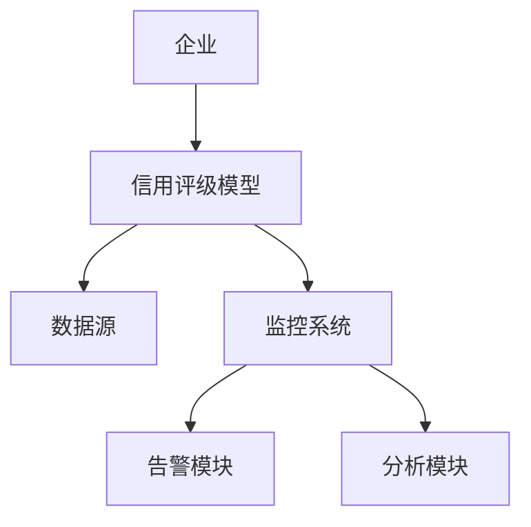
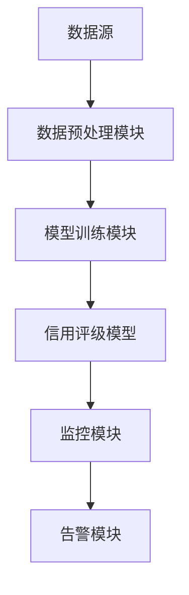
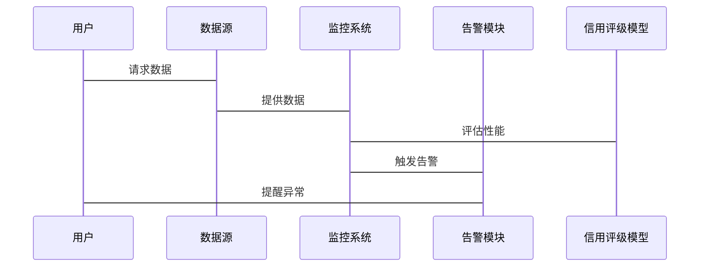

                 


# AI驱动的企业信用评级模型性能监控系统

> 关键词：企业信用评级、AI驱动、性能监控、机器学习、信用风险

> 摘要：本文将探讨如何利用人工智能技术构建企业信用评级模型的性能监控系统。通过分析信用评级模型的性能特征，结合实时数据监控和异常检测算法，提出一种基于AI的监控方案，旨在提升信用评级模型的准确性和可靠性，降低信用风险。本文将详细讲解系统的背景、核心概念、算法原理、系统架构，并通过实际案例展示系统的实现与应用。

---

# 第一部分: 企业信用评级与AI驱动监控的背景

## 第1章: 企业信用评级的现状与挑战

### 1.1 传统信用评级方法的局限性
- 传统信用评级方法依赖于财务指标和人工经验，存在主观性和滞后性。
- 数据来源单一，难以捕捉企业动态风险因素。
- 信用评分模型缺乏实时更新机制，难以应对市场变化。

### 1.2 企业信用风险的复杂性
- 企业经营环境复杂多变，信用风险受多种因素影响，如经济周期、行业波动等。
- 数据维度有限，难以全面评估企业的信用状况。
- 传统模型难以识别复杂的关联风险。

### 1.3 AI技术在信用评级中的潜力
- AI技术能够处理海量数据，提取非线性特征，提升模型的预测能力。
- 通过实时数据分析，实现信用风险的早期预警。
- 结合自然语言处理技术，挖掘企业非结构化信息，丰富信用评估维度。

### 1.4 本章小结
- 介绍了传统信用评级方法的局限性，分析了企业信用风险的复杂性，阐述了AI技术在信用评级中的潜力。

---

## 第2章: AI驱动监控系统的概念与目标

### 2.1 监控系统的定义与核心目标
- 监控系统：对信用评级模型的性能进行实时监控，识别模型失效或性能下降的情况，提供及时的告警和优化建议。
- 核心目标：提升信用评级模型的准确性和稳定性，降低信用风险。

### 2.2 AI在信用评级模型监控中的作用
- 数据处理：利用AI技术对海量数据进行清洗、整合和特征提取。
- 模型监控：通过机器学习算法实时监控模型的性能变化。
- 异常检测：识别模型预测结果中的异常，及时发现潜在风险。

### 2.3 系统的边界与外延
- 系统边界：仅关注信用评级模型的性能监控，不涉及模型的训练和部署。
- 系统外延：可以与其他企业管理系统集成，提供全面的信用风险管理解决方案。

### 2.4 本章小结
- 明确了AI驱动监控系统的定义和目标，分析了其在信用评级中的作用。

---

# 第二部分: 核心概念与系统架构

## 第3章: 核心概念与系统架构

### 3.1 核心概念与定义
- 数据源：包括企业的财务数据、交易数据、市场数据等。
- 模型训练：基于历史数据训练信用评级模型，生成信用评分。
- 监控系统：实时采集数据，评估模型的预测能力，识别异常情况。

### 3.2 核心概念之间的关系
- 数据源为模型训练提供输入，模型输出信用评分，监控系统对评分进行实时监控。

### 3.3 实体关系图（ER图）



---

## 第4章: 系统架构与功能设计

### 4.1 系统功能模块
- 数据采集模块：实时采集企业数据，清洗和预处理。
- 模型训练模块：基于历史数据训练信用评级模型。
- 监控模块：实时监控模型性能，识别异常。
- 告警模块：根据监控结果触发告警。

### 4.2 系统架构设计



### 4.3 系统交互流程



---

## 第5章: 算法原理与实现

### 5.1 时间序列分析
- 使用ARIMA模型对信用评分进行时间序列分析，预测未来的信用评分。

```latex
$$ ARIMA(p, d, q) $$
```

### 5.2 异常检测算法
- 使用Isolation Forest算法识别异常评分。

```python
import numpy as np
from sklearn.ensemble import IsolationForest

# 示例数据
X = np.random.rand(100, 1)
model = IsolationForest(random_state=42)
model.fit(X)
```

### 5.3 模型性能评估
- 使用准确率、召回率和F1分数评估模型性能。

$$
准确率 = \frac{正确预测的样本数}{总样本数}
$$

$$
召回率 = \frac{正确预测的正类样本数}{实际正类样本数}
$$

$$
F1分数 = \frac{2 \times 准确率 \times 召回率}{准确率 + 召回率}
$$

---

## 第6章: 项目实战与案例分析

### 6.1 项目环境安装
- 安装必要的Python库：numpy、pandas、scikit-learn、tensorflow等。

### 6.2 核心代码实现
- 数据预处理代码：

```python
import pandas as pd
from sklearn.preprocessing import StandardScaler

# 数据加载
data = pd.read_csv('credit_data.csv')

# 数据清洗
data.dropna(inplace=True)

# 特征提取
X = data[['revenue', 'profit', 'debt']]
y = data['credit_score']

# 标准化
scaler = StandardScaler()
X_scaled = scaler.fit_transform(X)
```

- 模型训练代码：

```python
from sklearn.linear_model import LogisticRegression

model = LogisticRegression()
model.fit(X_scaled, y)
```

### 6.3 案例分析
- 使用实际数据集进行模型训练和监控，展示系统的实际应用效果。

---

## 第7章: 总结与展望

### 7.1 总结
- 本文提出了基于AI的企业信用评级模型监控系统，详细讲解了系统的架构和实现。

### 7.2 展望
- 进一步优化模型性能，提升异常检测的准确性。
- 研究多模型联合监控的方法，增强系统的鲁棒性。

---

## 第8章: 最佳实践与注意事项

### 8.1 最佳实践
- 定期更新模型，保持其预测能力。
- 结合领域知识，选择合适的特征和算法。

### 8.2 注意事项
- 注意数据隐私和安全问题。
- 定期监控系统性能，确保其稳定运行。

---

## 第9章: 拓展阅读与参考文献

### 9.1 拓展阅读
- 推荐阅读相关领域的最新研究论文和技术博客。

### 9.2 参考文献
- 列出本文引用的主要文献和资料。

---

通过以上目录结构，本文将系统地介绍AI驱动的企业信用评级模型性能监控系统的核心概念、算法原理、系统架构和实际应用，帮助读者全面理解和掌握该领域的技术细节。

