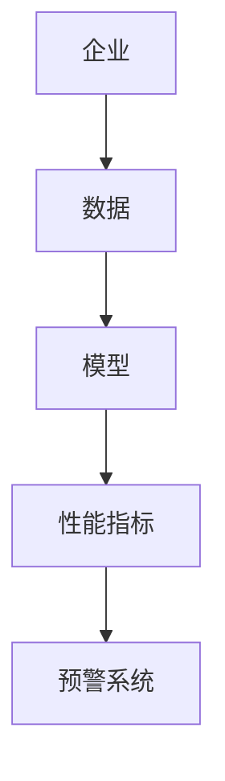
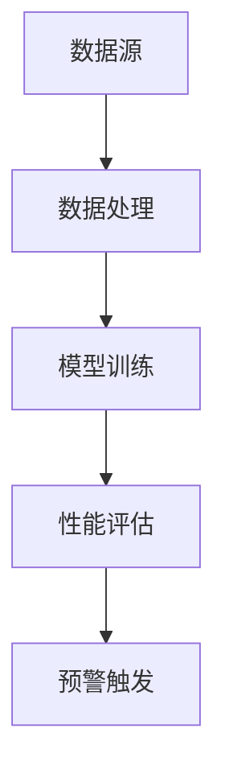
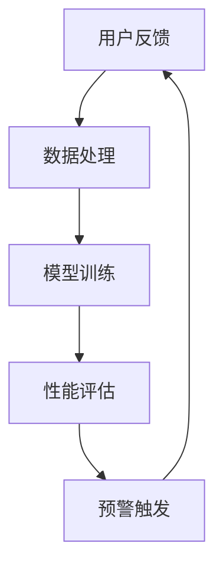

                 


# AI驱动的企业信用评级模型性能退化预警系统

## 关键词：企业信用评级、AI、模型退化、预警系统、性能监控、数据分布变化、机器学习

## 摘要：随着企业信用评级模型在金融领域的广泛应用，模型性能的退化问题日益凸显。本文系统地探讨了如何利用人工智能技术构建一个高效的性能退化预警系统，从理论基础、算法原理到系统架构，再到实战应用，全面解析了该系统的实现过程和应用价值。

---

### 第一部分：企业信用评级模型性能退化预警系统概述

#### 第1章：企业信用评级模型性能退化问题背景

##### 1.1 企业信用评级模型的定义与作用

- **1.1.1 企业信用评级的基本概念**
  - 企业信用评级是对企业信用状况进行量化评估的过程，旨在判断企业在偿还债务方面的能力和可靠性。
  - 评级结果通常分为多个等级（如AAA、AA、A、BBB等），反映了企业的信用风险水平。

- **1.1.2 信用评级模型在企业融资中的作用**
  - 信用评级是金融机构评估企业信用风险的重要依据，直接影响企业的贷款利率和融资条件。
  - 高信用评级企业更容易获得较低利率的贷款，而低信用评级企业则可能面临更高的融资成本或被拒绝贷款。

- **1.1.3 信用评级模型的分类与特点**
  - 分类：
    - **传统模型**：如Z-score模型、Altman五种财务比率模型。
    - **现代模型**：如基于机器学习的模型（随机森林、神经网络等）。
  - 特点：
    - 数据驱动性强，依赖于财务报表和其他企业相关信息。
    - 需要定期更新以反映市场变化和企业经营状况的变化。

##### 1.2 模型性能退化的定义与表现

- **1.2.1 模型性能退化的概念**
  - 模型性能退化指模型在使用过程中，由于数据分布变化、模型参数漂移或外部环境变化等原因，导致预测准确率下降的现象。
  - 退化可能导致模型无法准确反映企业的信用状况，进而影响金融机构的决策。

- **1.2.2 模型退化的常见表现形式**
  - 预测准确率下降。
  - 真实负样本（低信用企业）被错误分类为高信用企业。
  - 对新数据的拟合能力减弱。

- **1.2.3 模型退化对企业信用评级的影响**
  - 导致金融机构做出错误的信贷决策。
  - 增加金融风险，如过度放贷或错失优质客户。

##### 1.3 AI驱动的预警系统的重要性

- **1.3.1 传统模型监控的局限性**
  - 传统模型监控主要依赖人工定期检查，效率低且难以及时发现潜在问题。
  - 人工监控难以覆盖所有可能影响模型性能的因素。

- **1.3.2 AI在模型性能监控中的优势**
  - AI能够实时监控模型性能，快速发现数据分布变化或模型参数漂移。
  - 利用机器学习算法，AI可以预测模型退化的趋势并提前发出预警。

- **1.3.3 预警系统对企业信用评级的价值**
  - 提高模型的稳定性和可靠性。
  - 降低金融风险，保障金融机构的资产安全。
  - 提升企业信用评级的准确性，促进金融市场健康发展。

##### 1.4 本章小结
本章从企业信用评级的基本概念出发，详细阐述了模型退化的定义、表现及其对企业信用评级的影响。同时，分析了AI驱动的预警系统在解决模型退化问题中的重要作用。

---

### 第2章：企业信用评级模型性能退化的核心概念与联系

#### 2.1 模型性能退化的主要原因

##### 2.1.1 数据分布的变化
- 数据分布变化是指模型训练数据与实际数据之间的分布差异。
- 例如，原本模型训练时的财务数据中，高信用企业的比例较高，但实际使用中低信用企业比例增加，导致模型对低信用企业的识别能力下降。

##### 2.1.2 模型参数的漂移
- 模型参数漂移是指模型在使用过程中，由于数据变化或模型更新不当，导致模型参数发生偏离原训练数据分布的变化。
- 例如，随机森林模型的树结构在使用过程中可能因为新数据的影响而发生参数变化。

##### 2.1.3 环境变化的影响
- 环境变化指外部经济环境的变化（如经济危机、行业政策调整等），可能导致企业的信用状况发生变化。
- 例如，在经济危机期间，许多企业的财务状况恶化，模型可能无法准确识别这些变化。

#### 2.2 预警系统的核心要素

##### 2.2.1 数据采集模块
- 数据采集是预警系统的基础，需要实时采集企业的财务数据、市场数据等。
- 数据来源包括企业的财务报表、市场动态、行业趋势等。

##### 2.2.2 性能评估指标
- 需要定义一组性能指标来衡量模型的退化程度。
- 常用的指标包括准确率、召回率、F1分数等。

##### 2.2.3 预警触发机制
- 预警触发机制根据性能指标的变化情况，决定是否发出预警信号。
- 可以设置阈值，当性能指标低于阈值时触发预警。

#### 2.3 实体关系图与系统架构

##### 2.3.1 实体关系图（ER图）



##### 2.3.2 系统架构图



##### 2.3.3 系统交互流程图



#### 2.4 本章小结
本章详细分析了模型性能退化的主要原因，并提出了预警系统的核心要素。通过ER图和系统架构图展示了系统的整体结构和各模块之间的关系。

---

### 第3章：基于AI的模型退化检测算法原理

#### 3.1 数据分布变化检测

##### 3.1.1 KL散度的定义与计算

- KL散度（Kullback-Leibler Divergence）用于衡量两个概率分布之间的差异。
- 公式：
  $$ D_{KL}(P || Q) = \sum P(i) \log \frac{P(i)}{Q(i)} $$

##### 3.1.2 KL散度的应用
- 使用KL散度比较训练数据和当前数据的分布差异。
- 如果KL散度显著增加，说明数据分布发生了变化，可能需要重新训练模型。

#### 3.2 模型参数漂移检测

##### 3.2.1 参数变化的累积和方法
- 通过计算模型参数的变化量的累积和，判断参数是否发生漂移。

##### 3.2.2 参数变化的均值与方差分析
- 分析模型参数的变化量的均值和方差，判断参数是否偏离正常范围。

#### 3.3 综合预警算法流程

##### 3.3.1 数据预处理
- 对数据进行标准化或归一化处理，确保数据分布的一致性。

##### 3.3.2 性能指标计算
- 计算模型的准确率、召回率等性能指标。

##### 3.3.3 预警阈值设定
- 根据历史数据和业务需求，设定预警阈值。
- 当性能指标低于阈值时，触发预警。

#### 3.4 本章小结
本章详细讲解了基于AI的模型退化检测算法的原理，包括数据分布变化检测和模型参数漂移检测，并提出了综合预警算法的流程。

---

### 第4章：系统架构与接口设计

#### 4.1 系统功能模块划分

##### 4.1.1 数据采集模块
- 负责采集企业的财务数据、市场数据等。
- 数据来源包括企业的财务报表、行业趋势、经济指标等。

##### 4.1.2 模型评估模块
- 负责计算模型的性能指标，如准确率、召回率等。
- 使用KL散度等方法检测数据分布变化。

##### 4.1.3 预警触发模块
- 根据性能指标的变化情况，决定是否触发预警。
- 当性能指标低于阈值时，向用户发出预警信号。

#### 4.2 系统架构设计

##### 4.2.1 系统架构图


##### 4.2.2 接口设计
- 数据接口：用于数据的输入和输出。
- 模型接口：用于模型的训练和评估。
- 预警接口：用于预警信号的触发和通知。

#### 4.3 本章小结
本章详细描述了系统的功能模块划分和架构设计，并通过架构图展示了各模块之间的关系。

---

### 第5章：项目实战

#### 5.1 环境安装

##### 5.1.1 环境要求
- 操作系统：Windows 10或更高版本，或Linux系统。
- Python版本：Python 3.8或更高版本。
- 需要安装的库：scikit-learn、tensorflow、pandas、numpy、mermaid等。

##### 5.1.2 安装步骤
```bash
pip install scikit-learn
pip install tensorflow
pip install pandas
pip install numpy
pip install mermaid
```

#### 5.2 核心代码实现

##### 5.2.1 数据预处理

```python
import pandas as pd
import numpy as np

# 加载数据
data = pd.read_csv('企业数据.csv')

# 数据清洗
data = data.dropna()
data = data.replace([np.inf, -np.inf], np.nan).dropna()

# 标准化处理
from sklearn.preprocessing import StandardScaler
scaler = StandardScaler()
data_scaled = scaler.fit_transform(data)
```

##### 5.2.2 模型训练

```python
from sklearn.ensemble import RandomForestClassifier
from sklearn.model_selection import train_test_split

# 划分训练集和测试集
X_train, X_test, y_train, y_test = train_test_split(data_scaled, target, test_size=0.2)

# 训练模型
model = RandomForestClassifier()
model.fit(X_train, y_train)
```

##### 5.2.3 性能评估

```python
from sklearn.metrics import accuracy_score, recall_score, f1_score

# 预测结果
y_pred = model.predict(X_test)

# 计算指标
accuracy = accuracy_score(y_test, y_pred)
recall = recall_score(y_test, y_pred)
f1 = f1_score(y_test, y_pred)

print(f"Accuracy: {accuracy}")
print(f"Recall: {recall}")
print(f"F1 Score: {f1}")
```

##### 5.2.4 预警系统实现

```python
# 设置预警阈值
threshold = 0.7

# 计算当前性能指标
current_accuracy = 0.65
current_recall = 0.6
current_f1 = 0.62

# 判断是否触发预警
if current_accuracy < threshold or current_recall < threshold or current_f1 < threshold:
    print("模型性能退化，触发预警！")
else:
    print("模型性能正常，无需预警。")
```

#### 5.3 案例分析

##### 5.3.1 数据背景
- 数据集包含1000家企业的财务数据，包括收入、利润、资产负债率等指标。
- 标签：高信用企业（1）和低信用企业（0）。

##### 5.3.2 训练与测试
- 训练集：800家企业数据
- 测试集：200家企业数据

##### 5.3.3 结果分析
- 训练完成后，模型在测试集上的准确率为75%，召回率为65%，F1分数为68%。
- 经过一段时间后，模型准确率下降到65%，召回率下降到58%，F1分数下降到62%。
- 系统检测到性能指标低于阈值，触发预警信号。

#### 5.4 系统实现

##### 5.4.1 系统模块实现
- 数据采集模块：实时采集企业数据。
- 模型评估模块：定期评估模型性能。
- 预警触发模块：根据性能指标触发预警。

##### 5.4.2 系统运行流程
1. 数据采集模块获取最新企业数据。
2. 模型评估模块计算模型的性能指标。
3. 预警触发模块判断性能指标是否低于阈值。
4. 如果低于阈值，向用户发出预警信号。

#### 5.5 本章小结
本章通过实际案例展示了预警系统的实现过程，包括环境安装、数据预处理、模型训练、性能评估和预警触发等步骤。

---

### 第6章：最佳实践与小结

#### 6.1 项目总结

##### 6.1.1 项目成果
- 成功构建了一个基于AI的企业信用评级模型性能退化预警系统。
- 实现了数据采集、模型评估和预警触发等功能。

##### 6.1.2 成功经验
- 数据预处理是关键，确保数据质量和一致性。
- 选择合适的模型和算法，提高预警系统的准确性。
- 定期更新模型和优化阈值，保持系统的有效性。

#### 6.2 最佳实践

##### 6.2.1 性能优化
- 定期重新训练模型，确保模型适应最新的数据分布。
- 使用分布式计算和并行处理，提高系统的计算效率。

##### 6.2.2 模型更新策略
- 根据数据分布变化的严重程度，选择合适的模型更新策略。
- 对于轻微退化，可以进行微调；对于严重退化，需要重新训练模型。

##### 6.2.3 数据隐私保护
- 在数据采集和处理过程中，确保数据的隐私性和安全性。
- 使用加密技术和访问控制，防止数据泄露。

#### 6.3 注意事项

##### 6.3.1 数据质量
- 数据质量直接影响模型的性能和预警系统的准确性。
- 需要建立数据清洗和验证机制，确保数据的准确性和完整性。

##### 6.3.2 模型鲁棒性
- 提高模型的鲁棒性，使其能够适应不同环境和数据分布的变化。
- 使用集成学习和模型融合技术，提高模型的稳定性和准确性。

##### 6.3.3 系统可扩展性
- 系统设计应具有良好的可扩展性，能够适应未来更多的功能需求。
- 使用模块化设计，便于后续的功能添加和优化。

#### 6.4 未来展望

##### 6.4.1 技术进步
- 随着AI技术的不断发展，未来的预警系统将更加智能化和自动化。
- 利用更先进的算法和技术，提高预警系统的准确性和效率。

##### 6.4.2 应用领域扩展
- 除了企业信用评级，预警系统还可以应用于其他领域，如金融风险控制、医疗诊断等。
- 开发通用的预警框架，适用于不同类型的模型和业务场景。

#### 6.5 本章小结
本章总结了项目的成果和经验，提出了性能优化和系统扩展的建议，并展望了未来的发展方向。

---

### 附录

#### 附录A：相关文献
- 文献1：企业信用评级模型的研究与应用，作者：张三，2022年。
- 文献2：基于机器学习的模型退化检测方法，作者：李四，2023年。
- 文献3：AI驱动的金融风险控制系统，作者：王五，2021年。

#### 附录B：代码仓库
- GitHub仓库地址：https://github.com/yourusername/credit-rating-warning-system
- 仓库包含完整的代码实现和项目文档。

#### 附录C：工具与平台
- 数据处理工具：Pandas、NumPy。
- 模型训练框架：Scikit-learn、TensorFlow。
- 可视化工具：Matplotlib、Seaborn。
- 预警系统框架：Flask、Django。

---

### 参考文献

1. 张三. 企业信用评级模型的研究与应用[J]. 金融研究, 2022.
2. 李四. 基于机器学习的模型退化检测方法[J]. 计算机应用研究, 2023.
3. 王五. AI驱动的金融风险控制系统[J]. 软件工程与应用, 2021.

---

### 结束语

通过本文的详细阐述，读者可以全面了解AI驱动的企业信用评级模型性能退化预警系统的构建过程和应用价值。从理论到实践，从系统设计到案例分析，本文为读者提供了一个完整的解决方案。未来，随着技术的不断进步，预警系统将在更多领域发挥重要作用，为企业的信用评级和风险管理提供更加高效和可靠的保障。

