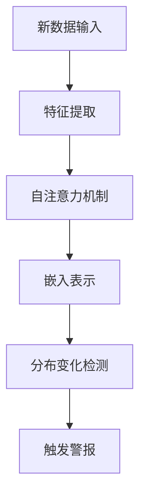
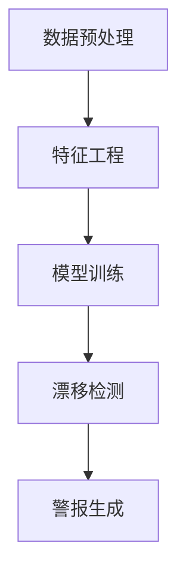

                 


# AI驱动的企业信用评级模型漂移检测系统

## 关键词：企业信用评级、模型漂移、AI驱动、机器学习、信用风险

## 摘要：  
随着人工智能技术的快速发展，企业信用评级模型在金融领域发挥着越来越重要的作用。然而，由于市场环境的动态变化，模型的性能可能会逐渐下降，这种现象被称为“模型漂移”。本文将深入探讨如何利用AI技术构建一个高效的模型漂移检测系统，以实时监控企业信用评级模型的性能变化，确保模型的准确性和可靠性。通过结合统计学、机器学习和深度学习等多种方法，本文将为企业信用评级系统提供一种创新的解决方案，帮助金融机构更好地应对信用风险。

---

# 第1章: 模型漂移的背景与核心概念

## 1.1 问题背景  
企业信用评级是金融机构评估企业信用风险的重要工具，其准确性直接关系到金融机构的资产安全和风险管理能力。然而，随着时间的推移，企业的经营状况、市场环境和经济条件会发生变化，这些变化可能导致训练模型时的数据分布与实际数据分布不一致，从而引发模型漂移。  

**模型漂移的定义**：模型漂移是指由于数据分布的变化，导致模型在新数据上的性能表现与训练时的预期性能出现偏差的现象。  

模型漂移可能由以下几种原因引起：  
- **数据分布变化**：例如，企业收入结构的变化、行业政策的调整等。  
- **模型性能退化**：模型在长期使用过程中，由于数据偏差或特征冗余，导致预测能力下降。  
- **概念漂移**：企业信用评级的内在逻辑发生变化，例如新的经济危机或行业趋势导致信用评估标准的变化。  

## 1.2 核心概念  
企业信用评级模型的核心要素包括：  
1. **输入特征**：如企业财务指标（收入、利润、资产负债率等）、行业指标（行业景气度、竞争状况等）和市场指标（宏观经济指标、政策变化等）。  
2. **模型输出**：如信用等级（AAA、AA、A等）或违约概率（PD）。  
3. **模型类型**：如逻辑回归、随机森林、XGBoost等传统机器学习模型，以及深度学习模型（如神经网络）。  

**模型漂移的分类**：  
- **渐进式漂移**：数据分布的变化是渐进的，模型性能逐步下降。  
- **突变式漂移**：数据分布突然发生重大变化，模型性能急剧下降。  

---

# 第2章: 模型漂移检测的原理与方法

## 2.1 模型漂移检测的原理  
模型漂移检测的核心是通过比较模型在训练数据和新数据上的表现，发现数据分布的变化或模型性能的退化。常见的检测方法包括：  
1. **统计检验法**：通过统计检验（如Kolmogorov-Smirnov检验）比较训练数据和新数据的分布差异。  
2. **分布距离法**：计算训练数据和新数据之间的分布距离（如Kullback-Leibler散度）。  
3. **模型性能监控法**：通过实时监控模型在新数据上的表现（如准确率、召回率等）发现性能下降。  

## 2.2 统计检验法：Kolmogorov-Smirnov检验  
Kolmogorov-Smirnov检验是一种非参数检验方法，用于比较两组数据的分布是否相同。其核心思想是比较两组数据的累积分布函数（CDF）之间的最大差异。  

**公式**：  
$$ D = \max_{x} |F_1(x) - F_2(x)| $$  
其中，$F_1(x)$和$F_2(x)$分别是训练数据和新数据的CDF。  

## 2.3 分布距离法：Kullback-Leibler散度  
Kullback-Leibler散度（KL散度）用于衡量两个概率分布之间的差异。  

**公式**：  
$$ D_{KL}(P||Q) = \sum P(x) \log\frac{P(x)}{Q(x)} $$  
其中，$P$和$Q$分别是训练数据和新数据的概率分布。  

## 2.4 模型性能监控法：基于ISAE的漂移检测  
Interpretable Self-Attentive Embedding（ISAE）是一种基于自注意力机制的深度学习模型，能够捕获数据的高层次特征。通过实时监控ISAE模型的嵌入表示，可以发现数据分布的变化。  

**流程图**：  


---

# 第3章: 企业信用评级模型漂移检测系统的设计与实现

## 3.1 系统架构设计  
企业信用评级模型漂移检测系统由以下几个模块组成：  
1. **数据预处理模块**：对输入数据进行清洗、归一化和特征工程。  
2. **模型训练模块**：基于训练数据训练企业信用评级模型。  
3. **漂移检测模块**：使用统计检验、分布距离和模型性能监控等多种方法检测漂移。  
4. **警报生成模块**：当检测到漂移时，触发警报并提供修复建议。  

**系统架构图**：  


## 3.2 数据流与功能模块设计  
1. **数据流**：  
   新数据输入 → 数据预处理 → 模型训练 → 漂移检测 → 警报生成。  

2. **功能模块**：  
   - 数据预处理：处理缺失值、异常值和数据格式。  
   - 特征工程：提取关键特征（如财务指标、行业指标）并进行降维。  
   - 模型训练：训练企业信用评级模型（如逻辑回归、随机森林）。  
   - 漂移检测：使用多种方法检测模型漂移。  
   - 警报生成：当漂移检测结果为真时，触发警报并提供修复建议。  

## 3.3 系统实现代码  
以下是一个基于Python的漂移检测系统实现示例：  

```python
import numpy as np
from sklearn.metrics import roc_auc_score
from scipy.stats import ks_2samp

def compute_ks_score(y_true, y_pred):
    return ks_2samp(y_true, y_pred).statistic

def compute_kl_divergence(p, q):
    return np.sum(p * np.log(p/q))

# 示例数据
train_scores = np.random.rand(1000)
test_scores = np.random.rand(1000)

# 计算KS检验
ks_statistic = compute_ks_score(train_scores, test_scores)
print(f"KS检验统计量：{ks_statistic}")

# 计算KL散度
p = np.exp(train_scores) / np.sum(np.exp(train_scores))
q = np.exp(test_scores) / np.sum(np.exp(test_scores))
kl_divergence = compute_kl_divergence(p, q)
print(f"KL散度：{kl_divergence}")
```

---

# 第4章: 企业信用评级模型漂移检测系统的应用与优化

## 4.1 系统应用案例  
以下是一个企业信用评级模型漂移检测系统的实际应用案例：  

**背景**：某银行的企业信用评级模型在上线后，由于经济危机的影响，企业违约率急剧上升，导致模型性能下降。  

**解决方案**：  
1. 使用Kolmogorov-Smirnov检验检测数据分布的变化。  
2. 使用ISAE模型监控嵌入表示的变化。  
3. 当检测到漂移时，重新训练模型并部署新模型。  

**结果**：  
- 模型性能恢复至上线时的水平。  
- 银行避免了因模型性能下降导致的经济损失。  

## 4.2 系统优化建议  
1. **实时监控**：通过流数据处理技术（如Flink）实时监控模型性能。  
2. **多模型融合**：结合多种检测方法（如统计检验、分布距离和模型性能监控）提高检测准确率。  
3. **自适应修复**：当检测到漂移时，自动触发模型重新训练和部署。  

## 4.3 系统性能优化  
- **计算效率**：通过并行计算和分布式计算优化模型检测的效率。  
- **存储优化**：使用分布式存储系统（如Hadoop）存储大规模数据。  
- **模型更新优化**：采用增量学习方法，减少模型重新训练的时间和成本。  

---

# 第5章: 企业信用评级模型漂移检测系统的最佳实践

## 5.1 最佳实践 tips  
1. **选择合适的检测方法**：根据具体情况选择统计检验、分布距离或模型性能监控方法。  
2. **实时监控**：通过实时监控系统减少模型漂移的负面影响。  
3. **数据预处理**：对数据进行清洗和归一化处理，确保数据质量。  
4. **模型修复与优化**：当检测到漂移时，及时修复模型并优化模型结构。  

## 5.2 小结  
企业信用评级模型漂移检测系统是金融机构风险管理的重要工具。通过结合统计学、机器学习和深度学习等多种方法，可以有效检测和修复模型漂移，确保模型的准确性和可靠性。

---

# 结语  
随着人工智能技术的不断发展，企业信用评级模型漂移检测系统将变得更加智能化和高效化。未来，随着大数据和AI技术的进一步融合，企业信用评级模型的性能和可靠性将得到更大的提升，为金融机构的风险管理提供更有力的支持。

