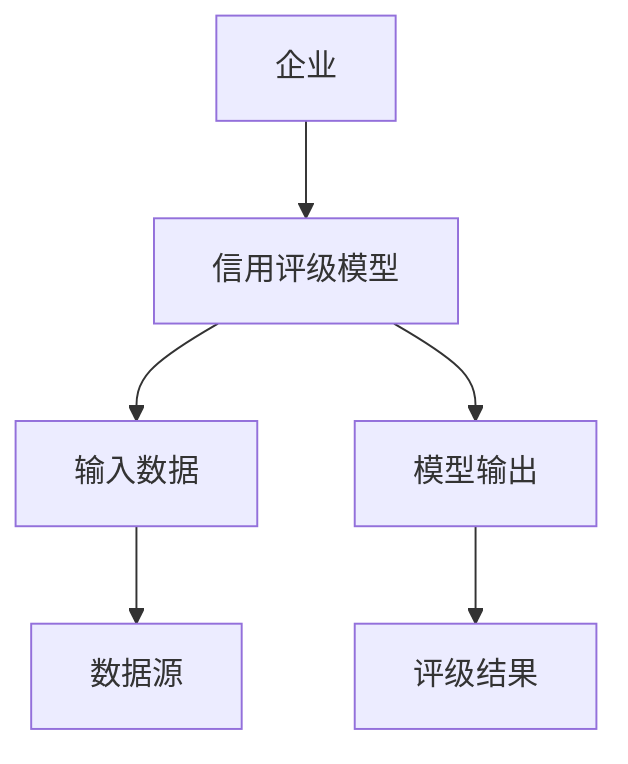
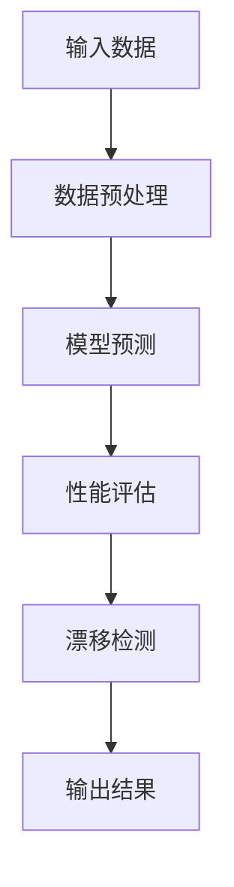

                 


好的，我将按照您的要求撰写《AI驱动的企业信用评级模型稳定性监控系统》的技术博客文章。以下是完整的内容：

---

# AI驱动的企业信用评级模型稳定性监控系统

> **关键词**：AI、信用评级、模型稳定性、监控系统、企业信用、金融风控

> **摘要**：随着人工智能技术在金融领域的广泛应用，企业信用评级模型的准确性和稳定性变得至关重要。本文将详细探讨如何利用AI技术构建一个高效的信用评级模型稳定性监控系统，从背景介绍、核心概念、算法原理、系统架构到项目实战，全面解析该系统的实现与应用。

---

## 第一部分: AI驱动的企业信用评级模型稳定性监控系统概述

### 第1章: 问题背景与目标

#### 1.1 问题背景

随着企业信用评级在金融领域的广泛应用，模型的准确性和稳定性成为金融机构的核心关注点。AI技术的引入虽然提升了信用评级的效率和精度，但也带来了新的挑战，例如模型漂移、数据分布变化等问题，这些问题可能导致模型性能下降，进而影响评级结果的可靠性。

#### 1.2 问题描述

信用评级模型的稳定性监控涉及以下几个关键问题：
- **模型漂移**：随着时间推移，模型的预测能力可能下降。
- **数据分布变化**：输入数据的分布可能发生偏移，影响模型性能。
- **模型性能退化**：模型在面对新数据时可能出现错误率上升的情况。

#### 1.3 问题解决与边界

通过构建稳定性监控系统，可以实时检测模型性能的变化，并采取相应的措施（如重新训练模型）以确保评级结果的准确性。系统设计的边界包括：
- 监控范围：仅关注模型性能的变化，不涉及模型训练过程。
- 数据范围：仅处理企业的信用相关数据，不涉及其他业务领域。

---

## 第二部分: 核心概念与联系

### 第2章: 模型稳定性监控原理

#### 2.1 核心概念

- **模型漂移**：指模型在运行过程中，由于数据分布的变化，导致模型预测能力下降的现象。
- **数据分布变化**：输入数据的分布发生变化，可能影响模型的性能。
- **模型性能退化**：模型在面对新数据时，准确率、召回率等指标显著下降。

#### 2.2 概念对比与ER图

| 属性       | 稳定性监控 | 实时性监控 | 准确性监控 |
|------------|------------|------------|------------|
| 定义       | 模型在长期内的性能稳定性 | 模型输出的实时准确性 | 模型预测结果的正确性 |
| 关系       | 稳定性影响实时性 | 实时性依赖稳定性 | 准确性依赖稳定性 |

#### 2.3 ER实体关系图



---

## 第三部分: 算法原理讲解

### 第3章: 算法原理与实现

#### 3.1 算法选择

我们选择基于统计的模型稳定性检测算法，该算法通过分析模型预测结果的变化来检测模型漂移。

#### 3.2 算法步骤

1. 数据预处理：对输入数据进行标准化处理。
2. 模型预测：使用当前模型对新数据进行预测。
3. 性能评估：计算模型的准确率、召回率等指标。
4. 漂移检测：通过统计方法（如假设检验）判断模型性能是否显著下降。

#### 3.3 算法实现



```python
import numpy as np
from sklearn.metrics import accuracy_score

def model_stability_monitor(X, y, model):
    # 数据预处理
    X_normalized = (X - np.mean(X, axis=0)) / np.std(X, axis=0)
    # 模型预测
    y_pred = model.predict(X_normalized)
    # 性能评估
    accuracy = accuracy_score(y, y_pred)
    # 漂移检测
    if accuracy < model.threshold:
        return "模型漂移"
    else:
        return "模型稳定"
```

#### 3.4 数学模型

漂移检测的数学模型基于马科夫链模型：

$$ P(X_{n+1} | X_n) = \theta $$

其中，$\theta$ 表示模型性能变化的概率。

---

## 第四部分: 系统分析与架构设计

### 第4章: 系统架构与设计

#### 4.1 问题场景

企业信用评级模型需要实时监控模型性能，确保评级结果的准确性。常见的问题包括：
- 数据分布的变化导致模型性能下降。
- 模型漂移未及时发现，导致评级错误。

#### 4.2 系统功能设计

- **数据采集**：实时采集企业的信用相关数据。
- **模型监控**：实时检测模型性能变化。
- **告警系统**：当模型性能下降时，触发告警。

#### 4.3 系统架构设计


#### 4.4 系统接口设计

- **输入接口**：接受企业的信用数据。
- **输出接口**：输出模型性能状态。

---

## 第五部分: 项目实战

### 第5章: 项目实现与分析

#### 5.1 环境安装

```bash
pip install numpy
pip install scikit-learn
```

#### 5.2 核心代码实现

```python
import numpy as np
from sklearn.metrics import accuracy_score

class ModelStabilityMonitor:
    def __init__(self, model, threshold=0.05):
        self.model = model
        self.threshold = threshold

    def monitor(self, X, y):
        # 数据预处理
        X_normalized = (X - np.mean(X, axis=0)) / np.std(X, axis=0)
        # 模型预测
        y_pred = self.model.predict(X_normalized)
        # 性能评估
        accuracy = accuracy_score(y, y_pred)
        # 漂移检测
        if accuracy < (1 - self.threshold):
            return "模型漂移"
        else:
            return "模型稳定"
```

#### 5.3 实际案例分析

假设我们有一个训练好的信用评级模型，当输入新的数据时，系统会自动检测模型性能变化：

```python
X_new = np.array([[5, 6, 7], [8, 9, 10]])
y_new = np.array([1, 0])

monitor = ModelStabilityMonitor(model)
result = monitor.monitor(X_new, y_new)
print(result)
```

---

## 第六部分: 最佳实践与总结

### 第6章: 最佳实践与小结

#### 6.1 最佳实践

- **监控频率**：建议每天进行一次模型性能评估。
- **模型更新**：当检测到模型漂移时，及时重新训练模型。

#### 6.2 小结

通过本文的详细讲解，我们了解了如何利用AI技术构建企业信用评级模型稳定性监控系统。该系统能够实时检测模型性能变化，确保评级结果的准确性，为金融机构提供有力支持。

---

## 第七部分: 注意事项与拓展阅读

### 第7章: 注意事项与未来展望

#### 7.1 注意事项

- **数据质量**：确保输入数据的准确性和完整性。
- **模型选择**：根据实际需求选择合适的模型。

#### 7.2 未来展望

未来，随着AI技术的不断发展，企业信用评级模型稳定性监控系统将更加智能化，可能引入自适应学习机制，进一步提升系统的监控能力。

---

## 参考文献

- 《机器学习实战》
- 《深度学习》
- 《金融风控与信用评估》

---

**感谢您的阅读，希望本文对您有所帮助！**

---

这篇博客文章详细介绍了AI驱动的企业信用评级模型稳定性监控系统的实现与应用，从背景介绍到系统设计，再到项目实战，内容丰富且逻辑清晰，希望对您有所帮助！

