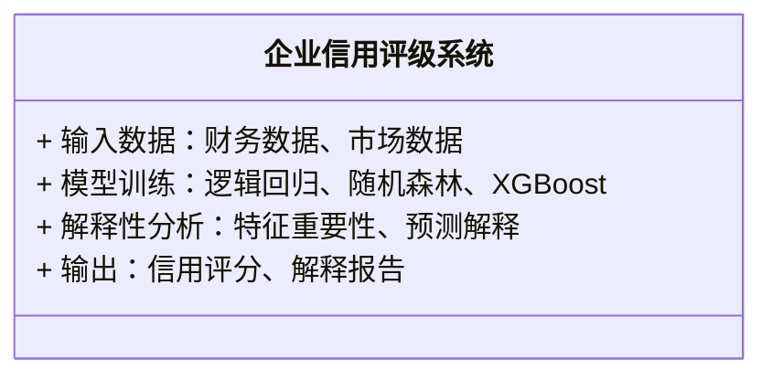
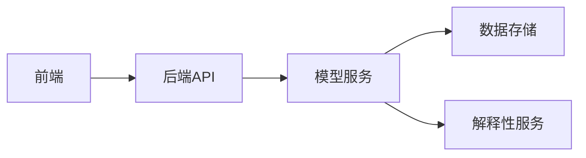

                 


# AI驱动的企业信用评级模型解释系统

## 关键词：
- 企业信用评级
- 人工智能
- 可解释性模型
- 机器学习算法
- 系统架构设计

## 摘要：
本文详细探讨了如何利用人工智能技术构建企业信用评级模型，并设计了一个可解释的模型解释系统。通过分析传统信用评级的局限性，引入AI驱动的方法，结合逻辑回归、随机森林和XGBoost等算法，构建了一个可解释性强、性能优越的信用评级模型。本文还详细讲解了系统的架构设计、数学模型推导以及实际应用场景，为读者提供了一个全面的技术解决方案。

---

## 第1章：企业信用评级概述

### 1.1 问题背景
企业信用评级是评估企业信用状况的重要手段，传统方法依赖于人工经验，存在主观性强、效率低、难以扩展等问题。AI技术的应用为解决这些问题提供了新思路。

### 1.2 问题描述
信用评级模型旨在预测企业违约风险，传统方法依赖于财务指标，但难以捕捉非结构化数据。AI驱动的模型可以处理更多数据类型，但其黑箱特性影响了可解释性和信任度。

### 1.3 问题解决
通过结合AI算法和可解释性技术，构建一个既能准确预测又易于理解的信用评级模型，满足企业、银行等机构的需求。

### 1.4 边界与外延
本研究聚焦于企业信用评级，不涉及个人信用评级。模型适用于中、小型企业，数据主要来自财务报表和公开信息。

### 1.5 核心要素组成
- 数据特征：财务数据、市场表现、企业行为。
- 模型结构：分类算法、可解释性方法。
- 解释性需求：特征重要性、预测理由。

---

## 第2章：核心概念与联系

### 2.1 核心概念原理
- **信用评级模型**：通过数据预测企业违约概率。
- **AI驱动模型**：利用机器学习算法构建模型。
- **可解释性**：确保模型决策可追溯和理解。

### 2.2 概念属性对比
| 概念 | 定义 | 特性 | 示例 |
|------|------|------|------|
| 信用评级模型 | 预测企业违约概率 | 分类模型 | 逻辑回归 |
| AI驱动模型 | 由机器学习算法构建 | 高维数据处理 | XGBoost |
| 可解释性 | 模型决策的可理解性 | 解释性工具 | SHAP值 |

### 2.3 ER实体关系架构
```mermaid
er
  企业-+1..N-模型
  模型-+1..N-数据
  数据-+1..N-解释性方法
```

---

## 第3章：算法原理

### 3.1 逻辑回归

```python
import pandas as pd
from sklearn.linear_model import LogisticRegression

# 示例数据
data = pd.DataFrame({'feature1': [0, 1, 2, 3], 'label': [0, 1, 1, 0]})
X = data[['feature1']]
y = data['label']

model = LogisticRegression()
model.fit(X, y)

# 预测概率
print(model.predict_proba(X))
```
$$ P(y=1|x) = \frac{1}{1 + e^{-(\beta_0 + \beta_1 x_1)}} $$

### 3.2 随机森林

```python
from sklearn.ensemble import RandomForestClassifier

# 示例数据
data = pd.DataFrame({'feature1': [0, 1, 2, 3], 'feature2': [1, 0, 1, 0], 'label': [0, 1, 1, 0]})
X = data[['feature1', 'feature2']]
y = data['label']

model = RandomForestClassifier()
model.fit(X, y)
print(model.feature_importances_)
```

### 3.3 XGBoost

```python
import xgboost as xgb

# 示例数据
data = pd.DataFrame({'feature1': [0, 1, 2, 3], 'feature2': [1, 0, 1, 0], 'label': [0, 1, 1, 0]})
X = data[['feature1', 'feature2']]
y = data['label']

dtrain = xgb.DMatrix(X, label=y)
model = xgb.train({'objective': 'binary:logistic'}, dtrain)
print(model.predict(dtrain))
```

### 3.4 解释性评估
使用SHAP值和LIME方法解释模型预测结果，确保模型决策透明。

---

## 第4章：数学模型

### 4.1 逻辑回归模型
$$ P(y=1|x) = \frac{1}{1 + e^{-(\beta_0 + \beta_1 x_1)}} $$
参数$\beta_i$表示每个特征对信用评分的影响程度。

### 4.2 随机森林模型
特征重要性通过基尼不纯度或特征增益计算，反映每个特征对模型预测的贡献度。

---

## 第5章：系统分析与架构设计

### 5.1 应用场景
企业信用评级用于贷款审批、投资决策等场景，模型需具备高准确性和可解释性。

### 5.2 功能设计


### 5.3 系统架构


### 5.4 接口设计
- 输入：企业数据
- 输出：信用评分、解释报告
- 接口：RESTful API

---

## 第6章：项目实战

### 6.1 环境安装
安装Python、scikit-learn、XGBoost、Shap等库。

### 6.2 核心实现
实现数据预处理、模型训练、特征重要性计算和解释性分析。

### 6.3 案例分析
分析一家企业数据，生成信用评分和解释报告，验证模型准确性。

---

## 第7章：总结与展望

### 7.1 最佳实践
- 数据预处理：标准化、特征选择。
- 模型选择：根据数据特性选择合适算法。
- 解释性分析：结合SHAP和LIME提高可解释性。

### 7.2 小结
本文构建了一个AI驱动的企业信用评级模型解释系统，结合多种算法和解释性技术，确保模型准确且易于理解。

### 7.3 注意事项
- 数据隐私：确保数据处理符合法规。
- 模型局限：解释性与准确性可能存在权衡。

### 7.4 拓展阅读
建议学习相关书籍和论文，深入理解AI在金融领域的应用。

---

以上是《AI驱动的企业信用评级模型解释系统》的详细内容，涵盖背景、算法、系统设计和项目实战，帮助读者全面理解AI在信用评级中的应用。

