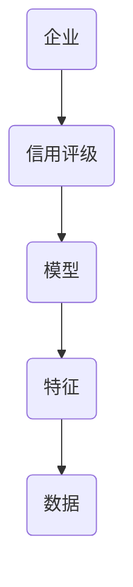
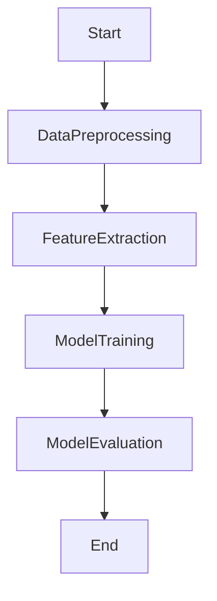
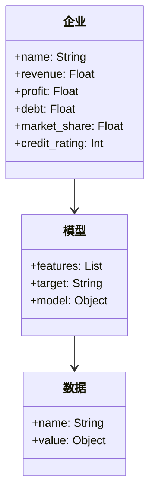
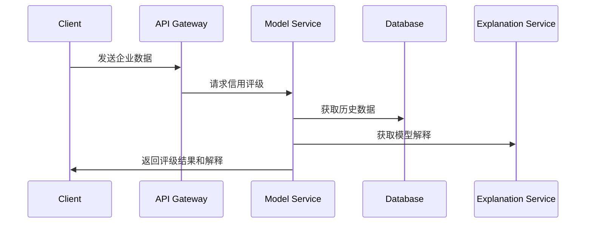

                 


# AI驱动的企业信用评级模型解释系统

## 关键词
AI驱动、企业信用评级、模型解释系统、机器学习、深度学习、可解释性

## 摘要
随着人工智能技术的快速发展，企业信用评级模型逐渐从传统的统计方法转向基于AI的驱动模型。然而，AI模型的复杂性和“黑箱”特性使得其在金融领域的应用受到限制。本文将详细探讨如何构建一个基于AI驱动的企业信用评级模型解释系统，从背景介绍、核心概念、算法原理、系统架构设计到项目实战，全面解析该系统的实现过程和应用场景。通过本文，读者将能够理解AI驱动模型的优势与挑战，并掌握如何在实际中应用这些模型进行企业信用评级。

---

# 第1章: 企业信用评级与AI驱动模型的背景介绍

## 1.1 企业信用评级的定义与重要性

### 1.1.1 企业信用评级的基本概念
企业信用评级是指通过对企业的财务状况、经营能力、市场竞争力等多方面因素的综合评估，确定企业在偿还债务时的风险水平。信用评级结果通常以分数或等级形式呈现，是金融机构对企业进行贷款审批、投资决策的重要依据。

### 1.1.2 企业信用评级在金融领域的核心作用
企业信用评级直接关系到企业的融资成本和融资能力。高信用评级的企业更容易获得低成本的贷款，而低信用评级的企业则可能面临更高的融资门槛或无法获得融资。因此，信用评级是企业与金融机构之间信任的桥梁。

### 1.1.3 传统信用评级方法的局限性
传统的信用评级方法主要依赖于财务指标和少量的非财务指标，且往往由人工或简单的统计模型完成。这种方法存在以下局限性：
1. **数据维度有限**：传统方法通常只考虑财务数据，忽略了企业的市场表现、管理能力等重要因素。
2. **主观性较强**：评级结果往往依赖于评级机构的经验和主观判断，缺乏客观性和一致性。
3. **效率低下**：传统方法处理数据的速度较慢，难以满足现代金融业务对实时性的要求。

## 1.2 AI驱动模型在信用评级中的应用背景

### 1.2.1 AI技术在金融领域的快速发展
近年来，人工智能技术在金融领域的应用取得了显著进展。从智能投顾、风险控制到信用评估，AI技术正在改变传统金融行业的运作方式。

### 1.2.2 信用评级中的黑箱问题与可解释性需求
AI模型，尤其是深度学习模型，虽然在预测准确性上有显著优势，但其“黑箱”特性使得模型的决策过程难以解释。这在信用评级中尤为关键，因为金融机构需要明确了解评级结果的依据，以便进行后续的决策和风险管理。

### 1.2.3 AI驱动模型的优势与挑战
AI驱动的信用评级模型具有以下优势：
1. **数据处理能力强大**：可以利用企业的财务数据、市场数据、社交媒体数据等多种数据源，构建更全面的信用评估体系。
2. **预测精度高**：通过机器学习算法，模型可以捕捉到传统方法难以发现的复杂模式和关联性。
3. **实时性高**：AI模型可以快速处理实时数据，满足金融机构对实时信用评级的需求。

然而，AI模型的复杂性和不可解释性也带来了挑战，如何在保证预测精度的同时提高模型的可解释性，是当前研究的重点。

---

# 第2章: AI驱动企业信用评级模型的核心概念与联系

## 2.1 核心概念原理

### 2.1.1 AI驱动模型的基本原理
AI驱动的信用评级模型通常基于机器学习算法，如随机森林、支持向量机（SVM）、逻辑回归等，或者深度学习模型，如神经网络、长短期记忆网络（LSTM）。这些模型通过对大量数据的学习，自动提取特征并构建预测模型。

### 2.1.2 信用评级的关键指标与特征
信用评级的关键指标通常包括：
1. **财务指标**：如资产负债率、利润率、流动比率等。
2. **市场指标**：如股价波动率、行业景气度等。
3. **管理指标**：如管理层稳定性、创新能力等。
4. **外部因素**：如宏观经济环境、政策法规等。

### 2.1.3 模型的输入与输出
- **输入**：企业的各项指标数据，包括财务数据、市场数据、管理数据等。
- **输出**：企业的信用评级结果，通常以分数或等级形式呈现。

## 2.2 核心概念属性对比表

| **属性**       | **传统信用评级模型**                     | **AI驱动信用评级模型**                  |
|----------------|------------------------------------------|------------------------------------------|
| 数据来源       | 主要依赖财务数据                         | 包括财务、市场、管理等多源数据         |
| 模型复杂性     | 简单，基于统计分析                       | 复杂，基于机器学习或深度学习算法       |
| 可解释性       | 较高                                     | 较低，尤其是深度学习模型               |
| 预测精度       | 较低                                     | 较高                                     |
| 处理速度       | 较慢                                     | 较快，支持实时处理                     |

## 2.3 ER实体关系图



---

# 第3章: AI驱动企业信用评级模型的算法原理

## 3.1 算法原理概述

### 3.1.1 基于机器学习的信用评级模型
随机森林是一种常用的信用评级模型，它通过构建多棵决策树并对结果进行投票或平均，可以有效降低模型的过拟合风险。

### 3.1.2 深度学习模型在信用评级中的应用
深度学习模型，如神经网络，可以自动提取数据中的复杂特征，适用于高维数据的处理。

## 3.2 算法流程图



## 3.3 算法实现代码

```python
import pandas as pd
from sklearn.ensemble import RandomForestClassifier
from sklearn.metrics import accuracy_score

# 数据加载
data = pd.read_csv('credit_data.csv')

# 特征选择
features = ['revenue', 'profit', 'debt', 'market_share']
target = 'credit_rating'

# 数据分割
X = data[features]
y = data[target]

# 模型训练
model = RandomForestClassifier()
model.fit(X, y)

# 模型预测
y_pred = model.predict(X)

# 模型评估
accuracy = accuracy_score(y, y_pred)
print(f'模型准确率: {accuracy}')
```

## 3.4 算法的数学模型与公式

### 3.4.1 随机森林的损失函数
随机森林的损失函数通常采用基尼指数（Gini Impurity）：
$$
G(p) = p(1 - p)
$$

### 3.4.2 深度学习模型的优化函数
深度学习模型通常使用交叉熵损失函数：
$$
\mathcal{L} = -\sum_{i=1}^{n} y_i \log(p_i) + (1 - y_i) \log(1 - p_i)
$$

---

# 第4章: 系统分析与架构设计方案

## 4.1 系统应用场景

### 4.1.1 金融机构的信用评估
金融机构可以利用AI驱动的信用评级模型，快速、准确地评估企业的信用状况，降低风险。

### 4.1.2 企业内部风险管理
企业可以通过自建信用评级模型，监控自身的信用风险，优化财务结构。

## 4.2 系统功能设计

### 4.2.1 领域模型


### 4.2.2 系统架构图
```mermaid
graph LR
    Client --> API Gateway
    API Gateway --> Model Service
    Model Service --> Database
    Model Service --> Explanation Service
    Explanation Service --> Client
```

### 4.2.3 系统接口设计
- **输入接口**：接收企业的各项指标数据。
- **输出接口**：返回企业的信用评级结果及模型解释。

### 4.2.4 系统交互流程


---

# 第5章: 项目实战

## 5.1 环境安装

### 5.1.1 安装Python和必要的库
```bash
pip install numpy pandas scikit-learn
```

## 5.2 系统核心实现源代码

### 5.2.1 数据加载与处理
```python
import pandas as pd

# 加载数据
data = pd.read_csv('credit_data.csv')

# 数据预处理
data = data.dropna()
```

### 5.2.2 特征选择与模型训练
```python
from sklearn.ensemble import RandomForestClassifier

features = ['revenue', 'profit', 'debt', 'market_share']
target = 'credit_rating'

X = data[features]
y = data[target]

model = RandomForestClassifier()
model.fit(X, y)
```

### 5.2.3 模型解释
```python
from sklearn.inspection import permutation_importance

result = permutation_importance(model, X, y, n_repeats=10)
importances = result.importances_mean
print(importances)
```

## 5.3 实际案例分析与详细讲解

### 5.3.1 案例背景
假设我们有一家企业的数据，包括收入、利润、债务和市场份额。我们需要通过模型预测其信用评级。

### 5.3.2 数据分析与模型预测
```python
import pandas as pd
import numpy as np

# 假设企业数据
new_data = pd.DataFrame({
    'revenue': [1000000],
    'profit': [100000],
    'debt': [200000],
    'market_share': [0.2]
})

# 预测信用评级
y_pred = model.predict(new_data)
print(f'预测信用评级: {y_pred[0]}')
```

## 5.4 项目小结
通过本项目，我们实现了基于随机森林的企业信用评级模型，并通过实际案例展示了模型的应用过程。模型不仅能够准确预测企业的信用评级，还能通过特征重要性分析提供解释。

---

# 第6章: 最佳实践

## 6.1 小结
本文详细介绍了AI驱动的企业信用评级模型解释系统的实现过程，从背景介绍、核心概念到算法原理、系统架构设计，再到项目实战，全面解析了该系统的构建与应用。

## 6.2 注意事项
- **数据隐私**：在处理企业数据时，需严格遵守数据隐私保护法规。
- **模型解释性**：AI模型的解释性是信用评级系统的重要组成部分，需在模型设计中予以重视。

## 6.3 拓展阅读
- 《机器学习实战》
- 《深度学习》
- 《可解释人工智能》

---

通过本文的系统讲解，读者可以全面理解AI驱动的企业信用评级模型的实现与应用，并能够在实际工作中应用这些模型进行信用评估。

