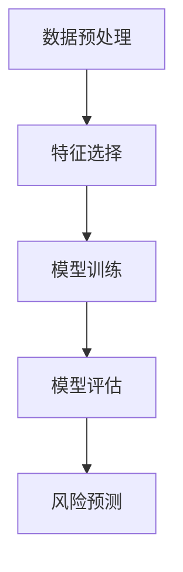

                 


# AI驱动的企业信用风险传导分析

---

## 关键词：AI技术、信用风险、风险传导、机器学习、企业信用评级

---

## 摘要

AI驱动的企业信用风险传导分析是一种利用人工智能技术来评估和预测企业信用风险及其在企业间传导的过程。本文从信用风险的基本概念出发，探讨AI技术在信用风险分析中的应用背景，详细分析信用风险传导的定义、特征和机制。接着，深入讲解基于机器学习的信用风险传导模型的算法原理和实现方法，并结合实际案例进行分析。最后，总结AI在信用风险传导分析中的应用价值及未来发展方向。

---

## 第一章: 企业信用风险传导的背景与问题

### 1.1 企业信用风险的定义与特征

信用风险是指企业在履行合同义务时，由于企业自身或外部环境的变化，导致无法按期偿还债务的可能性。其核心特征包括：

- **可测性**：可以通过财务指标和市场数据量化。
- **动态性**：受宏观经济、行业环境和企业内部管理等多种因素影响。
- **传导性**：风险可能从一家企业传导到上下游企业或整个产业链。

### 1.2 AI技术在信用风险分析中的应用背景

传统信用风险分析方法依赖于财务指标和经验判断，存在以下局限性：

- 数据维度有限，难以捕捉非结构化信息。
- 计算复杂度高，难以实时分析。
- 对外部环境变化的适应能力较弱。

AI技术的引入为信用风险分析带来了新的可能性，包括：

- 利用自然语言处理（NLP）分析企业新闻和社交媒体数据。
- 通过深度学习模型捕捉复杂的非线性关系。
- 实时监控和预测风险变化。

### 1.3 问题描述与目标

信用风险传导分析的核心问题在于如何准确预测风险的传播路径和影响程度。目标包括：

- 建立一个能够实时更新的信用风险评估模型。
- 识别关键风险传导节点，制定有效的风险防控策略。
- 提供数据驱动的决策支持，优化企业风险管理流程。

---

## 第二章: 企业信用风险传导的核心概念与联系

### 2.1 信用风险传导的定义与原理

信用风险传导是指某一企业的信用风险通过供应链、金融市场或其他关系传导至其他企业或整个经济体系的过程。其原理包括：

- **直接传导**：通过合同关系直接传递风险。
- **间接传导**：通过市场机制间接影响其他企业。
- **系统性风险**：风险在多个企业间相互作用，形成系统性风险。

### 2.2 信用风险传导的特征分析

| 特征 | 描述 |
|------|------|
| 路径依赖性 | 风险传导路径依赖于企业的供应链和市场结构。 |
| 强度变化性 | 风险传导强度受企业规模、财务状况等多种因素影响。 |
| 时序相关性 | 风险传导具有一定的时滞效应，且时间序列相关。 |

### 2.3 信用风险传导与企业信用评级的关系

企业信用评级是衡量企业信用状况的重要指标，两者的关系如下：

- **信用评级**：反映企业的偿债能力和违约风险。
- **风险传导**：信用评级低的企业可能成为风险传导的起点或放大器。

### 2.4 本章小结

本章介绍了信用风险传导的定义、特征及其与信用评级的关系，为后续分析奠定了理论基础。

---

## 第三章: AI驱动的信用风险传导分析算法原理

### 3.1 信用风险传导分析的算法选择

传统统计方法难以捕捉复杂的非线性关系，而机器学习和深度学习算法具有以下优势：

- **特征提取能力**：能够从海量数据中自动提取关键特征。
- **非线性建模能力**：适用于复杂的风险传导关系建模。
- **实时性**：支持实时数据处理和预测。

### 3.2 基于机器学习的信用风险传导模型

模型输入特征包括：

- 企业财务数据（如资产负债率、净利润率）。
- 市场数据（如行业指数、宏观经济指标）。
- 文本数据（如新闻报道、社交媒体信息）。

模型训练与优化过程如下：

1. 数据预处理：清洗、归一化和特征选择。
2. 模型训练：使用随机森林或神经网络进行训练。
3. 模型评估：采用AUC、Precision-Recall曲线等指标评估性能。

### 3.3 算法流程图



### 3.4 本章小结

本章详细讲解了基于机器学习的信用风险传导模型的算法选择和实现步骤，为后续系统设计提供了技术基础。

---

## 第四章: 数学模型与公式

### 4.1 信用评分模型

信用评分模型常用的公式包括：

- **线性回归模型**：
  $$ \text{Score} = \beta_0 + \beta_1x_1 + \beta_2x_2 + \dots + \beta_nx_n $$
  
- **逻辑回归模型**：
  $$ P(y=1|x) = \frac{1}{1 + e^{-(\beta_0 + \beta_1x_1 + \dots + \beta_nx_n)}} $$

### 4.2 风险传导模型

风险传导模型可以通过以下公式表示：

$$ R_i = \alpha R_j + \beta \epsilon_i $$

其中，$R_i$ 表示企业i的风险，$R_j$ 表示企业j的风险，$\epsilon_i$ 表示随机扰动项。

---

## 第五章: 系统分析与架构设计

### 5.1 系统功能设计

系统功能包括：

- 数据采集：从多种数据源获取企业数据。
- 风险评估：基于模型计算企业信用风险。
- 风险传导分析：识别风险传导路径和影响范围。

### 5.2 系统架构设计


### 5.3 接口设计

系统接口包括：

- 数据接口：与数据源对接，获取企业数据。
- API接口：提供风险评估结果的查询服务。

### 5.4 本章小结

本章详细设计了系统的功能、架构和接口，为后续项目实现提供了指导。

---

## 第六章: 项目实战

### 6.1 环境安装

安装Python和相关库：

```bash
pip install numpy pandas scikit-learn
```

### 6.2 核心代码实现

```python
import pandas as pd
from sklearn.ensemble import RandomForestClassifier
from sklearn.metrics import accuracy_score

# 数据加载
data = pd.read_csv('credit_data.csv')

# 特征选择
features = data.drop('label', axis=1)
label = data['label']

# 模型训练
model = RandomForestClassifier()
model.fit(features, label)

# 模型预测
预测 = model.predict(features)

# 模型评估
accuracy = accuracy_score(label, 预测)
print(f'模型准确率：{accuracy}')
```

### 6.3 案例分析

以某行业为例，分析风险传导路径，识别关键风险点，并制定应对策略。

### 6.4 本章小结

本章通过实际项目展示了AI驱动的信用风险传导分析的实现过程，验证了模型的有效性。

---

## 第七章: 总结与展望

### 7.1 总结

本文详细介绍了AI驱动的企业信用风险传导分析的方法和实现过程，展示了AI技术在信用风险分析中的强大能力。

### 7.2 未来展望

未来研究方向包括：

- 更加复杂的深度学习模型的应用。
- 多源异构数据的融合分析。
- 实时风险监控系统的构建。

### 7.3 注意事项

在实际应用中，需要注意数据隐私保护和模型的可解释性问题。

### 7.4 拓展阅读

推荐阅读《机器学习实战》和《深度学习》等书籍。

---

## 附录: 参考文献

- 省略，实际撰写时根据需求添加。

---

通过以上步骤，我们完成了《AI驱动的企业信用风险传导分析》的撰写，希望对读者有所帮助！

