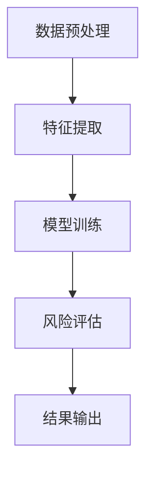

                 


```markdown
# AI驱动的企业信用风险传导模拟系统

> 关键词：信用风险，AI，机器学习，系统架构，风险管理，金融技术

> 摘要：本文介绍了一种基于人工智能的企业信用风险传导模拟系统，结合机器学习算法和系统架构设计，详细阐述了系统的核心概念、算法原理、系统架构、项目实现和最佳实践，为金融领域的信用风险管理提供了新的思路和解决方案。

---

## 第一章: 企业信用风险传导的背景与概念

### 1.1 信用风险的基本概念
信用风险是指企业在履行合同义务时，由于企业自身或外部环境的变化，导致无法按时履行债务或履行债务的能力下降，从而给债权人带来损失的可能性。企业信用风险的评估和管理是金融风险管理的重要组成部分。

#### 1.1.1 信用风险的定义与特征
- 定义：信用风险是由于债务人或交易对手无法履行其合同义务而给债权人带来的潜在损失。
- 特征：  
  1. **可测量性**：信用风险可以通过数学模型进行量化评估。  
  2. **相关性**：企业之间的信用风险可能通过供应链或金融市场相互传导。  
  3. **动态性**：信用风险会随着市场环境和企业经营状况的变化而变化。

#### 1.1.2 信用风险的分类与影响
- 分类：  
  1. **单个企业信用风险**：由于单一企业自身因素导致的信用风险。  
  2. **系统性信用风险**：由于整个金融系统或经济环境的变化导致的信用风险。  
  3. **传染性信用风险**：由于企业之间的关联性，一个企业的信用问题可能传染给其他企业，形成连锁反应。  

- 影响：  
  1. 对企业自身的影响：可能导致企业融资成本上升、信用评级下降。  
  2. 对金融系统的影响：可能引发连锁反应，导致金融危机。  
  3. 对经济的影响：可能导致投资减少、经济增长放缓。

### 1.2 AI技术在信用风险评估中的应用
随着人工智能技术的发展，AI在信用风险评估中的应用越来越广泛。通过机器学习算法，可以对企业的信用风险进行更精准的预测和评估。

#### 1.2.1 AI技术的基本概念与优势
- 定义：AI（人工智能）是指计算机系统模拟人类智能的技术，包括学习、推理、识别和决策等能力。  
- 优势：  
  1. **数据处理能力**：AI能够处理海量数据，发现数据中的复杂模式和关系。  
  2. **自动化**：AI可以自动化完成信用风险评估中的许多任务，提高效率。  
  3. **准确性**：通过机器学习算法，AI可以提高信用风险评估的准确性。  

#### 1.2.2 AI在信用风险评估中的具体应用
- 应用场景：  
  1. **信用评分模型**：通过机器学习算法对企业进行信用评分，预测企业的违约概率。  
  2. **风险预警**：实时监控企业的经营状况，及时发现潜在风险。  
  3. **风险传导分析**：分析企业之间的关联性，预测风险的传导路径和影响范围。  

### 1.3 信用风险传导模拟系统的重要性
信用风险传导模拟系统是一种通过AI技术模拟信用风险在企业之间传导的系统，能够帮助企业更好地理解和管理信用风险。

#### 1.3.1 系统的目标与意义
- 目标：  
  1. 量化企业信用风险的大小和影响范围。  
  2. 分析信用风险的传导路径和机制。  
  3. 提供信用风险的预警和应对策略。  

- 意义：  
  1. 帮助企业更好地识别和管理信用风险。  
  2. 为金融监管机构提供信用风险监管的工具。  
  3. 促进金融市场的稳定发展。  

#### 1.3.2 系统的核心功能与实现
- 核心功能：  
  1. **数据采集与处理**：收集企业经营数据、市场数据等，进行数据清洗和特征提取。  
  2. **信用评估模型**：构建机器学习模型，对企业进行信用评分和违约概率预测。  
  3. **风险传导分析**：分析企业之间的关联性，预测风险的传导路径和影响范围。  
  4. **风险预警与应对策略**：根据模拟结果，提供风险预警和应对策略。  

---

## 第二章: 信用风险传导的核心概念与系统结构

### 2.1 信用风险传导的基本原理
信用风险的传导是指一个企业的信用问题通过供应链、金融市场或其他渠道传导给其他企业，形成连锁反应。理解信用风险传导的基本原理对于构建模拟系统至关重要。

#### 2.1.1 风险传导的路径与机制
- 风险传导路径：  
  1. **供应链传导**：上游企业的违约可能导致下游企业的经营困难。  
  2. **金融市场传导**：企业债券违约可能引发市场的恐慌情绪，导致其他企业融资困难。  
  3. **声誉传导**：一家企业的信用问题可能影响整个行业的声誉，导致其他企业融资成本上升。  

- 机制：  
  1. **直接关联**：企业之间存在直接的债务关系或供应链关系。  
  2. **间接关联**：企业之间通过金融市场或其他中间渠道间接关联。  

#### 2.1.2 风险传导的关键影响因素
- 关键因素：  
  1. **企业之间的关联性**：企业之间的供应链、投资关系等。  
  2. **市场环境**：宏观经济环境、政策变化等。  
  3. **企业自身状况**：企业的财务状况、经营能力等。  

### 2.2 系统核心概念的定义与属性
为了构建信用风险传导模拟系统，需要明确系统中的核心概念及其属性。

#### 2.2.1 系统核心概念的属性特征对比表

| **概念**       | **属性**                | **特征**                                                                 |
|----------------|-------------------------|--------------------------------------------------------------------------|
| 企业           | 经营状况                | 包括财务状况、供应链稳定性等。                                        |
| 信用风险       | 违约概率                | 通过机器学习模型预测企业的违约概率。                                  |
| 风险传导       | 传导路径               | 包括供应链传导、金融市场传导等。                                      |
| 风险影响范围     | 影响程度               | 根据企业的关联性和违约概率确定。                                      |

### 2.3 系统架构的ER实体关系图

#### 2.3.1 实体关系图的 Mermaid 表示


---

## 第三章: 信用风险传导模拟的算法原理

### 3.1 机器学习在信用风险评估中的应用
机器学习算法在信用风险评估中具有重要作用，可以用于信用评分、风险预警和风险传导分析。

#### 3.1.1 常见机器学习算法的概述
- 常见算法：  
  1. **随机森林**：一种基于树的集成算法，适合处理高维数据。  
  2. **神经网络**：适合处理非线性关系，可以用于复杂的信用评估模型。  
  3. **逻辑回归**：适合用于分类问题，可以预测企业的违约概率。  

#### 3.1.2 算法选择与优化策略
- 算法选择：  
  1. 根据数据特征选择适合的算法。  
  2. 对比不同算法的性能，选择表现最好的算法。  
- 优化策略：  
  1. 数据预处理：清洗数据、特征选择。  
  2. 超参数优化：通过网格搜索或随机搜索优化模型参数。  

### 3.2 算法原理的 Mermaid 流程图

#### 3.2.1 算法流程图的 Mermaid 表示


### 3.3 算法的数学模型和公式
- 随机森林模型：随机森林是一种基于树的集成算法，通过多个决策树的集成提高模型的准确性和鲁棒性。  
  - **公式**：  
    $$ y = \text{sign}(\sum_{i=1}^{n} \text{weight}_i \cdot y_i) $$  
    其中，$y_i$ 是每个决策树的预测结果，$\text{weight}_i$ 是每个决策树的权重。  

- 神经网络模型：神经网络通过多层神经元网络结构，学习数据中的非线性关系。  
  - **公式**：  
    $$ a^{(l)} = \sigma(w^{(l)} a^{(l-1)} + b^{(l)}) $$  
    其中，$a^{(l)}$ 是第 $l$ 层的激活值，$w^{(l)}$ 是权重矩阵，$b^{(l)}$ 是偏置项，$\sigma$ 是激活函数（如ReLU、sigmoid等）。  

---

## 第四章: 系统架构设计与实现

### 4.1 问题场景介绍
系统需要解决的问题是：如何利用AI技术模拟企业信用风险的传导过程，帮助企业和监管机构更好地理解和管理信用风险。

### 4.2 系统功能设计
- 系统功能：  
  1. 数据采集与处理：收集企业的经营数据、市场数据等。  
  2. 信用评估模型：构建机器学习模型，预测企业的违约概率。  
  3. 风险传导分析：分析企业之间的关联性，预测风险的传导路径和影响范围。  
  4. 风险预警与应对策略：根据模拟结果，提供风险预警和应对策略。  

### 4.3 系统架构设计

#### 4.3.1 系统架构的 Mermaid 表示


---

## 第五章: 项目实战与实现

### 5.1 环境安装与配置
- 环境要求：  
  1. Python 3.8 或以上版本。  
  2. 安装必要的库：pandas、numpy、scikit-learn、tensorflow等。  

### 5.2 系统核心实现源代码
- 示例代码：随机森林模型实现信用评估  
```python
import pandas as pd
from sklearn.ensemble import RandomForestClassifier
from sklearn.metrics import accuracy_score

# 数据加载
data = pd.read_csv('credit_data.csv')

# 特征提取
X = data.drop(columns=['label'])
y = data['label']

# 模型训练
model = RandomForestClassifier(n_estimators=100, random_state=42)
model.fit(X, y)

# 模型预测
y_pred = model.predict(X)

# 模型评估
print("Accuracy:", accuracy_score(y, y_pred))
```

---

## 第六章: 最佳实践与总结

### 6.1 最佳实践
- 数据处理：  
  1. 数据清洗：处理缺失值、异常值。  
  2. 特征选择：选择对信用评估有重要影响的特征。  

- 模型优化：  
  1. 超参数优化：使用网格搜索或随机搜索优化模型参数。  
  2. 模型融合：将多个模型的结果进行融合，提高预测准确性。  

### 6.2 小结
本文介绍了AI驱动的企业信用风险传导模拟系统，结合机器学习算法和系统架构设计，详细阐述了系统的实现过程和应用场景。通过本文的介绍，读者可以深入了解信用风险的评估和模拟方法，掌握如何利用AI技术构建信用风险传导模拟系统。

### 6.3 注意事项
- 数据隐私：在处理企业数据时，需要注意数据隐私和合规性。  
- 模型解释性：在实际应用中，需要关注模型的解释性和可 interpretability。  

### 6.4 拓展阅读
- 推荐阅读《机器学习实战》和《Python机器学习》等书籍，深入理解机器学习算法和实践。

---

## 附录: 工具与资源

### 附录A: 参考文献
1. 刘洋, 《机器学习实战》, 人民邮电出版社, 2018.  
2. 周志华, 《机器学习》, 清华大学出版社, 2016.  

### 附录B: 开源工具与资源
1. **scikit-learn**：https://scikit-learn.org/  
2. **TensorFlow**：https://tensorflow.org/  
3. **Mermaid**：https://mermaid-js.github.io/mermaid-live-editor/  
```

---

## END
```

