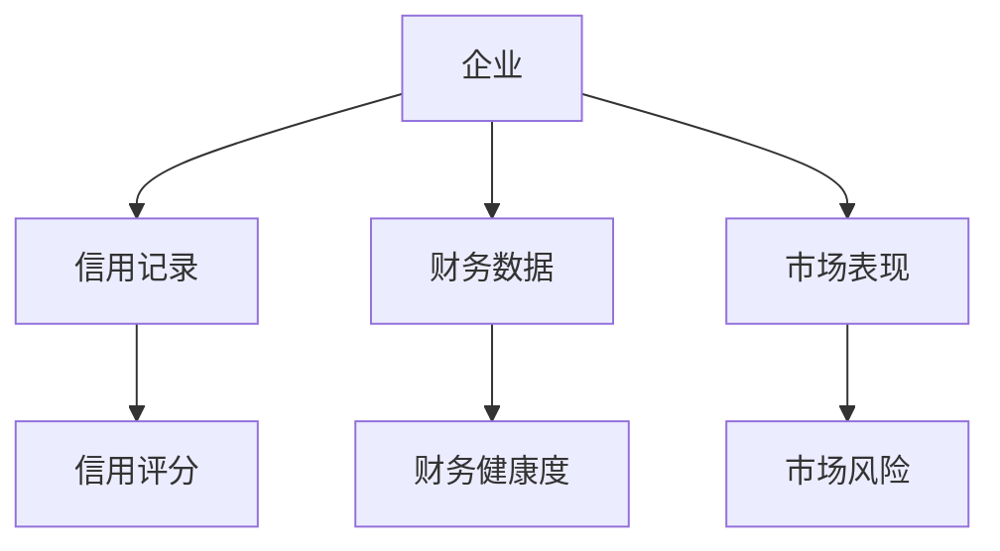
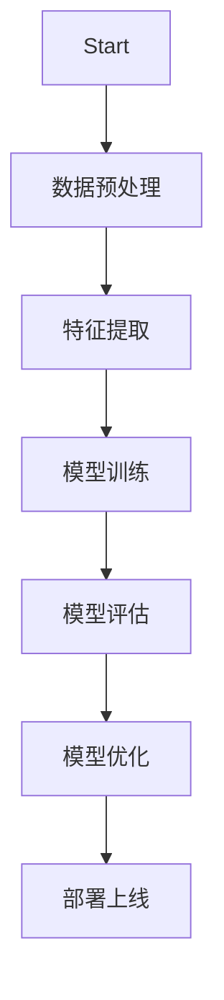
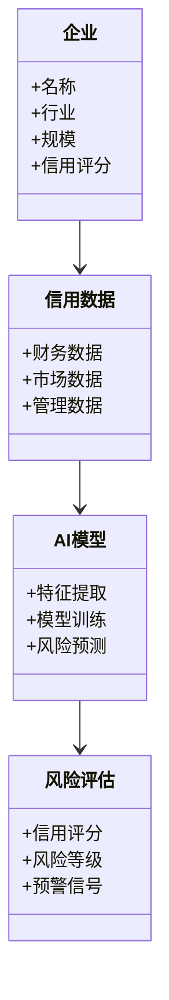
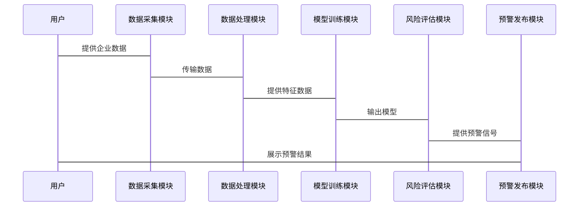

                 


# AI驱动的企业信用风险早期预警系统

> 关键词：企业信用风险，AI，早期预警，机器学习，风险评估

> 摘要：本文详细探讨了如何利用人工智能技术构建企业信用风险早期预警系统。通过分析企业信用风险的核心特征，结合机器学习算法，提出了一种基于AI的信用风险评估模型，并设计了系统的整体架构。文章还通过实际案例展示了系统的实现过程，并提出了系统的优化建议和未来发展方向。

---

# 第一章: 背景介绍

## 1.1 问题背景

### 1.1.1 企业信用风险的定义与重要性
企业信用风险是指企业在经营过程中由于内部或外部因素导致无法履行偿债义务的可能性。它是企业经营中的核心风险之一，直接影响企业的生存和发展。传统的信用风险评估方法通常依赖于财务数据和人工分析，存在效率低、覆盖面窄、预测精度不足等问题。

### 1.1.2 传统信用风险评估的局限性
- 数据来源单一，难以全面反映企业的信用状况。
- 人工分析主观性强，容易受到人为因素的干扰。
- 风险预警滞后，难以实现早期干预。

### 1.1.3 AI技术在信用风险评估中的应用潜力
AI技术（特别是机器学习）能够从海量数据中提取特征，发现传统方法难以察觉的规律，从而提高信用风险评估的准确性和效率。

## 1.2 问题描述

### 1.2.1 企业信用风险的多维度特征
企业信用风险的评估需要考虑多个维度，包括财务数据、市场表现、管理能力、行业环境等。这些维度相互作用，共同影响企业的信用状况。

### 1.2.2 早期预警的重要性
早期预警能够帮助金融机构及时发现潜在风险，采取措施降低损失。传统的信用风险评估往往在风险发生后才被发现，而早期预警系统可以在风险萌芽阶段发出警报。

### 1.2.3 当前信用风险评估的主要挑战
- 数据量大且异构性高，难以有效处理。
- 模型的可解释性不足，影响实际应用。
- 实时性要求高，对系统性能提出更高挑战。

## 1.3 问题解决

### 1.3.1 AI驱动的解决方案概述
通过收集和分析企业的多维度数据，利用机器学习算法构建信用风险评估模型，实现对企业的信用风险的早期预警。

### 1.3.2 数据驱动的信用风险评估方法
基于企业的财务数据、市场表现、行业趋势等多源数据，构建数据驱动的信用风险评估体系。

### 1.3.3 机器学习在信用风险预警中的应用
利用监督学习、无监督学习等机器学习算法，对企业的信用风险进行分类、聚类和预测。

## 1.4 系统边界与外延

### 1.4.1 系统的功能边界
系统主要功能包括数据采集、特征提取、模型训练、风险评估和预警发布。

### 1.4.2 系统的输入与输出
- 输入：企业的财务数据、市场数据、管理数据等。
- 输出：信用风险评估结果、风险预警信号。

### 1.4.3 系统与其他系统的交互
系统需要与数据源、金融机构的业务系统以及用户界面进行交互。

## 1.5 核心概念结构与组成

### 1.5.1 核心概念的层次结构
- 顶层概念：企业信用风险。
- 中层概念：财务数据、市场数据、管理数据。
- 底层概念：信用评分、风险预警信号。

### 1.5.2 核心要素的定义与关系
- 企业信用数据：包括财务数据、市场数据、管理数据等。
- AI模型：用于处理和分析信用数据，生成信用评分和预警信号。
- 风险评估结果：基于模型输出的信用评分和预警信号，提供风险评估报告。

## 1.6 本章小结

---

# 第二章: 核心概念与联系

## 2.1 核心概念原理

### 2.1.1 企业信用数据的特征分析
企业信用数据具有多维性、动态性和复杂性。需要从财务、市场、管理等多个维度进行特征提取。

### 2.1.2 AI模型在信用评估中的作用
AI模型能够从海量数据中提取特征，发现数据之间的隐含关系，提高信用风险评估的准确性和效率。

### 2.1.3 早期预警机制的实现原理
通过实时监控企业的信用数据，利用AI模型进行风险预测，及时发出预警信号。

## 2.2 核心概念属性特征对比

### 2.2.1 企业信用数据的特征对比表
| 特征维度 | 描述 |
|----------|------|
| 财务数据 | 包括收入、利润、资产负债率等财务指标 |
| 市场数据 | 包括行业趋势、市场竞争状况等 |
| 管理数据 | 包括管理团队稳定性、战略决策能力等 |

### 2.2.2 不同AI模型的性能对比
| 模型类型 | 优点 | 缺点 |
|---------|------|------|
| 支持向量机 | 高精度 | 参数敏感 |
| 随机森林 | 鲁棒性好 | 解释性差 |
| 神经网络 | 高度非线性建模 | 训练时间长 |

### 2.2.3 早期预警系统的指标对比
| 指标 | 描述 | 优劣对比 |
|------|------|----------|
| 精准度 | 预警信号的准确性 | 高精准度可能忽略部分潜在风险 |
| 召回率 | 预警信号的全面性 | 高召回率可能导致误报 |

## 2.3 ER实体关系图



## 2.4 本章小结

---

# 第三章: 算法原理讲解

## 3.1 算法选择与原理

### 3.1.1 机器学习算法的选择标准
- 数据类型与规模
- 模型的可解释性要求
- 计算资源限制

### 3.1.2 常见算法的优缺点对比
| 模型类型 | 优点 | 缺点 |
|---------|------|------|
| 逻辑回归 | 线性可解释 | 非线性关系处理能力有限 |
| 支持向量机 | 高精度 | 参数敏感 |
| 随机森林 | 鲁棒性好 | 解释性差 |

### 3.1.3 最终选择的算法及其原理
选择随机森林作为最终算法。随机森林是一种基于树的集成学习方法，能够处理高维数据，具有较强的抗过拟合能力。

## 3.2 算法流程图



## 3.3 算法实现代码

```python
import pandas as pd
from sklearn.ensemble import RandomForestClassifier
from sklearn.metrics import accuracy_score

# 加载数据
data = pd.read_csv('credit_data.csv')

# 特征工程
X = data.drop('label', axis=1)
y = data['label']

# 模型训练
model = RandomForestClassifier()
model.fit(X, y)

# 模型评估
y_pred = model.predict(X)
print("Accuracy:", accuracy_score(y, y_pred))
```

## 3.4 数学模型与公式

### 3.4.1 逻辑回归模型
$$ P(y=1|x) = \frac{1}{1 + e^{- (w x + b)}} $$

### 3.4.2 随机森林模型
随机森林通过构建多棵决策树，并对结果进行投票或平均，最终得到预测结果。公式如下：
$$ y = \text{投票结果} \text{或平均结果} $$

## 3.5 本章小结

---

# 第四章: 系统分析与架构设计方案

## 4.1 问题场景介绍
企业信用风险早期预警系统需要实时监控企业的信用数据，快速识别潜在风险，及时发出预警信号。

## 4.2 项目介绍
本项目旨在构建一个基于AI的企业信用风险早期预警系统，帮助企业或金融机构提前识别和管理信用风险。

## 4.3 系统功能设计

### 4.3.1 领域模型


### 4.3.2 系统架构设计


### 4.3.3 系统接口设计
- 数据接口：与企业数据源对接。
- 用户接口：提供预警结果的展示和查询功能。

### 4.3.4 系统交互设计


## 4.4 本章小结

---

# 第五章: 项目实战

## 5.1 环境安装
- 安装Python和必要的库（如Pandas、Scikit-learn、Mermaid等）。

## 5.2 系统核心实现源代码

### 5.2.1 数据预处理
```python
import pandas as pd
from sklearn.impute import SimpleImputer
from sklearn.preprocessing import StandardScaler

# 加载数据
data = pd.read_csv('credit_data.csv')

# 处理缺失值
imputer = SimpleImputer(strategy='mean')
data_imputed = imputer.fit_transform(data)

# 标准化处理
scaler = StandardScaler()
data_scaled = scaler.fit_transform(data_imputed)
```

### 5.2.2 特征提取
```python
from sklearn.feature_selection import SelectFromModel
from sklearn.ensemble import RandomForestClassifier

# 特征选择
selector = SelectFromModel(RandomForestClassifier())
selector.fit(data_scaled, labels)
selected_features = selector.transform(data_scaled)
```

### 5.2.3 模型训练与评估
```python
from sklearn.model_selection import train_test_split
from sklearn.metrics import classification_report

# 划分数据集
X_train, X_test, y_train, y_test = train_test_split(selected_features, labels, test_size=0.2)

# 模型训练
model = RandomForestClassifier()
model.fit(X_train, y_train)

# 模型评估
y_pred = model.predict(X_test)
print(classification_report(y_test, y_pred))
```

## 5.3 实际案例分析
通过一个实际案例，展示系统的实现过程和效果。

## 5.4 本章小结

---

# 第六章: 最佳实践、小结与展望

## 6.1 最佳实践
- 数据预处理是关键，尤其是缺失值和异常值的处理。
- 特征选择能够显著提高模型的性能。
- 模型的可解释性在实际应用中非常重要。

## 6.2 小结
本文详细探讨了AI驱动的企业信用风险早期预警系统的构建过程，从背景分析到算法实现，再到系统设计和项目实战，全面展示了系统的实现过程。

## 6.3 注意事项
- 数据隐私和安全问题需要高度重视。
- 模型的实时性和可扩展性需要在实际应用中进一步优化。
- 系统的维护和更新需要持续进行，以适应市场环境的变化。

## 6.4 拓展阅读
推荐阅读相关领域的经典文献和最新研究成果，进一步深入学习和探索。

---

# 附录

## 附录A: 代码实现细节
详细说明代码实现的每一步，包括数据加载、特征提取、模型训练等。

## 附录B: 系统架构图
展示系统架构的详细设计图。

---

# 结语

通过本文的介绍，读者可以全面了解AI驱动的企业信用风险早期预警系统的构建过程，并能够实际操作和应用。未来，随着AI技术的不断发展，企业信用风险评估将更加智能化和精准化。

