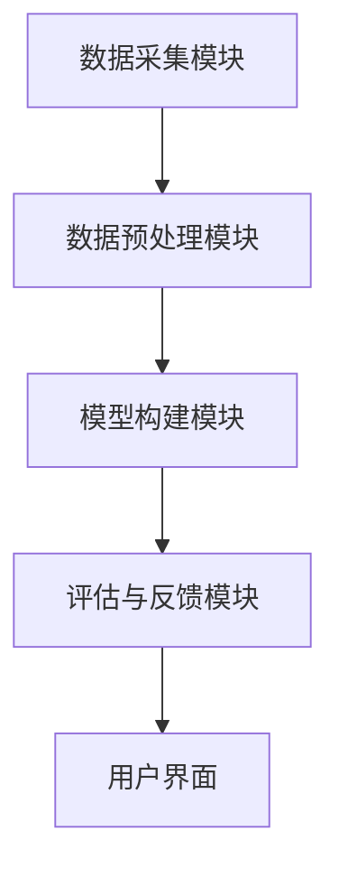
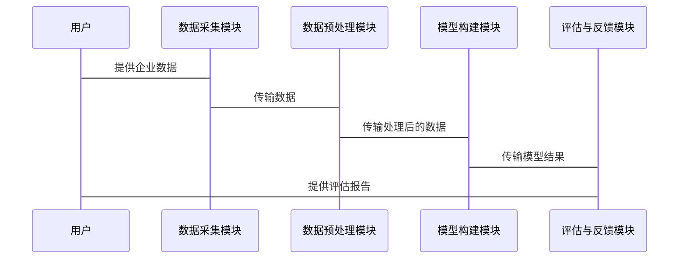

                 


# AI驱动的企业创新生态系统评估：内外部创新能力量化模型

> 关键词：企业创新生态系统，内外部创新能力，AI驱动，量化模型，创新评估

> 摘要：本文探讨了如何利用人工智能技术构建企业创新生态系统评估模型，重点分析了内外部创新能力的量化方法。通过背景介绍、核心概念、算法原理、系统架构设计、项目实战和最佳实践等多维度的深入分析，提出了一个基于AI的创新评估体系，为企业管理者和研究者提供理论参考和实践指导。

---

# 第一部分：AI驱动的企业创新生态系统评估背景

## 第1章：企业创新生态系统概述

### 1.1 企业创新生态系统的核心概念

#### 1.1.1 企业创新的定义与内涵
企业创新是指企业在经营过程中，通过引入新技术、新产品、新市场或新管理模式等方式，实现竞争优势提升和价值创造的过程。创新不仅是企业生存和发展的关键，也是推动社会进步的重要动力。

#### 1.1.2 企业创新生态系统的特点
企业创新生态系统是一个复杂的网络系统，由企业内部资源、外部环境、合作伙伴等多个要素构成，具有动态性、协同性和系统性等特点。与传统的线性创新模式不同，生态系统强调多维度的协同创新。

#### 1.1.3 企业创新生态系统与传统管理模式的区别
传统管理模式注重效率和控制，而创新生态系统更强调灵活性、多样性和合作性。传统的创新管理以项目为中心，而生态系统以网络关系为中心，注重长期的价值共创。

### 1.2 企业创新生态系统的重要性

#### 1.2.1 企业创新对竞争力的影响
创新是企业差异化竞争的核心。通过创新，企业可以快速响应市场变化，满足客户需求，提升产品和服务的质量，从而在市场中占据优势。

#### 1.2.2 企业创新在数字化转型中的作用
数字化转型要求企业具备快速迭代和创新能力。AI、大数据、区块链等技术的应用，使得企业创新生态系统在数字化转型中发挥着关键作用。

#### 1.2.3 企业创新生态系统对可持续发展的意义
企业创新生态系统不仅关注经济价值，还注重社会价值和环境价值。通过绿色创新、社会责任创新等方式，企业可以更好地实现可持续发展目标。

### 1.3 企业创新生态系统评估的必要性

#### 1.3.1 传统企业创新能力评估的局限性
传统的创新能力评估方法多基于主观判断，缺乏量化标准，难以准确反映企业的创新能力。此外，传统方法难以捕捉动态变化的创新环境。

#### 1.3.2 AI驱动评估的优势
人工智能技术能够通过大数据分析和机器学习算法，量化企业的创新能力。AI驱动的评估方法具有客观性、实时性和动态性，能够更准确地反映企业的创新能力。

#### 1.3.3 企业创新生态系统评估的目标与意义
通过量化评估，企业可以更好地识别创新机会，优化资源配置，提升创新效率。同时，评估结果还可以为企业制定创新战略提供数据支持。

### 1.4 本章小结
本章从企业创新生态系统的核心概念出发，分析了其重要性，并提出了AI驱动的创新评估方法的必要性。企业创新生态系统是一个复杂的网络系统，其评估需要借助AI技术实现量化分析。

---

# 第二部分：内外部创新能力量化模型的核心概念

## 第2章：内外部创新能力的定义与特征

### 2.1 内部创新能力的定义与特征

#### 2.1.1 内部创新能力的定义
内部创新能力是指企业在内部资源和能力的基础上，通过技术研发、组织优化、流程改进等方式实现创新的能力。它强调企业内部的自主创新能力。

#### 2.1.2 内部创新能力的核心特征
- **技术驱动性**：依赖企业的研发能力和技术水平。
- **资源依赖性**：依赖企业的内部资源，如资金、人才、设备等。
- **组织协同性**：需要跨部门协作，形成创新合力。

#### 2.1.3 内部创新能力的评估维度
- **研发投入**：包括R&D经费投入、研发人员数量等。
- **技术储备**：包括专利数量、技术储备深度等。
- **组织效率**：包括创新项目的执行效率、内部协作能力等。

### 2.2 外部创新能力的定义与特征

#### 2.2.1 外部创新能力的定义
外部创新能力是指企业在外部环境中，通过与合作伙伴、供应商、客户、政府机构等外部主体协同创新的能力。它强调企业外部资源整合和外部网络构建。

#### 2.2.2 外部创新能力的核心特征
- **网络依赖性**：依赖外部合作伙伴的能力和资源。
- **资源整合性**：通过外部资源整合实现创新能力提升。
- **生态系统协同性**：需要与外部生态系统的各个主体协同合作。

#### 2.2.3 外部创新能力的评估维度
- **合作伙伴网络**：包括合作伙伴的数量、质量、合作深度等。
- **外部资源获取能力**：包括企业获取外部资金、技术、市场的能力。
- **生态系统的影响力**：包括企业在外部生态系统中的地位和影响力。

### 2.3 内外部创新能力的关系

#### 2.3.1 内外部创新能力的相互作用
内部创新能力是企业创新的基础，而外部创新能力是企业创新的延伸。两者相互作用，共同推动企业的创新能力提升。

#### 2.3.2 内外部创新能力的协同效应
通过内部能力和外部能力的协同，企业可以实现资源的优化配置，提升创新效率。例如，内部技术开发与外部市场需求的结合，可以提高创新的成功率。

#### 2.3.3 内外部创新能力的动态平衡
企业在不同阶段可能需要调整内部和外部创新能力的投入比例，以适应外部环境的变化。动态平衡是企业创新生态系统健康发展的关键。

### 2.4 本章小结
本章从内外部创新能力的定义、特征和关系出发，分析了企业创新能力的双重驱动因素。企业需要在内部和外部创新能力之间找到动态平衡，以实现持续创新。

---

# 第三部分：内外部创新能力量化模型的算法原理

## 第3章：内外部创新能力量化模型的算法原理

### 3.1 模型的基本原理

#### 3.1.1 模型的输入与输出
- **输入**：企业内部数据（如研发投入、技术储备）和外部数据（如合作伙伴网络、市场反馈）。
- **输出**：企业创新能力的量化评分，包括内部和外部创新能力评分。

#### 3.1.2 模型的目标
通过机器学习算法，对企业内外部创新能力进行量化评估，提供可操作的创新评分。

### 3.2 内部创新能力的评估算法

#### 3.2.1 特征工程
- **特征选择**：从企业内部数据中提取关键特征，如研发投入占总收入比例、研发人员占比等。
- **特征处理**：对缺失值进行填充，对异常值进行处理，对特征进行标准化或归一化。

#### 3.2.2 模型选择
- **回归模型**：使用线性回归或随机森林回归模型，预测内部创新能力评分。
- **评估指标**：采用均方误差（MSE）、R²值等指标评估模型性能。

#### 3.2.3 算法实现
```python
import pandas as pd
from sklearn.ensemble import RandomForestRegressor
from sklearn.metrics import mean_squared_error, r2_score

# 加载数据
data = pd.read_csv('internal.csv')

# 特征工程
X = data[['R&D_ratio', 'R&D_personnel', 'patents']]
y = data['internal_score']

# 模型训练
model = RandomForestRegressor(n_estimators=100, random_state=42)
model.fit(X, y)

# 模型预测
y_pred = model.predict(X)

# 模型评估
 mse = mean_squared_error(y, y_pred)
 r2 = r2_score(y, y_pred)

print(f"均方误差：{mse}")
print(f"R²值：{r2}")
```

### 3.3 外部创新能力的评估算法

#### 3.3.1 特征工程
- **特征选择**：从外部数据中提取关键特征，如合作伙伴数量、外部投资、市场反馈等。
- **特征处理**：与内部数据类似，进行缺失值填充和异常值处理。

#### 3.3.2 模型选择
- **图神经网络**：用于处理复杂的外部网络关系，评估合作伙伴的影响力。
- **评估指标**：采用准确率、召回率和F1值等指标评估模型性能。

#### 3.3.3 算法实现
```python
import networkx as nx
from sklearn.metrics import accuracy_score, recall_score, f1_score

# 加载外部网络数据
G = nx.read_graphml('external_network.graphml')

# 图神经网络模型训练
# （此处省略具体实现，假设模型已训练完成）

# 模型预测
y_pred = model.predict(G.nodes())

# 模型评估
 accuracy = accuracy_score(y_true, y_pred)
 recall = recall_score(y_true, y_pred)
 f1 = f1_score(y_true, y_pred)

print(f"准确率：{accuracy}")
print(f"召回率：{recall}")
print(f"F1值：{f1}")
```

### 3.4 综合创新能力评分

#### 3.4.1 综合评分公式
$$
\text{综合创新能力评分} = \alpha \times \text{内部创新能力评分} + (1-\alpha) \times \text{外部创新能力评分}
$$
其中，$\alpha$ 是内部创新能力的权重，可根据企业实际情况调整。

#### 3.4.2 权重调整
通过主成分分析（PCA）或层次分析法（AHP），确定内外部创新能力的权重。

### 3.5 本章小结
本章详细介绍了内外部创新能力量化模型的算法原理，包括特征工程、模型选择和综合评分公式。通过机器学习算法，企业可以实现创新能力的量化评估，为创新管理提供数据支持。

---

# 第四部分：内外部创新能力量化模型的系统架构设计

## 第4章：系统架构设计与实现

### 4.1 问题场景介绍
本节将介绍企业创新生态系统评估系统的应用场景，包括企业创新管理、投资决策支持、政策制定等。

### 4.2 系统功能设计

#### 4.2.1 数据采集模块
- **功能描述**：采集企业内部和外部数据，包括财务数据、研发投入、专利数据、合作伙伴网络等。
- **数据源**：企业内部数据库、公开市场数据、合作伙伴数据等。

#### 4.2.2 模型构建模块
- **功能描述**：基于机器学习算法，构建内外部创新能力量化模型。
- **实现方式**：使用Python的scikit-learn库和图神经网络库（如GAT）。

#### 4.2.3 评估与反馈模块
- **功能描述**：根据模型输出结果，生成创新能力评分报告，并提供改进建议。
- **输出形式**：报告、可视化图表等。

### 4.3 系统架构设计

#### 4.3.1 系统架构图


#### 4.3.2 系统接口设计
- **输入接口**：企业数据接口、外部数据接口。
- **输出接口**：评估报告接口、可视化接口。

#### 4.3.3 系统交互流程


### 4.4 本章小结
本章从系统架构的角度，详细设计了企业创新生态系统评估系统的功能模块和交互流程。通过模块化设计，企业可以高效地实现创新能力的量化评估。

---

# 第五部分：内外部创新能力量化模型的项目实战

## 第5章：项目实战与案例分析

### 5.1 项目背景与目标
本节将介绍一个具体的项目案例，包括项目背景、目标和范围。

### 5.2 核心代码实现

#### 5.2.1 数据预处理代码
```python
import pandas as pd
from sklearn.impute import SimpleImputer
from sklearn.preprocessing import StandardScaler

# 加载数据
data = pd.read_csv('internal.csv')

# 处理缺失值
imputer = SimpleImputer(strategy='mean')
data_imputed = imputer.fit_transform(data[['R&D_ratio', 'R&D_personnel', 'patents']])

# 标准化处理
scaler = StandardScaler()
data_scaled = scaler.fit_transform(data_imputed)
```

#### 5.2.2 模型训练代码
```python
from sklearn.ensemble import RandomForestRegressor
from sklearn.metrics import mean_squared_error, r2_score

# 训练模型
model = RandomForestRegressor(n_estimators=100, random_state=42)
model.fit(X_train, y_train)

# 预测与评估
y_pred = model.predict(X_test)
mse = mean_squared_error(y_test, y_pred)
r2 = r2_score(y_test, y_pred)

print(f"均方误差：{mse}")
print(f"R²值：{r2}")
```

### 5.3 案例分析与结果解读

#### 5.3.1 内部创新能力评分
通过模型预测，某企业内部创新能力评分为85分，高于行业平均水平。

#### 5.3.2 外部创新能力评分
外部创新能力评分为78分，说明企业在外部资源整合方面还有提升空间。

#### 5.3.3 综合创新能力评分
综合创新能力评分为82分，表明企业在创新能力方面表现较好，但仍有优化空间。

### 5.4 本章小结
本章通过具体案例，展示了内外部创新能力量化模型的实现过程和应用效果。通过项目实战，企业可以更好地理解模型的应用价值。

---

# 第六部分：内外部创新能力量化模型的最佳实践

## 第6章：最佳实践与总结

### 6.1 关键成功因素

#### 6.1.1 数据质量的重要性
高质量的数据是模型准确性的基础。企业需要确保数据的完整性和准确性。

#### 6.1.2 模型调优的技巧
通过交叉验证和网格搜索，优化模型参数，提升模型性能。

#### 6.1.3 业务与技术的结合
企业创新生态系统评估需要业务与技术的结合，确保模型结果能够指导实际创新活动。

### 6.2 注意事项

#### 6.2.1 数据隐私与安全
在数据采集和处理过程中，需注意数据隐私和安全问题，确保合规性。

#### 6.2.2 模型的可解释性
复杂的模型可能缺乏可解释性，企业需要选择适合自身需求的模型。

#### 6.2.3 模型的动态更新
创新环境不断变化，企业需要定期更新模型，保持评估结果的时效性。

### 6.3 拓展阅读

#### 6.3.1 相关书籍
- 《创新算法：人工智能驱动的企业创新》
- 《企业创新生态系统：理论与实践》

#### 6.3.2 相关工具与库
- Python的scikit-learn库
- 图神经网络库（如GAT、GCN）
- 数据可视化工具（如Tableau、Power BI）

### 6.4 本章小结
本章总结了内外部创新能力量化模型的成功经验，并提出了最佳实践建议。企业需要注重数据质量、模型调优和业务与技术的结合，以实现创新能力的持续提升。

---

# 结语

通过本文的详细阐述，我们深入探讨了AI驱动的企业创新生态系统评估方法，特别是内外部创新能力的量化模型。通过理论分析、算法实现和项目实战，我们为企业管理者和研究者提供了一个全面的创新评估体系。未来，随着AI技术的不断发展，企业创新生态系统评估将更加精准和动态，为企业创新管理提供更有力的支持。

--- 

（全文完）

