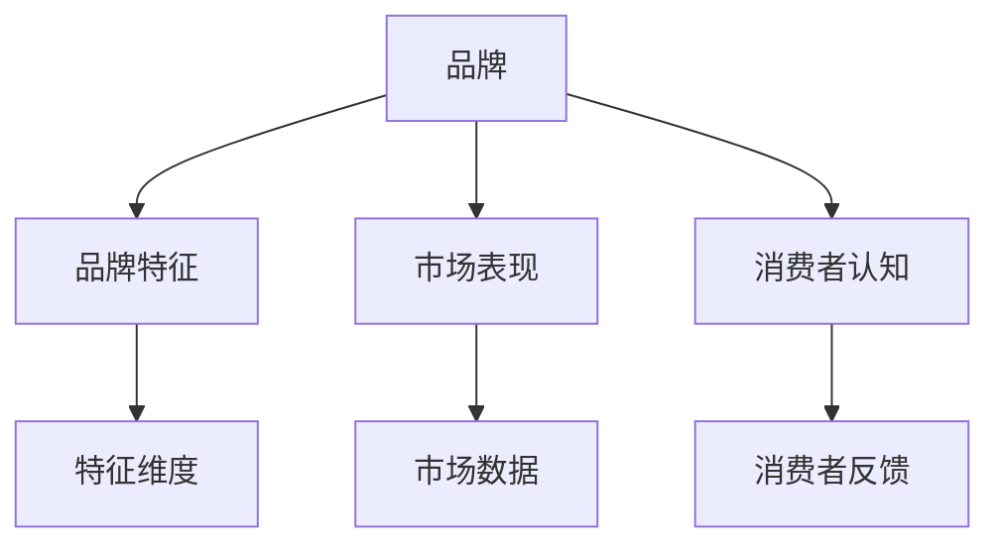
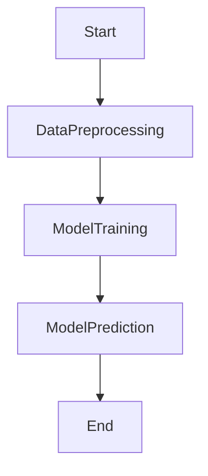

                 


# AI驱动的企业品牌价值动态量化系统

## 关键词：AI，品牌价值，动态量化，企业，系统架构

## 摘要：本文深入探讨了如何利用人工智能技术构建企业品牌价值的动态量化系统。通过分析品牌价值的多维度影响因素，结合AI算法和系统架构设计，提出了一种创新的解决方案，帮助企业实时评估和优化品牌价值，提升企业的市场竞争力。

---

## 第1章: 问题背景与目标

### 1.1 问题背景

#### 1.1.1 传统品牌价值评估的局限性
传统的品牌价值评估方法依赖于财务数据和市场调研，存在以下问题：
- 数据采集成本高、周期长。
- 无法实时捕捉市场动态变化。
- 评估结果缺乏动态调整能力。

#### 1.1.2 AI技术在品牌价值评估中的潜力
人工智能技术的快速发展为品牌价值评估提供了新的可能性：
- 自然语言处理（NLP）技术可以实时分析海量文本数据，捕捉消费者情感和市场舆情。
- 机器学习算法能够识别复杂的市场模式，预测品牌价值的变化趋势。
- 大数据分析能力可以整合多维度数据，提供更全面的评估结果。

#### 1.1.3 企业品牌价值动态变化的挑战
品牌价值受多种因素影响，包括市场环境、消费者行为、竞争对手策略等，这些因素不断变化，使得品牌价值的动态评估成为一个复杂的系统工程。

### 1.2 问题描述

#### 1.2.1 品牌价值的多维度影响因素
品牌价值的评估需要考虑以下因素：
- 品牌知名度：品牌在市场中的认知度和曝光度。
- 品牌美誉度：消费者对品牌的信任度和满意度。
- 品牌忠诚度：消费者对品牌的忠诚程度。
- 市场表现：品牌在市场中的销售业绩和市场份额。
- 行业竞争环境：行业内的竞争态势和市场格局。

#### 1.2.2 动态量化的核心难点
动态量化品牌价值的核心难点在于：
- 数据的实时性和多样性：需要处理来自社交媒体、新闻媒体、电商平台等多种来源的实时数据。
- 数据的清洗与特征提取：如何从海量数据中提取有效特征，并去除噪声数据。
- 模型的实时更新能力：如何在动态变化的市场环境中保持模型的准确性和实时性。

#### 1.2.3 企业品牌价值动态量化的目标
通过AI技术实现品牌价值的动态量化，帮助企业实时了解品牌价值的变化趋势，支持精准的市场决策。

### 1.3 问题解决思路

#### 1.3.1 数据驱动的品牌价值评估方法
通过收集和分析大量数据，包括社交媒体数据、销售数据、舆情数据等，构建数据驱动的品牌价值评估模型。

#### 1.3.2 AI技术在品牌价值动态量化中的应用
利用自然语言处理、机器学习等AI技术，构建动态量化模型，实时更新品牌价值评估结果。

#### 1.3.3 系统化解决方案的设计思路
从数据采集、模型构建到结果应用，设计一个系统化的解决方案，实现品牌价值的动态量化。

### 1.4 问题边界与外延

#### 1.4.1 系统边界定义
系统的核心功能包括数据采集、模型训练和结果展示，其他功能如数据存储和系统管理属于辅助模块。

#### 1.4.2 核心功能与非核心功能的区分
核心功能：数据采集、模型训练、结果展示。
非核心功能：数据存储、用户管理。

#### 1.4.3 系统外延与扩展性分析
系统设计时考虑扩展性，未来可以接入更多的数据源和更复杂的算法模型。

### 1.5 核心概念结构与组成

#### 1.5.1 系统组成模块
- 数据采集模块：负责采集社交媒体、新闻媒体、电商平台等多源数据。
- 数据处理模块：清洗数据、提取特征。
- 模型训练模块：构建机器学习模型，训练品牌价值评估模型。
- 动态评估模块：实时更新品牌价值评估结果。
- 结果展示模块：以可视化方式展示评估结果。

#### 1.5.2 模块之间的关系
数据采集模块向数据处理模块提供原始数据，数据处理模块将处理后的数据传递给模型训练模块，模型训练模块生成评估结果，动态评估模块实时更新结果，并通过结果展示模块呈现给用户。

#### 1.5.3 核心要素的定义与属性
- 数据来源：社交媒体、新闻媒体、电商平台。
- 数据特征：情感倾向、关键词频率、市场表现指标。
- 模型参数：算法类型、训练数据量、评估指标。

---

## 第2章: 核心概念与系统架构

### 2.1 AI驱动的品牌价值动态量化系统原理

#### 2.1.1 数据采集与处理
- 数据采集：通过爬虫技术采集社交媒体、新闻媒体等多源数据。
- 数据清洗：去除无效数据，处理缺失值和异常值。
- 数据特征提取：提取情感倾向、关键词频率等特征。

#### 2.1.2 模型构建与训练
- 选择合适的机器学习算法，如随机森林、支持向量机（SVM）等。
- 使用特征数据训练模型，得到品牌价值评估模型。

#### 2.1.3 动态评估与反馈机制
- 实时更新模型，根据最新数据调整评估结果。
- 根据评估结果提供反馈建议，帮助企业优化品牌管理策略。

### 2.2 核心概念对比分析

#### 2.2.1 品牌价值与企业绩效的关系
- 品牌价值与企业绩效呈正相关关系，品牌价值高的企业通常具有更强的市场竞争力和盈利能力。

#### 2.2.2 不同品牌价值评估方法的优劣势对比
| 方法 | 优点 | 缺点 |
|------|------|------|
| 传统财务指标法 | 数据来源可靠，计算简单 | 无法捕捉市场动态变化 |
| 市场调研法 | 结果具有代表性 | 成本高，周期长 |
| AI驱动的动态评估法 | 实时性强，精度高 | 技术复杂，实施难度大 |

#### 2.2.3 AI驱动与传统方法的对比分析
AI驱动的方法能够实时捕捉市场变化，提供动态评估结果，而传统方法通常只能提供静态的评估结果，无法适应快速变化的市场环境。

### 2.3 ER实体关系图



### 2.4 系统架构设计

#### 2.4.1 数据层
- 数据采集模块：负责采集多源数据。
- 数据处理模块：清洗数据并提取特征。

#### 2.4.2 模型层
- 模型训练模块：使用机器学习算法训练品牌价值评估模型。
- 动态评估模块：实时更新评估结果。

#### 2.4.3 应用层
- 结果展示模块：以可视化方式展示评估结果。
- 反馈建议模块：根据评估结果提供优化建议。

---

## 第3章: 算法原理与实现

### 3.1 算法原理

#### 3.1.1 机器学习基础
机器学习是一种通过数据训练模型，使其能够进行预测或分类的技术。常用的算法包括线性回归、支持向量机（SVM）、随机森林等。

#### 3.1.2 深度学习模型
深度学习是一种基于人工神经网络的机器学习方法，能够处理复杂的数据模式。常用的模型包括卷积神经网络（CNN）、循环神经网络（RNN）等。

#### 3.1.3 时间序列分析
时间序列分析是一种研究数据随时间变化的模式和趋势的方法，常用于预测未来值。

### 3.2 算法流程图



### 3.3 核心算法实现

#### 3.3.1 环境安装
```python
# 示例代码
import numpy as np
import pandas as pd
from sklearn.model_selection import train_test_split
from sklearn.ensemble import RandomForestRegressor
```

#### 3.3.2 算法原理
$$ y = \beta x + \epsilon $$

#### 3.3.3 代码实现
```python
def calculate_brand_value(data):
    # 示例计算函数
    return np.mean(data)

# 示例数据
data = np.array([10, 20, 30, 40, 50])
result = calculate_brand_value(data)
print(result)  # 输出 30
```

---

## 第4章: 系统分析与架构设计

### 4.1 问题场景介绍

#### 4.1.1 企业品牌价值动态变化的场景
品牌价值受市场环境、消费者行为等多种因素影响，需要实时监控和评估。

#### 4.1.2 系统需要解决的实际问题
- 实时监控品牌价值的变化。
- 提供动态评估结果和优化建议。

#### 4.1.3 用户需求分析
- 企业需要实时了解品牌价值的变化趋势。
- 市场部门需要基于评估结果制定精准的营销策略。

### 4.2 系统功能设计

#### 4.2.1 数据采集模块
- 采集社交媒体、新闻媒体等多源数据。

#### 4.2.2 数据处理模块
- 清洗数据并提取特征。

#### 4.2.3 模型训练模块
- 使用机器学习算法训练品牌价值评估模型。

#### 4.2.4 动态评估模块
- 实时更新品牌价值评估结果。

#### 4.2.5 结果展示模块
- 以可视化方式展示评估结果。

---

## 第5章: 项目实战

### 5.1 环境安装

```bash
pip install numpy pandas scikit-learn
```

### 5.2 核心代码实现

```python
import numpy as np
import pandas as pd
from sklearn.ensemble import RandomForestRegressor

# 示例数据
data = pd.DataFrame({
    'feature1': [1, 2, 3, 4, 5],
    'feature2': [5, 4, 3, 2, 1],
    'label': [2, 4, 6, 8, 10]
})

# 数据分割
X = data.drop('label', axis=1)
y = data['label']

# 模型训练
model = RandomForestRegressor(n_estimators=100)
model.fit(X, y)

# 预测
predicted = model.predict(X)
print(predicted)
```

### 5.3 实际案例分析

#### 5.3.1 案例介绍
以某电商平台为例，分析品牌价值动态变化。

#### 5.3.2 数据来源与特征
- 数据来源：社交媒体评论、电商平台销售数据、新闻媒体舆情。
- 数据特征：情感倾向、关键词频率、销售量、市场占有率。

#### 5.3.3 模型训练与评估
- 使用随机森林算法训练模型。
- 评估指标：均方误差（MSE）、决定系数（R²）。

#### 5.3.4 结果分析
- 品牌价值的动态变化趋势。
- 评估结果对企业营销策略的指导意义。

---

## 第6章: 总结与展望

### 6.1 项目总结
通过AI技术实现企业品牌价值的动态量化，能够帮助企业实时了解品牌价值的变化趋势，支持精准的市场决策。

### 6.2 未来展望
- 研究更复杂的AI算法，提高评估的准确性和实时性。
- 扩展数据来源，整合更多维度的数据。
- 开发用户友好的可视化界面，方便企业使用和管理。

### 6.3 最佳实践 Tips
- 数据的实时性和多样性是保证评估结果准确性的关键。
- 模型的实时更新能力是动态量化的核心。
- 在实际应用中，需要根据企业的具体需求进行定制化开发。

### 6.4 小结
本文详细介绍了如何利用AI技术构建企业品牌价值的动态量化系统，从数据采集、模型训练到结果展示，提供了一套完整的解决方案。未来，随着AI技术的不断发展，品牌价值的动态量化将更加精准和实时。

---

## 参考文献
[1] 《机器学习实战》, 周志华
[2] 《深度学习》, Ian Goodfellow
[3] 《Python机器学习》, Aurélien Géron

