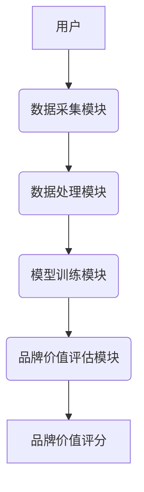

                 


# AI驱动的企业品牌价值量化评估系统

> 关键词：AI，企业品牌价值，量化评估，系统架构，算法原理，项目实战

> 摘要：本文深入探讨了如何利用人工智能技术驱动企业品牌价值的量化评估。通过分析品牌价值的核心要素、构建多维度评估模型、设计AI算法和系统架构，本文提供了一套完整的解决方案。文章还结合实际案例，详细讲解了系统实现和应用，为企业的品牌价值管理提供了新的思路。

---

# 第一部分：背景介绍

## 第1章：AI驱动的企业品牌价值量化评估系统概述

### 1.1 问题背景与必要性

#### 1.1.1 传统品牌价值评估的局限性
传统的品牌价值评估方法依赖于财务数据和主观判断，难以量化品牌的核心价值。企业难以通过数据驱动的方式优化品牌策略，导致品牌价值评估缺乏科学性和实时性。

#### 1.1.2 数字化时代品牌价值评估的新需求
在数字化时代，品牌价值受到社交媒体、用户行为和市场反馈等多方面的影响。企业需要一种动态、实时的评估方法，以应对快速变化的市场环境。

#### 1.1.3 AI技术在品牌价值评估中的优势
人工智能技术可以通过海量数据分析、自然语言处理和深度学习模型，帮助企业从多维度量化品牌价值，提供实时反馈和优化建议。

### 1.2 问题描述与目标

#### 1.2.1 品牌价值的定义与关键要素
品牌价值是指品牌为企业带来的长期经济价值，包括品牌知名度、用户忠诚度、品牌影响力等多个维度。

#### 1.2.2 企业品牌价值量化的核心问题
如何将品牌相关的多维度数据转化为可量化的指标，并构建动态评估模型。

#### 1.2.3 系统的目标与预期成果
构建一个基于AI的企业品牌价值量化评估系统，实现品牌价值的实时评估、动态监控和优化建议。

### 1.3 问题解决思路与方法

#### 1.3.1 AI驱动的品牌价值评估框架
通过收集品牌相关的多维度数据（如社交媒体数据、销售数据、用户反馈等），利用AI技术进行特征提取、模型训练和预测，最终实现品牌价值的量化评估。

#### 1.3.2 数据驱动的品牌价值分析方法
基于大数据分析，提取品牌相关的特征指标，构建品牌价值评估模型。

#### 1.3.3 多维度品牌价值评估模型
结合品牌知名度、用户忠诚度、品牌影响力等多维度指标，构建动态品牌价值评估模型。

### 1.4 系统的边界与外延

#### 1.4.1 系统的功能边界
系统专注于品牌价值的量化评估，不涉及企业的具体业务操作和财务数据管理。

#### 1.4.2 系统的适用范围与限制
适用于需要进行品牌价值评估的企业，特别适用于互联网企业、电子商务平台和社交媒体运营企业。

#### 1.4.3 系统与相关系统的区别与联系
系统与客户关系管理系统（CRM）、营销自动化系统等密切相关，能够为其提供品牌价值评估数据支持。

---

# 第二部分：核心概念与联系

## 第2章：品牌价值量化的核心概念与模型

### 2.1 品牌价值的定义与特征

#### 2.1.1 品牌价值的多维度属性
品牌价值包括品牌知名度、用户忠诚度、品牌影响力、品牌声誉等多个维度。

#### 2.1.2 品牌价值的动态变化特征
品牌价值会受到市场环境、用户行为、企业战略等多种因素的影响，具有动态变化的特征。

#### 2.1.3 品牌价值与企业绩效的关系
品牌价值是企业绩效的重要组成部分，能够影响企业的市场份额、客户忠诚度和长期盈利能力。

### 2.2 品牌价值量化

#### 2.2.1 品牌价值量化的核心要素
- 数据来源：社交媒体数据、销售数据、用户反馈等。
- 数据特征：品牌知名度、用户情感倾向、品牌影响力等。
- 数据分析方法：自然语言处理、机器学习、统计分析等。

#### 2.2.2 品牌价值量化模型
- 基于情感分析的品牌价值评估模型。
- 基于协同过滤的品牌价值评估模型。
- 基于深度学习的多维度品牌价值评估模型。

---

### 2.3 品牌价值量化模型的构建

#### 2.3.1 数据收集与预处理
- 数据来源：社交媒体评论、新闻报道、用户评分等。
- 数据清洗：去除无效数据、处理缺失值、标准化数据。
- 数据特征提取：情感分析特征、关键词提取特征等。

#### 2.3.2 模型训练与优化
- 模型选择：根据数据特征选择合适的算法，如随机森林、支持向量机（SVM）、神经网络等。
- 模型训练：基于训练数据对模型进行参数优化。
- 模型评估：通过验证集评估模型的准确率、召回率、F1值等指标。

#### 2.3.3 品牌价值评估结果
- 品牌价值的量化结果：通过模型预测得到的品牌价值分数。
- 品牌价值的动态变化趋势：基于历史数据分析品牌价值的变化趋势。

---

## 第3章：AI驱动的品牌价值量化模型

### 3.1 基于自然语言处理的品牌价值评估

#### 3.1.1 自然语言处理在品牌价值评估中的应用
- 情感分析：分析用户对品牌的评价情感倾向。
- 实体识别：提取品牌相关的关键词和实体。
- 文本分类：分类用户的反馈内容，如正面、负面、中性。

#### 3.1.2 基于BERT的情感分析模型
- BERT模型简介：基于Transformer的预训练语言模型。
- 情感分析任务：将用户评论分为正面、负面、中性三类。
- 模型训练与优化：基于品牌相关的评论数据进行微调。

#### 3.1.3 情感分析结果对品牌价值的影响
- 正面评论数量增加：品牌知名度和用户忠诚度提升。
- 负面评论数量增加：品牌声誉下降，用户流失风险增加。

### 3.2 基于深度学习的多维度品牌价值评估

#### 3.2.1 多维度品牌价值评估模型
- 数据输入：品牌知名度、用户忠诚度、品牌影响力等多维度数据。
- 模型结构：基于深度学习的多任务学习模型。
- 输出结果：品牌价值的综合评分。

#### 3.2.2 模型训练与优化
- 数据预处理：标准化、归一化处理。
- 模型选择：基于实验结果选择最优模型结构。
- 超参数优化：通过网格搜索优化模型参数。

#### 3.2.3 模型评估与验证
- 评估指标：准确率、召回率、F1值、AUC值等。
- 交叉验证：通过K折交叉验证评估模型的泛化能力。

---

## 第4章：品牌价值量化模型的优化与应用

### 4.1 基于反馈机制的模型优化

#### 4.1.1 反馈机制的引入
- 用户反馈：收集用户的评估结果反馈，用于模型优化。
- 模型更新：基于新数据不断优化模型参数。

#### 4.1.2 动态评估模型
- 动态调整模型权重：根据实时数据动态调整各维度的权重。
- 实时品牌价值评估：基于最新数据实时更新品牌价值评分。

### 4.2 品牌价值量化模型的应用场景

#### 4.2.1 企业品牌管理
- 品牌监控：实时监控品牌在市场中的表现。
- 品牌优化：基于评估结果优化品牌策略。

#### 4.2.2 营销决策支持
- 营销效果评估：评估营销活动对品牌价值的影响。
- 营销策略优化：基于品牌价值评估结果制定最优营销策略。

#### 4.2.3 投资者决策支持
- 投资价值评估：基于品牌价值评估结果评估企业的投资价值。
- 投资决策优化：为投资者提供数据支持。

---

# 第三部分：系统架构与实现

## 第5章：系统架构设计

### 5.1 系统功能设计

#### 5.1.1 数据采集模块
- 数据来源：社交媒体、新闻媒体、电商平台等。
- 数据类型：文本数据、结构化数据等。

#### 5.1.2 数据处理模块
- 数据清洗：去除噪声数据。
- 特征提取：提取文本特征、用户行为特征等。

#### 5.1.3 模型训练模块
- 模型选择：基于数据特征选择合适的算法。
- 模型训练：基于训练数据训练AI模型。
- 模型优化：通过参数调整优化模型性能。

#### 5.1.4 品牌价值评估模块
- 输入数据：品牌相关的多维度数据。
- 输出结果：品牌价值的综合评分。

### 5.2 系统架构设计

#### 5.2.1 系统架构图


#### 5.2.2 模块交互流程
1. 用户输入数据或触发数据采集。
2. 数据采集模块从指定渠道获取数据。
3. 数据处理模块对数据进行清洗和特征提取。
4. 模型训练模块基于处理后的数据训练AI模型。
5. 品牌价值评估模块利用训练好的模型对品牌价值进行评估。
6. 输出品牌价值评分。

---

## 第6章：项目实战与实现

### 6.1 项目环境安装

#### 6.1.1 安装Python环境
```bash
python --version
pip install --upgrade pip
```

#### 6.1.2 安装相关库
```bash
pip install numpy pandas scikit-learn transformers
```

### 6.2 系统核心实现

#### 6.2.1 数据采集模块实现
```python
import requests
from bs4 import BeautifulSoup

def fetch_data(url):
    response = requests.get(url)
    soup = BeautifulSoup(response.text, 'html.parser')
    # 提取数据
    return extracted_data
```

#### 6.2.2 数据处理模块实现
```python
from sklearn.feature_extraction.text import TfidfVectorizer

vectorizer = TfidfVectorizer(max_features=100)
tfidf_matrix = vectorizer.fit_transform(text_data)
```

#### 6.2.3 模型训练模块实现
```python
from sklearn.model_selection import train_test_split
from sklearn.linear_model import LogisticRegression

X_train, X_test, y_train, y_test = train_test_split(tfidf_matrix, labels, test_size=0.2)
model = LogisticRegression()
model.fit(X_train, y_train)
```

#### 6.2.4 品牌价值评估模块实现
```python
def evaluate_brand(brand_data):
    prediction = model.predict(vectorizer.transform([brand_data]))
    return prediction[0]
```

### 6.3 项目实战与分析

#### 6.3.1 实际案例分析
假设我们有一个品牌的数据集，包括用户的评论、评分和品牌相关的新闻数据。我们可以通过上述模块实现品牌价值的量化评估。

#### 6.3.2 代码解读与分析
```python
# 数据采集模块：从社交媒体获取用户评论
comments = fetch_data('https://example.com/comments')

# 数据处理模块：提取文本特征
tfidf_features = vectorizer.get_feature_names()

# 模型训练模块：训练情感分析模型
model.fit(X_train, y_train)

# 品牌价值评估模块：预测品牌价值
brand_value = evaluate_brand('品牌名称')
```

#### 6.3.3 案例分析与结果解读
通过实际案例分析，我们可以看到品牌价值的量化评估结果如何影响企业的品牌管理策略。

---

## 第7章：总结与展望

### 7.1 总结

通过本文的介绍，我们了解了如何利用人工智能技术构建企业品牌价值量化评估系统。从数据采集到模型训练，再到品牌价值评估，整个系统实现了一个完整的品牌价值量化流程。

### 7.2 展望

未来，随着AI技术的不断发展，品牌价值评估系统将更加智能化和动态化。我们期待看到更多基于AI的品牌价值评估应用，为企业提供更精准的决策支持。

---

## 第8章：注意事项与拓展阅读

### 8.1 注意事项

在实际应用中，需要注意数据的质量和模型的泛化能力。同时，品牌价值的量化评估需要结合企业的实际情况，进行定制化开发。

### 8.2 拓展阅读

建议读者进一步阅读以下内容：
1. 深度学习在自然语言处理中的应用。
2. 多任务学习在品牌价值评估中的应用。
3. 时间序列分析在品牌价值动态评估中的应用。

---

以上是《AI驱动的企业品牌价值量化评估系统》的技术博客文章的完整目录结构和内容框架。

