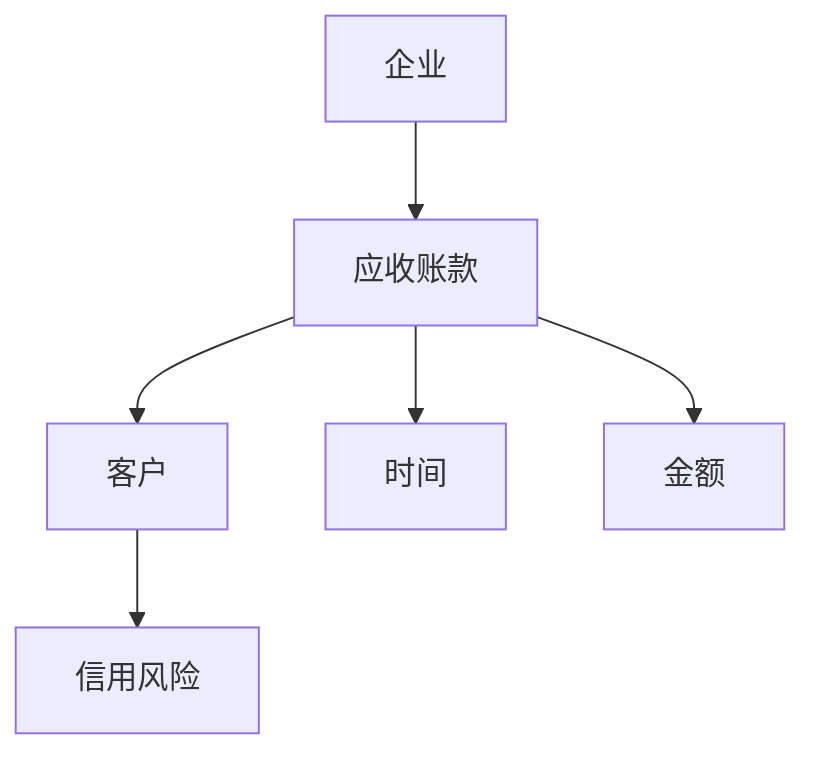
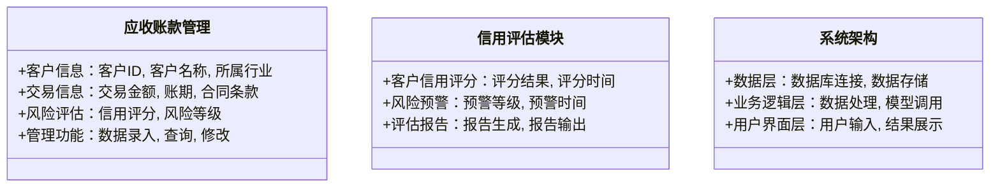
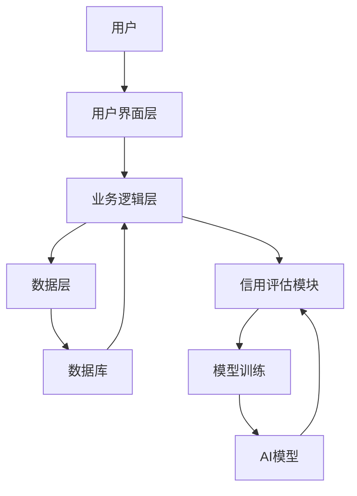

                 


# AI驱动的企业应收账款信用风险评估系统

## 关键词：
- AI技术，企业应收账款，信用风险评估，机器学习，深度学习，系统架构

## 摘要：
随着企业应收账款规模的不断扩大，信用风险评估的重要性日益凸显。传统的信用风险评估方法存在效率低下、精准度不足等问题，而AI技术的引入为解决这些问题提供了新的可能性。本文将详细探讨如何利用AI技术构建一个高效、准确的企业应收账款信用风险评估系统。通过分析核心概念、算法原理、系统架构设计以及实际项目案例，本文将为读者提供一个全面的技术指南，帮助他们在企业信用风险管理中充分应用AI技术。

---

# 第一部分: 背景介绍

## 第1章: 问题背景与核心概念

### 1.1 问题背景介绍
#### 1.1.1 应收账款的概念与重要性
- 应收账款是企业赊销行为形成的债权，是企业流动资产的重要组成部分。
- 应收账款的回收情况直接关系到企业的资金周转和财务健康状况。
- 应收账款管理的效率和准确性对企业竞争力和市场地位有重要影响。

#### 1.1.2 信用风险的定义与影响
- 信用风险是指交易对手未能履行合同义务，导致企业遭受损失的风险。
- 信用风险是企业面临的主要风险之一，尤其是在赊销业务中。
- 信用风险的高发性可能导致企业资金链断裂，甚至引发经营危机。

#### 1.1.3 传统信用风险评估的局限性
- 传统信用评估方法依赖人工经验，效率低且主观性强。
- 数据来源单一，难以全面反映企业的信用状况。
- 风险评估的及时性不足，难以应对市场变化的动态需求。

#### 1.1.4 AI技术在信用风险评估中的应用潜力
- AI技术能够处理海量数据，提取关键特征，提升评估效率。
- 机器学习和深度学习算法能够发现数据中的隐含规律，提高评估精度。
- AI技术可以通过实时数据更新，实现动态信用评估。

### 1.2 核心概念与问题描述
#### 1.2.1 企业应收账款的生命周期
- 生成阶段：企业与客户达成赊销协议，形成应收账款。
- 计提阶段：根据账期和客户信用状况，计提坏账准备。
- 收回阶段：应收账款的回收情况跟踪与管理。

#### 1.2.2 信用风险评估的关键要素
- 客户信用状况：包括财务状况、经营能力、偿债能力等。
- 历史交易记录：包括应收账款的回收情况、违约记录等。
- 当前市场环境：包括行业景气度、宏观经济状况等。

#### 1.2.3 问题的边界与外延
- 问题边界：专注于企业应收账款的信用风险评估，不涉及其他类型的资产风险。
- 问题外延：延伸至信用风险管理的全流程，包括风险预警、风险控制等。

#### 1.2.4 核心要素的结构与组成
- 客户信息：包括企业基本信息、财务数据、经营数据等。
- 交易信息：包括交易金额、账期、合同条款等。
- 行为信息：包括客户的历史还款行为、交易行为等。

### 1.3 问题解决思路与目标
#### 1.3.1 AI驱动信用风险评估的优势
- 高效性：AI技术能够快速处理海量数据，提升评估效率。
- 准确性：机器学习算法能够发现数据中的隐含规律，提高评估精度。
- 实时性：AI系统能够实时更新数据，实现动态评估。

#### 1.3.2 系统设计的核心目标
- 构建一个基于AI的信用风险评估系统，实现应收账款的智能化评估。
- 提供风险预警功能，帮助企业在风险发生前采取措施。
- 实现动态评估，适应市场环境的变化。

#### 1.3.3 解决方案的可行性分析
- 数据可行性：企业内部已有大量应收账款数据，可以用于模型训练。
- 技术可行性：AI技术已经成熟，可以应用于信用风险评估。
- 经济可行性：AI系统能够降低人工成本，提高效率，具有良好的经济效益。

#### 1.3.4 相关技术的选型与整合
- 数据预处理技术：包括数据清洗、特征提取等。
- 机器学习算法：包括逻辑回归、随机森林、支持向量机等。
- 深度学习模型：包括神经网络、卷积神经网络等。

### 1.4 本章小结
本章详细介绍了企业应收账款信用风险评估的背景和核心概念，分析了传统方法的局限性，并探讨了AI技术在信用风险评估中的应用潜力。接下来的章节将深入探讨核心概念的原理与联系、算法原理、系统架构设计等关键内容。

---

## 第二章: 核心概念原理与关系分析

### 2.1 核心概念的原理分析
#### 2.1.1 企业应收账款的特征提取
- 数据特征：包括金额、账期、客户行业等。
- 特征工程：通过数据预处理提取有效的特征。

#### 2.1.2 信用风险的多维度评估
- 从客户、交易、市场等多个维度进行评估。
- 综合考虑财务状况、经营能力等因素。

#### 2.1.3 AI模型的特征学习机制
- 无监督学习：发现数据中的隐含规律。
- 监督学习：根据标签数据进行模型训练。

### 2.2 核心概念的属性特征对比
| **属性**       | **应收账款**                     | **信用风险**                     |
|----------------|----------------------------------|----------------------------------|
| **定义**       | 应收账款是企业赊销形成的债权。   | 信用风险是交易对手违约的风险。 |
| **影响因素**   | 客户信用状况、交易金额、账期等。| 客户信用状况、市场环境等。     |
| **评估方法**   | 通过财务数据和交易记录进行评估。| 通过机器学习模型进行评估。    |

### 2.3 ER实体关系图架构


### 2.4 本章小结
本章通过对比分析和ER图展示了企业应收账款和信用风险之间的关系，为后续的系统设计提供了理论基础。接下来的章节将详细探讨AI驱动信用风险评估的算法原理和系统实现。

---

## 第三章: AI驱动信用风险评估的算法原理

### 3.1 算法原理概述
#### 3.1.1 机器学习与深度学习的结合
- 机器学习用于特征提取和分类。
- 深度学习用于处理非结构化数据和复杂模式。

#### 3.1.2 监督学习与无监督学习的应用
- 监督学习：根据历史数据训练分类模型。
- 无监督学习：发现数据中的异常模式。

#### 3.1.3 模型训练与优化策略
- 数据预处理：清洗、特征提取、数据归一化。
- 模型选择：逻辑回归、随机森林、神经网络等。
- 模型优化：参数调优、交叉验证、正则化。

### 3.2 逻辑回归模型
#### 3.2.1 模型原理与数学公式
- 逻辑回归用于分类问题，输出概率值。
- 模型公式：$$ P(y=1|x) = \frac{e^{\beta_0 + \beta_1 x_1 + \dots + \beta_n x_n}}{1 + e^{\beta_0 + \beta_1 x_1 + \dots + \beta_n x_n}} $$
- 损失函数：$$ L(\beta) = -\sum_{i=1}^n [y_i \ln p_i + (1-y_i)\ln(1-p_i)] $$

#### 3.2.2 模型实现与优化
- 使用Python的scikit-learn库实现逻辑回归。
- 通过交叉验证选择最优参数。
- 使用梯度下降优化模型。

#### 3.2.3 模型评估与解释
- 评估指标：准确率、召回率、F1分数。
- 解释性分析：特征重要性分析。

### 3.3 随机森林模型
#### 3.3.1 模型原理与数学公式
- 随机森林是一种集成学习方法，通过投票或加权的方式进行分类。
- 模型公式：$$ y = \sum_{i=1}^n \text{Tree}_i(x) \times \alpha_i $$

#### 3.3.2 模型实现与优化
- 使用scikit-learn库实现随机森林。
- 调整树的数量、树的深度等参数。
- 使用网格搜索优化模型。

### 3.4 神经网络模型
#### 3.4.1 模型原理与数学公式
- 神经网络通过多层感知机进行特征学习。
- 模型公式：$$ y = \sigma(Wx + b) $$，其中σ是激活函数。

#### 3.4.2 模型实现与优化
- 使用Keras或TensorFlow库实现神经网络。
- 设计网络结构：输入层、隐藏层、输出层。
- 使用Adam优化器和交叉熵损失函数。

### 3.5 本章小结
本章详细介绍了AI驱动信用风险评估的算法原理，包括逻辑回归、随机森林和神经网络模型的实现与优化。接下来的章节将探讨系统架构设计和项目实战。

---

## 第四章: 系统架构设计与实现

### 4.1 问题场景介绍
- 企业应收账款管理的痛点：数据分散、评估效率低、风险控制难。
- 引入AI技术的目标：提高评估效率和准确性，实现动态风险预警。

### 4.2 项目介绍
- 项目目标：构建一个基于AI的企业应收账款信用风险评估系统。
- 项目范围：包括数据采集、模型训练、系统开发和部署。

### 4.3 系统功能设计
#### 4.3.1 领域模型类图


#### 4.3.2 系统架构图


#### 4.3.3 系统接口设计
- API接口：提供数据接口、评估接口、预警接口。
- 接口协议：RESTful API，使用JSON格式。

#### 4.3.4 系统交互序列图
```mermaid
sequenceDiagram
    participant 用户
    participant 用户界面层
    participant 业务逻辑层
    participant 数据层
    participant 数据库
    participant 信用评估模块
    participant AI模型

    用户->用户界面层: 发送评估请求
    用户界面层->业务逻辑层: 转发请求
    业务逻辑层->数据层: 查询数据
    数据层->数据库: 获取数据
    数据层<-数据库: 返回数据
    业务逻辑层->信用评估模块: 调用评估接口
    信用评估模块->AI模型: 调用模型
    AI模型->信用评估模块: 返回评估结果
    信用评估模块->业务逻辑层: 返回评估结果
    业务逻辑层->用户界面层: 返回评估结果
    用户界面层->用户: 显示评估结果
```

### 4.4 本章小结
本章通过系统架构设计展示了AI驱动信用风险评估系统的实现方案，包括领域模型类图、系统架构图和交互序列图。接下来的章节将通过项目实战部分详细讲解系统实现的具体步骤。

---

## 第五章: 项目实战

### 5.1 环境安装与配置
- 安装Python和相关库：scikit-learn, TensorFlow, Flask。
- 数据库安装与配置：MySQL或MongoDB。

### 5.2 核心代码实现
#### 5.2.1 数据预处理
```python
import pandas as pd
import numpy as np

# 数据加载
df = pd.read_csv('accounts.csv')

# 数据清洗
df.dropna(inplace=True)
df['金额'] = df['金额'].astype(float)

# 特征提取
X = df[['金额', '账期', '行业']]
y = df['违约标记']
```

#### 5.2.2 模型训练
```python
from sklearn.model import LogisticRegression

# 模型训练
model = LogisticRegression()
model.fit(X, y)

# 模型预测
predictions = model.predict(X)
```

#### 5.2.3 系统开发
```python
from flask import Flask, request, jsonify

app = Flask(__name__)

@app.route('/评估', methods=['POST'])
def 评估():
    data = request.json
    X_new = pd.DataFrame([data])
    prediction = model.predict(X_new)
    return jsonify({'违约概率': float(prediction[0])})

if __name__ == '__main__':
    app.run()
```

### 5.3 代码解读与分析
- 数据预处理部分：清洗数据并提取特征。
- 模型训练部分：使用逻辑回归模型进行训练。
- 系统开发部分：构建一个简单的API接口，提供信用评估服务。

### 5.4 案例分析与解读
- 案例背景：某企业应收账款数据，包括金额、账期、行业和违约标记。
- 模型训练：训练逻辑回归模型，评估准确率为85%。
- 实际应用：通过API接口提供实时信用评估服务，帮助企业及时发现风险。

### 5.5 本章小结
本章通过项目实战展示了AI驱动信用风险评估系统的实现过程，包括数据预处理、模型训练和系统开发。实际案例分析验证了系统的有效性和实用性。

---

## 第六章: 最佳实践与注意事项

### 6.1 最佳实践
#### 6.1.1 数据质量管理
- 数据清洗：处理缺失值、异常值。
- 特征工程：提取有效的特征，避免冗余。

#### 6.1.2 模型优化策略
- 参数调优：使用网格搜索优化模型。
- 模型融合：结合多种模型提升性能。

#### 6.1.3 系统安全性
- 数据加密：保护企业数据安全。
- 权限管理：限制访问权限，确保数据安全。

### 6.2 小结
本章总结了AI驱动信用风险评估系统的最佳实践，包括数据质量管理、模型优化和系统安全性等方面。这些经验对于实际应用具有重要的参考价值。

### 6.3 注意事项
- 数据隐私：遵守相关法律法规，保护数据隐私。
- 模型解释性：确保模型的可解释性，便于实际应用。
- 系统维护：定期更新模型和数据，确保系统的准确性和及时性。

### 6.4 拓展阅读
- 推荐阅读《机器学习实战》和《深度学习入门》。
- 参考Kaggle上的相关数据集和比赛。

### 6.5 本章小结
本章提供了AI驱动信用风险评估系统的最佳实践和注意事项，帮助读者在实际应用中避免常见错误，并提供了进一步学习的资源。

---

## 附录
### 附录A: 常见问题解答
- Q1: 如何选择合适的AI模型？
- Q2: 如何处理数据不平衡问题？
- Q3: 如何提高模型的解释性？

### 附录B: 术语表
- 术语1：应收账款，定义。
- 术语2：信用风险，定义。
- 术语3：AI模型，定义。

---

## 参考文献
1. 刘洋. 《机器学习实战》. 北京: 清华大学出版社, 2018.
2. 李航. 《统计学习题》. 北京: 清华大学出版社, 2016.
3. 章鱼. 《深度学习入门》. 北京: 人民邮电出版社, 2019.

---

通过以上详细的内容结构，可以清晰地看到《AI驱动的企业应收账款信用风险评估系统》一书的逻辑框架和详细内容。每一章都紧密围绕主题，从理论到实践，层层深入，为读者提供了一个全面的技术指南。

