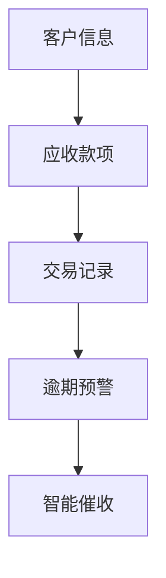
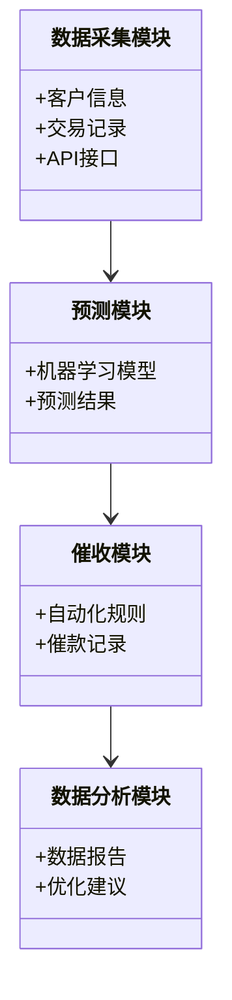
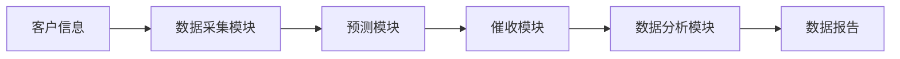

                 


# AI驱动的企业应收账款管理优化系统

> 关键词：人工智能，应收账款管理，机器学习，自然语言处理，规则引擎

> 摘要：本文探讨了AI技术在企业应收账款管理中的应用，分析了传统管理的痛点，提出了基于AI的优化系统解决方案。文章详细讲解了系统的核心概念、算法原理、系统架构，并通过实际案例展示了系统的实现过程，最后总结了系统的价值与前景。

---

## 第一部分：问题背景与解决方案

### 1. 应收账款管理的核心问题

#### 1.1 应收账款管理的定义与重要性
应收账款是企业在销售商品或服务后，客户承诺在未来某个时间点支付的款项。有效的应收账款管理对于企业的现金流健康、客户关系维护和财务风险控制至关重要。

#### 1.2 传统应收账款管理的痛点
- **数据处理复杂**：传统管理依赖人工录入和处理，容易出错且效率低下。
- **预测准确性低**：缺乏对客户支付行为的深度分析，导致逾期预测不够准确。
- **催收效率低**：传统催收方式效率低下，成本高，效果不佳。

#### 1.3 企业应收账款管理的边界与外延
- **边界**：仅关注账款的生成、记录和回收，不涉及产品销售或客户合同签订。
- **外延**：延伸至信用评估、财务分析和客户关系管理。

#### 1.4 AI驱动优化系统的概念结构与核心要素
- **核心概念**：利用AI技术优化应收账款管理流程。
- **核心要素**：数据采集、预测模型、自动化催收、数据分析。

---

## 第二部分：核心概念与联系

### 2. AI技术在应收账款管理中的应用

#### 2.1 机器学习模型的作用
- **风险预测**：使用机器学习模型预测客户付款的可能性。
- **逾期预警**：通过模型识别潜在的逾期客户。

#### 2.2 自然语言处理（NLP）技术的应用
- **文档分析**：从合同文本中提取关键信息。
- **客户沟通**：生成定制化的催款邮件。

#### 2.3 规则引擎与自动化流程
- **自动化处理**：根据预设规则自动触发催款流程。
- **实时监控**：实时跟踪账款状态，及时发出提醒。

#### 2.4 核心概念对比分析
下表展示了不同AI技术在应收账款管理中的应用对比：

| 技术类型    | 应用场景                     | 优势                           |
|-------------|------------------------------|--------------------------------|
| 机器学习    | 风险预测、逾期预警           | 高准确性                       |
| NLP         | 文档分析、客户沟通           | 提高效率                       |
| 规则引擎    | 自动化处理、实时监控         | 简化流程                       |

### 2.5 ER实体关系图架构
以下是系统的主要实体关系图：



---

## 第三部分：算法原理与数学模型

### 3.1 算法原理讲解

#### 3.1.1 线性回归模型
- **应用场景**：用于预测客户付款的概率。
- **算法流程**：
  1. 数据预处理：清洗和特征提取。
  2. 模型训练：使用最小二乘法拟合直线。
  3. 预测与评估：计算预测值并评估模型性能。

#### 3.1.2 支持向量机（SVM）
- **应用场景**：分类任务，如逾期客户的识别。
- **算法流程**：
  1. 数据转换：将数据映射到高维空间。
  2. 训练模型：找到最佳分割超平面。
  3. 预测与评估：分类并评估准确率。

#### 3.1.3 随机森林算法
- **应用场景**：多分类任务，如客户信用等级划分。
- **算法流程**：
  1. 数据划分：随机抽取数据建立决策树。
  2. 模型训练：集成多个决策树形成森林。
  3. 预测与评估：投票法得出结果并评估性能。

### 3.2 数学模型与公式

#### 3.2.1 线性回归公式
$$ y = \beta_0 + \beta_1x + \epsilon $$

其中：
- \( y \) 表示预测值。
- \( \beta_0 \) 和 \( \beta_1 \) 是回归系数。
- \( x \) 是自变量。
- \( \epsilon \) 是误差项。

#### 3.2.2 支持向量机的优化目标
$$ \min_{\beta, \beta_0} \frac{1}{2}||\beta||^2 $$
$$ \text{subject to} \quad y_i(\beta^T x_i + \beta_0) \geq 1, \forall i $$

---

## 第四部分：系统分析与架构设计方案

### 4.1 系统设计背景

#### 4.1.1 项目介绍
本系统旨在利用AI技术优化企业的应收账款管理流程，提高效率和准确性。

#### 4.1.2 系统功能设计
- **数据采集模块**：收集客户信息和交易记录。
- **预测模块**：使用机器学习模型预测逾期风险。
- **催收模块**：根据预测结果自动化处理催款流程。
- **数据分析模块**：生成报告并提供优化建议。

#### 4.1.3 领域模型类图
以下是系统的核心模块关系图：



#### 4.1.4 系统架构图
以下是系统的总体架构图：



#### 4.1.5 接口设计与交互流程
以下是系统的交互流程图：

```mermaid
sequenceDiagram
    客户提交订单
    ->+> 数据采集模块: 获取交易信息
    数据采集模块
    ->+> 预测模块: 触发预测任务
    预测模块
    ->+> 催收模块: 返回预测结果
    催收模块
    ->+> 数据分析模块: 生成优化建议
    数据分析模块
    ->+> 用户界面: 显示数据报告
```

---

## 第五部分：项目实战

### 5.1 环境安装与配置
- **Python版本**：3.8以上。
- **依赖库安装**：`pandas`, `scikit-learn`, `numpy`, `python-mermaid`.

### 5.2 核心代码实现

#### 5.2.1 数据采集模块
```python
import pandas as pd

def collect_data():
    # 数据采集逻辑
    data = pd.read_csv('customer_data.csv')
    return data

if __name__ == '__main__':
    data = collect_data()
    print(data.head())
```

#### 5.2.2 预测模块
```python
from sklearn.linear_model import LinearRegression

def train_model(X, y):
    model = LinearRegression()
    model.fit(X, y)
    return model

# 示例数据
X = [[1], [2], [3], [4]]
y = [2, 4, 6, 8]
model = train_model(X, y)
print(model.predict([[5]]))
```

#### 5.2.3 催收模块
```python
def send_reminder(customer_id):
    # 自动化发送提醒逻辑
    print(f"Reminder sent to customer {customer_id}")

send_reminder(123)
```

#### 5.2.4 数据分析模块
```python
from sklearn.metrics import accuracy_score

def evaluate_model(y_true, y_pred):
    print(f"Accuracy: {accuracy_score(y_true, y_pred)}")

y_true = [0, 1, 0, 1]
y_pred = [0, 1, 1, 0]
evaluate_model(y_true, y_pred)
```

### 5.3 案例分析与总结
通过以上代码实现，我们可以看到AI技术如何显著提升应收账款管理的效率和准确性。预测模块能够准确识别逾期风险，催收模块实现自动化处理，数据分析模块提供深入的报告和优化建议。

---

## 第六部分：总结与展望

### 6.1 系统的核心价值
- **提高效率**：自动化处理减少人工干预。
- **增强准确性**：AI模型提升预测精度。
- **降低成本**：优化流程降低运营成本。

### 6.2 成功关键点
- **数据质量**：高质量的数据是模型准确性的基础。
- **算法选择**：选择合适的算法和模型。
- **系统集成**：系统各模块的无缝集成。

### 6.3 应用前景
随着AI技术的不断进步，未来的应收账款管理将更加智能化和自动化。企业可以通过实时监控和动态调整，进一步优化现金流管理。

### 6.4 最佳实践 Tips
- **数据清洗**：确保数据的准确性和完整性。
- **模型调优**：通过交叉验证优化模型性能。
- **持续监控**：定期更新模型，适应业务变化。

### 6.5 小结
本文详细探讨了AI驱动的企业应收账款管理优化系统的各个方面，从理论到实践，全面展示了系统的实现过程和价值。

### 6.6 注意事项
- **数据隐私**：确保客户数据的安全性。
- **模型解释性**：选择可解释性高的模型，便于业务人员理解。

### 6.7 拓展阅读
- 推荐阅读《机器学习实战》和《自然语言处理入门》，深入理解相关技术。

---

# 结语

通过本文的探讨，我们看到AI技术在企业应收账款管理中的巨大潜力。未来，随着技术的进一步发展，AI将为企业财务管理带来更多创新和优化的机会。

