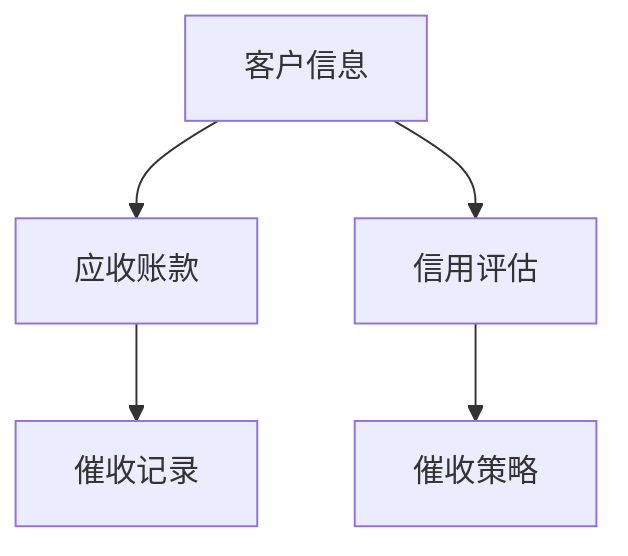
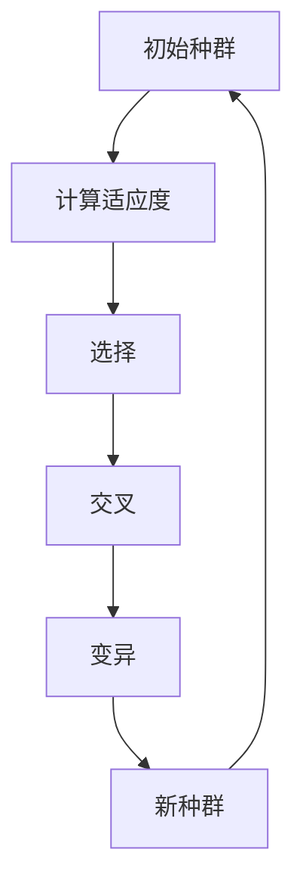
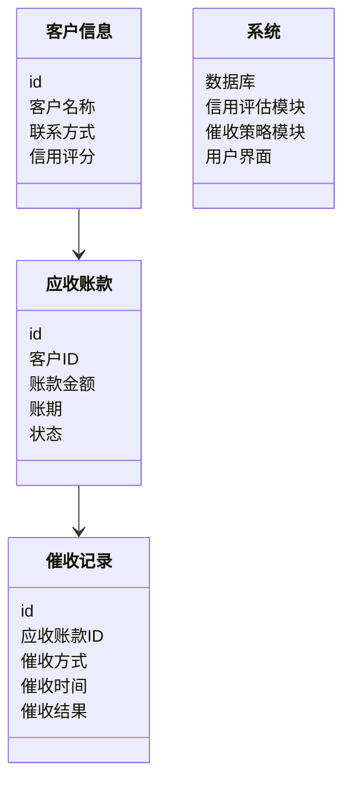
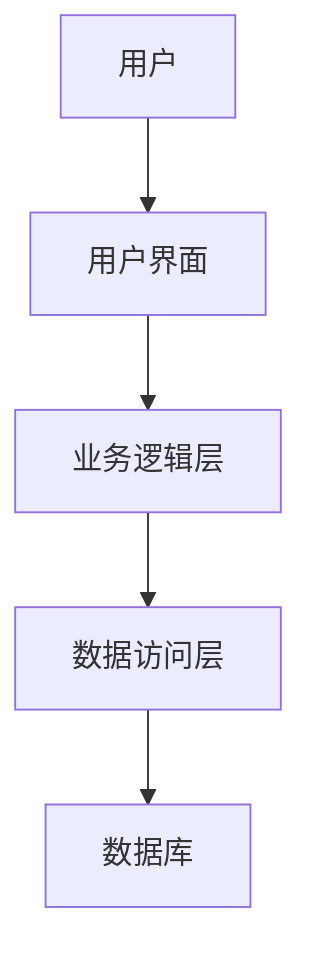
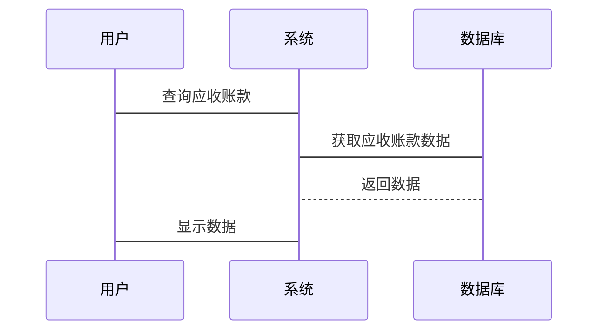

                 


# AI驱动的企业应收账款组合优化管理系统

## 关键词：
AI驱动，企业应收账款，组合优化，管理系统，优化算法，系统架构

## 摘要：
本文介绍了一种基于人工智能技术的企业应收账款组合优化管理系统。通过分析应收账款管理中的问题与挑战，提出了一种结合优化算法和系统架构设计的解决方案。文章详细探讨了核心概念、算法原理、系统设计以及实际应用，旨在为企业提供一种高效、智能的应收账款管理方法。

---

# 第一部分: AI驱动的企业应收账款组合优化管理系统概述

## 第1章: 问题背景与核心概念

### 1.1 应收账款管理的重要性
#### 1.1.1 应收账款在企业运营中的地位
企业应收账款是企业流动资金的重要组成部分，直接影响企业的财务健康和运营效率。有效的应收账款管理能够降低坏账风险，优化资金流，提高企业整体竞争力。

#### 1.1.2 应收账款管理的核心目标
应收账款管理的核心目标包括：最大化资金回收效率、最小化坏账损失、优化客户信用管理、提高应收账款周转率。

#### 1.1.3 应收账款管理的常见挑战
- 客户信用评估难度大
- 应收账款回收周期长
- 数据分散，难以统一管理
- 人工干预过多，效率低下

### 1.2 企业应收账款组合优化的背景
#### 1.2.1 应收账款组合优化的定义
应收账款组合优化是指通过科学的方法和工具，对企业的应收账款组合进行分析、评估和优化，以实现资金回收效率和客户信用管理的双重目标。

#### 1.2.2 组合优化在企业财务管理中的作用
组合优化能够帮助企业实现以下目标：
- 优化客户结构，降低坏账风险
- 提高资金回收效率，降低资金成本
- 提升客户满意度，增强客户关系
- 提高企业财务透明度和决策能力

#### 1.2.3 AI技术如何驱动应收账款优化
AI技术通过以下方式驱动应收账款优化：
- 智能信用评估：利用机器学习模型对客户信用进行评估和预测
- 智能催收策略：根据历史数据和客户行为，制定最优催收策略
- 智能风险控制：通过实时数据分析，识别潜在风险并采取预防措施

### 1.3 问题描述与目标
#### 1.3.1 应收账款组合优化的问题描述
企业在应收账款管理中面临以下问题：
- 客户信用评估不准确，导致坏账风险高
- 应收账款回收周期长，影响资金流动性
- 数据分散，难以实现统一管理
- 缺乏智能化工具，管理效率低下

#### 1.3.2 优化目标与关键指标
优化目标：
- 最小化坏账损失
- 提高应收账款回收率
- 优化客户信用管理
- 提高应收账款周转率

关键指标：
- 坏账率
- 应收账款回收周期
- 客户信用评分
- 应收账款周转率

#### 1.3.3 边界与外延
边界：
- 仅针对企业内部的应收账款管理
- 不包括应付账款管理
- 仅考虑客户信用评估和应收账款回收

外延：
- 可扩展到企业其他财务领域
- 可与其他企业管理系统（如ERP）集成
- 可应用于不同行业和规模的企业

### 1.4 核心概念与系统架构
#### 1.4.1 核心概念的定义与属性对比
核心概念包括：
- 客户信息：包括客户名称、信用评分、历史交易记录等
- 应收账款：包括账款金额、账期、状态等
- 信用评估：包括信用评分、风险等级等
- 催收策略：包括催收方式、优先级等

属性对比表：
| 概念       | 属性                 | 描述                                   |
|------------|----------------------|----------------------------------------|
| 客户信息    | 客户ID               | 唯一标识客户                           |
|            | 信用评分             | 表示客户的信用状况                     |
| 应收账款    | 账款金额             | 应收账款的金额                         |
|            | 账期                 | 应收账款的到期时间                     |
| 信用评估    | 评估方法             | 用于评估客户信用的方法                 |
|            | 风险等级             | 表示客户信用风险的等级                 |
| 催收策略    | 催收方式             | 不同的催收手段，如电话、邮件、上门等   |
|            | 催收优先级           | 根据风险等级确定催收优先级             |

#### 1.4.2 ER实体关系图
```mermaid
er
  客户信息表
  +----+------------+-----------------+------------+ 
  | id | 客户名称   | 联系方式       | 信用评分   |
  +----+------------+-----------------+------------+ 
  应收账款表
  +----+------------+-----------------+------------+ 
  | id | 客户ID     | 账款金额       | 账期       |
  +----+------------+-----------------+------------+ 
  催收记录表
  +----+------------+-----------------+------------+ 
  | id | 应收账款ID | 催收方式       | 催收时间   |
  +----+------------+-----------------+------------+ 
```

#### 1.4.3 系统架构图


---

# 第二部分: AI驱动的优化算法原理

## 第2章: 优化算法原理

### 2.1 基础优化算法
#### 2.1.1 遗传算法
遗传算法是一种模拟生物进化过程的优化算法，主要包括选择、交叉和变异三个步骤。以下是遗传算法的简单实现示例：

```python
def genetic_algorithm(population, fitness_func, mutation_rate):
    while True:
        population = fitness_func(population)
        population = mutate(population, mutation_rate)
```

#### 2.1.2 模拟退火算法
模拟退火算法是一种全局优化算法，通过逐步降温的方式找到全局最优解。以下是模拟退火算法的简单实现示例：

```python
def simulated_annealing(initial_state, cost_func, cooling_schedule):
    current_state = initial_state
    current_cost = cost_func(current_state)
    while temperature > 0:
        neighbor = get_neighbor(current_state)
        neighbor_cost = cost_func(neighbor)
        if neighbor_cost < current_cost:
            current_state = neighbor
            current_cost = neighbor_cost
        temperature = cooling_schedule(temperature)
```

#### 2.1.3 其他优化算法简介
其他常见的优化算法包括蚁群算法、粒子群优化算法等。这些算法各有特点，适用于不同的问题场景。

### 2.2 基于AI的优化模型
#### 2.2.1 神经网络在优化中的应用
神经网络可以用于信用评估和风险预测。例如，使用卷积神经网络（CNN）对客户信用进行分类。

#### 2.2.2 强化学习在优化中的应用
强化学习可以用于制定催收策略，通过与环境的交互不断优化策略。

#### 2.2.3 深度学习模型的优化策略
深度学习模型可以通过迁移学习、数据增强等方法进一步优化。

### 2.3 算法实现与代码示例
#### 2.3.1 遗传算法实现
```python
import random

def fitness(individual):
    # 计算适应度，这里简化为求和
    return sum(individual)

def mutate(individual, mutation_rate):
    for i in range(len(individual)):
        if random.random() < mutation_rate:
            individual[i] = 1 - individual[i]
    return individual

def genetic_algorithm(population, fitness_func, mutation_rate):
    best = max(population, key=lambda x: fitness_func(x))
    while True:
        population = [mutate(individual, mutation_rate) for individual in population]
        population.sort(key=lambda x: -fitness_func(x))
        population = population[:int(len(population) * 0.8)]
        best_fitness = fitness_func(best)
        print(f"Best fitness: {best_fitness}")
        if best_fitness > fitness_func(mutate(best, mutation_rate)):
            break
    return best
```

#### 2.3.2 算法流程图


---

# 第三部分: 系统分析与架构设计

## 第3章: 系统分析与架构设计

### 3.1 问题场景介绍
企业应收账款管理系统需要处理以下问题：
- 数据分散，难以统一管理
- 缺乏智能化工具，管理效率低
- 催收策略不够灵活，难以应对不同客户

### 3.2 系统功能设计
#### 3.2.1 领域模型


#### 3.2.2 系统架构设计


#### 3.2.3 系统接口设计
- 用户界面：提供客户信息录入、应收账款查询、催收记录等功能
- 数据访问层：与数据库交互，提供数据查询和存储功能
- 业务逻辑层：处理信用评估、催收策略等核心逻辑

#### 3.2.4 系统交互设计


---

# 第四部分: 项目实战

## 第4章: 项目实战

### 4.1 环境安装
- 安装Python和必要的库（如Pandas、Scikit-learn、TensorFlow）
- 安装数据库（如MySQL或MongoDB）
- 安装开发工具（如PyCharm、VS Code）

### 4.2 系统核心实现
#### 4.2.1 数据预处理
```python
import pandas as pd

# 读取数据
data = pd.read_csv('receivables.csv')
# 数据清洗
data.dropna(inplace=True)
# 数据转换
data['账期'] = pd.to_datetime(data['账期'])
```

#### 4.2.2 信用评估模型
```python
from sklearn.model_selection import train_test_split
from sklearn.linear_model import LogisticRegression

# 划分训练集和测试集
X = data[['账款金额', '账期']]
y = data['信用评分']
X_train, X_test, y_train, y_test = train_test_split(X, y, test_size=0.2)

# 训练模型
model = LogisticRegression()
model.fit(X_train, y_train)

# 预测
y_pred = model.predict(X_test)
```

#### 4.2.3 催收策略实现
```python
def get_c_collection_priority(receivable):
    if receivable['账款金额'] > 10000:
        return '高优先级'
    elif receivable['账款金额'] > 5000:
        return '中优先级'
    else:
        return '低优先级'
```

### 4.3 代码应用解读与分析
- 数据预处理：确保数据的完整性和准确性
- 模型训练：使用机器学习算法进行信用评估
- 催收策略：根据金额和风险等级制定优先级

### 4.4 实际案例分析
案例：某企业应收账款数据
- 数据清洗与预处理
- 模型训练与评估
- 催收策略制定与实施

### 4.5 项目小结
通过项目实战，我们验证了AI驱动的应收账款组合优化管理系统的可行性，并展示了其在实际应用中的优势。

---

# 第五部分: 总结与展望

## 第5章: 总结与展望

### 5.1 本章总结
本文介绍了AI驱动的企业应收账款组合优化管理系统的核心概念、算法原理、系统架构和项目实战。通过理论与实践相结合，展示了AI技术在应收账款管理中的应用潜力。

### 5.2 未来展望
未来的研究方向包括：
- 更复杂的优化算法研究
- 多目标优化问题的解决
- 与其他企业系统的集成
- 更加智能化的催收策略

### 5.3 最佳实践Tips
- 数据质量是关键，确保数据的准确性和完整性
- 选择合适的算法，根据问题特点进行优化
- 系统设计要模块化，便于扩展和维护
- 定期更新模型，适应业务变化

---

# 结束语
通过本文的介绍，读者可以全面了解AI驱动的企业应收账款组合优化管理系统的实现方法和应用价值。希望本文能为企业的应收账款管理提供新的思路和解决方案。

