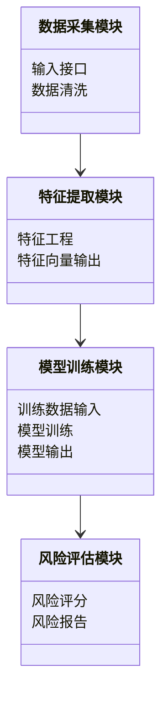
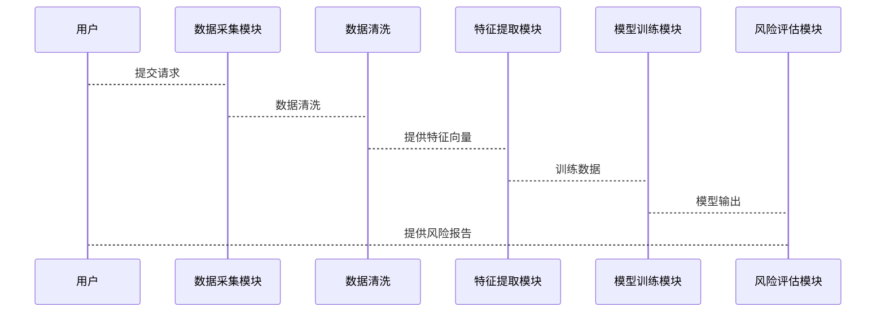

                 


# AI驱动的企业应收账款组合信用风险评估系统

## 关键词
AI技术, 信用风险评估, 机器学习, 应收账款, 深度学习

## 摘要
本文探讨了如何利用AI技术驱动企业应收账款组合信用风险评估系统。通过分析传统方法的局限性，介绍了AI在信用风险评估中的应用前景，详细讲解了核心概念、算法原理、系统架构设计，并通过实际案例展示了项目的实现过程，最后总结了最佳实践和未来研究方向。

---

# 第一部分: 企业应收账款信用风险评估的背景与挑战

## 第1章: 企业应收账款信用风险评估的背景与挑战

### 1.1 应收账款信用风险评估的背景

#### 1.1.1 应收账款的概念与重要性
应收账款是指企业在赊销商品或服务后，客户承诺在未来某个时间点支付的款项。它是企业流动资产的重要组成部分，反映了企业的销售能力和资金周转能力。有效的应收账款管理对企业财务健康和经营稳定性至关重要。

#### 1.1.2 信用风险的定义与特征
信用风险是指由于客户或交易对手未能履行其财务义务而导致的损失风险。在应收账款管理中，信用风险主要表现为客户拖欠或拒绝支付账款的可能性。信用风险的特征包括不确定性、传染性、周期性等。

#### 1.1.3 传统信用风险评估方法的局限性
传统的信用风险评估方法通常依赖于财务报表分析、信用评分模型等，存在以下局限性：
- 数据维度有限，难以捕捉非结构化数据。
- 模型复杂度不足，难以处理复杂的关联关系。
- 人工干预较多，效率低下且易受主观因素影响。

### 1.2 AI技术在信用风险评估中的应用前景

#### 1.2.1 AI技术的基本概念与优势
人工智能（AI）是指计算机系统模拟人类智能的技术，包括学习、推理、自我改进等功能。AI在信用风险评估中的优势包括：
- 高效处理大量数据。
- 发现数据中的复杂模式和关联。
- 实时更新和优化模型。

#### 1.2.2 AI在信用风险评估中的潜在价值
AI技术可以提高信用风险评估的准确性和效率，具体体现在：
- 利用机器学习算法分析多维度数据，识别潜在风险。
- 通过深度学习模型捕捉非线性关系，提升预测精度。
- 实现实时监控和动态风险评估。

#### 1.2.3 企业应收账款组合信用风险评估的AI驱动模式
AI驱动的信用风险评估模式强调数据驱动和自动化，通过整合企业内外部数据，构建智能化的评估系统，实现对应收账款组合风险的全面、动态管理。

### 1.3 本章小结
本章介绍了应收账款信用风险评估的背景、定义和传统方法的局限性，探讨了AI技术在信用风险评估中的应用前景，提出了AI驱动的信用风险评估模式。

---

# 第二部分: 核心概念与系统架构

## 第2章: 企业应收账款组合信用风险评估的核心概念

### 2.1 信用风险评估的关键要素

#### 2.1.1 企业信用评分
信用评分是衡量企业信用状况的重要指标，通常基于财务指标、市场表现、历史交易记录等。

#### 2.1.2 应收账款组合的风险特征
应收账款组合的风险特征包括客户分布、账期结构、行业风险等。

#### 2.1.3 信用风险的量化与评估指标
常用的信用风险量化指标包括违约概率（PD）、违约损失率（LGD）、风险敞口等。

### 2.2 AI驱动的信用风险评估模型

#### 2.2.1 机器学习在信用评估中的应用
机器学习算法（如逻辑回归、随机森林）广泛应用于信用风险评估，通过分析历史数据预测客户违约风险。

#### 2.2.2 深度学习在信用风险评估中的优势
深度学习模型（如神经网络）能够处理非结构化数据，发现复杂特征，提升预测精度。

#### 2.2.3 组合信用风险的AI驱动评估框架
AI驱动的组合信用风险评估框架包括数据采集、特征提取、模型训练、风险评估等环节。

### 2.3 核心概念之间的关系

#### 2.3.1 信用评分与组合风险的关联
信用评分是评估单个客户信用风险的基础，组合风险则是基于多个客户的信用评分和相关性进行综合评估。

#### 2.3.2 AI模型与信用风险评估的交互
AI模型通过不断学习和优化，提高信用风险评估的准确性和实时性。

#### 2.3.3 系统架构与模型实现的整合
系统架构决定了AI模型的实现方式和数据处理流程，两者相互依存，共同实现信用风险评估目标。

### 2.4 本章小结
本章详细阐述了信用风险评估的关键要素和AI驱动模型的核心概念，分析了各概念之间的关系和相互作用。

---

# 第三部分: 算法原理与数学模型

## 第3章: 基于机器学习的信用风险评估算法

### 3.1 传统机器学习算法

#### 3.1.1 逻辑回归模型
逻辑回归是一种广泛应用于分类任务的统计方法，适用于二分类问题。

- 公式：$$P(y=1|x) = \frac{1}{1 + e^{- (w^T x + b)}}$$

#### 3.1.2 支持向量机（SVM）
SVM通过构建超平面实现数据分类，适用于高维数据。

#### 3.1.3 随机森林与梯度提升树
随机森林和梯度提升树是基于树结构的集成学习方法，具有较强的抗过拟合能力。

### 3.2 深度学习算法在信用风险评估中的应用

#### 3.2.1 神经网络模型
神经网络通过多层非线性变换，能够捕捉数据中的复杂特征。

- 公式：$$y = f(x) = \sigma(w_2 \cdot f(w_1 \cdot x + b_1) + b_2)$$

#### 3.2.2 卷积神经网络（CNN）
CNN适用于处理图像或序列数据，但在信用评估中的应用相对有限。

#### 3.2.3 循环神经网络（RNN）
RNN适合处理时间序列数据，但在信用评估中的应用也较为有限。

### 3.3 基于XGBoost的信用风险评估模型

#### 3.3.1 XGBoost算法原理
XGBoost是一种高效的梯度提升算法，通过正则化和优化剪枝策略提高模型性能。

---

## 第四部分: 系统分析与架构设计

## 第4章: 应收账款组合信用风险评估系统的架构设计

### 4.1 问题场景介绍
系统需要评估企业应收账款组合的信用风险，帮助企业在赊销过程中降低损失。

### 4.2 系统功能设计

#### 4.2.1 数据采集模块
数据采集模块负责收集企业内外部数据，包括财务数据、市场数据、交易数据等。

#### 4.2.2 特征提取模块
特征提取模块通过数据清洗和特征工程，生成可用于模型训练的特征向量。

#### 4.2.3 模型训练模块
模型训练模块基于特征向量训练AI模型，生成信用风险评估结果。

#### 4.2.4 风险评估模块
风险评估模块将模型输出的风险评分转化为具体的信用风险等级。

### 4.3 系统架构设计

#### 4.3.1 系统类图


#### 4.3.2 系统架构图


### 4.4 系统交互设计

#### 4.4.1 系统交互流程


### 4.5 本章小结
本章详细描述了系统的架构设计，包括功能模块、系统类图、架构图和交互流程，为后续的系统实现奠定了基础。

---

## 第五部分: 项目实战

## 第5章: 应收账款组合信用风险评估系统项目实战

### 5.1 环境安装
项目需要安装Python、机器学习库（如Scikit-learn、XGBoost）、数据处理库（如Pandas）、可视化库（如Matplotlib）等。

### 5.2 核心代码实现

#### 5.2.1 数据采集与预处理
```python
import pandas as pd

# 数据加载
df = pd.read_csv('data.csv')

# 数据清洗
df.dropna(inplace=True)
```

#### 5.2.2 特征工程
```python
from sklearn.preprocessing import StandardScaler

# 特征标准化
scaler = StandardScaler()
X = scaler.fit_transform(df.drop('target', axis=1))
y = df['target']
```

#### 5.2.3 模型训练
```python
from sklearn.ensemble import RandomForestClassifier

# 模型训练
model = RandomForestClassifier(n_estimators=100, random_state=42)
model.fit(X, y)
```

#### 5.2.4 风险评估与报告
```python
import joblib

# 模型保存
joblib.dump(model, 'credit_risk_model.pkl')
```

### 5.3 案例分析
以某制造企业为例，通过系统实现对其应收账款组合的信用风险进行评估，生成风险报告和应对策略。

### 5.4 本章小结
本章通过实际项目展示了系统的实现过程，从数据采集到模型训练，再到风险评估，为读者提供了可参考的代码和案例。

---

## 第六部分: 最佳实践与总结

## 第6章: 最佳实践与总结

### 6.1 最佳实践

#### 6.1.1 数据质量管理
确保数据的准确性和完整性，避免数据偏差。

#### 6.1.2 模型优化与验证
通过交叉验证和超参数调优提升模型性能。

#### 6.1.3 系统安全与合规性
确保系统数据安全和合规性，避免数据泄露风险。

### 6.2 小结
本文系统介绍了AI驱动的企业应收账款组合信用风险评估系统的背景、核心概念、算法原理、系统架构和项目实战，展示了AI技术在信用风险评估中的巨大潜力。

### 6.3 注意事项
- 数据隐私和合规性问题需高度重视。
- 模型的可解释性需要加强，以便更好地应用于实际业务。
- 系统的实时性和稳定性需进一步优化。

### 6.4 拓展阅读
建议读者深入学习机器学习和深度学习相关知识，关注AI在金融领域的最新应用和发展。

### 6.5 本章小结
本章总结了AI驱动信用风险评估系统的最佳实践，提出了未来研究方向和注意事项。

---

## 参考文献
（此处列出相关的学术论文、技术报告、书籍等参考资料）

---

## 附录
（此处可以添加额外的代码示例、数据表格、详细公式推导等内容）

---

通过以上结构，本文系统地介绍了AI驱动的企业应收账款组合信用风险评估系统的各个方面，从理论到实践，为读者提供了全面的知识和实践指导。

