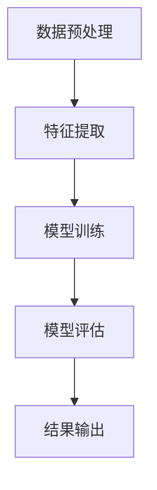
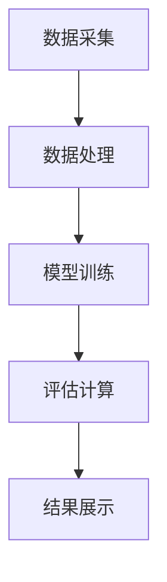
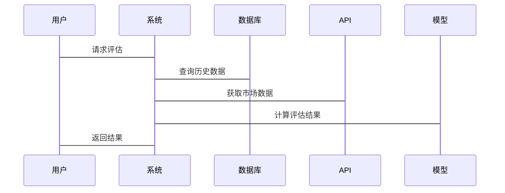

                 


# AI驱动的企业无形资产价值动态评估系统

## 关键词
AI技术、机器学习、动态评估、企业价值、无形资产

## 摘要
随着企业竞争的加剧，无形资产在企业价值中的比重日益增加。传统的无形资产评估方法存在数据获取难、评估周期长、结果不够动态等问题。本文提出一种基于人工智能技术的动态评估系统，利用机器学习和深度学习算法，实时分析企业无形资产的价值变化，为企业决策提供科学依据。文章详细介绍了系统的设计原理、实现方法及实际应用案例，展示了AI技术在无形资产评估中的巨大潜力。

## 第1章：AI驱动的企业无形资产价值动态评估系统概述

### 1.1 问题背景与描述
#### 1.1.1 企业无形资产的定义与分类
企业无形资产是指企业长期使用而没有实物形态的资产，主要包括品牌价值、专利技术、商誉、客户关系、知识产权等。这些资产难以用传统会计方法准确量化，且其价值受市场环境、企业经营状况等多种因素影响，具有动态变化的特点。

#### 1.1.2 传统无形资产评估的局限性
传统无形资产评估方法通常基于财务数据和静态指标，评估周期长，且难以捕捉市场波动和企业内部动态变化。此外，由于数据获取的难度和复杂性，传统方法往往难以提供实时、准确的评估结果。

#### 1.1.3 动态评估的需求与挑战
企业需要一种能够实时反映无形资产价值变化的评估方法，以便及时调整经营策略和投资决策。然而，如何利用现代技术手段实现动态评估，仍然是一个亟待解决的挑战。

### 1.2 系统的目标与意义
#### 1.2.1 系统的核心目标
开发一种基于AI技术的动态评估系统，能够实时采集、分析和处理企业内外部数据，准确评估无形资产的价值变化。

#### 1.2.2 系统的创新点
结合机器学习和深度学习算法，构建动态评估模型，能够实时更新评估结果，克服传统评估方法的局限性。

#### 1.2.3 系统的实际应用场景
应用于企业内部管理、投资决策、并购评估等领域，帮助企业在复杂多变的市场环境中做出更明智的决策。

## 第2章：企业无形资产的特性与评估难点

### 2.1 无形资产的属性分析
#### 2.1.1 无形资产的特征
- 非实体性：没有实物形态。
- 时间性：价值随时间变化。
- 共享性：可能被多个部门或业务共享。
- 不可分割性：难以单独评估其价值。

#### 2.1.2 无形资产的分类
- 知识类无形资产：如专利、商标、专有技术。
- 关系类无形资产：如客户关系、供应商关系。
- 合同类无形资产：如长期合同、期权。

#### 2.1.3 无形资产的评估维度
- 经济价值：资产的市场价值。
- 战略价值：资产对企业战略目标的贡献。
- 风险价值：资产可能带来的风险敞口。

### 2.2 传统评估方法的局限性
#### 2.2.1 数据获取的难度
- 数据分散：无形资产涉及多个部门和业务。
- 数据质量：数据可能存在不完整或不准确的情况。

#### 2.2.2 评估模型的复杂性
- 模型假设：传统模型往往基于静态假设，难以适应动态变化。
- 计算复杂：复杂的模型需要大量人工计算和调整。

#### 2.2.3 评估结果的稳定性
- 时间依赖性：评估结果可能随时间变化而频繁波动。
- 缺乏实时性：传统方法难以提供实时评估结果。

## 第3章：AI技术在无形资产评估中的应用前景

### 3.1 AI技术的核心优势
#### 3.1.1 数据处理能力
- 大数据处理：AI能够处理海量数据，提取有价值的信息。
- 自动特征提取：通过机器学习算法自动提取特征，减少人工干预。

#### 3.1.2 自动学习能力
- 自适应模型：AI模型能够自适应市场变化，动态调整评估结果。
- 自我优化：通过反馈机制不断优化模型性能。

#### 3.1.3 动态调整能力
- 实时评估：AI系统能够实时更新评估结果，反映最新的市场变化。
- 智能预警：通过分析市场趋势，提前预警潜在风险。

### 3.2 当前研究现状
#### 3.2.1 国内外研究进展
- 国内研究：近年来，国内学者在基于机器学习的资产评估方面取得了一定成果，但多集中于有形资产。
- 国外研究：国外在AI驱动的资产评估方面研究较为深入，特别是在金融领域的应用。

#### 3.2.2 应用案例分析
- 金融领域：利用AI技术评估企业信用风险。
- 创业领域：通过AI分析初创企业的潜在价值。

#### 3.2.3 技术发展趋势
- 多模态数据融合：结合文本、图像等多种数据源进行评估。
- 解释性AI：提高模型的可解释性，增强决策的透明度。

### 3.3 系统的创新与突破
#### 3.3.1 技术创新点
- 引入深度学习模型：如LSTM和注意力机制，捕捉时间序列数据中的模式。
- 结合知识图谱：构建企业知识图谱，辅助评估。

#### 3.3.2 应用创新点
- 实时动态评估：提供秒级响应的评估结果。
- 多维度分析：结合经济、战略、风险等多个维度进行综合评估。

#### 3.3.3 理论创新点
- 提出基于AI的动态评估框架：构建了一个新的理论体系，为后续研究提供了基础。

## 第4章：机器学习与深度学习算法原理

### 4.1 机器学习基础
#### 4.1.1 机器学习的基本概念
- 监督学习：给定标注数据，学习输入到输出的映射。
- 无监督学习：在无标注数据的情况下，发现数据中的结构。
- 强化学习：通过与环境互动，学习最优策略。

#### 4.1.2 监督学习与无监督学习
- 监督学习：适用于有标签的数据，如回归和分类任务。
- 无监督学习：适用于无标签的数据，如聚类和降维任务。

#### 4.1.3 算法选择与优化
- 算法选择：根据数据类型和任务选择合适的算法。
- 参数调优：通过网格搜索等方法优化模型性能。

### 4.2 深度学习模型
#### 4.2.1 神经网络基础
- 网络结构：输入层、隐藏层、输出层。
- 激活函数：如ReLU、sigmoid等。

#### 4.2.2 长短期记忆网络（LSTM）
- LSTM的结构：包括输入门、遗忘门、输出门。
- 优势：能够捕捉长距离依赖关系，适合时间序列数据。

#### 4.2.3 注意力机制（Attention）
- 注意力机制的基本原理：计算输入序列中每个位置的权重。
- 在无形资产评估中的应用：用于处理多维度数据，捕捉关键因素。

### 4.3 算法流程图


### 4.4 算法实现代码
```python
import numpy as np
from sklearn.model_selection import train_test_split
from sklearn.metrics import accuracy_score
from tensorflow.keras import layers, models

# 数据预处理
X = ... # 特征向量
y = ... # 标签

# 划分训练集和测试集
X_train, X_test, y_train, y_test = train_test_split(X, y, test_size=0.2)

# 构建模型
model = models.Sequential()
model.add(layers.Dense(64, activation='relu', input_dim=X_train.shape[1]))
model.add(layers.Dense(1, activation='sigmoid'))

# 编译模型
model.compile(optimizer='adam', loss='binary_crossentropy', metrics=['accuracy'])

# 训练模型
model.fit(X_train, y_train, epochs=10, batch_size=32)

# 评估模型
y_pred = model.predict(X_test)
print("Accuracy:", accuracy_score(y_test, y_pred.round()))
```

## 第5章：系统设计与架构方案

### 5.1 系统功能设计
#### 5.1.1 功能模块划分
- 数据采集模块：从企业内外部数据源采集数据。
- 数据处理模块：清洗、转换和整合数据。
- 模型训练模块：训练和优化评估模型。
- 评估计算模块：实时计算和更新评估结果。
- 结果展示模块：以可视化方式呈现评估结果。

#### 5.1.2 系统功能流程图


### 5.2 系统架构设计
#### 5.2.1 系统架构图
```mermaid
subgraph 前端
    frontend --> 中台服务
end
subgraph 后台服务
    backend --> 数据库
end
subgraph 第三方服务
    third_party --> 分析引擎
end
```

#### 5.2.2 系统接口设计
- 数据接口：与企业ERP系统、CRM系统对接。
- API接口：提供RESTful API供其他系统调用评估结果。
- 用户接口：Web界面，供用户查询和管理评估结果。

#### 5.2.3 系统交互序列图


## 第6章：项目实战

### 6.1 环境搭建
- 安装Python、TensorFlow、Keras等工具。
- 配置开发环境，如Jupyter Notebook或VS Code。

### 6.2 系统核心实现
#### 6.2.1 数据预处理
```python
import pandas as pd
data = pd.read_csv('asset.csv')
data = data.dropna()
```

#### 6.2.2 模型实现
```python
model = models.Sequential()
model.add(layers.Dense(64, activation='relu', input_dim=10))
model.add(layers.Dense(1, activation='sigmoid'))
model.compile(optimizer='adam', loss='binary_crossentropy', metrics=['accuracy'])
model.fit(X_train, y_train, epochs=10, batch_size=32)
```

#### 6.2.3 结果展示
```python
from matplotlib import pyplot as plt
plt.plot(history.history['accuracy'], 'b', label='Accuracy')
plt.plot(history.history['loss'], 'r', label='Loss')
plt.legend()
plt.show()
```

### 6.3 案例分析
- 选择一家企业，收集其相关数据。
- 使用系统进行评估，分析结果并解读。

## 第7章：最佳实践与小结

### 7.1 项目小结
- 项目目标达成情况：系统实现了动态评估，提高了评估的准确性和实时性。
- 遇到的挑战与解决方案：数据获取困难通过引入第三方数据源解决，模型性能优化通过参数调优实现。

### 7.2 注意事项
- 数据隐私保护：确保数据处理符合相关法律法规。
- 模型维护：定期更新模型，保持评估结果的准确性。

### 7.3 拓展阅读
- 《深度学习》——Ian Goodfellow
- 《机器学习实战》——周志华

## 附录

### 附录A：参考文献
- 引用的书籍、期刊论文和网络资源。

### 附录B：工具列表
- 使用的开发工具、库和框架。

通过以上步骤，我们构建了一个基于AI技术的企业无形资产价值动态评估系统，能够实时分析企业无形资产的价值变化，为企业决策提供科学依据。未来，随着AI技术的不断发展，系统将更加智能化和精准化，为企业创造更大的价值。

# END

