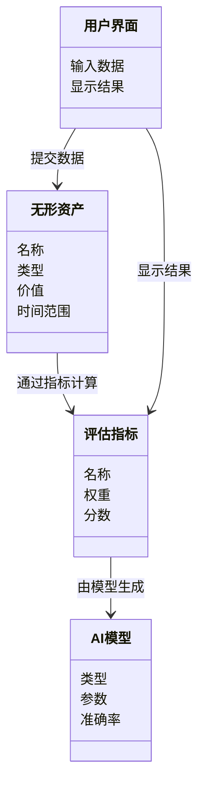
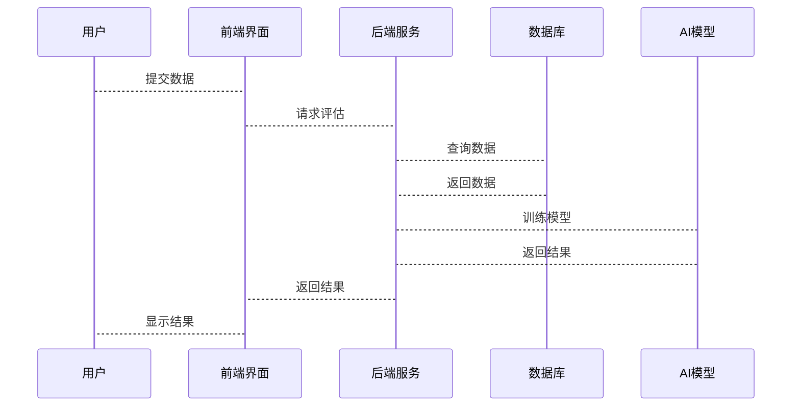

                 


# AI驱动的企业无形资产价值评估系统

**关键词：** AI技术、企业价值、无形资产、资产评估、机器学习、系统架构

**摘要：**  
本文探讨了如何利用人工智能技术构建企业无形资产价值评估系统。通过分析传统评估方法的局限性，结合AI技术的优势，提出了一种基于机器学习的评估框架。文章详细介绍了系统的背景、核心概念、算法原理、系统架构设计、项目实战及最佳实践，旨在为企业提供一种高效、准确的无形资产评估解决方案。

---

## 第1章: 企业无形资产价值评估的背景与挑战

### 1.1 企业无形资产的定义与重要性  
企业无形资产是指企业拥有或控制的没有实物形态的长期资产，主要包括品牌价值、专利技术、商誉、客户关系、技术诀窍等。这些资产通常难以通过财务报表直接反映，但它们对企业整体价值的贡献却至关重要。例如，知名品牌的价值可能远超其账面资产的价值。

#### 1.1.1 无形资产的定义与分类  
- **品牌价值**：品牌的知名度和美誉度直接影响企业的市场价值。  
- **专利技术**：专利的价值取决于其技术创新性和市场应用前景。  
- **商誉**：商誉是企业整体价值的重要组成部分，通常与企业的盈利能力、客户忠诚度等密切相关。  
- **客户关系**：稳定的客户关系是企业长期发展的基石。  

#### 1.1.2 无形资产在企业价值中的作用  
无形资产不仅影响企业的市场竞争力，还直接影响企业的估值。例如，一家拥有强大品牌和技术优势的企业，其估值往往远高于其有形资产的价值。  

#### 1.1.3 无形资产评估的难点与挑战  
- **数据获取难度**：无形资产的评估需要依赖大量的非财务数据，如市场反馈、客户评价等，这些数据往往难以获取。  
- **评估标准不统一**：不同类型的无形资产具有不同的评估标准，缺乏统一的评估框架。  
- **动态变化**：无形资产的价值受市场环境、技术发展等因素的影响，具有动态变化的特点。  

---

### 1.2 传统企业无形资产价值评估方法  

#### 1.2.1 财务指标法  
财务指标法主要依赖于企业的财务数据，如净利润、营业收入等，通过财务比率分析来评估企业价值。然而，这种方法忽视了无形资产的独特性，无法准确反映其价值。  

#### 1.2.2 市场法与收益法  
- **市场法**：通过比较类似企业的市场交易价格，估算企业价值。  
- **收益法**：基于未来现金流的折现值来评估企业价值。  

这两种方法在实践中常被结合使用，但其局限性在于难以量化无形资产的具体贡献。  

#### 1.2.3 传统方法的局限性  
传统评估方法通常依赖于财务数据，难以捕捉无形资产的动态变化和独特价值。此外，传统方法的主观性较强，评估结果可能受到评估人员的经验和判断的影响。  

---

### 1.3 AI技术在无形资产评估中的应用前景  

#### 1.3.1 AI技术的核心优势  
- **数据处理能力**：AI能够处理大量非结构化数据，如文本、图像等，从而更全面地评估无形资产的价值。  
- **模型可解释性**：通过机器学习模型，可以揭示无形资产与企业价值之间的复杂关系。  
- **动态评估能力**：AI能够实时更新评估结果，适应市场环境的变化。  

#### 1.3.2 AI驱动评估的潜在价值  
AI技术能够提高评估的准确性和效率，为企业决策提供更有力的支持。例如，通过自然语言处理技术，AI可以分析大量的市场反馈，帮助企业准确评估品牌价值。  

#### 1.3.3 未来发展趋势  
随着AI技术的不断进步，企业无形资产评估将更加智能化、数据化。未来，AI驱动的评估系统将与企业管理系统深度融合，为企业提供更全面的决策支持。  

---

## 第2章: AI驱动的企业无形资产价值评估系统的核心概念  

### 2.1 AI驱动评估系统的定义与特点  

#### 2.1.1 系统定义  
AI驱动的企业无形资产价值评估系统是一种基于机器学习技术的智能评估系统，能够通过分析企业的多维数据，准确估算无形资产的价值。  

#### 2.1.2 系统核心特点  
- **数据驱动**：系统依赖于大量数据，包括财务数据、市场数据、文本数据等。  
- **智能化**：通过机器学习算法，系统能够自动学习和优化评估模型。  
- **动态评估**：系统能够实时更新评估结果，适应市场变化。  

---

### 2.2 核心概念与联系  

#### 2.2.1 实体关系图（ER图）分析  
以下是系统的ER图，展示了系统中的核心实体及其关系：  

```mermaid
er
  entity 无形资产 {
    string 名称
    string 类型
    decimal 价值
    date 时间范围
  }
  entity 评估指标 {
    string 名称
    decimal 权重
    decimal 分数
  }
  entity AI模型 {
    string 类型
    string 参数
    decimal 准确率
  }
  无形资产 --> 评估指标: 通过指标计算
  评估指标 --> AI模型: 由模型生成
```

#### 2.2.2 核心概念对比分析  
以下是核心概念的对比分析表格：  

| 概念       | 属性       | 描述                                       |
|------------|------------|------------------------------------------|
| 无形资产   | 名称       | 如品牌、专利等                            |
| 评估指标   | 权重       | 如市场影响力、技术领先性等                |
| AI模型     | 类型       | 如回归模型、神经网络模型等                |

---

### 2.3 本章小结  

---

## 第3章: AI驱动评估系统的算法原理  

### 3.1 算法原理概述  

#### 3.1.1 算法选择与优化  
在选择算法时，需要考虑数据类型、评估目标和计算效率。例如，对于分类问题，可以使用逻辑回归或支持向量机（SVM）；对于回归问题，可以使用线性回归或随机森林。  

#### 3.1.2 数据预处理与特征工程  
数据预处理是确保模型准确性的关键步骤，包括数据清洗、特征提取和数据归一化。例如，可以通过TF-IDF方法提取文本特征，或者通过主成分分析（PCA）降低数据维度。  

#### 3.1.3 模型训练与优化  
模型训练需要选择合适的超参数，并通过交叉验证优化模型性能。例如，对于神经网络模型，可以选择不同的激活函数和优化器（如Adam、SGD）来提高模型的训练效果。  

---

### 3.2 算法实现与案例分析  

#### 3.2.1 算法实现  
以下是基于Python的机器学习模型实现代码示例：  

```python
import pandas as pd
from sklearn.model_selection import train_test_split
from sklearn.ensemble import RandomForestRegressor
from sklearn.metrics import mean_squared_error

# 加载数据
data = pd.read_csv('unseen_assets.csv')

# 数据预处理
X = data.drop('value', axis=1)
y = data['value']

# 划分训练集和测试集
X_train, X_test, y_train, y_test = train_test_split(X, y, test_size=0.2, random_state=42)

# 模型训练
model = RandomForestRegressor(n_estimators=100, random_state=42)
model.fit(X_train, y_train)

# 模型预测
y_pred = model.predict(X_test)

# 评估模型
mse = mean_squared_error(y_test, y_pred)
print(f'Mean Squared Error: {mse}')
```

#### 3.2.2 案例分析  
以某科技公司为例，假设我们希望通过AI模型评估其专利价值。首先，我们需要收集相关数据，包括专利数量、技术领域、市场应用前景等。然后，通过特征工程构建特征向量，并选择合适的算法进行模型训练。最后，通过模型预测得到专利的估计价值。  

---

### 3.3 算法优化与模型评估  

#### 3.3.1 算法优化  
通过调整模型参数和优化数据预处理步骤，可以提高模型的准确性和效率。例如，可以通过网格搜索（Grid Search）选择最优的模型参数。  

#### 3.3.2 模型评估  
模型评估可以通过交叉验证和指标分析来实现。常用的评估指标包括均方误差（MSE）、R平方值（R²）等。  

---

## 第4章: 系统分析与架构设计方案  

### 4.1 问题场景介绍  
本章将详细分析AI驱动的无形资产价值评估系统的应用场景和功能需求。  

#### 4.1.1 问题场景  
假设我们是一家互联网公司，希望通过AI技术评估品牌价值。我们需要收集品牌相关的数据，包括社交媒体数据、市场反馈、竞争对手信息等。  

---

### 4.2 系统功能设计  

#### 4.2.1 领域模型设计  
以下是系统的领域模型：  



#### 4.2.2 系统架构设计  
以下是系统的架构图：  

```mermaid
container 容器 {
    前端界面
    后端服务
    数据库
}
```

---

### 4.3 系统接口设计  

#### 4.3.1 接口设计  
系统需要提供API接口，供用户上传数据并获取评估结果。例如，可以通过RESTful API实现数据提交和结果查询。  

#### 4.3.2 交互流程图  
以下是系统的交互流程图：  



---

## 第5章: 项目实战  

### 5.1 环境安装  

#### 5.1.1 安装Python环境  
需要安装Python 3.8及以上版本，并安装必要的库，如Pandas、Scikit-learn、Mermaid等。  

#### 5.1.2 安装依赖项  
运行以下命令安装依赖项：  
```bash
pip install pandas scikit-learn mermaid4jupyter
```

---

### 5.2 系统核心实现  

#### 5.2.1 核心代码实现  
以下是系统的核心代码实现：  

```python
import pandas as pd
from sklearn.ensemble import RandomForestRegressor
from sklearn.metrics import mean_squared_error
from sklearn.model_selection import train_test_split

# 加载数据
data = pd.read_csv('unseen_assets.csv')

# 数据预处理
X = data.drop('value', axis=1)
y = data['value']

# 划分训练集和测试集
X_train, X_test, y_train, y_test = train_test_split(X, y, test_size=0.2, random_state=42)

# 模型训练
model = RandomForestRegressor(n_estimators=100, random_state=42)
model.fit(X_train, y_train)

# 模型预测
y_pred = model.predict(X_test)

# 评估模型
mse = mean_squared_error(y_test, y_pred)
print(f'Mean Squared Error: {mse}')
```

#### 5.2.2 代码解读  
上述代码实现了基于随机森林回归模型的无形资产评估系统。首先，加载数据并进行数据预处理，然后划分训练集和测试集，训练模型并进行预测，最后评估模型性能。  

---

### 5.3 案例分析  

#### 5.3.1 案例背景  
以某科技公司为例，假设我们希望通过AI模型评估其专利价值。  

#### 5.3.2 数据收集  
收集专利数量、技术领域、市场应用前景等数据。  

#### 5.3.3 模型训练  
使用收集的数据训练随机森林回归模型。  

#### 5.3.4 结果分析  
通过模型预测得到专利的估计价值，并与实际价值进行对比，验证模型的准确性。  

---

## 第6章: 最佳实践  

### 6.1 小结  
本文详细介绍了AI驱动的企业无形资产价值评估系统的背景、核心概念、算法原理、系统架构设计、项目实战及最佳实践。通过结合理论与实践，为企业的无形资产评估提供了新的思路和方法。  

---

### 6.2 注意事项  
- 在实际应用中，需要根据具体需求选择合适的算法和模型。  
- 数据质量和完整性对模型性能至关重要，需谨慎处理数据。  
- 模型的可解释性和透明度是企业决策的关键，需注重模型的解释性。  

---

### 6.3 拓展阅读  
- 《机器学习实战》  
- 《深度学习》  
- 《企业价值评估：方法与实践》  

---

## 总结  
AI技术的快速发展为企业无形资产价值评估提供了新的可能性。通过构建AI驱动的评估系统，企业可以更高效、更准确地评估无形资产的价值，从而为决策提供更有力的支持。未来，随着技术的不断进步，AI驱动的评估系统将更加智能化、数据化，为企业创造更大的价值。

