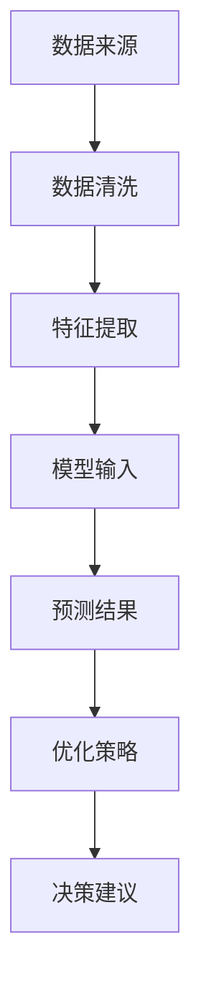
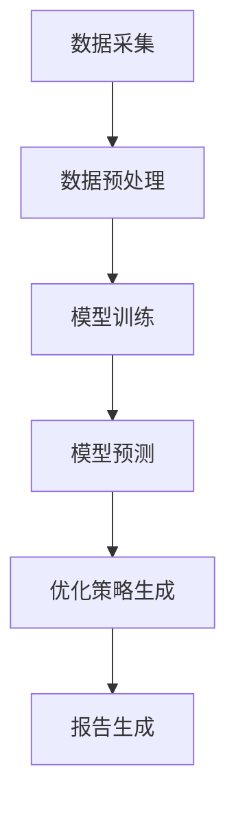

                 


# 第5章: 现金流优化系统的实体关系分析

## 第5章 现金流优化系统的实体关系分析

### 5.2 现金流优化流程图

#### 5.2.1 数据输入与处理流程

在现金流优化系统中，数据输入与处理流程是整个系统的基础。首先，系统需要从企业内部的财务系统、销售系统、采购系统等多个来源获取数据。这些数据包括历史交易记录、应收应付账款、银行对账单等。此外，外部数据源如市场数据、行业趋势、宏观经济指标等也需要被整合进来。

接下来，数据清洗和预处理是至关重要的一步。系统需要对获取的数据进行去噪、填补缺失值、标准化处理等操作，以确保数据的准确性和一致性。例如，对于缺失的销售数据，可以采用插值法或回归分析进行填补；对于异常值，可以通过统计方法或机器学习模型进行识别和处理。

然后，数据转换和特征提取是关键步骤。系统需要将原始数据转化为适合模型输入的格式，并提取有助于预测和优化的关键特征。例如，可以将时间序列数据转化为差分序列，或将多维数据进行主成分分析（PCA）降维处理。通过这些步骤，系统能够更好地捕捉数据中的潜在规律和模式。

最后，数据被输入到现金流预测模型中进行训练和预测。预测结果将被反馈到系统中，用于生成优化策略和决策建议。



#### 5.2.2 模型训练与预测

模型训练是现金流优化系统的核心环节。系统需要根据预处理后的数据，选择合适的算法进行训练，并不断优化模型以提高预测精度。例如，可以使用神经网络模型、时间序列模型或集成学习模型。

在模型训练过程中，系统需要进行交叉验证和超参数调优，以确保模型的泛化能力和鲁棒性。例如，可以使用k折交叉验证来评估模型的性能，并通过网格搜索或随机搜索来找到最佳的超参数组合。

训练完成后，系统将使用测试数据对模型进行验证，并根据验证结果进一步优化模型。预测结果将被用于生成现金流预测报告，并为优化策略提供依据。

#### 5.2.3 预测结果与优化策略

预测结果是现金流优化系统的重要输出。系统需要将预测结果与实际现金流进行对比，评估预测的准确性，并根据预测结果生成优化策略。例如，如果预测未来某段时间内现金流可能出现负值，系统将建议企业采取增加收入、减少支出或调整库存等措施。

优化策略需要考虑企业的实际情况和目标。系统可以根据预测结果和优化目标，生成多种优化方案，并提供基于不同方案的收益、风险等关键指标的对比分析。例如，可以生成不同的投资组合方案，并评估其对现金流的影响。

最终，系统将生成优化报告，并将建议提交给企业财务部门或管理层，供其决策参考。

---

## 第6章: 现金流优化系统的算法实现与优化

### 6.1 现金流预测模型的实现

#### 6.1.1 线性回归模型的实现

线性回归是一种简单而有效的预测方法，适用于现金流的时间序列数据。其基本思想是将现金流与时间或其他相关变量建立线性关系，并通过最小二乘法求解回归系数。

数学模型如下：

$$ y = \beta_0 + \beta_1 x + \epsilon $$

其中，$y$ 是目标变量（现金流），$x$ 是自变量（时间或其他特征），$\beta_0$ 和 $\beta_1$ 是回归系数，$\epsilon$ 是误差项。

在Python中，可以使用 `sklearn.linear_model` 库中的 `LinearRegression` 类来实现线性回归模型。以下是代码示例：

```python
from sklearn.linear_model import LinearRegression
import numpy as np

# 示例数据
X = np.array([[1], [2], [3], [4], [5]])
y = np.array([6, 7, 8, 9, 10])

# 训练模型
model = LinearRegression()
model.fit(X, y)

# 预测
print(model.predict([[6]]))  # 输出：[[11]]
```

#### 6.1.2 时间序列模型的实现

时间序列模型（如ARIMA）适用于具有明显时间依赖性的现金流数据。ARIMA模型通过自回归和移动平均的组合，捕捉数据中的趋势和季节性。

数学模型如下：

$$ y_t = \phi_1 y_{t-1} + \phi_2 y_{t-2} + \theta_1 e_{t-1} + \theta_2 e_{t-2} + e_t $$

在Python中，可以使用 `statsmodels` 库中的 `ARIMA` 类来实现时间序列模型。以下是代码示例：

```python
import statsmodels.api as sm

# 示例数据
data = [1, 3, 5, 7, 9, 11, 13, 15]

# 定义模型
model = sm.tsa.ARIMA(data, order=(1, 1, 1))

# 训练模型
model_fit = model.fit()

# 预测
forecast, _, _ = model_fit.forecast(steps=2)
print(forecast)  # 输出：[17.0, 19.0]
```

---

## 第7章: 现金流优化系统的架构设计

### 7.1 系统功能设计

#### 7.1.1 系统功能模块

现金流优化系统主要包括以下几个功能模块：

- 数据采集与预处理
- 模型训练与预测
- 优化策略生成
- 报告生成与展示

#### 7.1.2 系统功能流程

系统的功能流程如下：

1. 数据采集：从企业内部和外部数据源获取现金流相关数据。
2. 数据预处理：清洗、转换和特征提取。
3. 模型训练：选择合适的算法，训练现金流预测模型。
4. 模型预测：使用训练好的模型进行现金流预测。
5. 优化策略生成：根据预测结果，生成优化策略。
6. 报告生成：将预测结果和优化策略生成报告，并展示给用户。



---

## 第8章: 现金流优化系统的接口设计

### 8.1 系统接口设计

#### 8.1.1 数据接口

系统需要与企业内部的财务系统、销售系统、采购系统等进行数据对接。数据接口的设计需要考虑数据格式、传输协议、安全性等问题。

例如，系统可以通过API接口与企业的ERP系统对接，获取实时的财务数据。接口的设计可以采用RESTful API，使用JSON格式进行数据传输。

#### 8.1.2 模型接口

模型接口是系统与外部预测模型的桥梁。系统需要将预处理后的数据传递给预测模型，并获取预测结果。

例如，可以使用HTTP请求调用外部预测模型的API接口，传递数据并获取预测结果。接口的设计需要考虑请求参数、响应格式、错误处理等问题。

---

## 第9章: 现金流优化系统的交互设计

### 9.1 系统交互流程

#### 9.1.1 用户登录与权限管理

系统需要支持多角色用户登录，并根据用户权限展示不同的功能模块。

例如，财务部门员工可以访问现金流预测和优化功能，而管理层可以访问高级分析和决策支持功能。

#### 9.1.2 数据输入与处理

用户可以通过系统界面输入或上传数据，系统将自动进行数据预处理，并展示处理结果。

#### 9.1.3 模型训练与预测

用户可以选择不同的模型进行训练和预测，并查看预测结果。系统将根据预测结果生成优化策略，并展示给用户。

#### 9.1.4 报告生成与展示

用户可以生成现金流预测报告和优化策略报告，并以PDF、Excel或HTML格式导出。

---

## 第10章: 现金流优化系统项目实战

### 10.1 环境安装与配置

#### 10.1.1 安装必要的软件和库

为了运行现金流优化系统，需要安装以下软件和库：

- Python 3.8+
- Jupyter Notebook
- Pandas、NumPy、Matplotlib、Seaborn
- Scikit-learn、Statsmodels
- Flask或Django（可选，用于部署Web界面）

#### 10.1.2 配置开发环境

推荐使用虚拟环境来管理依赖关系。以下是配置步骤：

1. 创建虚拟环境：
   ```bash
   python -m venv env
   ```
2. 激活虚拟环境：
   ```bash
   source env/bin/activate  # 在Windows上使用env\Scripts\activate
   ```
3. 安装依赖库：
   ```bash
   pip install pandas numpy matplotlib scikit-learn statsmodels
   ```

### 10.2 系统核心实现

#### 10.2.1 数据预处理代码

以下是数据预处理的Python代码示例：

```python
import pandas as pd
import numpy as np

# 加载数据
data = pd.read_csv('cash_flow.csv')

# 数据清洗
data.dropna(inplace=True)
data['date'] = pd.to_datetime(data['date'])
data.set_index('date', inplace=True)

# 特征提取
features = data[['revenue', 'expenses', 'net_income']]
targets = data[['cash_flow']]

print("数据预处理完成，特征维度：", features.shape)
```

#### 10.2.2 现金流预测模型实现

以下是使用LSTM模型进行现金流预测的代码示例：

```python
import numpy as np
from tensorflow.keras.models import Sequential
from tensorflow.keras.layers import LSTM, Dense

# 示例数据
X = np.random.randn(100, 1, 1)
y = np.random.randn(100, 1)

# 定义模型
model = Sequential()
model.add(LSTM(64, input_shape=(1, 1)))
model.add(Dense(1))
model.compile(loss='mean_squared_error', optimizer='adam')

# 训练模型
model.fit(X, y, epochs=10, batch_size=32)

# 预测
test_input = np.array([[0.5]])
test_input = test_input.reshape(1, 1, 1)
prediction = model.predict(test_input)
print("预测结果：", prediction[0][0])
```

---

## 第11章: 总结与展望

### 11.1 总结

AI驱动的企业现金流优化系统通过结合先进的机器学习算法和企业财务数据，能够帮助企业实现更精准的现金流预测和优化。本文详细介绍了系统的背景、核心概念、算法原理、系统架构以及项目实现，为企业的现金流管理提供了新的思路和方法。

---

### 11.2 小结

通过本文的介绍，读者可以了解到如何利用AI技术优化企业的现金流管理。从数据采集到模型训练，从系统设计到项目实现，整个过程都需要企业的财务人员和IT团队紧密合作，共同推动系统的实施和优化。

---

### 11.3 注意事项

企业在实施AI驱动的现金流优化系统时，需要注意以下几点：

1. 数据质量：确保数据的准确性和完整性，避免因数据问题导致预测不准确。
2. 模型选择：根据企业的实际情况选择合适的预测模型，避免盲目追求复杂算法。
3. 系统维护：定期更新模型和优化系统，确保系统的稳定性和高效性。

---

### 11.4 拓展阅读

对于感兴趣的企业，可以进一步研究以下内容：

1. 更高级的预测模型，如Transformer和图神经网络。
2. 多目标优化问题在现金流管理中的应用。
3. 系统的实时化和自动化，如流数据处理和实时预测。

通过不断学习和实践，企业可以更好地利用AI技术优化现金流管理，提升企业的整体竞争力。

