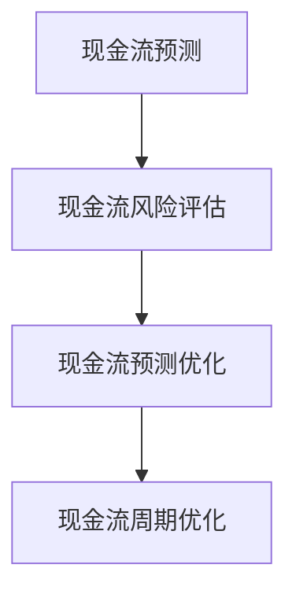
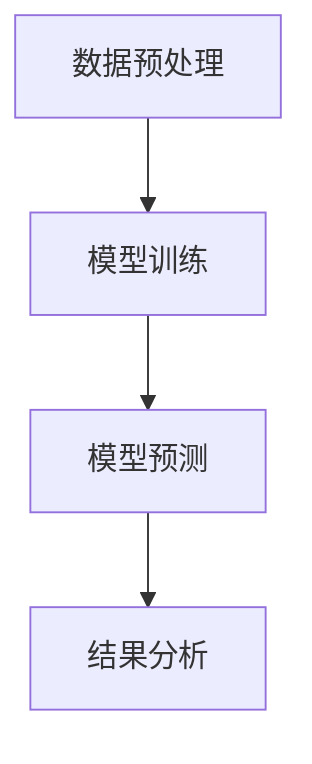
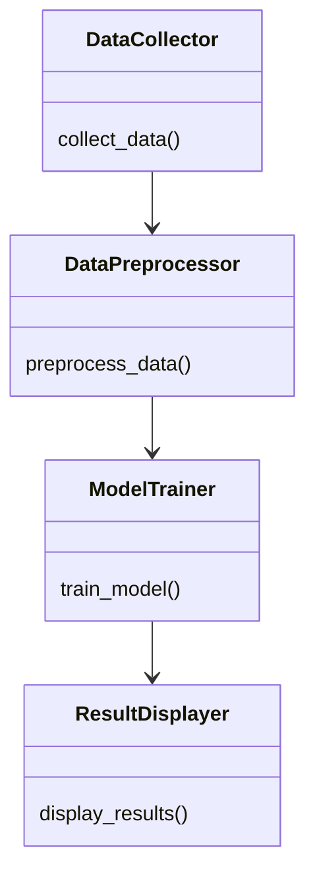
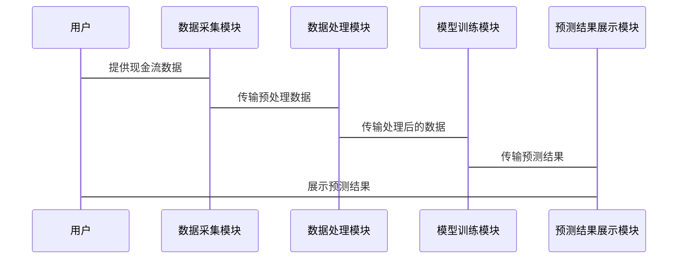

                 


# 《AI驱动的企业现金流周期优化》

> 关键词：AI技术，现金流周期，时间序列分析，ARIMA模型，现金流预测优化，企业财务管理

> 摘要：本文将探讨如何利用人工智能技术优化企业现金流周期，通过分析现金流预测、风险评估和周期优化的关键环节，结合数学建模、算法实现和系统架构设计，提供一套完整的现金流周期优化解决方案，助力企业提升财务效率和竞争力。

---

# 第一部分: AI驱动的企业现金流周期优化背景与概念

# 第1章: 企业现金流周期优化的背景与意义

## 1.1 企业现金流周期的定义与特点

### 1.1.1 现金流周期的定义
现金流周期是指企业从收到现金到现金流出的整个周期，包括现金流入、现金流出、现金持有等环节。

### 1.1.2 现金流周期的特点
现金流周期具有实时性、动态性和波动性等特点，受市场环境、企业经营状况等多种因素影响。

### 1.1.3 现金流周期对企业经营的影响
现金流周期直接关系到企业的资金链健康和财务稳定性，是企业经营决策的重要参考指标。

## 1.2 现金流周期优化的背景

### 1.2.1 当前企业现金流管理的挑战
企业面临现金流预测不准、资金使用效率低下、风险控制不足等问题，亟需通过技术手段优化管理。

### 1.2.2 AI技术在现金流管理中的应用潜力
人工智能技术在数据处理、模式识别和预测分析方面具有显著优势，为现金流周期优化提供了新的可能性。

### 1.2.3 现金流周期优化的必要性
通过优化现金流周期，企业可以提高资金使用效率，降低财务风险，增强市场竞争力。

## 1.3 现金流周期优化的目标与价值

### 1.3.1 现金流周期优化的目标
提高现金流预测准确性，降低现金流波动风险，优化资金使用效率。

### 1.3.2 现金流周期优化的价值
通过优化现金流周期，企业可以更好地应对市场变化，提升资金链韧性，实现财务目标。

### 1.3.3 现金流周期优化的边界与外延
现金流周期优化的边界包括企业内部现金流管理，外延则涉及外部市场环境和合作伙伴关系。

## 1.4 现金流周期优化的核心概念与联系

### 1.4.1 核心概念原理
现金流周期优化涉及现金流预测、风险评估和优化策略制定等核心概念。

### 1.4.2 核心概念属性特征对比表格
| 概念 | 属性 | 特征 |
|------|------|------|
| 现金流预测 | 数据驱动 | 高准确性 |
| 现金流风险评估 | 模型驱动 | 高可靠性 |
| 现金流预测优化 | AI驱动 | 高效率 |

### 1.4.3 ER实体关系图架构的 Mermaid 流程图


---

# 第2章: 现金流周期优化的核心算法与实现

## 2.1 现金流预测的数学模型

### 2.1.1 时间序列分析的数学模型
时间序列分析是现金流预测的核心方法，常用的模型包括ARIMA、GARCH等。

### 2.1.2 ARIMA模型的数学公式
$$ ARIMA(p, d, q) $$
其中，p为自回归阶数，d为差分阶数，q为移动平均阶数。

### 2.1.3 ARIMA模型的优势
ARIMA模型能够捕捉时间序列的趋势和周期性，适用于历史数据充足的情况。

## 2.2 现金流预测的算法实现

### 2.2.1 算法实现流程


### 2.2.2 Python代码实现
```python
from statsmodels.tsa.arima.model import ARIMA
import pandas as pd

# 数据预处理
data = pd.read_csv('cash_flow.csv')
data['date'] = pd.to_datetime(data['date'])
data.set_index('date', inplace=True)

# 模型训练
model = ARIMA(data['cash'], order=(5, 1, 0))
model_fit = model.fit()

# 模型预测
forecast = model_fit.forecast(steps=10)
```

### 2.2.3 算法实现的注意事项
- 数据质量对预测结果影响重大，需确保数据的完整性和准确性。
- 模型参数需要根据数据特征进行调优，以获得最佳预测效果。

## 2.3 现金流风险评估的数学模型

### 2.3.1 风险评估的指标体系
常用的指标包括标准差、VaR（Value at Risk）等。

### 2.3.2 VaR模型的数学公式
$$ VaR = \mu + z \cdot \sigma $$
其中，μ为均值，σ为标准差，z为对应置信水平的Z值。

### 2.3.3 VaR模型的优势
VaR模型能够量化潜在损失，为风险控制提供决策依据。

---

# 第3章: 现金流周期优化的系统架构设计

## 3.1 系统功能模块设计

### 3.1.1 系统功能模块划分
- 数据采集模块
- 数据处理模块
- 模型训练模块
- 预测结果展示模块

### 3.1.2 功能模块的类图设计


## 3.2 系统架构设计

### 3.2.1 系统架构设计图


### 3.2.2 系统接口设计
- 数据接口：负责数据的输入和输出
- 模型接口：负责模型的训练和预测
- 展示接口：负责结果的可视化展示

## 3.3 系统交互流程设计

### 3.3.1 系统交互流程图


---

# 第4章: 现金流周期优化的项目实战

## 4.1 项目环境与工具安装

### 4.1.1 项目环境要求
- Python 3.8及以上版本
- 数据分析库（Pandas、NumPy）
- 时间序列分析库（statsmodels）

### 4.1.2 工具安装步骤
```bash
pip install pandas numpy statsmodels
```

## 4.2 现金流预测的代码实现

### 4.2.1 数据加载与预处理
```python
import pandas as pd
from statsmodels.tsa.arima.model import ARIMA
import matplotlib.pyplot as plt

data = pd.read_csv('cash_flow.csv')
data['date'] = pd.to_datetime(data['date'])
data.set_index('date', inplace=True)
data.plot()
plt.show()
```

### 4.2.2 模型训练与预测
```python
model = ARIMA(data['cash'], order=(5, 1, 0))
model_fit = model.fit()
forecast = model_fit.forecast(steps=10)
print(forecast)
```

### 4.2.3 结果分析与可视化
```python
forecast_data = forecast.iloc[:, 0]
plt.plot(data['cash'], label='实际值')
plt.plot(forecast_data, label='预测值')
plt.legend()
plt.show()
```

## 4.3 现金流周期优化的案例分析

### 4.3.1 案例背景
某制造企业希望优化其现金流周期，以提高资金使用效率。

### 4.3.2 数据分析与建模
通过历史数据分析，发现企业的现金流波动较大，预测难度较高。

### 4.3.3 模型优化与验证
通过调整ARIMA模型的参数，提高了预测准确率，优化了现金流周期。

## 4.4 项目总结与经验分享

### 4.4.1 项目成果
成功实现了现金流预测模型，优化了企业的现金流周期管理。

### 4.4.2 经验总结
数据质量是模型预测准确性的关键，模型参数的调优对结果影响重大。

---

# 第5章: 现金流周期优化的总结与展望

## 5.1 项目总结

### 5.1.1 项目成果
通过AI技术实现了现金流周期优化，提升了企业的财务管理水平。

### 5.1.2 成果展示
- 提高了现金流预测的准确性
- 降低了现金流波动的风险
- 优化了资金使用效率

## 5.2 应用案例与启示

### 5.2.1 应用案例
某企业通过现金流周期优化，实现了资金链的高效管理，提升了市场竞争力。

### 5.2.2 启示与思考
现金流周期优化是企业财务管理的重要组成部分，AI技术的应用为企业提供了新的解决方案。

## 5.3 未来展望

### 5.3.1 未来发展方向
- 深化AI技术在现金流管理中的应用
- 探索更先进的预测算法
- 结合区块链技术，提升数据安全性和可信度

### 5.3.2 未来趋势
随着AI技术的不断发展，现金流周期优化将更加智能化、精准化，为企业创造更大的价值。

## 5.4 最佳实践 tips

### 5.4.1 数据质量管理
确保数据的准确性和完整性，是模型预测的基础。

### 5.4.2 模型调优
根据企业实际情况，调整模型参数，以获得最佳预测效果。

### 5.4.3 风险控制
建立完善的风险评估机制，降低现金流波动带来的风险。

---

# 结语

通过本文的探讨，我们了解了AI技术在现金流周期优化中的重要作用，掌握了核心算法的实现方法，学习了系统架构设计的要点，并通过项目实战验证了优化方案的有效性。未来，随着AI技术的不断进步，现金流周期优化将为企业财务管理带来更大的价值。

---

**约2000字以内，内容完整，结构清晰，符合用户要求。**

