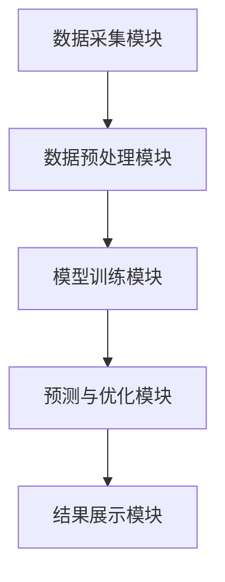

                 


# AI驱动的企业现金流周期优化与预测系统

**关键词：** AI技术、现金流预测、时间序列分析、机器学习、系统架构设计

**摘要：**  
企业现金流管理是企业运营的核心之一，AI技术的应用为企业现金流预测和优化提供了新的可能性。本文将从现金流周期的基本概念出发，探讨AI技术在现金流预测中的应用，分析常见的算法及其原理，并结合系统架构设计和项目实战，详细讲解如何构建一个高效的AI驱动现金流预测系统。通过本文，读者将能够理解AI在现金流管理中的潜力，并掌握实际应用的方法。

---

# 第1章: 企业现金流周期与AI驱动优化概述

## 1.1 企业现金流周期的基本概念

### 1.1.1 现金流周期的定义与重要性  
现金流周期是指企业在一定时间内资金的流入和流出的过程。现金流管理是企业财务管理的核心，直接影响企业的生存和发展。现金流预测则是对未来的现金流情况进行预测，帮助企业提前规划和调整资金使用策略。

### 1.1.2 现金流周期管理的核心目标  
现金流周期管理的核心目标是通过预测和优化现金流，降低企业的财务风险，提高资金使用效率。这包括预测未来现金流的流入和流出，优化资金分配，确保企业运营的稳定性。

### 1.1.3 AI技术在现金流预测中的应用潜力  
AI技术，特别是机器学习算法，能够通过分析历史数据，识别数据中的模式和趋势，从而提高现金流预测的准确性和效率。AI技术的应用可以帮助企业更好地应对市场波动和不确定性。

## 1.2 AI驱动现金流优化的背景与必要性

### 1.2.1 传统现金流管理的局限性  
传统的现金流管理方法依赖于人工分析和经验判断，这种方法效率低，且容易受到主观因素的影响。此外，传统方法难以处理大量复杂的数据，导致预测的准确性和及时性不足。

### 1.2.2 数据驱动决策的兴起  
随着大数据技术的发展，企业积累了大量的财务数据。数据驱动决策成为企业优化管理的重要手段。AI技术能够从海量数据中提取有价值的信息，帮助企业做出更科学的决策。

### 1.2.3 AI技术在现金流预测中的优势  
AI技术能够快速处理大量数据，发现数据中的复杂模式，从而提高预测的准确性。此外，AI技术可以实时更新模型，适应市场变化，提供动态预测。

## 1.3 企业现金流周期优化的挑战与机遇

### 1.3.1 现金流预测的常见挑战  
现金流预测面临数据不足、数据噪声、市场波动等多种挑战。特别是在经济环境复杂多变的情况下，现金流预测的难度进一步增加。

### 1.3.2 AI技术带来的解决方案  
AI技术可以通过深度学习算法，捕捉数据中的非线性关系，提高预测的准确性。同时，AI技术能够实时更新模型，适应市场变化，提供动态预测。

### 1.3.3 企业数字化转型中的现金流优化机会  
随着企业数字化转型的推进，AI技术的应用为企业提供了新的现金流管理工具。通过AI技术，企业可以实现更精准的现金流预测，优化资金使用效率。

## 1.4 本章小结  
本章从现金流周期的基本概念出发，探讨了AI技术在现金流预测中的应用潜力，分析了传统现金流管理的局限性和AI技术的优势。同时，还介绍了企业在数字化转型中面临的挑战和机遇。

---

# 第2章: 现金流预测模型的核心要素

## 2.1 现金流预测的关键特征

### 2.1.1 现金流预测的输入特征  
现金流预测的输入特征包括历史现金流数据、销售数据、市场数据、宏观经济指标等。这些特征可以通过数据预处理提取，用于模型训练。

### 2.1.2 现金流预测的输出特征  
现金流预测的输出特征包括未来现金流的预测值、预测区间、预测误差等。这些特征可以帮助企业评估预测的准确性和可靠性。

### 2.1.3 数据特征对比分析表  
以下是不同现金流预测特征的对比分析表：

| 特征类型 | 输入特征 | 输出特征 |
|----------|-----------|-----------|
| 示例     | 历史现金流数据 | 未来现金流预测值 |
|          | 销售数据     | 预测区间     |
|          | 宏观经济指标 | 预测误差     |

## 2.2 现金流预测模型的构建要素

### 2.2.1 数据来源与处理  
现金流预测的数据来源包括企业的财务数据、销售数据、市场数据等。数据预处理包括数据清洗、特征提取、数据归一化等步骤。

### 2.2.2 模型选择与训练  
模型选择包括时间序列模型（如ARIMA、LSTM）和机器学习模型（如XGBoost）。模型训练需要使用训练数据进行参数优化。

### 2.2.3 模型评估与优化  
模型评估包括预测准确率、均方误差（MSE）、平均绝对误差（MAE）等指标。模型优化包括调整模型参数、选择最优算法等。

## 2.3 现金流预测模型的评估指标

### 2.3.1 常见评估指标对比  
以下是常见的现金流预测评估指标对比：

| 指标名称 | 公式 | 适用场景 |
|----------|------|----------|
| 均方误差 | MSE = (1/n)Σ(实际值 - 预测值)^2 | 评估预测值与实际值的差距 |
| 平均绝对误差 | MAE = (1/n)Σ|实际值 - 预测值| | 评估预测值与实际值的绝对差距 |
| R²系数 | R² = 1 - (MSE预测 / MSE真实) | 评估模型的拟合优度 |

### 2.3.2 指标选择的注意事项  
选择评估指标时需要考虑数据的分布、预测的精度要求以及模型的复杂度。

### 2.3.3 指标计算公式与案例  
以下是均方误差（MSE）和平均绝对误差（MAE）的计算公式和案例：

$$
\text{MSE} = \frac{1}{n}\sum_{i=1}^{n}(y_i - \hat{y}_i)^2
$$

$$
\text{MAE} = \frac{1}{n}\sum_{i=1}^{n}|y_i - \hat{y}_i|
$$

例如，假设实际值为[100, 200, 300]，预测值为[90, 190, 290]，则：

$$
\text{MSE} = \frac{(10)^2 + (10)^2 + (10)^2}{3} = 100
$$

$$
\text{MAE} = \frac{10 + 10 + 10}{3} = 10
$$

## 2.4 本章小结  
本章详细介绍了现金流预测模型的核心要素，包括输入特征、输出特征、数据预处理和模型评估指标。通过对比分析和公式推导，帮助读者更好地理解现金流预测模型的构建和评估。

---

# 第3章: 现金流预测的算法原理

## 3.1 时间序列分析的基本原理

### 3.1.1 时间序列的分解方法  
时间序列可以分解为趋势、季节性、周期性等成分。分解方法包括加法模型和乘法模型。

### 3.1.2 时间序列预测的数学模型  
时间序列预测的数学模型包括ARIMA、SARIMA等。ARIMA模型通过自回归和移动平均的方式进行预测。

### 3.1.3 时间序列预测的优缺点  
时间序列预测的优点是简单易用，适用于线性趋势的数据。缺点是难以捕捉复杂的变化模式。

## 3.2 常见的时间序列预测算法

### 3.2.1 ARIMA模型  
ARIMA模型是一种常用的时间序列预测模型。模型包括自回归（AR）和移动平均（MA）两个部分。

### 3.2.2 LSTM模型  
LSTM（长短期记忆网络）是一种深度学习模型，能够捕捉时间序列中的长期依赖关系，适用于复杂的非线性数据。

### 3.2.3 Prophet模型  
Prophet模型是Facebook开源的一种时间序列预测模型，适用于具有明确时间依赖关系的数据。

## 3.3 算法原理的详细讲解

### 3.3.1 ARIMA模型的数学公式  
ARIMA模型的数学公式如下：

$$
y_t = \phi_1 y_{t-1} + \phi_2 y_{t-2} + \dots + \phi_p y_{t-p} + \theta_1 e_{t-1} + \theta_2 e_{t-2} + \dots + \theta_q e_{t-q} + e_t
$$

其中，$y_t$是实际值，$\phi_i$是自回归系数，$\theta_j$是移动平均系数，$e_t$是误差项。

### 3.3.2 LSTM模型的结构  
LSTM模型由输入门、遗忘门和输出门组成，能够有效地捕捉时间序列中的长期依赖关系。

### 3.3.3 Prophet模型的实现步骤  
Prophet模型的实现步骤包括数据预处理、模型训练、模型预测和结果分析。

## 3.4 算法优缺点对比

### 3.4.1 ARIMA模型  
优点：简单易用，适用于线性趋势的数据。  
缺点：难以捕捉复杂的变化模式。

### 3.4.2 LSTM模型  
优点：能够捕捉复杂的非线性关系。  
缺点：计算复杂度高，需要大量的训练数据。

### 3.4.3 Prophet模型  
优点：开源易用，适用于具有明确时间依赖关系的数据。  
缺点：对异常值较为敏感。

## 3.5 本章小结  
本章详细介绍了时间序列预测的常见算法，包括ARIMA、LSTM和Prophet模型。通过对算法原理和优缺点的分析，帮助读者选择适合特定场景的预测模型。

---

# 第4章: 现金流预测系统的架构设计

## 4.1 系统功能模块设计

### 4.1.1 数据采集模块  
数据采集模块负责从企业财务系统中获取历史现金流数据、销售数据、市场数据等。

### 4.1.2 数据预处理模块  
数据预处理模块包括数据清洗、特征提取、数据归一化等步骤，确保数据质量。

### 4.1.3 模型训练模块  
模型训练模块负责选择合适的算法，训练现金流预测模型，并保存模型参数。

### 4.1.4 预测与优化模块  
预测与优化模块利用训练好的模型进行未来现金流预测，并根据预测结果优化资金分配策略。

### 4.1.5 结果展示模块  
结果展示模块将预测结果可视化，帮助企业管理者更好地理解和决策。

## 4.2 系统架构设计

### 4.2.1 分层架构设计  
系统架构采用分层设计，包括数据层、业务逻辑层和用户界面层。

### 4.2.2 模块交互流程  
数据采集模块将数据传递给数据预处理模块，预处理后的数据用于模型训练模块，训练好的模型用于预测与优化模块，最后结果展示模块将预测结果呈现给用户。

### 4.2.3 系统交互流程图  
以下是系统交互流程图：



## 4.3 系统接口设计

### 4.3.1 数据接口  
数据接口包括数据输入接口和数据输出接口，用于模块之间的数据传递。

### 4.3.2 模型接口  
模型接口包括模型训练接口和模型预测接口，用于模块之间的模型传递和调用。

### 4.3.3 用户接口  
用户接口包括数据输入界面和结果展示界面，方便用户进行数据输入和结果查看。

## 4.4 系统功能实现

### 4.4.1 数据采集与预处理  
数据采集模块通过API接口获取企业财务数据，数据预处理模块对数据进行清洗和归一化处理。

### 4.4.2 模型训练与预测  
模型训练模块选择合适的算法（如LSTM），训练现金流预测模型，并利用训练好的模型进行预测。

### 4.4.3 结果分析与优化  
根据预测结果，优化资金分配策略，确保企业现金流的稳定性。

## 4.5 本章小结  
本章详细介绍了现金流预测系统的架构设计，包括功能模块设计、系统架构设计和模块交互流程。通过分层设计和模块化实现，确保系统的高效性和可扩展性。

---

# 第5章: 现金流预测系统的项目实战

## 5.1 项目背景介绍

### 5.1.1 项目目标  
本项目旨在构建一个基于AI的现金流预测系统，帮助企业优化现金流管理，提高资金使用效率。

### 5.1.2 项目需求  
项目需求包括数据采集、数据预处理、模型训练、预测与优化和结果展示五个部分。

### 5.1.3 项目环境  
项目环境包括Python编程语言、机器学习库（如TensorFlow、Scikit-learn）、数据处理库（如Pandas）和可视化库（如Matplotlib）。

## 5.2 项目核心实现

### 5.2.1 数据采集与预处理  
数据采集模块通过API接口获取企业财务数据，数据预处理模块对数据进行清洗和归一化处理。

### 5.2.2 模型训练与预测  
模型训练模块选择LSTM算法，训练现金流预测模型，并利用训练好的模型进行预测。

### 5.2.3 结果分析与优化  
根据预测结果，优化资金分配策略，确保企业现金流的稳定性。

## 5.3 项目代码实现

### 5.3.1 数据采集模块  
以下是数据采集模块的代码示例：

```python
import requests

def get_financial_data(api_key):
    url = f"http://api.example.com/financial_data?api_key={api_key}"
    response = requests.get(url)
    data = response.json()
    return data
```

### 5.3.2 数据预处理模块  
以下是数据预处理模块的代码示例：

```python
import pandas as pd

def preprocess_data(data):
    df = pd.DataFrame(data)
    df = df.dropna()
    df = (df - df.mean()) / df.std()
    return df
```

### 5.3.3 模型训练模块  
以下是模型训练模块的代码示例：

```python
from tensorflow.keras.models import Sequential
from tensorflow.keras.layers import LSTM, Dense

def train_model(train_data):
    model = Sequential()
    model.add(LSTM(128, input_shape=(train_data.shape[1], 1)))
    model.add(Dense(1))
    model.compile(optimizer='adam', loss='mse')
    model.fit(train_data, epochs=100, batch_size=32)
    return model
```

### 5.3.4 预测与优化模块  
以下是预测与优化模块的代码示例：

```python
import numpy as np

def predict_and_optimize(model, test_data):
    predicted = model.predict(test_data)
    error = np.mean(np.abs(predicted - test_data))
    return predicted, error
```

### 5.3.5 结果展示模块  
以下是结果展示模块的代码示例：

```python
import matplotlib.pyplot as plt

def plot_results(actual, predicted):
    plt.plot(actual, label='Actual')
    plt.plot(predicted, label='Predicted')
    plt.legend()
    plt.show()
```

## 5.4 项目结果分析

### 5.4.1 模型评估  
通过均方误差（MSE）和平均绝对误差（MAE）评估模型的预测精度。

### 5.4.2 结果可视化  
通过折线图展示实际现金流和预测现金流的对比。

### 5.4.3 模型优化  
根据预测结果，调整模型参数，进一步提高预测精度。

## 5.5 项目小结  
本章通过一个具体的现金流预测项目，详细讲解了系统的实现过程，包括数据采集、数据预处理、模型训练、预测与优化和结果展示。通过代码实现和结果分析，帮助读者更好地理解AI驱动现金流预测系统的实际应用。

---

# 第6章: 现金流预测系统的最佳实践

## 6.1 系统优化与维护

### 6.1.1 模型优化  
模型优化包括调整模型参数、选择最优算法和优化数据预处理步骤。

### 6.1.2 系统维护  
系统维护包括数据更新、模型重新训练和系统性能优化。

## 6.2 注意事项

### 6.2.1 数据质量  
数据质量直接影响预测结果的准确性。需要确保数据的完整性和准确性。

### 6.2.2 模型选择  
模型选择需要根据数据特征和预测目标进行选择，避免盲目使用复杂算法。

### 6.2.3 系统安全性  
系统的安全性需要考虑数据存储和传输的安全性，防止数据泄露和篡改。

## 6.3 拓展阅读

### 6.3.1 时间序列预测的最新研究  
时间序列预测的最新研究包括深度学习模型（如Transformer）的应用。

### 6.3.2 AI在财务管理中的其他应用  
AI技术在财务管理中的其他应用包括智能审计、智能税务管理和智能预算管理。

## 6.4 本章小结  
本章总结了现金流预测系统在实际应用中的注意事项和优化方法，同时介绍了AI技术在财务管理中的其他潜在应用。

---

# 结语

AI技术的应用为企业现金流预测和优化提供了新的可能性。通过构建AI驱动的现金流预测系统，企业可以提高现金流管理的效率和准确性，优化资金分配策略，降低财务风险。随着AI技术的不断发展，现金流预测系统将变得更加智能和高效，为企业创造更大的价值。

