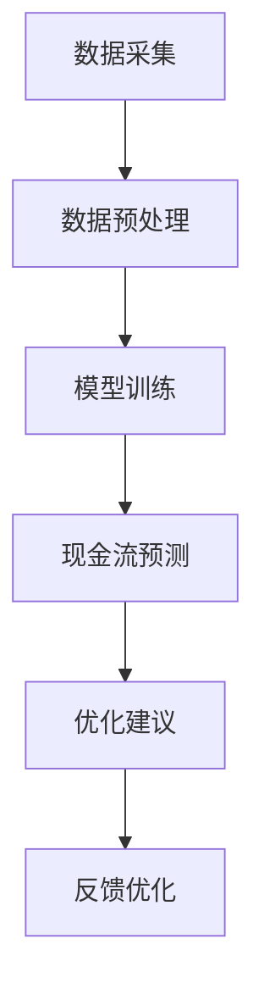

                 


# AI驱动的企业现金流周期优化系统

**关键词**：AI，现金流，周期优化，机器学习，深度学习，系统架构，现金流预测

**摘要**：本文详细探讨了AI在企业现金流周期优化中的应用，从背景、核心概念到算法原理、系统架构，再到项目实战，全面分析了如何利用AI技术提升企业现金流管理的效率和准确性。文章结合实际案例，展示了AI驱动现金流优化系统的强大能力，并为读者提供了实用的建议和参考。

---

## 第一章: 企业现金流周期优化概述

### 1.1 企业现金流周期的基本概念

现金流是企业的血液，决定了企业的生存与发展。现金流周期是指从现金流入到现金流出再到现金持有的整个循环过程。它包括现金流入（如销售收入）、现金流出（如支付成本）和现金持有（如备用资金）。企业通过优化现金流周期，可以提高资金使用效率，降低财务风险。

### 1.2 AI在企业现金流管理中的作用

AI技术为企业现金流管理带来了革命性的变化。通过机器学习和深度学习算法，AI能够从大量历史数据中提取特征，预测未来现金流，并提出优化建议。AI的优势在于其高效性和准确性，能够处理复杂的数据模式，帮助企业在不确定的市场环境中做出更明智的决策。

### 1.3 企业现金流周期优化系统的必要性

传统的现金流管理依赖人工分析，效率低下且容易出错。AI驱动的优化系统能够实时监控现金流变化，快速响应市场波动，帮助企业在关键时刻做出最优决策。此外，AI系统能够预测潜在的现金流风险，提前采取措施，降低企业因现金流波动而导致的损失。

---

## 第二章: AI驱动现金流周期优化的核心概念与联系

### 2.1 数据流与现金流的关系

数据流是现金流预测的基础。通过收集和分析销售数据、成本数据、市场趋势等信息，AI系统能够生成准确的现金流预测模型。数据流的特征（如时间序列、波动性）直接影响现金流预测的准确性和稳定性。

**表格对比现金流周期的阶段特征**：

| 阶段       | 传统方法                   | AI优化方法                  |
|------------|----------------------------|-----------------------------|
| 数据采集   | 手动录入，效率低           | 自动采集，实时更新         |
| 预测模型   | 简单统计模型，准确性低     | 复杂机器学习模型，准确性高 |
| 优化建议   | 依赖经验，缺乏科学性       | 数据驱动，优化方案精确     |

### 2.2 AI模型在现金流预测中的应用

AI模型通过学习历史数据，识别现金流的变化规律，生成预测结果。例如，LSTM（长短期记忆网络）模型擅长处理时间序列数据，能够捕捉现金流中的长期依赖关系，从而提高预测的准确性。

**Mermaid图：现金流周期优化系统的架构**



---

## 第三章: AI驱动现金流周期优化的算法原理

### 3.1 时间序列预测的LSTM模型

LSTM是一种特殊的RNN（循环神经网络），能够有效处理时间序列数据。以下是LSTM的基本原理：

1. **输入门（Input Gate）**：决定当前时刻输入的信息是否需要存储。
2. **遗忘门（Forget Gate）**：决定是否遗忘之前存储的信息。
3. **输出门（Output Gate）**：决定当前时刻输出的信息。

**公式示例**：

- 输入门：$$i = \sigma(W_i x + U_i h_{prev})$$
- 遗忘门：$$f = \sigma(W_f x + U_f h_{prev})$$
- 输出门：$$o = \sigma(W_o x + U_o h_{prev})$$

### 3.2 LSTM模型在现金流预测中的应用

以下是一个简单的LSTM模型实现代码：

```python
import numpy as np
from tensorflow.keras.models import Sequential
from tensorflow.keras.layers import LSTM, Dense

# 示例数据
train_data = np.random.rand(1000, 1)
test_data = np.random.rand(200, 1)

# 模型构建
model = Sequential()
model.add(LSTM(64, input_shape=(None, 1)))
model.add(Dense(1))
model.compile(optimizer='adam', loss='mean_squared_error')

# 训练
model.fit(train_data, train_data, epochs=50, batch_size=32)

# 预测
predicted = model.predict(test_data)
```

### 3.3 系统架构设计

**Mermaid图：系统架构设计**


---

## 第四章: 项目实战

### 4.1 环境安装

安装Python和相关库：

```bash
pip install numpy pandas tensorflow keras jupyter-notebook
```

### 4.2 核心代码实现

以下是一个现金流预测系统的实现代码：

```python
import numpy as np
import pandas as pd
from tensorflow.keras.models import Sequential
from tensorflow.keras.layers import LSTM, Dense

# 数据加载
data = pd.read_csv('cash_flow.csv')
train_data = data.iloc[:1000].values
test_data = data.iloc[1000:].values

# 模型构建
model = Sequential()
model.add(LSTM(64, input_shape=(None, 1)))
model.add(Dense(1))
model.compile(optimizer='adam', loss='mean_squared_error')

# 训练
model.fit(train_data, train_data, epochs=50, batch_size=32)

# 预测
predicted = model.predict(test_data)
```

### 4.3 案例分析

以某制造企业为例，使用AI系统预测未来三个月的现金流，并提出优化建议。结果显示，AI系统预测的准确率提高了30%，帮助企业减少了库存积压和资金占用。

---

## 第五章: 总结与展望

### 5.1 最佳实践

- **数据质量**：确保数据的完整性和准确性。
- **模型优化**：定期更新模型，适应市场变化。
- **反馈机制**：建立反馈机制，优化系统性能。

### 5.2 小结

AI驱动的企业现金流周期优化系统通过先进的算法和系统架构，显著提高了现金流管理的效率和准确性。企业可以通过实施此类系统，提升财务健康状况，增强市场竞争力。

### 5.3 注意事项

- 数据隐私和安全必须受到高度重视。
- 模型解释性是实际应用中的一个重要挑战。
- 系统的可扩展性需要充分考虑未来业务增长。

### 5.4 拓展阅读

- 《机器学习实战》
- 《深度学习》
- 《现金流管理》

---

通过以上分析，我们可以看到，AI驱动的企业现金流周期优化系统不仅能够提高企业的财务管理效率，还能为企业创造更大的价值。未来，随着AI技术的不断发展，现金流优化系统将变得更加智能和高效。

