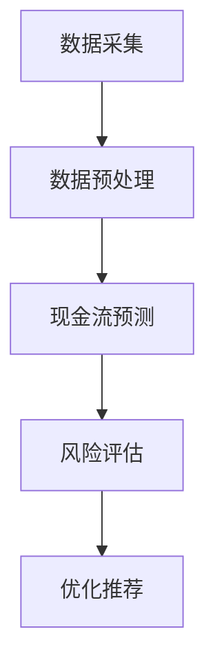
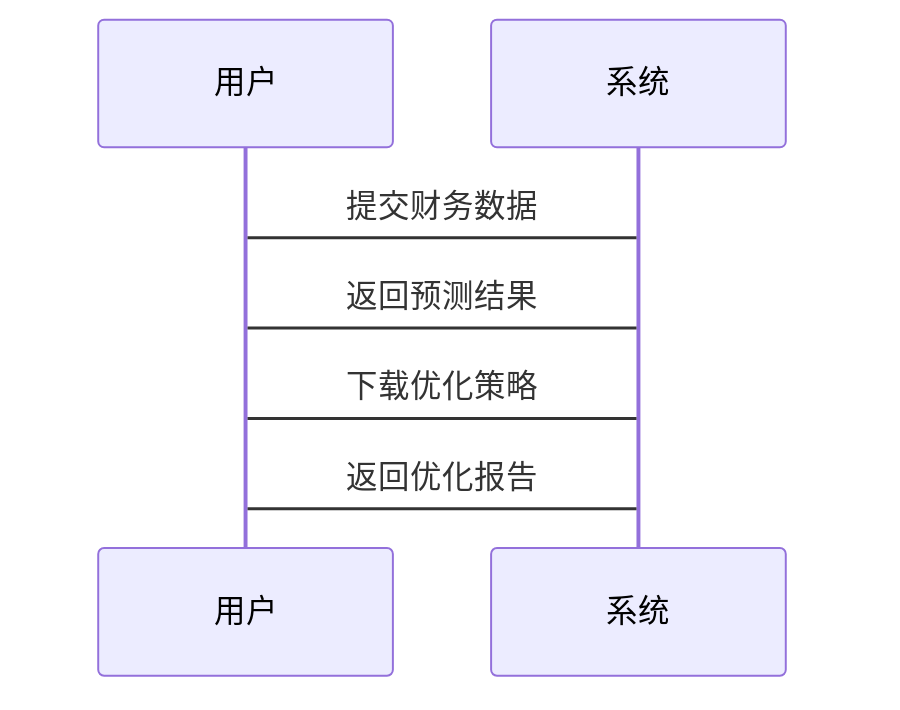

                 


### 第四章: 系统架构设计与实现

#### 4.1 系统功能模块划分

##### 4.1.1 数据采集与预处理模块
- 数据来源：企业财务数据、市场数据、行业数据等。
- 数据清洗：处理缺失值、异常值，标准化数据格式。
- 数据转换：将原始数据转换为模型可接受的格式。

##### 4.1.2 现金流预测模块
- 输入：经过预处理的历史现金流数据。
- 输出：未来现金流的预测值及其置信区间。
- 方法：使用ARIMA、LSTM等模型进行预测。

##### 4.1.3 风险评估与预警模块
- 输入：预测的现金流数据、市场风险因素。
- 输出：风险等级、预警信号。
- 方法：基于聚类分析和神经网络的风险评估模型。

##### 4.1.4 优化推荐模块
- 输入：风险评估结果、企业财务目标。
- 输出：现金流优化策略、执行建议。
- 方法：基于遗传算法的现金流优化策略。

#### 4.2 系统架构设计

##### 4.2.1 分层架构设计
- 数据层：负责数据的采集、存储和管理。
- 计算层：负责现金流预测、风险评估和优化算法的实现。
- 应用层：负责用户交互、结果展示和策略执行。

##### 4.2.2 系统架构图（Mermaid）



#### 4.3 系统接口设计

##### 4.3.1 数据接口
- 数据输入接口：接收企业的财务数据。
- 数据输出接口：输出预测结果和优化策略。

##### 4.3.2 用户接口
- 界面设计：用户友好的操作界面。
- 报告生成：生成现金流预测报告和优化建议。

#### 4.4 系统交互设计

##### 4.4.1 系统交互流程图（Mermaid）



### 第五章: 项目实战与案例分析

#### 5.1 项目环境安装

##### 5.1.1 安装Python环境
- 使用Anaconda安装Python 3.8及以上版本。

##### 5.1.2 安装依赖库
```bash
pip install numpy pandas scikit-learn tensorflow keras matplotlib
```

#### 5.2 系统核心实现源代码

##### 5.2.1 数据预处理代码

```python
import pandas as pd
import numpy as np

# 加载数据
data = pd.read_csv('cash_flow.csv')

# 数据清洗
data.dropna(inplace=True)
data = data[~data.isin([np.nan, np.inf, -np.inf]).any(axis=1)]

# 数据转换
data['date'] = pd.to_datetime(data['date'])
data.set_index('date', inplace=True)
```

##### 5.2.2 现金流预测代码

```python
from sklearn.model_selection import train_test_split
from sklearn.metrics import mean_squared_error
import tensorflow as tf
from tensorflow.keras.models import Sequential
from tensorflow.keras.layers import LSTM, Dense

# 划分训练集和测试集
train_data, test_data = train_test_split(data, test_size=0.2)

# 构建LSTM模型
model = Sequential()
model.add(LSTM(50, input_shape=(None, 1)))
model.add(Dense(1))
model.compile(optimizer='adam', loss='mse')

# 训练模型
model.fit(train_data.values, epochs=50, batch_size=32, validation_data=test_data.values)
```

##### 5.2.3 风险评估代码

```python
from sklearn.ensemble import IsolationForest

# 初始化IsolationForest模型
model = IsolationForest(n_estimators=100, contamination=0.05)

# 训练模型
model.fit(train_data)

# 预测异常值
test_data['risk_score'] = model.predict(test_data)
```

##### 5.2.4 优化推荐代码

```python
import numpy as np
from sklearn.metrics import mean_absolute_error

# 初始化遗传算法参数
population_size = 100
mutation_rate = 0.1

# 定义适应度函数
def fitness(individual):
    return mean_absolute_error(data['actual'], data['predicted'])

# 进行遗传算法优化
best_solution = population[0]
for _ in range(100):
    population = evolve_population(population, mutation_rate)
    best_solution = max(population, key=fitness)
```

#### 5.3 实际案例分析

##### 5.3.1 案例背景
- 某制造企业过去三年的现金流数据。
- 目标：优化现金流预测和管理。

##### 5.3.2 数据分析与建模
- 使用LSTM模型进行现金流预测。
- 通过IsolationForest模型识别异常值。

##### 5.3.3 结果展示
- 预测结果与实际数据对比。
- 风险评估报告生成。

#### 5.4 项目小结

##### 5.4.1 项目总结
- 项目实现的成果。
- 项目中的经验教训。

##### 5.4.2 可能遇到的问题与解决方案
- 数据不足时的处理方法。
- 模型调优的技巧。

### 第六章: 最佳实践与未来展望

#### 6.1 最佳实践

##### 6.1.1 数据质量管理
- 确保数据的准确性和完整性。
- 数据预处理的重要性。

##### 6.1.2 模型选择与调优
- 根据具体场景选择合适的模型。
- 模型的持续优化与更新。

#### 6.2 未来展望

##### 6.2.1 技术进步
- 更先进的算法研究。
- 多模态数据的应用。

##### 6.2.2 应用场景扩展
- 全球化企业中的应用。
- 行业-specific模型的开发。

#### 6.3 注意事项

##### 6.3.1 数据隐私与安全
- 确保数据的安全存储和传输。
- 遵守相关法律法规。

##### 6.3.2 模型的可解释性
- 提高模型的可解释性。
- 解释性模型的开发与应用。

### 总结

#### 6.4.1 小结
- 本书的核心内容回顾。
- AI在现金流周期优化中的巨大潜力。

#### 6.4.2 展望
- 未来的研究方向。
- 技术的不断进步对现金流优化的影响。

---

### 关键词
- 企业现金流
- AI技术
- 现金流预测
- 风险管理
- 现金流优化

### 摘要
《AI驱动的企业现金流周期优化系统》这本书详细探讨了如何利用人工智能技术优化企业的现金流周期管理。通过分析现金流周期的各个阶段，结合先进的AI算法，如机器学习和深度学习，本书提出了一个完整的现金流优化系统架构。从数据采集到预测模型的建立，再到风险评估和优化策略的推荐，书中提供了详细的实现方案和实际案例。通过阅读本书，读者可以掌握如何利用AI技术提升企业财务管理的效率和准确性，从而在激烈的市场竞争中占据优势。

