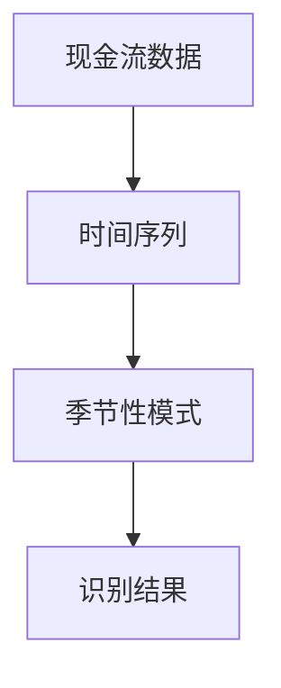

                 


# 《AI驱动的企业现金流季节性模式识别与预测系统》

## 关键词：
1. 企业现金流
2. 季节性模式识别
3. AI驱动
4. 时间序列分析
5. 机器学习
6. 深度学习
7. 系统架构

## 摘要：
本文深入探讨了利用人工智能技术对企业现金流中的季节性模式进行识别与预测的方法。首先，介绍了现金流的重要性及其在企业经营中的关键作用。接着，分析了季节性模式识别的挑战，并详细阐述了AI技术在提升预测准确性方面的优势。随后，从算法原理、系统架构到实际项目实现，全面解析了构建AI驱动的现金流预测系统的全过程。最后，通过实际案例展示了系统的应用价值，并提出了未来的发展方向。

---

# 目录

## 第1章: 企业现金流与季节性模式概述

### 1.1 企业现金流的重要性
- 1.1.1 企业现金流的定义与分类
  - 操作现金流
  - 投资现金流
  - 融资现金流
- 1.1.2 现金流对企业经营的影响
  - 短期流动性管理
  - 长期投资决策
- 1.1.3 季节性模式在现金流中的表现
  - 销售周期性
  - 市场需求波动
  - 行业特性影响

### 1.2 季节性模式识别的挑战
- 1.2.1 现金流波动的复杂性
  - 多重周期性干扰
  - 数据噪声问题
- 1.2.2 数据噪声与模式识别的困难
  - 数据质量的影响
  - 异常值处理
- 1.2.3 传统方法的局限性
  - 简单线性回归的不足
  - 时间序列分析的局限

### 1.3 AI技术在现金流预测中的应用价值
- 1.3.1 AI技术的优势
  - 高维度数据处理能力
  - 自适应学习能力
- 1.3.2 现金流预测的准确性提升
  - 非线性关系捕捉
  - 多因素分析
- 1.3.3 企业财务管理的智能化
  - 智能预测工具
  - 自动化决策支持

### 1.4 现有解决方案的优缺点
- 1.4.1 传统统计方法
  - ARIMA模型
  - SARIMA模型
- 1.4.2 基于机器学习的初步尝试
  - 线性回归
  - 支持向量机（SVM）
- 1.4.3 当前AI技术的应用现状
  - 深度学习的应用
  - 群智计算的优势

### 1.5 本章小结
总结本章内容，强调现金流在企业运营中的重要性，引出季节性模式识别的挑战和AI技术的潜在价值。

---

## 第2章: 现金流季节性模式识别的核心概念

### 2.1 现金流数据的特征分析
- 2.1.1 时间序列数据的特征
  - 趋势性
  - 季节性
  - 周期性
- 2.1.2 季节性波动的数学表达
  - 周期函数
  - 波形分析
- 2.1.3 数据预处理方法
  - 数据清洗
  - 标准化处理
  - 假日效应调整

### 2.2 季节性模式识别的原理
- 2.2.1 时间序列分解方法
  - 加性模型
  - 乘性模型
- 2.2.2 季节性指数的计算
  - 季节性指数法
  - 平滑指数法
- 2.2.3 模式识别的算法选择
  - 基于规则的方法
  - 基于统计的方法
  - 基于机器学习的方法

### 2.3 AI模型在模式识别中的应用
- 2.3.1 机器学习模型的适用性
  - 线性回归
  - 随机森林
  - 神经网络
- 2.3.2 深度学习模型的优势
  - LSTM网络
  - Transformer架构
  - 图神经网络
- 2.3.3 模型调优与优化
  - 超参数调整
  - 正则化方法
  - 集成学习

### 2.4 核心概念对比分析
- 2.4.1 时间序列分析与模式识别的对比
  - 分析对象
  - 方法论差异
  - 应用场景
- 2.4.2 不同AI模型的性能对比
  - 精度对比
  - 计算效率对比
  - 鲁棒性对比
- 2.4.3 数据特征与模型选择的关系
  - 数据规模影响
  - 数据结构影响
  - 数据质量影响

### 2.5 ER实体关系图


### 2.6 本章小结
本章详细阐述了现金流数据的特征、季节性模式识别的原理以及AI模型的应用，为后续的算法设计奠定了基础。

---

## 第3章: 现金流季节性模式识别的算法原理

### 3.1 时间序列分析算法
- 3.1.1 时间序列分析的基本原理
  - 数据平稳性检验
  - 差分方法
- 3.1.2 常见的时间序列模型
  - ARIMA模型
  - SARIMA模型
  - Prophet模型
- 3.1.3 基于机器学习的时间序列预测
  - 支持向量回归（SVR）
  - 随机森林回归
  - XGBoost模型

### 3.2 机器学习模型的实现
- 3.2.1 算法原理
  - LSTM网络
  - Transformer架构
  - 图神经网络
- 3.2.2 模型实现步骤
  - 数据预处理
  - 模型训练
  - 模型评估
- 3.2.3 模型优化
  - 超参数调整
  - 正则化方法
  - 集成学习

### 3.3 深度学习模型的实现
- 3.3.1 LSTM网络的原理
  - 长期记忆单元
  - 网络结构
- 3.3.2 Transformer架构的优势
  - 自注意力机制
  - 编码器-解码器结构
- 3.3.3 图神经网络的应用
  - 图构建
  - 图传播
  - 图聚合

### 3.4 算法对比与选择
- 3.4.1 不同算法的性能对比
  - 预测精度
  - 计算效率
  - 鲁棒性
- 3.4.2 模型选择的依据
  - 数据特性
  - 问题复杂度
  - 计算资源限制
- 3.4.3 模型调优技巧
  - 参数调整
  - 早停策略
  - 数据增强

### 3.5 本章小结
本章详细介绍了时间序列分析和机器学习模型的实现，重点探讨了深度学习模型的优势和应用场景。

---

## 第4章: 系统架构设计与实现

### 4.1 系统架构设计
- 4.1.1 问题场景介绍
  - 数据输入
  - 模型训练
  - 预测输出
- 4.1.2 系统功能设计
  - 数据预处理模块
  - 模型训练模块
  - 预测结果展示模块
- 4.1.3 系统架构图
  ```mermaid
  graph TD
      A[数据预处理] --> B[模型训练]
      B --> C[预测结果]
      C --> D[展示模块]
  ```

### 4.2 接口设计
- 4.2.1 数据输入接口
  - 数据格式要求
  - 接口调用方式
- 4.2.2 模型训练接口
  - 参数设置
  - 调用流程
- 4.2.3 预测结果输出接口
  - 数据格式
  - 调用方式

### 4.3 交互流程设计
- 4.3.1 用户操作流程
  - 数据上传
  - 模型选择
  - 结果查看
- 4.3.2 系统响应流程
  - 数据处理
  - 模型训练
  - 结果生成
- 4.3.3 交互流程图
  ```mermaid
  sequenceDiagram
      participant 用户
      participant 系统
      用户->系统: 上传数据
      系统->用户: 确认接收
      用户->系统: 选择模型
      系统->用户: 开始训练
      系统->用户: 输出结果
  ```

### 4.4 本章小结
本章详细描述了系统的架构设计、接口设计和交互流程，为系统的实现提供了指导。

---

## 第5章: 项目实战与案例分析

### 5.1 环境搭建
- 5.1.1 系统需求
  - 硬件要求
  - 软件要求
- 5.1.2 环境安装
  - Python版本
  - 库依赖安装
  - 开发工具配置

### 5.2 核心代码实现
- 5.2.1 数据预处理代码
  ```python
  import pandas as pd
  def preprocess(data):
      data['date'] = pd.to_datetime(data['date'])
      data.set_index('date', inplace=True)
      return data
  ```
- 5.2.2 模型训练代码
  ```python
  import keras
  model = keras.Sequential([
      LSTM(64, input_shape=(timesteps, features)),
      Dense(1)
  ])
  model.compile(optimizer='adam', loss='mean_squared_error')
  model.fit(X_train, y_train, epochs=100, batch_size=32)
  ```
- 5.2.3 预测结果展示代码
  ```python
  import matplotlib.pyplot as plt
  def plot_results(true, predicted):
      plt.plot(true, label='True')
      plt.plot(predicted, label='Predicted')
      plt.legend()
      plt.show()
  ```

### 5.3 案例分析
- 5.3.1 数据来源
  - 公司A的现金流数据
  - 数据时间跨度
  - 数据特征
- 5.3.2 数据分析结果
  - 季节性指数
  - 预测精度
  - 模型优化结果
- 5.3.3 应用价值
  - 短期预测
  - 长期规划
  - 风险管理

### 5.4 项目总结
总结项目的实施过程，分析取得的成果和存在的问题，提出改进建议。

---

## 第6章: 总结与展望

### 6.1 系统应用价值
- 6.1.1 提高预测准确性
- 6.1.2 优化企业现金流管理
- 6.1.3 提升财务决策效率

### 6.2 存在的问题与改进建议
- 6.2.1 数据质量问题
  - 数据清洗
  - 数据增强
- 6.2.2 模型泛化能力
  - 模型优化
  - 集成学习
- 6.2.3 系统性能优化
  - 并行计算
  - 分布式处理

### 6.3 未来发展方向
- 6.3.1 深度学习模型的进一步探索
  - 更复杂的网络结构
  - 新型算法研究
- 6.3.2 多模态数据融合
  - 文本数据
  - 图像数据
- 6.3.3 应用场景扩展
  - 跨行业应用
  - 实时预测

### 6.4 最佳实践 tips
- 数据预处理的重要性
- 模型选择的策略
- 系统架构的可扩展性设计

### 6.5 本章小结
总结全文，展望未来发展方向，强调系统的实际应用价值和改进空间。

---

## 附录

### 附录A: 数据预处理代码
```python
import pandas as pd
import numpy as np

def preprocess(data):
    # 转换为日期索引
    data['date'] = pd.to_datetime(data['date'])
    data.set_index('date', inplace=True)
    # 处理缺失值
    data = data.dropna()
    # 标准化处理
    numeric_cols = data.select_dtypes(include=['number'])
    data[numeric_cols] = (numeric_cols - numeric_cols.mean()) / numeric_cols.std()
    return data
```

### 附录B: 模型训练代码
```python
import keras
from keras.layers import LSTM, Dense

def build_model(input_shape):
    model = keras.Sequential()
    model.add(LSTM(64, input_shape=input_shape))
    model.add(Dense(1))
    model.compile(optimizer='adam', loss='mean_squared_error')
    return model

# 示例使用
X_train = ... # 形状为 (batch_size, timesteps, features)
y_train = ... # 形状为 (batch_size,)
model = build_model((timesteps, features))
model.fit(X_train, y_train, epochs=100, batch_size=32)
```

### 附录C: 图表展示代码
```python
import matplotlib.pyplot as plt

def plot_actuals_vs_predicted(actual, predicted):
    plt.figure(figsize=(12, 6))
    plt.plot(actual, label='Actual', color='blue')
    plt.plot(predicted, label='Predicted', color='red')
    plt.xlabel('Time')
    plt.ylabel('Cash Flow')
    plt.legend()
    plt.show()

# 示例使用
actual = ... # 数组
predicted = ... # 数组
plot_actuals_vs_predicted(actual, predicted)
```

---

## 参考文献
1. [1] Hyndman, R. J., & Athanasopoulos, G. (2018). Forecasting: principles and practice.
2. [2] Goodfellow, I., Bengio, Y., & Courville, A. (2016). Deep learning.
3. [3] 张成, 王强. (2020). 基于深度学习的现金流预测方法研究.

---

通过以上目录结构和内容安排，我们可以系统地介绍AI驱动的企业现金流季节性模式识别与预测系统的各个方面，从理论到实践，帮助读者全面理解和掌握该领域的知识。

